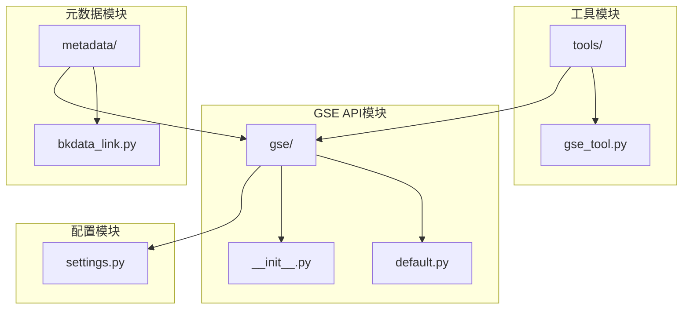
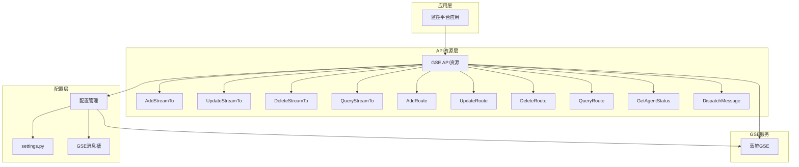
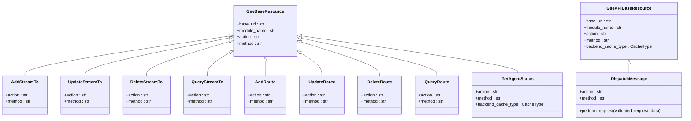
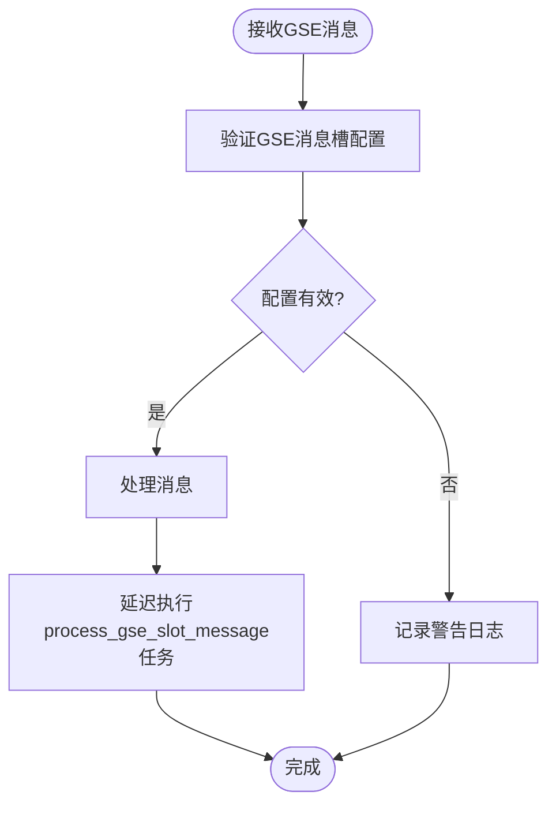
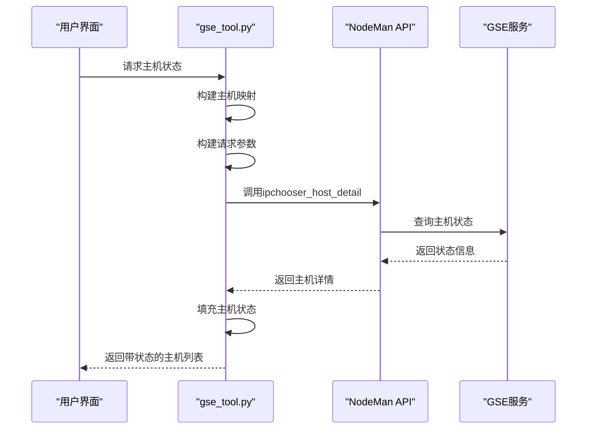
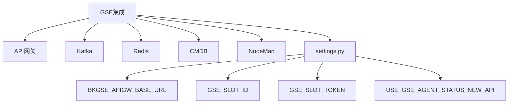

# GSE集成

<cite>
**本文档引用的文件**
- [default.py](file://bkmonitor/api/gse/default.py)
- [gse_tool.py](file://bkmonitor/bkm_ipchooser/tools/gse_tool.py)
- [bkdata_link.py](file://bkmonitor/metadata/resources/bkdata_link.py)
- [settings.py](file://bkmonitor/settings.py)
</cite>

## 目录
1. [简介](#简介)
2. [项目结构](#项目结构)
3. [核心组件](#核心组件)
4. [架构概述](#架构概述)
5. [详细组件分析](#详细组件分析)
6. [依赖分析](#依赖分析)
7. [性能考虑](#性能考虑)
8. [故障排除指南](#故障排除指南)
9. [结论](#结论)

## 简介
本文档详细阐述了蓝鲸监控平台与蓝鲸GSE（通用服务引擎）的集成机制。GSE作为蓝鲸体系的核心组件，负责进程管理、事件订阅和指令下发等关键功能。本文档将深入分析`api/gse/`模块如何与GSE交互，说明`default.py`中定义的API端点配置和调用方式，描述GSE在监控数据采集、心跳上报和远程控制中的作用，并提供相关操作的代码示例和故障解决方案。

## 项目结构
GSE集成相关的代码主要分布在`bkmonitor/api/gse/`目录下，核心配置和资源文件分布在其他相关模块中。

**Diagram sources**
- [default.py](file://bkmonitor/api/gse/default.py)
- [gse_tool.py](file://bkmonitor/bkm_ipchooser/tools/gse_tool.py)
- [bkdata_link.py](file://bkmonitor/metadata/resources/bkdata_link.py)
- [settings.py](file://bkmonitor/settings.py)

**Section sources**
- [default.py](file://bkmonitor/api/gse/default.py)
- [gse_tool.py](file://bkmonitor/bkm_ipchooser/tools/gse_tool.py)

## 核心组件
GSE集成的核心组件包括API资源定义、消息槽配置、状态查询和指令分发。`default.py`文件定义了与GSE交互的所有API资源，包括数据接收端配置、路由信息管理和主机状态查询等功能。

**Section sources**
- [default.py](file://bkmonitor/api/gse/default.py)
- [bkdata_link.py](file://bkmonitor/metadata/resources/bkdata_link.py)

## 架构概述
GSE集成架构采用分层设计，上层应用通过API资源层与GSE进行通信，底层通过配置和缓存机制确保通信的可靠性和高效性。

**Diagram sources**
- [default.py](file://bkmonitor/api/gse/default.py)
- [settings.py](file://bkmonitor/settings.py)

## 详细组件分析

### API资源组件分析
`default.py`中的API资源类继承自`GseBaseResource`和`GseAPIBaseResource`，通过RESTful API与GSE进行交互。每个资源类都定义了特定的操作，如新增、修改、删除和查询数据接收端配置。

#### API资源类图

**Diagram sources**
- [default.py](file://bkmonitor/api/gse/default.py)

**Section sources**
- [default.py](file://bkmonitor/api/gse/default.py)

### 消息槽组件分析
GSE消息槽用于接收来自GSE的异步消息，`bkdata_link.py`中的`GseSlotResource`类处理这些消息，并将其分发给相应的任务进行处理。

#### 消息槽处理流程

**Diagram sources**
- [bkdata_link.py](file://bkmonitor/metadata/resources/bkdata_link.py)

**Section sources**
- [bkdata_link.py](file://bkmonitor/metadata/resources/bkdata_link.py)

### 状态查询组件分析
`gse_tool.py`中的`fill_agent_status`函数用于填充主机的Agent状态，通过调用NodeMan的API获取主机的实时状态信息。

#### 状态查询流程

**Diagram sources**
- [gse_tool.py](file://bkmonitor/bkm_ipchooser/tools/gse_tool.py)

**Section sources**
- [gse_tool.py](file://bkmonitor/bkm_ipchooser/tools/gse_tool.py)

## 依赖分析
GSE集成依赖于多个外部组件和配置，包括API网关、消息队列、缓存系统和认证机制。

**Diagram sources**
- [default.py](file://bkmonitor/api/gse/default.py)
- [settings.py](file://bkmonitor/settings.py)

**Section sources**
- [default.py](file://bkmonitor/api/gse/default.py)
- [settings.py](file://bkmonitor/settings.py)

## 性能考虑
GSE集成在设计时考虑了性能和可靠性，通过缓存、连接池和超时设置等机制确保系统的高效运行。

- **缓存机制**：使用`CacheType.GSE`缓存主机状态查询结果，减少对GSE服务的直接调用。
- **连接池管理**：API资源通过`APIResource`基类管理HTTP连接池，复用连接以提高性能。
- **超时设置**：所有API调用都有合理的超时设置，防止请求长时间挂起。
- **异步处理**：GSE消息通过Celery任务异步处理，避免阻塞主线程。

## 故障排除指南
GSE集成中常见的问题包括网络问题、认证失败和消息丢失，以下是相应的解决方案。

**Section sources**
- [default.py](file://bkmonitor/api/gse/default.py)
- [bkdata_link.py](file://bkmonitor/metadata/resources/bkdata_link.py)
- [settings.py](file://bkmonitor/settings.py)

### 网络问题
- **问题**：无法连接到GSE服务
- **解决方案**：
  1. 检查`BKGSE_APIGW_BASE_URL`或`BK_COMPONENT_API_URL`配置是否正确
  2. 验证网络连通性，确保监控平台可以访问GSE服务
  3. 检查防火墙设置，确保相关端口已开放

### 认证失败
- **问题**：API调用返回认证错误
- **解决方案**：
  1. 检查`GSE_SLOT_ID`和`GSE_SLOT_TOKEN`配置是否正确
  2. 验证API调用者的权限是否足够
  3. 检查Token是否过期，必要时重新生成

### 消息丢失
- **问题**：GSE消息未被正确处理
- **解决方案**：
  1. 检查`GseSlotResource`的日志，确认消息是否被接收
  2. 验证Celery任务队列是否正常运行
  3. 检查`process_gse_slot_message`任务是否被正确执行

## 结论
GSE集成是蓝鲸监控平台的核心功能之一，通过`api/gse/`模块与GSE服务进行高效交互。本文档详细分析了GSE集成的架构、组件和配置，提供了操作示例和故障排除指南，为开发和运维人员提供了全面的参考。