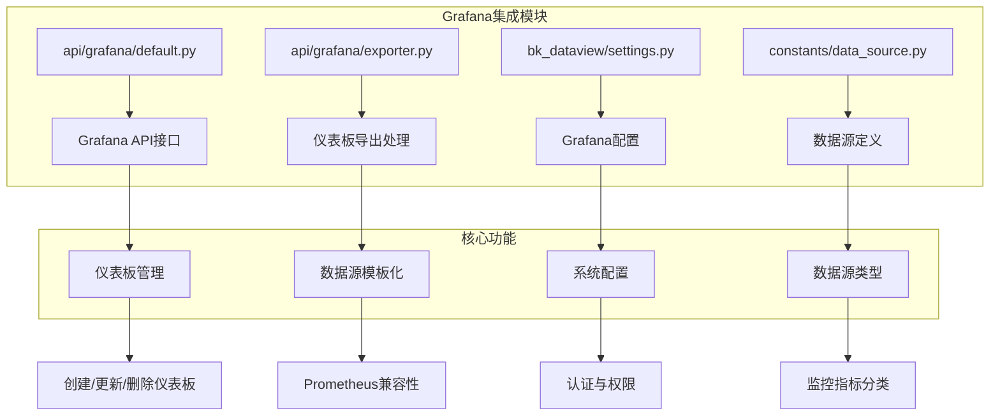
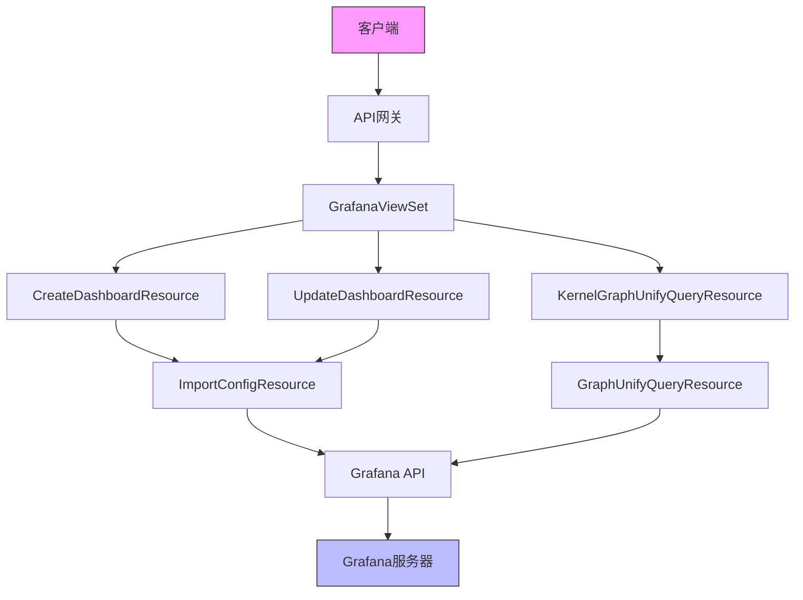
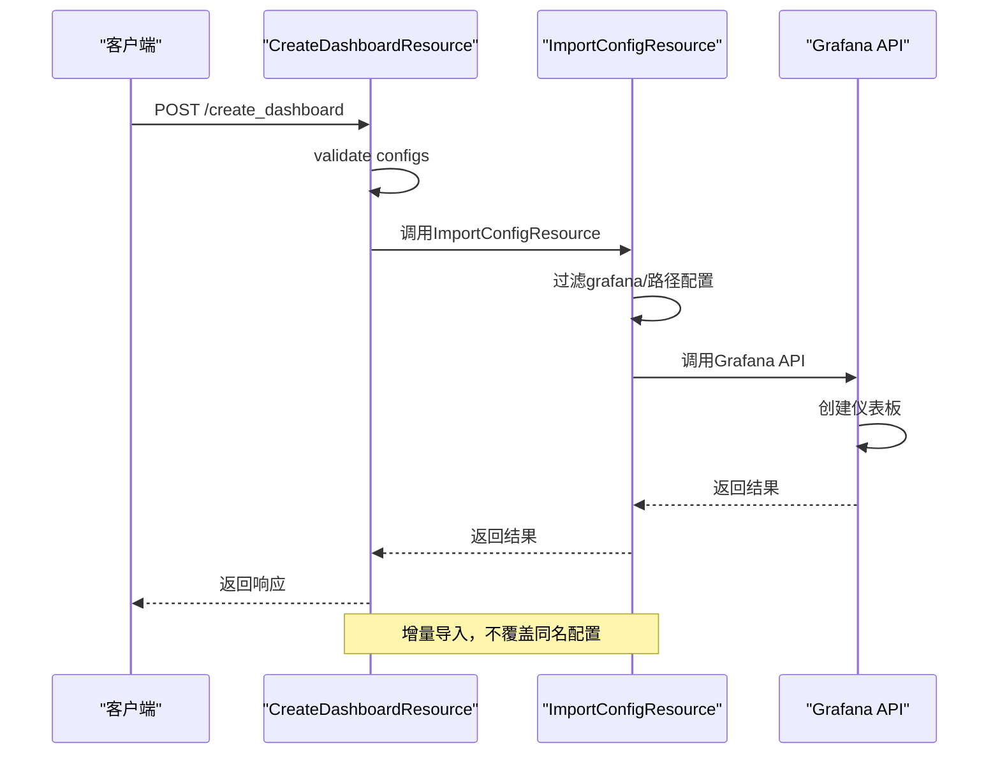
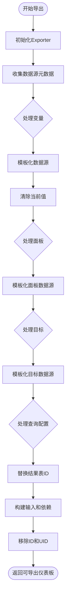
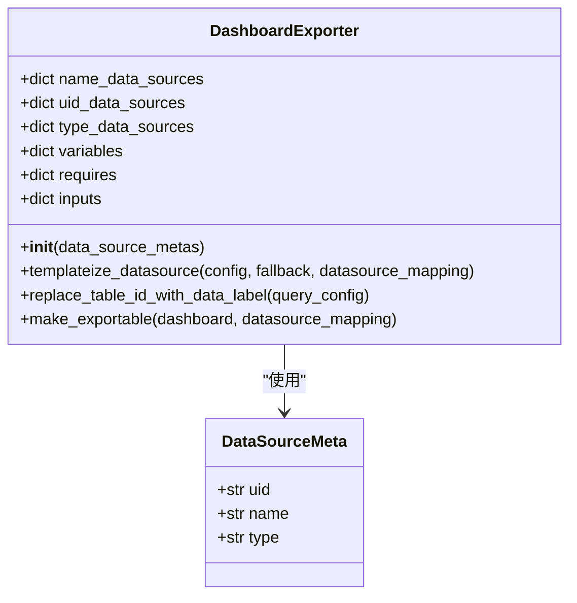
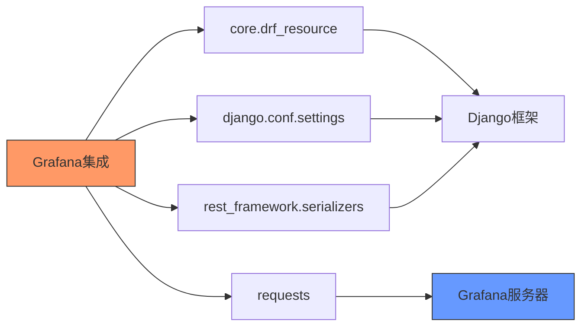

# Grafana集成

<cite>
**本文档引用的文件**   
- [default.py](file://bkmonitor/api/grafana/default.py)
- [exporter.py](file://bkmonitor/api/grafana/exporter.py)
- [settings.py](file://bkmonitor/bk_dataview/settings.py)
- [grafana.py](file://bkmonitor/bkmonitor/utils/grafana.py)
- [grafana.py](file://bkmonitor/kernel_api/resource/grafana.py)
- [grafana.py](file://bkmonitor/kernel_api/views/v4/grafana.py)
- [data_source.py](file://bkmonitor/constants/data_source.py)
</cite>

## 目录
1. [简介](#简介)
2. [项目结构](#项目结构)
3. [核心组件](#核心组件)
4. [架构概述](#架构概述)
5. [详细组件分析](#详细组件分析)
6. [依赖分析](#依赖分析)
7. [性能考虑](#性能考虑)
8. [故障排除指南](#故障排除指南)
9. [结论](#结论)

## 简介
本文档详细说明了`bk-apm`系统中Grafana集成的实现机制。该集成通过`api/grafana/`模块与Grafana可视化平台对接，实现了仪表板管理、图表嵌入和数据源配置等功能。`exporter.py`模块负责指标导出和Prometheus兼容性处理。系统通过API实现了仪表板的创建、更新和删除流程，并提供了认证配置、数据源绑定和权限管理的指导。文档还列举了集成过程中常见的跨域问题、权限错误和数据不一致的解决方案。

## 项目结构
Grafana集成功能主要分布在`bkmonitor/api/grafana/`目录下，包含API定义、数据导出和配置管理等核心文件。系统通过`default.py`定义了与Grafana API的交互接口，`exporter.py`处理仪表板的模板化和导出。配置信息分散在`settings.py`和`constants/data_source.py`中，定义了数据源类型和系统配置。



**Diagram sources**
- [default.py](file://bkmonitor/api/grafana/default.py#L28-L320)
- [exporter.py](file://bkmonitor/api/grafana/exporter.py#L4-L126)
- [settings.py](file://bkmonitor/bk_dataview/settings.py#L14-L81)
- [data_source.py](file://bkmonitor/constants/data_source.py#L21-L246)

**Section sources**
- [default.py](file://bkmonitor/api/grafana/default.py#L1-L320)
- [exporter.py](file://bkmonitor/api/grafana/exporter.py#L1-L126)

## 核心组件
Grafana集成的核心组件包括API资源类、仪表板导出器和系统配置管理。`GrafanaApiResource`基类定义了与Grafana后端通信的通用方法，所有具体的API操作都继承自此类。`DashboardExporter`类负责处理仪表板的模板化和导出，确保仪表板可以在不同环境中移植。系统通过`grafana_settings`对象管理Grafana相关的配置参数。

**Section sources**
- [default.py](file://bkmonitor/api/grafana/default.py#L28-L320)
- [exporter.py](file://bkmonitor/api/grafana/exporter.py#L4-L126)
- [settings.py](file://bkmonitor/bk_dataview/settings.py#L54-L81)

## 架构概述
Grafana集成采用分层架构，上层为API资源类，中层为业务逻辑处理，底层为配置管理。API资源类直接与Grafana REST API交互，执行具体的CRUD操作。业务逻辑层处理数据转换、模板化和权限验证。配置管理层提供统一的配置访问接口，确保系统配置的一致性。



**Diagram sources**
- [grafana.py](file://bkmonitor/kernel_api/views/v4/grafana.py#L11-L61)
- [grafana.py](file://bkmonitor/kernel_api/resource/grafana.py#L60-L98)
- [default.py](file://bkmonitor/api/grafana/default.py#L28-L320)

## 详细组件分析

### API资源组件分析
API资源组件基于`GrafanaApiResource`基类实现，通过继承和重写方法来支持不同的Grafana API端点。每个具体的API资源类都定义了HTTP方法、路径和请求序列化器，确保参数验证和类型安全。

#### API资源类图
```mermaid
classDiagram
class GrafanaApiResource {
+str method
+str path
+bool with_org_id
+perform_request(params) dict
}
class CreateOrUpdateDashboard {
+str method = "POST"
+str path = "/api/dashboards/db/"
+RequestSerializer
}
class CreateDataSource {
+str method = "POST"
+str path = "/api/datasources/"
+RequestSerializer
}
class GetDashboardByUID {
+str method = "GET"
+str path = "/api/dashboards/uid/{uid}"
+RequestSerializer
}
class DeleteDashboardByUID {
+str method = "DELETE"
+str path = "/api/dashboards/uid/{uid}/"
+RequestSerializer
}
GrafanaApiResource <|-- CreateOrUpdateDashboard
GrafanaApiResource <|-- CreateDataSource
GrafanaApiResource <|-- GetDashboardByUID
GrafanaApiResource <|-- DeleteDashboardByUID
```

**Diagram sources**
- [default.py](file://bkmonitor/api/grafana/default.py#L28-L320)

#### 仪表板创建流程序列图


**Diagram sources**
- [grafana.py](file://bkmonitor/kernel_api/resource/grafana.py#L60-L78)
- [grafana.py](file://bkmonitor/kernel_api/views/v4/grafana.py#L28-L30)

### 仪表板导出组件分析
`DashboardExporter`组件负责将仪表板配置转换为可移植的模板格式，支持在不同环境中部署。该组件处理数据源的模板化，替换结果表ID为data_label，并移除特定于环境的标识符。

#### 仪表板导出流程图


**Diagram sources**
- [exporter.py](file://bkmonitor/api/grafana/exporter.py#L4-L126)

#### 数据源模板化类图


**Diagram sources**
- [exporter.py](file://bkmonitor/api/grafana/exporter.py#L4-L126)
- [data_source.py](file://bkmonitor/constants/data_source.py#L21-L41)

**Section sources**
- [exporter.py](file://bkmonitor/api/grafana/exporter.py#L1-L126)
- [data_source.py](file://bkmonitor/constants/data_source.py#L1-L246)

## 依赖分析
Grafana集成模块依赖于多个核心组件和外部服务。系统通过`core.drf_resource`提供资源框架支持，依赖`django.conf.settings`进行配置管理，并通过`requests`库与Grafana服务器通信。



**Diagram sources**
- [default.py](file://bkmonitor/api/grafana/default.py#L18-L21)
- [exporter.py](file://bkmonitor/api/grafana/exporter.py#L1)
- [settings.py](file://bkmonitor/bk_dataview/settings.py#L11)

**Section sources**
- [default.py](file://bkmonitor/api/grafana/default.py#L1-L320)
- [exporter.py](file://bkmonitor/api/grafana/exporter.py#L1-L126)
- [settings.py](file://bkmonitor/bk_dataview/settings.py#L1-L81)

## 性能考虑
Grafana集成在性能方面考虑了并发处理和缓存机制。`fetch_biz_panels`函数使用线程池并发获取多个仪表板的面板信息，提高了批量操作的效率。系统还通过`api_cache`模块提供API响应缓存，减少对Grafana后端的重复请求。

## 故障排除指南
集成过程中可能遇到的常见问题包括跨域问题、权限错误和数据不一致。跨域问题通常由浏览器安全策略引起，可通过配置CORS头解决。权限错误多因API密钥或用户权限不足导致，需检查Grafana用户角色和API密钥权限。数据不一致问题可能源于数据源配置错误或查询时间范围不匹配，应验证数据源连接和查询参数。

**Section sources**
- [grafana.py](file://bkmonitor/bkmonitor/utils/grafana.py#L19-L77)
- [default.py](file://bkmonitor/api/grafana/default.py#L25-L77)

## 结论
Grafana集成模块通过清晰的分层架构和模块化设计，实现了与Grafana平台的无缝对接。系统提供了完整的仪表板管理API，支持数据源的动态配置和指标的可视化展示。`DashboardExporter`组件确保了仪表板配置的可移植性，而详细的权限管理和错误处理机制保证了系统的稳定性和安全性。该集成方案为监控数据的可视化提供了强大而灵活的支持。