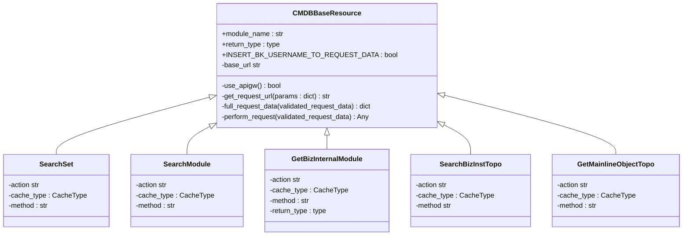
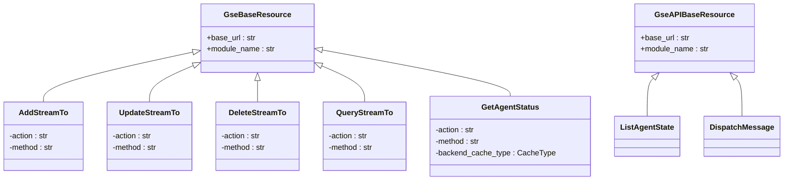
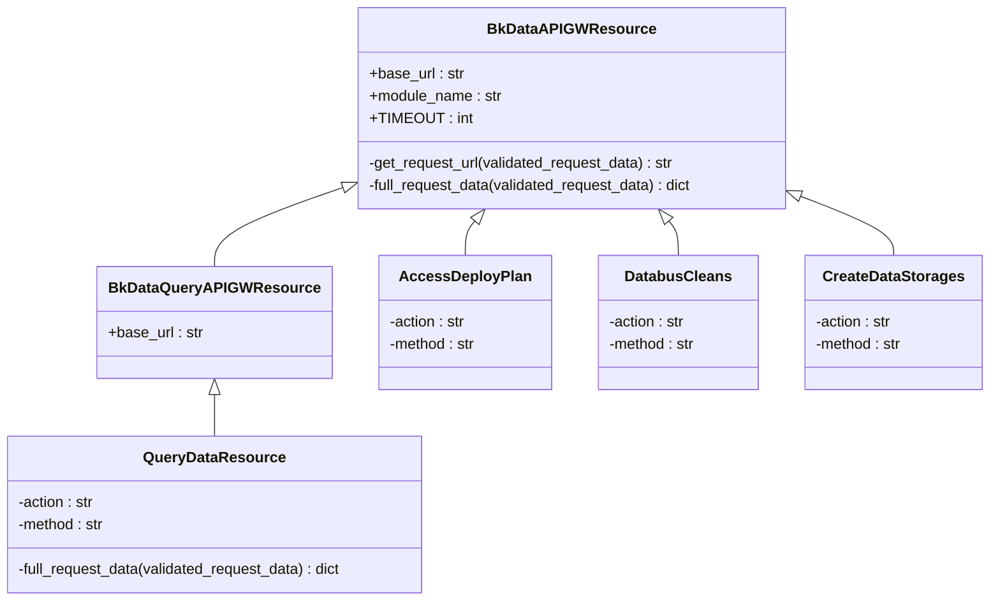
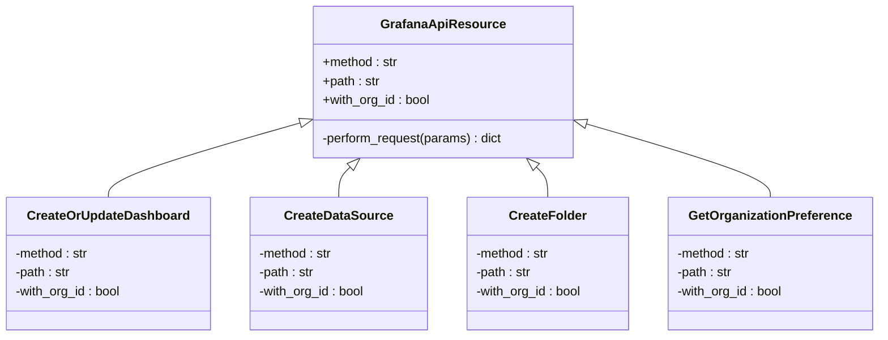

# 外部系统集成

<cite>
**本文档引用的文件**   
- [client.py](file://bkmonitor/api/cmdb/client.py)
- [default.py](file://bkmonitor/api/cmdb/default.py)
- [define.py](file://bkmonitor/api/cmdb/define.py)
- [default.py](file://bkmonitor/api/gse/default.py)
- [default.py](file://bkmonitor/api/bkdata/default.py)
- [default.py](file://bkmonitor/api/grafana/default.py)
- [exporter.py](file://bkmonitor/api/grafana/exporter.py)
- [common.py](file://bkmonitor/constants/common.py)
- [cmdb.py](file://bkmonitor/constants/cmdb.py)
</cite>

## 目录
1. [引言](#引言)
2. [CMDB集成](#cmdb集成)
3. [GSE集成](#gse集成)
4. [BKData集成](#bkdata集成)
5. [Grafana集成](#grafana集成)
6. [认证机制](#认证机制)
7. [重试策略与错误处理](#重试策略与错误处理)
8. [配置步骤与权限要求](#配置步骤与权限要求)
9. [常见问题解决方案](#常见问题解决方案)

## 引言
本文档详细描述了蓝鲸监控平台与外部系统（CMDB、GSE、BKData、Grafana）的集成方式。这些集成模块封装了对蓝鲸平台外部服务的调用，提供了统一的接口供监控系统使用。CMDB模块用于获取主机拓扑信息，GSE模块用于进程管理，BKData模块用于数据接入，Grafana模块用于可视化集成。文档将深入分析每个模块的职责、API调用机制、认证方式、重试策略和错误处理，并提供配置步骤、权限要求及常见问题的解决方案。

## CMDB集成

CMDB集成模块负责与蓝鲸配置管理数据库（CMDB）进行交互，获取业务、主机、服务实例等拓扑信息。该模块通过封装CMDB API，为上层应用提供简洁、易用的接口。

### 模块职责
CMDB集成模块的主要职责包括：
- **获取主机拓扑**：查询业务下的主机及其在拓扑中的位置，支持按IP、业务ID、拓扑节点等多种条件查询。
- **查询业务信息**：获取业务的详细信息，包括业务ID、名称、负责人等。
- **查询服务实例**：获取业务下的所有服务实例，或根据拓扑节点查询特定的服务实例。
- **查询模块与集群**：获取模块和集群的详细信息，支持按ID、服务模板等条件过滤。

### API调用实现
CMDB集成通过`client.py`和`default.py`两个文件实现。`client.py`定义了与CMDB API直接交互的底层资源类，这些类继承自`CMDBBaseResource`，并针对不同的CMDB API端点进行配置。`default.py`则在此基础上，提供了更高层次的、面向业务的资源类，这些类使用`batch_request`等工具进行批量请求和结果处理。

**图示来源**
- [client.py](file://bkmonitor/api/cmdb/client.py#L38-L456)

**本节来源**
- [client.py](file://bkmonitor/api/cmdb/client.py#L1-L457)
- [default.py](file://bkmonitor/api/cmdb/default.py#L1-L800)
- [define.py](file://bkmonitor/api/cmdb/define.py#L1-L811)

## GSE集成

GSE集成模块负责与蓝鲸游戏服务引擎（GSE）进行交互，主要用于进程状态管理和数据路由配置。该模块通过调用GSE API来实现对Agent和进程的监控与管理。

### 模块职责
GSE集成模块的主要职责包括：
- **进程状态管理**：查询指定主机上Agent和进程的运行状态。
- **数据路由配置**：管理数据接收端（Stream To）和路由（Route）的配置，实现数据的分发和存储。
- **消息分发**：向指定的Agent发送消息，用于执行特定任务。

### API调用实现
GSE集成在`default.py`中定义了一系列资源类，这些类继承自`GseBaseResource`或`GseAPIBaseResource`。每个资源类对应一个GSE API端点，例如`AddStreamTo`用于新增数据接收端，`GetAgentStatus`用于查询Agent状态。这些类通过`RequestSerializer`定义了请求参数的结构，并通过`perform_request`方法执行实际的API调用。

**图示来源**
- [default.py](file://bkmonitor/api/gse/default.py#L29-L484)

**本节来源**
- [default.py](file://bkmonitor/api/gse/default.py#L1-L484)

## BKData集成

BKData集成模块负责与蓝鲸数据平台（BKData）进行交互，主要用于数据接入、清洗、存储和查询。该模块为监控系统提供了强大的数据处理能力。

### 模块职责
BKData集成模块的主要职责包括：
- **数据接入**：提交数据接入部署计划，将外部数据源接入到BKData平台。
- **数据清洗**：配置和管理数据清洗规则，将原始数据转换为结构化数据。
- **数据存储**：创建数据入库任务，将清洗后的数据存储到指定的存储系统（如Kafka、InfluxDB）。
- **数据查询**：执行SQL查询，从BKData平台获取处理后的数据。
- **模型管理**：管理AIOPS模型的发布和应用。

### API调用实现
BKData集成在`default.py`中定义了多个资源类，这些类继承自`BkDataAPIGWResource`或`BkDataQueryAPIGWResource`。`BkDataAPIGWResource`是所有BKData API的基类，它定义了基础的URL、超时时间等。`QueryDataResource`专门用于数据查询，它实现了基于`bkdata_data_token`或用户身份的认证机制。

**图示来源**
- [default.py](file://bkmonitor/api/bkdata/default.py#L49-L800)

**本节来源**
- [default.py](file://bkmonitor/api/bkdata/default.py#L1-L800)

## Grafana集成

Grafana集成模块负责与Grafana可视化平台进行交互，主要用于仪表盘的创建、更新和管理。该模块通过调用Grafana的Admin API和普通API来实现对Grafana资源的管理。

### 模块职责
Grafana集成模块的主要职责包括：
- **仪表盘管理**：创建、更新、删除和导入仪表盘。
- **数据源管理**：创建和管理数据源，为仪表盘提供数据支持。
- **文件夹管理**：创建、更新和删除文件夹，用于组织和管理仪表盘。
- **组织偏好设置**：设置组织的默认主页仪表盘。

### API调用实现
Grafana集成在`default.py`中定义了一个基类`GrafanaApiResource`和多个具体的资源类。`GrafanaApiResource`封装了与Grafana API交互的通用逻辑，包括构建URL、设置请求头（特别是`X-WEBAUTH-USER`和`X-Grafana-Org-Id`）、处理响应等。具体的资源类如`CreateOrUpdateDashboard`、`CreateDataSource`等，通过定义`path`和`method`属性来指定具体的API端点。

**图示来源**
- [default.py](file://bkmonitor/api/grafana/default.py#L28-L320)

**本节来源**
- [default.py](file://bkmonitor/api/grafana/default.py#L1-L320)
- [exporter.py](file://bkmonitor/api/grafana/exporter.py#L1-L126)

## 认证机制

外部系统集成模块使用了多种认证机制来确保API调用的安全性。

### JWT与API Key
- **CMDB、GSE、BKData**：这些模块主要通过蓝鲸API网关（APIGW）进行调用。API网关使用`x-bkapi-authorization`请求头进行认证，该头信息中包含了`bk_app_code`和`bk_app_secret`，相当于API Key。在`bkdata/default.py`中，`UseSaaSAuthInfoMixin`混入类确保了所有请求都携带了正确的`bk_app_code`和`bk_app_secret`。
- **Grafana**：Grafana使用`X-WEBAUTH-USER`请求头进行认证，该头信息指定了执行操作的用户名。在`grafana/default.py`中，`GrafanaApiResource`类在`perform_request`方法中设置了此请求头。

### 认证流程
1.  **应用级认证**：对于通过APIGW调用的服务（CMDB、GSE、BKData），系统使用预配置的`SAAS_APP_CODE`和`SAAS_SECRET_KEY`进行应用级别的认证。
2.  **数据级认证**：对于BKData的数据查询，除了应用认证外，还可以使用`bkdata_data_token`进行数据级别的认证，这提供了更细粒度的权限控制。
3.  **用户级认证**：对于Grafana，操作是基于指定的用户名进行的，这允许系统以特定用户的身份执行操作。

**本节来源**
- [default.py](file://bkmonitor/api/bkdata/default.py#L23-L47)
- [default.py](file://bkmonitor/api/grafana/default.py#L50-L51)

## 重试策略与错误处理

外部系统集成模块内置了重试策略和错误处理机制，以提高系统的稳定性和容错能力。

### 重试策略
文档中未直接体现代码层面的重试策略。但通过`batch_request`工具的使用，可以推断出系统在处理批量请求时具备一定的容错能力。`batch_request`会自动处理分页和重试，确保所有数据都能被成功获取。

### 错误处理
错误处理主要体现在以下几个方面：
- **异常捕获**：在`client.py`的`CMDBBaseResource.perform_request`方法中，捕获了`NoRelatedResourceError`异常，并返回空数据，避免了异常向上抛出导致整个流程中断。
- **日志记录**：在`default.py`中，使用`logging`模块记录了详细的日志信息，便于问题排查。
- **返回码处理**：在`grafana/default.py`的`GrafanaApiResource.perform_request`方法中，检查了HTTP响应状态码，并根据结果返回结构化的响应数据，其中包含了`result`、`code`、`message`和`data`字段，便于上层应用判断调用是否成功。

**本节来源**
- [client.py](file://bkmonitor/api/cmdb/client.py#L76-L84)
- [default.py](file://bkmonitor/api/grafana/default.py#L66-L76)

## 配置步骤与权限要求

### 配置步骤
1.  **环境变量配置**：在`settings.py`中配置必要的环境变量，如`BK_COMPONENT_API_URL`、`BKDATA_API_BASE_URL`、`GRAFANA_URL`等。
2.  **认证信息配置**：配置`SAAS_APP_CODE`、`SAAS_SECRET_KEY`和`BKDATA_DATA_TOKEN`等认证信息。
3.  **模块初始化**：在应用启动时，确保相关的API资源类被正确加载和初始化。

### 权限要求
- **CMDB**：需要具备访问CMDB API的权限，通常由蓝鲸平台的权限系统统一管理。
- **GSE**：需要具备调用GSE API的权限，特别是`get_agent_status`等接口。
- **BKData**：需要具备数据接入、清洗和查询的权限。对于`bkdata_data_token`，需要确保该Token具有访问目标数据的权限。
- **Grafana**：需要具备Grafana的管理员权限（Admin权限），因为许多操作（如创建用户、创建数据源）都需要管理员身份。

**本节来源**
- [default.py](file://bkmonitor/api/bkdata/default.py#L33-L34)
- [default.py](file://bkmonitor/api/grafana/default.py#L38-L50)

## 常见问题解决方案

### 问题1：调用CMDB API返回空数据
**现象**：调用`get_biz_internal_module`等接口时，返回空列表。
**原因**：该业务可能没有关联的资源，或者当前用户没有访问该业务的权限。
**解决方案**：检查业务ID是否正确，并确认当前用户是否具有该业务的查看权限。

### 问题2：Grafana仪表盘创建失败
**现象**：调用`CreateOrUpdateDashboard`接口返回403错误。
**原因**：执行操作的用户（由`X-WEBAUTH-USER`指定）没有足够的权限。
**解决方案**：确保指定的用户名具有Grafana的管理员权限，或者检查Grafana的权限配置。

### 问题3：BKData数据查询返回认证失败
**现象**：调用`QueryDataResource`时，返回`bkdata_authentication_method`相关的错误。
**原因**：`bkdata_data_token`配置错误或已过期，或者`SAAS_APP_CODE`/`SAAS_SECRET_KEY`配置不正确。
**解决方案**：检查`settings.py`中的相关配置项，并确保`bkdata_data_token`有效。

**本节来源**
- [client.py](file://bkmonitor/api/cmdb/client.py#L78-L84)
- [default.py](file://bkmonitor/api/grafana/default.py#L54-L55)
- [default.py](file://bkmonitor/api/bkdata/default.py#L207-L212)