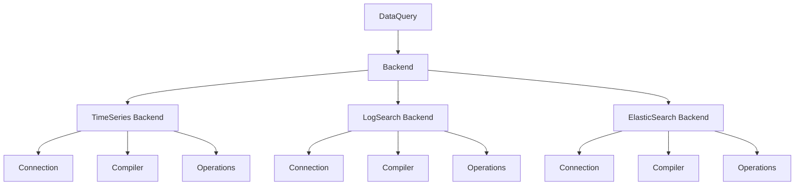
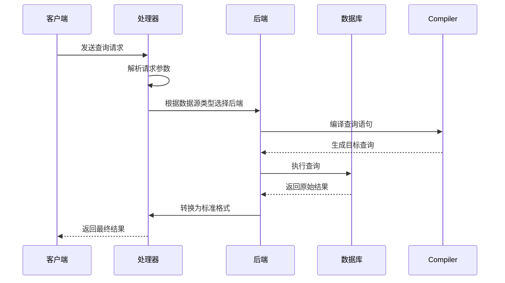
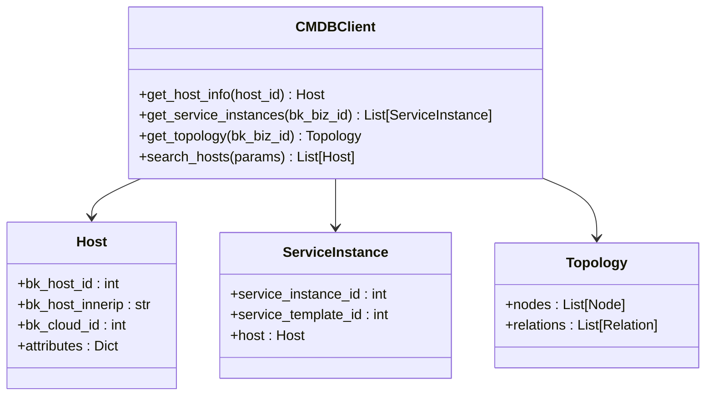

# 数据采集

<cite>
**本文档中引用的文件**  
- [data_source/__init__.py](file://bkmonitor/bkmonitor/data_source/__init__.py)
- [data_source/shortcuts.py](file://bkmonitor/bkmonitor/data_source/shortcuts.py)
- [data_source/README.md](file://bkmonitor/bkmonitor/data_source/README.md)
- [data_source/backends/base/connection.py](file://bkmonitor/bkmonitor/data_source/backends/base/connection.py)
- [data_source/backends/base/operations.py](file://bkmonitor/bkmonitor/data_source/backends/base/operations.py)
- [data_source/backends/time_series/connection.py](file://bkmonitor/bkmonitor/data_source/backends/time_series/connection.py)
- [data_source/backends/time_series/compiler.py](file://bkmonitor/bkmonitor/data_source/backends/time_series/compiler.py)
- [data_source/backends/log_search/connection.py](file://bkmonitor/bkmonitor/data_source/backends/log_search/connection.py)
- [data_source/backends/log_search/compiler.py](file://bkmonitor/bkmonitor/data_source/backends/log_search/compiler.py)
- [data_source/backends/elastic_search/connection.py](file://bkmonitor/bkmonitor/data_source/backends/elastic_search/connection.py)
- [data_source/backends/elastic_search/compiler.py](file://bkmonitor/bkmonitor/data_source/backends/elastic_search/compiler.py)
- [data_source/handler/time_series.py](file://bkmonitor/bkmonitor/data_source/handler/time_series.py)
- [data_source/handler/log_search.py](file://bkmonitor/bkmonitor/data_source/handler/log_search.py)
- [data_source/handler/elastic_search.py](file://bkmonitor/bkmonitor/data_source/handler/elastic_search.py)
- [api/cmdb/client.py](file://bkmonitor/api/cmdb/client.py)
- [api/gse/default.py](file://bkmonitor/api/gse/default.py)
- [api/log_search/default.py](file://bkmonitor/api/log_search/default.py)
</cite>

## 目录

1. [简介](#简介)
2. [数据源类型](#数据源类型)
3. [后端实现机制](#后端实现机制)
4. [请求处理机制](#请求处理机制)
5. [外部接口封装](#外部接口封装)
6. [配置方法与最佳实践](#配置方法与最佳实践)
7. [扩展新数据源](#扩展新数据源)

## 简介

数据采集模块是蓝鲸监控平台的核心组件之一，负责统一接入和处理多种类型的数据源。该模块设计目标是提供统一的查询入口，支持时序数据、日志数据、自定义上报和APM数据等多种数据类型，并为上层应用提供类似Django ORM的简洁查询接口。

**Section sources**
- [data_source/README.md](file://bkmonitor/bkmonitor/data_source/README.md)

## 数据源类型

系统支持以下主要数据源类型：

- **时序数据**：用于存储和查询时间序列指标数据，如CPU使用率、内存占用等性能指标
- **日志数据**：用于采集和分析结构化或非结构化日志信息
- **自定义上报**：支持用户通过API主动上报业务指标数据
- **APM数据**：应用性能监控数据，包括调用链追踪、事务性能等

这些数据源通过统一的数据查询模型进行抽象，使得不同类型的查询可以使用一致的接口。

**Section sources**
- [data_source/README.md](file://bkmonitor/bkmonitor/data_source/README.md)

## 后端实现机制

### 架构设计

数据采集模块采用插件式后端架构，每个数据源类型都有独立的后端实现，遵循统一的基类规范。

**Diagram sources**
- [data_source/backends/base/connection.py](file://bkmonitor/bkmonitor/data_source/backends/base/connection.py)
- [data_source/backends/base/operations.py](file://bkmonitor/bkmonitor/data_source/backends/base/operations.py)

### 时序数据后端

时序数据后端（TimeSeries）负责处理时间序列数据库的查询请求。其核心组件包括：

- **Connection**：管理与时序数据库的连接
- **Compiler**：将高级查询语句编译为底层数据库查询语言
- **Operations**：定义特定于时序数据的操作方法

该后端支持聚合查询、时间范围过滤、分组统计等功能。

**Section sources**
- [data_source/backends/time_series/connection.py](file://bkmonitor/bkmonitor/data_source/backends/time_series/connection.py)
- [data_source/backends/time_series/compiler.py](file://bkmonitor/bkmonitor/data_source/backends/time_series/compiler.py)

### 日志数据后端

日志数据后端（LogSearch）专门处理日志类数据的查询需求。其特点包括：

- 支持全文检索和字段过滤
- 提供日志聚合和统计功能
- 集成BK-LogSearch系统的查询能力

与时序数据类似，也包含Connection、Compiler和Operations三个核心组件。

**Section sources**
- [data_source/backends/log_search/connection.py](file://bkmonitor/bkmonitor/data_source/backends/log_search/connection.py)
- [data_source/backends/log_search/compiler.py](file://bkmonitor/bkmonitor/data_source/backends/log_search/compiler.py)

### ElasticSearch后端

ElasticSearch后端用于处理基于ElasticSearch的数据查询，主要应用于APM和分布式追踪场景。它支持复杂的嵌套查询、模糊匹配和高亮显示等功能。

**Section sources**
- [data_source/backends/elastic_search/connection.py](file://bkmonitor/bkmonitor/data_source/backends/elastic_search/connection.py)
- [data_source/backends/elastic_search/compiler.py](file://bkmonitor/bkmonitor/data_source/backends/elastic_search/compiler.py)

## 请求处理机制

### 处理器架构

`data_source/handler/`目录下的处理器负责接收和分发来自不同数据源的请求。

**Diagram sources**
- [data_source/handler/time_series.py](file://bkmonitor/bkmonitor/data_source/handler/time_series.py)
- [data_source/handler/log_search.py](file://bkmonitor/bkmonitor/data_source/handler/log_search.py)
- [data_source/handler/elastic_search.py](file://bkmonitor/bkmonitor/data_source/handler/elastic_search.py)

### 具体处理器

- **time_series.py**：处理时序数据查询请求
- **log_search.py**：处理日志搜索查询请求  
- **elastic_search.py**：处理ElasticSearch相关查询

这些处理器根据请求中的数据源标识符路由到相应的后端实现。

**Section sources**
- [data_source/handler/time_series.py](file://bkmonitor/bkmonitor/data_source/handler/time_series.py)
- [data_source/handler/log_search.py](file://bkmonitor/bkmonitor/data_source/handler/log_search.py)
- [data_source/handler/elastic_search.py](file://bkmonitor/bkmonitor/data_source/handler/elastic_search.py)

## 外部接口封装

### CMDB接口

CMDB（配置管理数据库）接口封装了对资源拓扑和配置信息的访问，主要用于：

- 主机和服务实例的发现
- 资源关系查询
- 拓扑结构获取

**Diagram sources**
- [api/cmdb/client.py](file://bkmonitor/api/cmdb/client.py)

### GSE接口

GSE（Generic Service Engine）接口提供了对代理和进程的控制能力，包括：

- 进程启停管理
- 代理状态查询
- 命令下发执行

**Section sources**
- [api/gse/default.py](file://bkmonitor/api/gse/default.py)

### LogSearch接口

LogSearch接口封装了日志搜索平台的查询功能，支持：

- 索引集查询
- 日志检索语法
- 聚合分析

**Section sources**
- [api/log_search/default.py](file://bkmonitor/api/log_search/default.py)

## 配置方法与最佳实践

### 配置方式

数据采集模块的配置主要通过以下方式进行：

1. **数据源注册**：在系统中注册新的数据源实例
2. **查询参数设置**：配置查询的时间范围、采样间隔等参数
3. **权限控制**：设置数据访问的权限策略

### 最佳实践

- 使用统一的查询接口避免直接操作底层数据库
- 合理设置查询时间范围以提高性能
- 利用聚合查询减少数据传输量
- 对高频查询建立适当的索引
- 定期监控查询性能并进行优化

## 扩展新数据源

### 扩展步骤

要扩展支持新的数据源类型，需要遵循以下步骤：

1. 在`backends/`目录下创建新的子目录
2. 继承基类`BaseDatabaseConnection`和`BaseDatabaseOperations`
3. 实现具体的`connection.py`、`compiler.py`和`operations.py`
4. 在`__init__.py`中注册新后端
5. 创建对应的处理器文件在`handler/`目录下

### 接口规范

新数据源必须实现的标准接口包括：

- 连接管理
- 查询编译
- 结果解析
- 错误处理

通过遵循这些规范，可以确保新数据源与现有系统无缝集成。

**Section sources**
- [data_source/backends/base/connection.py](file://bkmonitor/bkmonitor/data_source/backends/base/connection.py)
- [data_source/backends/base/operations.py](file://bkmonitor/bkmonitor/data_source/backends/base/operations.py)