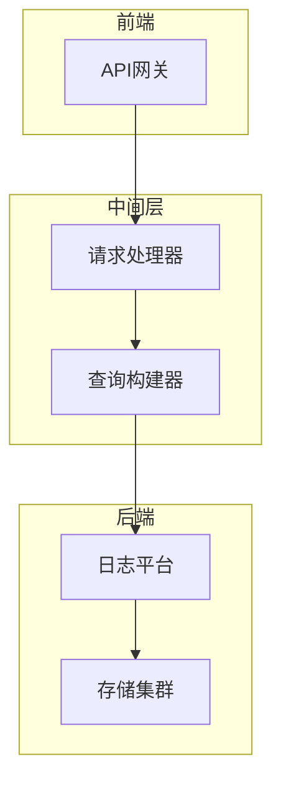
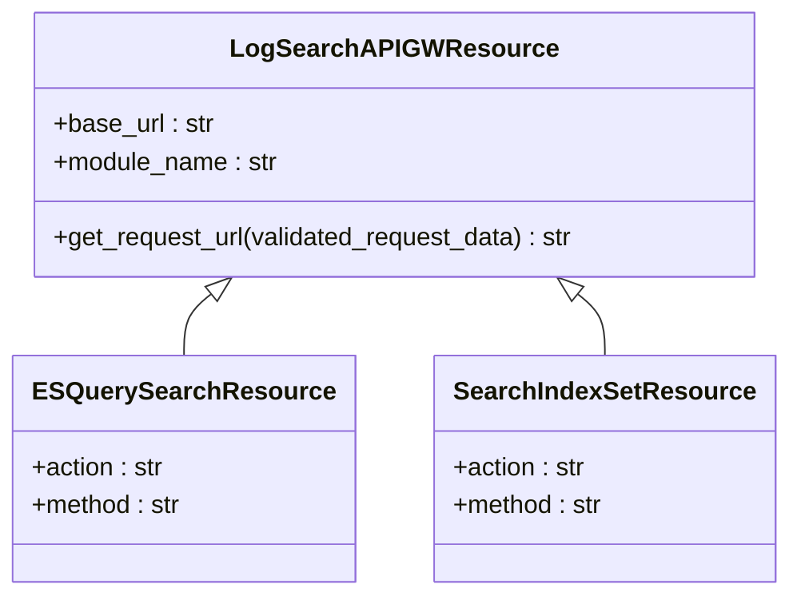
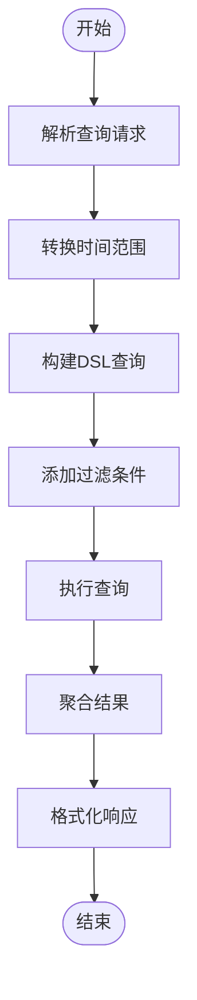
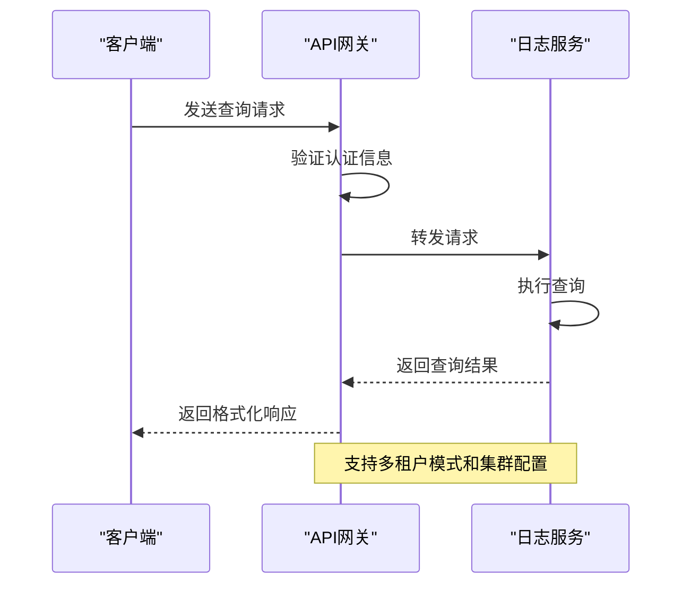
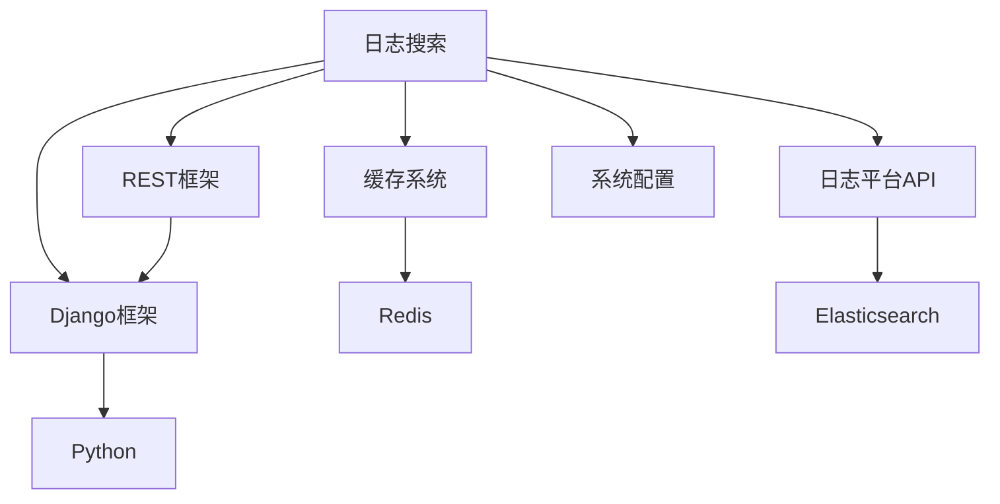

# 日志数据采集

<cite>
**本文档引用的文件**
- [log_search.py](file://bkmonitor/api/log_search/default.py)
- [log_search.py](file://bkmonitor/data_source/handler/log_search.py)
- [test_log_search.py](file://bkmonitor/data_source/tests/test_log_search.py)
- [0045_fix_log_search_method.py](file://bkmonitor/migrations/0045_fix_log_search_method.py)
- [0051_fix_log_search_metric_id.py](file://bkmonitor/migrations/0051_fix_log_search_metric_id.py)
</cite>

## 目录
1. [简介](#简介)
2. [项目结构](#项目结构)
3. [核心组件](#核心组件)
4. [架构概述](#架构概述)
5. [详细组件分析](#详细组件分析)
6. [依赖分析](#依赖分析)
7. [性能考虑](#性能考虑)
8. [故障排除指南](#故障排除指南)
9. [结论](#结论)

## 简介
本文档详细阐述了日志数据采集模块的技术实现，重点解析了日志平台集成、日志查询请求处理流程、外部日志搜索服务API调用方式、认证机制及错误处理。同时提供了日志采集的配置方法、常见问题排查和性能调优指南。

## 项目结构
日志数据采集功能主要分布在`bkmonitor`模块下的多个子目录中，核心功能集中在`api/log_search`和`data_source/handler`目录。系统通过分层架构实现了日志数据的检索、处理和聚合。

**Section sources**
- [default.py](file://bkmonitor/api/log_search/default.py#L1-L517)
- [log_search.py](file://bkmonitor/data_source/handler/log_search.py#L1-L16)

## 核心组件
日志数据采集系统的核心组件包括日志搜索API网关资源、数据查询处理器和日志搜索数据查询类。这些组件协同工作，实现了从日志平台检索数据的完整流程。

**Section sources**
- [log_search.py](file://bkmonitor/data_source/handler/log_search.py#L1-L16)
- [default.py](file://bkmonitor/api/log_search/default.py#L1-L517)

## 架构概述
日志数据采集系统采用分层架构设计，前端通过API网关与日志平台交互，中间层处理查询请求和数据转换，后端实现数据聚合和结果返回。系统通过标准化接口与外部日志搜索服务集成。

**Diagram sources**
- [default.py](file://bkmonitor/api/log_search/default.py#L21-L517)
- [log_search.py](file://bkmonitor/data_source/handler/log_search.py#L14-L15)

## 详细组件分析

### 日志搜索API网关分析
日志搜索API网关组件负责与外部日志搜索服务进行通信，提供了多种查询接口，包括DSL查询、索引集搜索、字段查询等。网关通过`LogSearchAPIGWResource`基类实现统一的请求处理和认证机制。

**Diagram sources**
- [default.py](file://bkmonitor/api/log_search/default.py#L21-L143)

### 日志查询请求处理分析
日志查询请求处理流程包括查询语句转换、时间范围处理和结果聚合三个主要阶段。系统通过`LogSearchDataQuery`类实现查询构建，支持多种查询条件和聚合操作。

**Diagram sources**
- [log_search.py](file://bkmonitor/data_source/handler/log_search.py#L14-L15)
- [test_log_search.py](file://bkmonitor/data_source/tests/test_log_search.py#L1-L133)

### API调用与认证机制分析
系统通过API网关与外部日志搜索服务进行交互，实现了完整的认证机制和错误处理流程。API调用支持多租户模式，并根据配置自动选择合适的API基础URL。

**Diagram sources**
- [default.py](file://bkmonitor/api/log_search/default.py#L24-L34)

## 依赖分析
日志数据采集系统依赖于多个核心模块和外部服务，包括Django框架、REST框架、缓存系统和日志平台API。系统通过清晰的接口定义实现了模块间的松耦合。

**Diagram sources**
- [default.py](file://bkmonitor/api/log_search/default.py#L14-L18)
- [log_search.py](file://bkmonitor/data_source/handler/log_search.py#L11-L12)

## 性能考虑
系统在设计时充分考虑了性能优化，通过缓存机制、查询优化和连接池等技术提高查询效率。建议在生产环境中合理配置缓存策略和查询参数，以获得最佳性能。

## 故障排除指南
当遇到日志采集问题时，可按照以下步骤进行排查：
1. 检查API网关配置是否正确
2. 验证认证信息是否有效
3. 检查查询语句是否符合语法规范
4. 确认时间范围设置是否合理
5. 查看系统日志获取详细错误信息

**Section sources**
- [default.py](file://bkmonitor/api/log_search/default.py#L70-L105)
- [test_log_search.py](file://bkmonitor/data_source/tests/test_log_search.py#L101-L124)

## 结论
日志数据采集系统通过模块化设计和标准化接口，实现了高效、可靠的日志数据检索功能。系统具有良好的扩展性和可维护性，能够满足不同场景下的日志采集需求。