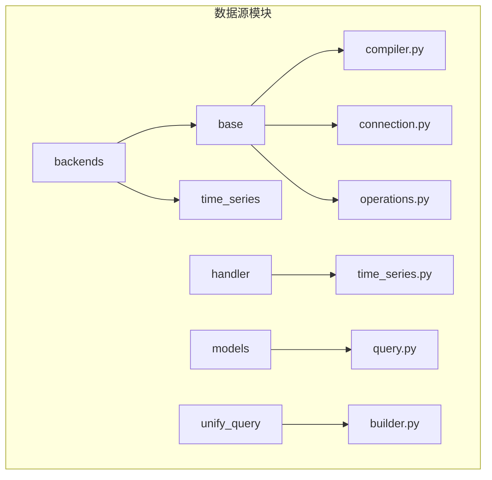
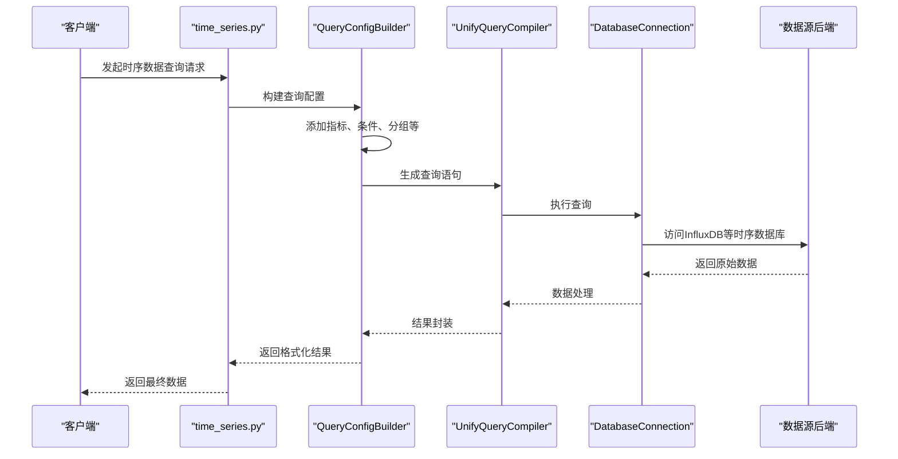
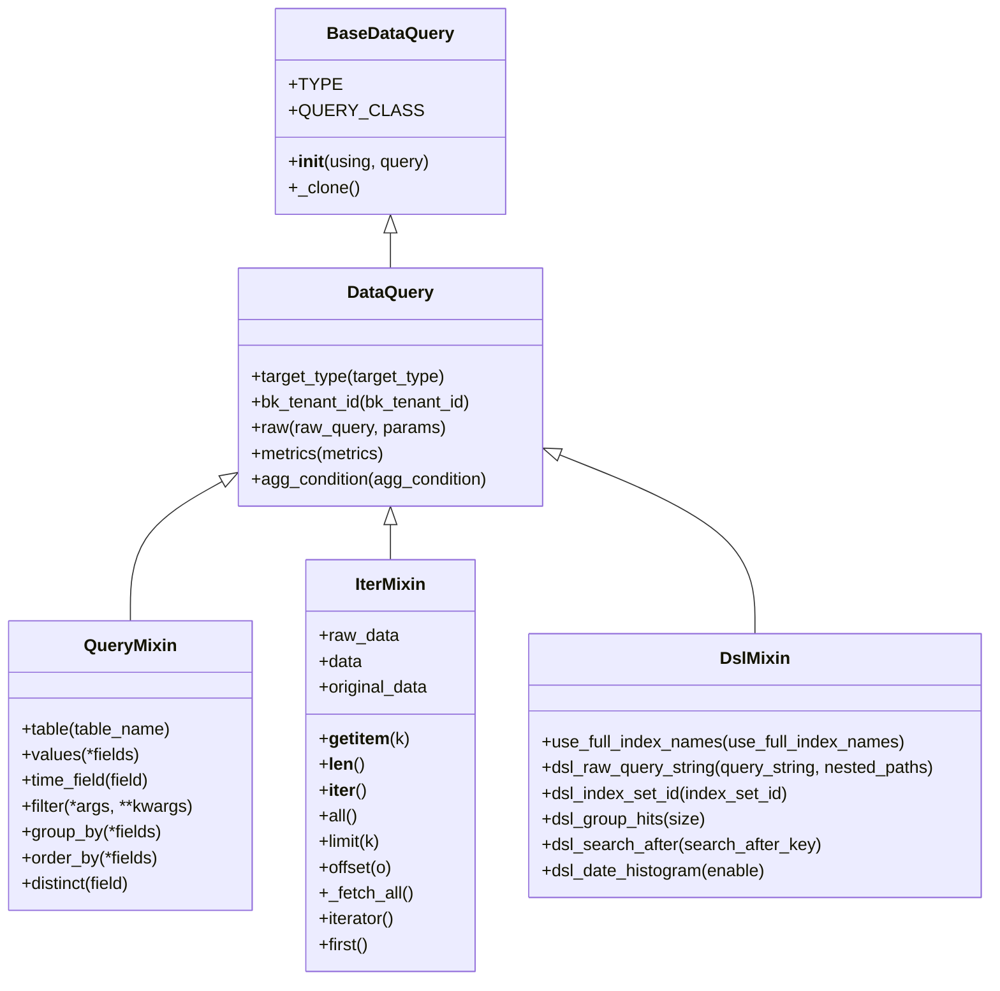
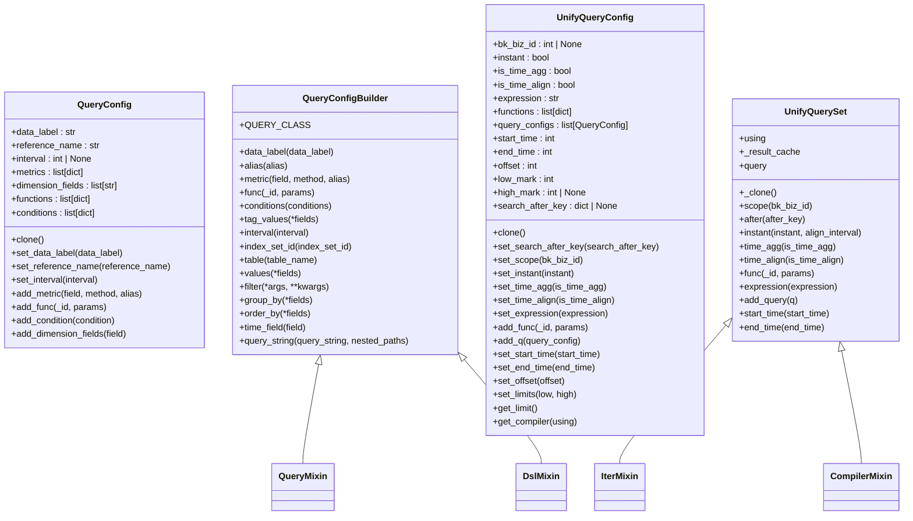
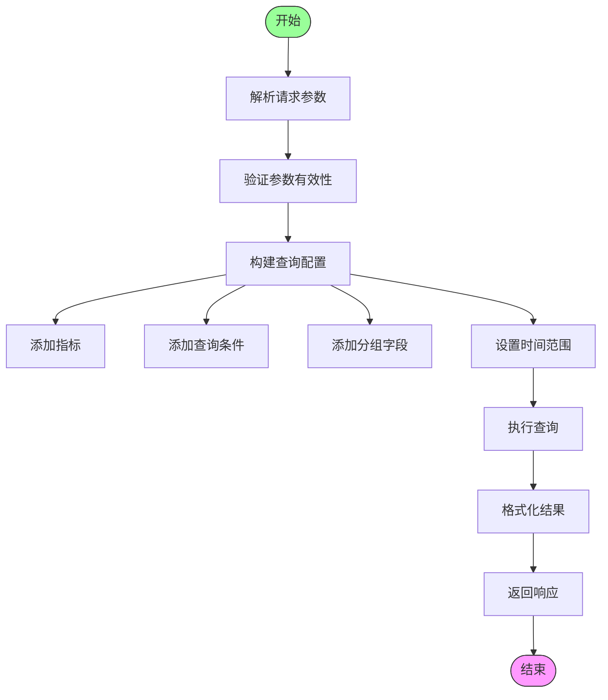
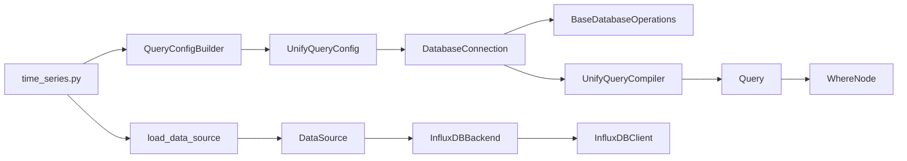

# 时序数据采集

<cite>
**本文档引用的文件**  
- [builder.py](file://bkmonitor/bkmonitor/data_source/unify_query/builder.py)
- [query.py](file://bkmonitor/bkmonitor/data_source/models/query.py)
- [data_source.py](file://bkmonitor/bkmonitor/data_source/data_source.py)
- [compiler.py](file://bkmonitor/bkmonitor/data_source/backends/base/compiler.py)
- [connection.py](file://bkmonitor/bkmonitor/data_source/backends/base/connection.py)
- [operations.py](file://bkmonitor/bkmonitor/data_source/backends/base/operations.py)
- [time_series.py](file://bkmonitor/bkmonitor/data_source/handler/time_series.py)
</cite>

## 目录
1. [简介](#简介)
2. [项目结构](#项目结构)
3. [核心组件](#核心组件)
4. [架构概述](#架构概述)
5. [详细组件分析](#详细组件分析)
6. [依赖分析](#依赖分析)
7. [性能考虑](#性能考虑)
8. [故障排除指南](#故障排除指南)
9. [结论](#结论)

## 简介
本文档详细描述了蓝鲸监控平台中时序数据采集的实现机制，重点分析了如何通过统一查询框架（UnifyQuery）从时序数据库（如InfluxDB）中获取数据。文档涵盖了数据源后端实现、查询构建逻辑、参数解析、结果格式化以及扩展新数据源的方法。

## 项目结构
时序数据采集功能主要分布在`bkmonitor/data_source/`目录下，采用模块化设计，分离了数据源定义、查询构建、编译执行和结果处理等职责。

**图示来源**  
- [builder.py](file://bkmonitor/bkmonitor/data_source/unify_query/builder.py)
- [query.py](file://bkmonitor/bkmonitor/data_source/models/query.py)
- [compiler.py](file://bkmonitor/bkmonitor/data_source/backends/base/compiler.py)

## 核心组件
时序数据采集系统的核心组件包括查询模型、统一查询构建器、数据源处理器和后端连接器。这些组件共同实现了从高层查询请求到具体数据库查询的转换与执行。

**本节来源**  
- [builder.py](file://bkmonitor/bkmonitor/data_source/unify_query/builder.py#L1-L555)
- [query.py](file://bkmonitor/bkmonitor/data_source/models/query.py#L1-L243)

## 架构概述
系统采用类ORM的设计模式，将时序数据查询抽象为可组合的对象，通过统一查询接口与底层数据源进行交互。

**图示来源**  
- [time_series.py](file://bkmonitor/bkmonitor/data_source/handler/time_series.py)
- [builder.py](file://bkmonitor/bkmonitor/data_source/unify_query/builder.py)
- [connection.py](file://bkmonitor/bkmonitor/data_source/backends/base/connection.py)

## 详细组件分析

### 查询模型分析
`models/query.py`文件定义了时序数据查询的基础模型和混合类，提供了数据遍历、查询构造和DSL操作等核心功能。

**图示来源**  
- [query.py](file://bkmonitor/bkmonitor/data_source/models/query.py#L19-L243)

### 统一查询构建器分析
`unify_query/builder.py`实现了统一查询的构建器模式，提供了流畅的API来构造复杂的时序数据查询。

**图示来源**  
- [builder.py](file://bkmonitor/bkmonitor/data_source/unify_query/builder.py#L54-L555)

### 时序数据处理器分析
`handler/time_series.py`负责处理时序数据的HTTP请求，解析参数并调用相应的查询构建器。

**图示来源**  
- [time_series.py](file://bkmonitor/bkmonitor/data_source/handler/time_series.py)

## 依赖分析
时序数据采集模块依赖于多个核心组件和外部服务，形成了清晰的依赖关系。

**图示来源**  
- [builder.py](file://bkmonitor/bkmonitor/data_source/unify_query/builder.py)
- [data_source.py](file://bkmonitor/bkmonitor/data_source/data_source.py)
- [connection.py](file://bkmonitor/bkmonitor/data_source/backends/base/connection.py)

## 性能考虑
在设计时序数据查询时，需要考虑以下性能优化建议：

1. **合理设置时间范围**：避免查询过长的时间跨度，建议使用分页或滚动查询
2. **优化查询条件**：使用索引字段作为查询条件，减少扫描的数据量
3. **控制返回数据量**：通过limit和offset控制单次查询返回的数据点数量
4. **合理使用聚合**：在数据库层面进行聚合计算，减少网络传输数据量
5. **缓存机制**：对频繁查询的静态数据使用缓存
6. **并行查询**：对于多个独立的查询，可以考虑并行执行

## 故障排除指南
当遇到时序数据采集问题时，可以按照以下步骤进行排查：

**本节来源**  
- [builder.py](file://bkmonitor/bkmonitor/data_source/unify_query/builder.py#L254-L273)
- [connection.py](file://bkmonitor/bkmonitor/data_source/backends/base/connection.py#L345-L346)

## 结论
本文档详细介绍了蓝鲸监控平台中时序数据采集的实现机制。系统通过统一查询框架提供了灵活、可扩展的数据访问能力，支持多种时序数据库。通过类ORM的设计模式，使得复杂的时序数据查询变得简单易用，同时保持了良好的性能和可维护性。