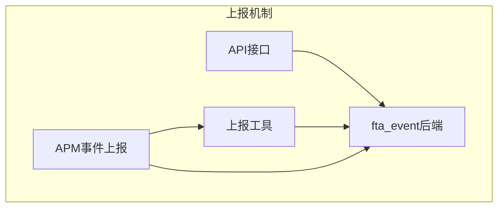
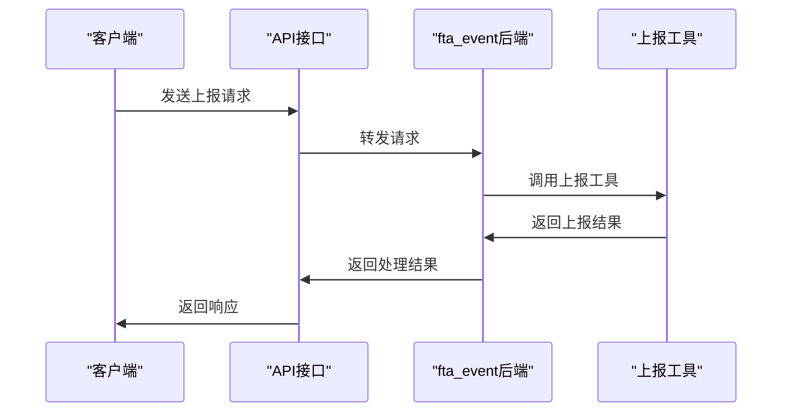
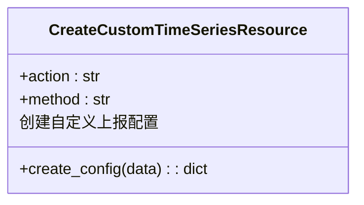
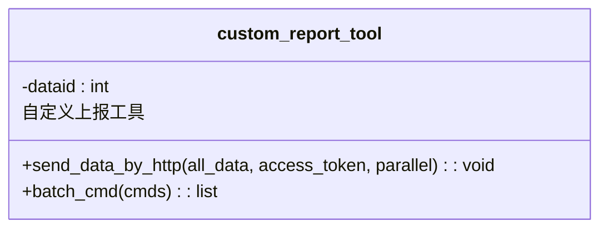
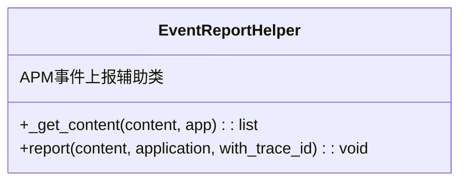
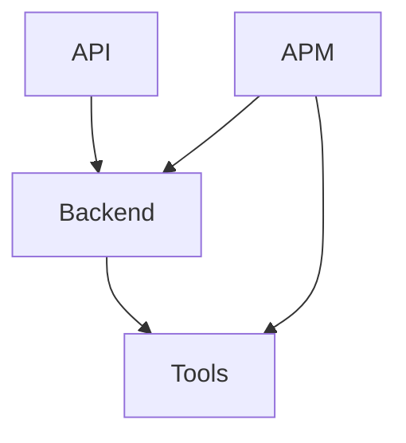

# 自定义上报

<cite>
**本文档引用的文件**   
- [default.py](file://bkmonitor/api/monitor/default.py)
- [report_event.py](file://bkmonitor/apm/utils/report_event.py)
- [custom_report_tools.py](file://bkmonitor/bkmonitor/utils/custom_report_tools.py)
- [event.py](file://bkmonitor/bkmonitor/documents/event.py)
- [connection.py](file://bkmonitor/data_source/backends/fta_event/connection.py)
- [operations.py](file://bkmonitor/data_source/backends/fta_event/operations.py)
</cite>

## 目录
1. [简介](#简介)
2. [项目结构](#项目结构)
3. [核心组件](#核心组件)
4. [架构概述](#架构概述)
5. [详细组件分析](#详细组件分析)
6. [依赖分析](#依赖分析)
7. [性能考虑](#性能考虑)
8. [故障排查指南](#故障排查指南)
9. [结论](#结论)

## 简介
本文档详细说明了蓝鲸监控平台中的自定义上报机制，重点介绍如何通过 `data_source/backends/fta_event/` 处理用户自定义事件和指标的上报请求。文档还展示了如何通过 `api/monitor/default.py` 接收和验证上报数据，并解释了 `data_source/shortcuts.py` 中提供的便捷方法，以简化数据上报的集成过程。此外，文档提供了上报协议的详细说明、数据格式要求、认证方式和最佳实践，并包含错误码和故障排查指南。

## 项目结构
蓝鲸监控平台的自定义上报机制主要涉及以下几个核心目录和文件：
- `bkmonitor/data_source/backends/fta_event/`：处理自定义事件和指标上报的核心后端逻辑。
- `bkmonitor/api/monitor/default.py`：提供API接口以接收和验证上报数据。
- `bkmonitor/bkmonitor/utils/custom_report_tools.py`：提供自定义上报的工具类，支持通过HTTP发送数据。
- `bkmonitor/apm/utils/report_event.py`：APM模块中用于事件上报的辅助类。

**图示来源**
- [connection.py](file://bkmonitor/data_source/backends/fta_event/connection.py)
- [default.py](file://bkmonitor/api/monitor/default.py)
- [custom_report_tools.py](file://bkmonitor/bkmonitor/utils/custom_report_tools.py)
- [report_event.py](file://bkmonitor/apm/utils/report_event.py)

## 核心组件

自定义上报机制的核心组件包括：
- `CreateCustomTimeSeriesResource`：用于创建自定义上报配置。
- `CustomTimeSeriesDetailResource`：用于获取自定义指标上报的详细信息。
- `custom_report_tool`：用于通过HTTP上报数据的工具类。
- `EventReportHelper`：用于APM模块中事件上报的辅助类。

**组件来源**
- [default.py](file://bkmonitor/api/monitor/default.py#L108-L124)
- [custom_report_tools.py](file://bkmonitor/bkmonitor/utils/custom_report_tools.py#L23-L95)
- [report_event.py](file://bkmonitor/apm/utils/report_event.py#L23-L61)

## 架构概述

自定义上报机制的架构如下图所示，展示了数据从客户端到后端处理的完整流程。

**图示来源**
- [default.py](file://bkmonitor/api/monitor/default.py)
- [connection.py](file://bkmonitor/data_source/backends/fta_event/connection.py)
- [custom_report_tools.py](file://bkmonitor/bkmonitor/utils/custom_report_tools.py)

## 详细组件分析

### CreateCustomTimeSeriesResource 分析
`CreateCustomTimeSeriesResource` 是用于创建自定义上报配置的API资源。它通过POST请求接收数据，并在后端创建相应的配置。

**图示来源**
- [default.py](file://bkmonitor/api/monitor/default.py#L108-L115)

### custom_report_tool 分析
`custom_report_tool` 是一个工具类，用于通过HTTP上报数据。它支持并发请求，以提高上报效率。

**图示来源**
- [custom_report_tools.py](file://bkmonitor/bkmonitor/utils/custom_report_tools.py#L23-L95)

### EventReportHelper 分析
`EventReportHelper` 是APM模块中用于事件上报的辅助类。它封装了上报逻辑，简化了事件上报的集成。

**图示来源**
- [report_event.py](file://bkmonitor/apm/utils/report_event.py#L23-L61)

## 依赖分析

自定义上报机制的依赖关系如下图所示，展示了各组件之间的依赖关系。

**图示来源**
- [default.py](file://bkmonitor/api/monitor/default.py)
- [connection.py](file://bkmonitor/data_source/backends/fta_event/connection.py)
- [custom_report_tools.py](file://bkmonitor/bkmonitor/utils/custom_report_tools.py)
- [report_event.py](file://bkmonitor/apm/utils/report_event.py)

## 性能考虑

自定义上报机制在设计时考虑了性能优化，主要体现在以下几个方面：
- **并发上报**：`custom_report_tool` 支持并发请求，以提高上报效率。
- **数据分批**：上报数据被分批处理，避免单次请求数据过大。
- **异步处理**：部分上报操作采用异步处理，减少对主线程的影响。

## 故障排查指南

在使用自定义上报机制时，可能会遇到以下常见问题：
- **上报失败**：检查 `access_token` 和 `dataid` 是否正确配置。
- **数据丢失**：确保上报数据格式正确，并检查网络连接。
- **性能问题**：监控上报频率，避免过高频率导致系统负载过高。

**故障排查来源**
- [custom_report_tools.py](file://bkmonitor/bkmonitor/utils/custom_report_tools.py#L79-L95)
- [report_event.py](file://bkmonitor/apm/utils/report_event.py#L59-L61)

## 结论

本文档详细介绍了蓝鲸监控平台中的自定义上报机制，涵盖了从API接口到后端处理的完整流程。通过本文档，用户可以了解如何集成和使用自定义上报功能，并掌握相关的最佳实践和故障排查方法。