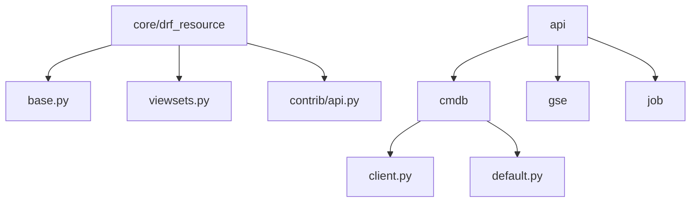
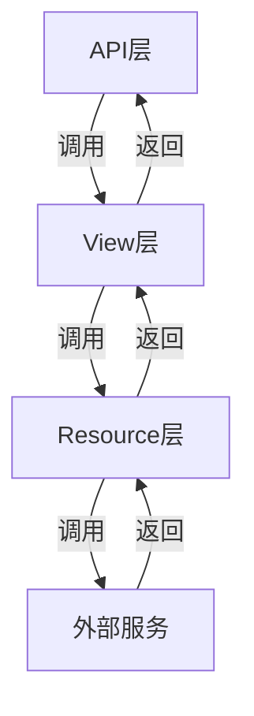
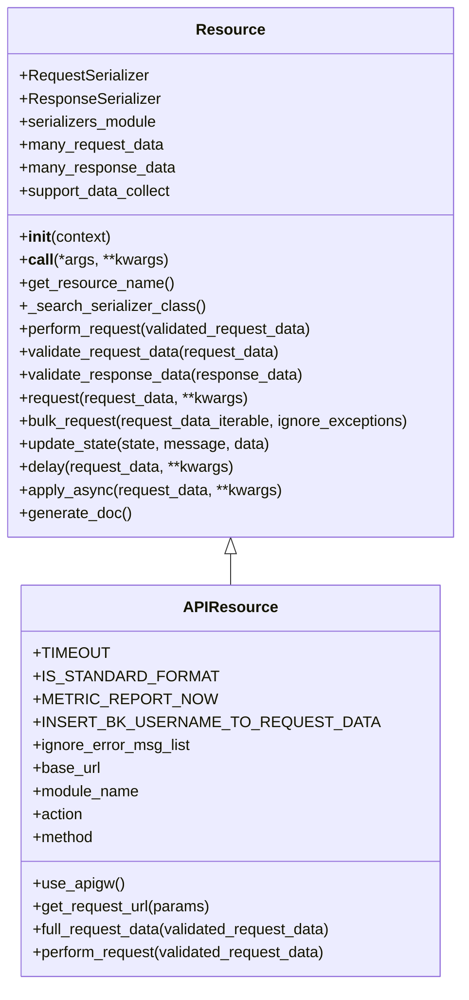
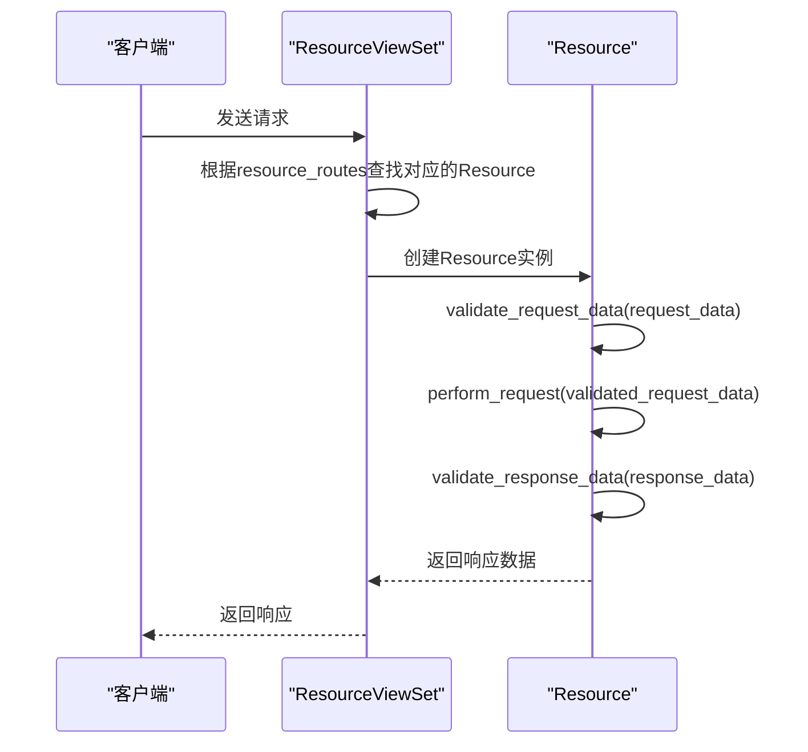
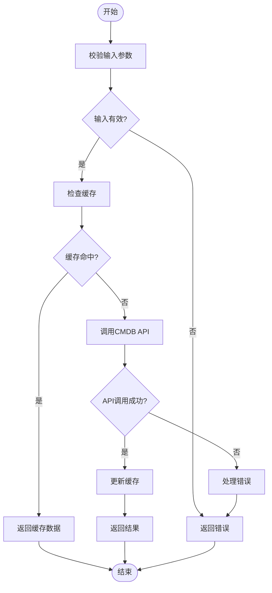
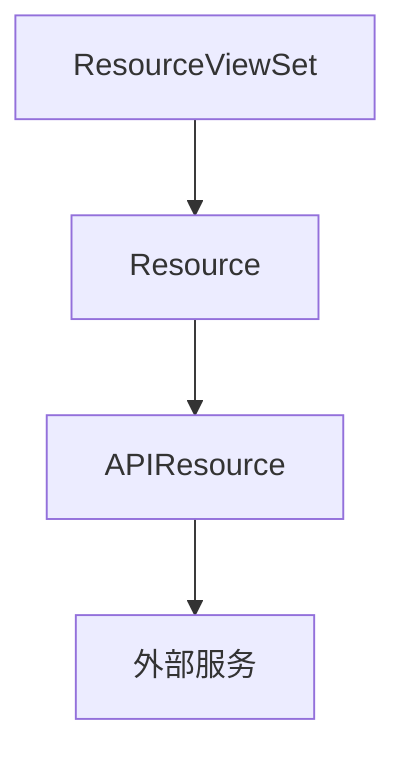

# API扩展机制

<cite>
**本文档引用的文件**   
- [base.py](file://bkmonitor/core/drf_resource/base.py)
- [viewsets.py](file://bkmonitor/core/drf_resource/viewsets.py)
- [api.py](file://bkmonitor/core/drf_resource/contrib/api.py)
- [client.py](file://bkmonitor/api/cmdb/client.py)
- [monitor_v3.yaml](file://bkmonitor/docs/api/monitor_v3.yaml)
- [default.py](file://bkmonitor/api/cmdb/default.py)
</cite>

## 目录
1. [引言](#引言)
2. [项目结构](#项目结构)
3. [核心组件](#核心组件)
4. [架构概述](#架构概述)
5. [详细组件分析](#详细组件分析)
6. [依赖分析](#依赖分析)
7. [性能考虑](#性能考虑)
8. [故障排除指南](#故障排除指南)
9. [结论](#结论)

## 引言
本文档旨在详细阐述bk-monitor系统的API扩展机制，重点介绍基于DRF Resource的API扩展框架。文档将深入分析如何通过core/drf_resource模块构建可复用的资源接口，包括API注册、路由映射、参数校验和响应序列化等核心机制。同时，将以CMDB为例，说明如何封装外部API调用、处理认证授权、实现缓存策略和错误重试机制。文档还将涵盖API版本管理策略，以及自定义API扩展的开发指南，为开发者提供全面的技术参考。

## 项目结构
bk-monitor系统采用模块化设计，其项目结构清晰地划分了不同功能模块。核心的API扩展机制主要集中在`core/drf_resource`目录下，该目录提供了构建可复用资源接口的基础框架。外部服务集成则通过`api`目录下的各个子模块实现，如`api/cmdb`、`api/gse`等，每个子模块负责与特定的外部服务进行交互。这种结构使得系统具有良好的可扩展性和可维护性。

**图示来源**
- [base.py](file://bkmonitor/core/drf_resource/base.py)
- [viewsets.py](file://bkmonitor/core/drf_resource/viewsets.py)
- [client.py](file://bkmonitor/api/cmdb/client.py)

**本节来源**
- [base.py](file://bkmonitor/core/drf_resource/base.py)
- [viewsets.py](file://bkmonitor/core/drf_resource/viewsets.py)

## 核心组件
API扩展机制的核心组件包括Resource基类、ResourceViewSet和APIResource。Resource基类定义了资源的基本行为，包括请求数据校验、业务逻辑执行和响应数据校验。ResourceViewSet负责将Resource与Django REST framework的视图集集成，实现API的路由映射。APIResource则专门用于封装对外部服务的API调用，提供了统一的请求处理、认证授权和错误处理机制。

**本节来源**
- [base.py](file://bkmonitor/core/drf_resource/base.py)
- [viewsets.py](file://bkmonitor/core/drf_resource/viewsets.py)
- [api.py](file://bkmonitor/core/drf_resource/contrib/api.py)

## 架构概述
bk-monitor的API扩展框架采用分层架构，从下到上依次为：Resource层、View层和API层。Resource层负责业务逻辑的实现，View层负责API的路由和请求处理，API层则提供与外部服务的集成。这种分层设计使得各层职责清晰，便于开发和维护。

**图示来源**
- [base.py](file://bkmonitor/core/drf_resource/base.py)
- [viewsets.py](file://bkmonitor/core/drf_resource/viewsets.py)

## 详细组件分析

### Resource基类分析
Resource基类是API扩展框架的核心，它定义了资源的基本行为。开发者通过继承Resource基类并实现`perform_request`方法来定义具体的业务逻辑。Resource基类还提供了请求数据校验和响应数据校验的功能，确保输入和输出数据的正确性。

#### 类图

**图示来源**
- [base.py](file://bkmonitor/core/drf_resource/base.py)
- [api.py](file://bkmonitor/core/drf_resource/contrib/api.py)

**本节来源**
- [base.py](file://bkmonitor/core/drf_resource/base.py)

### ResourceViewSet分析
ResourceViewSet负责将Resource与Django REST framework的视图集集成，实现API的路由映射。通过定义`resource_routes`列表，可以将不同的Resource映射到不同的API端点。ResourceViewSet还提供了自动生成API文档的功能，简化了API的开发和维护。

#### 序列图

**图示来源**
- [viewsets.py](file://bkmonitor/core/drf_resource/viewsets.py)

**本节来源**
- [viewsets.py](file://bkmonitor/core/drf_resource/viewsets.py)

### CMDB集成分析
CMDB集成通过`api/cmdb`模块实现，该模块封装了与CMDB服务的API调用。通过继承`APIResource`基类，可以方便地定义与CMDB服务的交互逻辑。CMDB集成还实现了缓存策略和错误重试机制，提高了系统的稳定性和性能。

#### 流程图

**图示来源**
- [client.py](file://bkmonitor/api/cmdb/client.py)

**本节来源**
- [client.py](file://bkmonitor/api/cmdb/client.py)

## 依赖分析
API扩展机制的各个组件之间存在明确的依赖关系。ResourceViewSet依赖于Resource基类，APIResource依赖于Resource基类和外部服务。这种依赖关系确保了系统的模块化和可扩展性。

**图示来源**
- [base.py](file://bkmonitor/core/drf_resource/base.py)
- [viewsets.py](file://bkmonitor/core/drf_resource/viewsets.py)
- [api.py](file://bkmonitor/core/drf_resource/contrib/api.py)

**本节来源**
- [base.py](file://bkmonitor/core/drf_resource/base.py)
- [viewsets.py](file://bkmonitor/core/drf_resource/viewsets.py)
- [api.py](file://bkmonitor/core/drf_resource/contrib/api.py)

## 性能考虑
在设计API扩展机制时，需要考虑性能因素。通过使用缓存策略，可以减少对外部服务的调用次数，提高系统的响应速度。同时，通过异步任务处理，可以避免长时间的API调用阻塞主线程，提高系统的并发处理能力。

## 故障排除指南
在使用API扩展机制时，可能会遇到各种问题。常见的问题包括参数校验失败、API调用超时、缓存失效等。通过查看日志和调试信息，可以快速定位问题并进行修复。

**本节来源**
- [base.py](file://bkmonitor/core/drf_resource/base.py)
- [viewsets.py](file://bkmonitor/core/drf_resource/viewsets.py)
- [api.py](file://bkmonitor/core/drf_resource/contrib/api.py)

## 结论
bk-monitor系统的API扩展机制通过基于DRF Resource的框架，实现了灵活、可复用的API开发。通过合理的分层设计和模块化结构，使得系统具有良好的可扩展性和可维护性。开发者可以基于该框架快速开发新的API，满足业务需求。