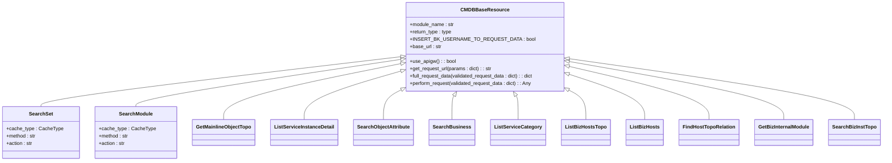
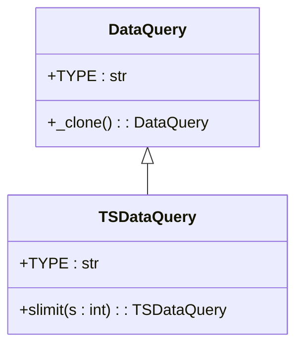

# 外部服务集成模式

<cite>
**本文档引用的文件**   
- [bkmonitor\api\cmdb\default.py](file://bkmonitor/api/cmdb/default.py)
- [bkmonitor\api\cmdb\client.py](file://bkmonitor/api/cmdb/client.py)
- [bkmonitor\bkmonitor\data_source\handler\time_series.py](file://bkmonitor/bkmonitor/data_source/handler/time_series.py)
- [bkmonitor\metadata\models\custom_report\time_series.py](file://bkmonitor/metadata/models/custom_report/time_series.py)
</cite>

## 目录
1. [引言](#引言)
2. [CMDB服务客户端封装](#cmdb服务客户端封装)
3. [数据源适配器模式](#数据源适配器模式)
4. [服务降级与熔断机制](#服务降级与熔断机制)
5. [调用模式与缓存策略](#调用模式与缓存策略)
6. [新服务接入流程](#新服务接入流程)

## 引言
本系统通过标准化的集成模式与外部服务进行交互，确保了系统的可扩展性和稳定性。以CMDB（配置管理数据库）集成为例，系统通过封装HTTP客户端、统一认证机制和错误处理，实现了与外部服务的高效通信。同时，采用数据源适配器模式，将不同外部系统的接入方式统一化，降低了系统耦合度。在面对外部依赖异常时，系统通过降级和熔断机制保障核心功能的可用性，并通过合理的缓存策略提升性能。

## CMDB服务客户端封装

### HTTP请求构建与认证令牌管理
CMDB服务客户端的封装基于`CMDBBaseResource`基类实现，该类继承自`APIResource`，提供了统一的HTTP请求构建和认证机制。



**图示来源**
- [bkmonitor\api\cmdb\client.py](file://bkmonitor/api/cmdb/client.py#L20-L456)

**本节来源**
- [bkmonitor\api\cmdb\client.py](file://bkmonitor/api/cmdb/client.py#L20-L456)

`CMDBBaseResource`类通过`base_url`属性动态构建请求地址，根据`settings.ENABLE_MULTI_TENANT_MODE`或`settings.CMDB_USE_APIGW`配置决定使用API网关还是直接访问组件API。认证令牌通过`get_backend_username`函数获取，并在`full_request_data`方法中注入到请求数据中，同时自动填充`bk_supplier_account`供应商账户信息。

### 错误码映射与重试策略
错误处理在`perform_request`方法中实现，通过捕获`NoRelatedResourceError`等特定异常，将其映射为业务友好的错误码，并返回空数据作为降级结果，避免异常向上层传播。

```python
def perform_request(self, validated_request_data):
    # 非cmdb空间兼容，无关联资源捕获异常返回空数据
    try:
        return super().perform_request(validated_request_data)
    except NoRelatedResourceError as err:
        self.report_api_failure_metric(
            error_code=getattr(err, "code", 0), exception_type=NoRelatedResourceError.__name__
        )
        return self.return_type()
```

重试策略由底层的`APIResource`框架提供，通过`batch_request`工具函数实现批量请求的自动重试和错误处理，确保在网络波动或服务短暂不可用时仍能成功获取数据。

## 数据源适配器模式

### 时序数据源查询转换逻辑
数据源适配器模式通过`DataQuery`基类和`TSDataQuery`子类实现，为不同类型的外部数据源提供统一的查询接口。



**图示来源**
- [bkmonitor\bkmonitor\data_source\handler\time_series.py](file://bkmonitor/bkmonitor/data_source/handler/time_series.py#L0-L20)

**本节来源**
- [bkmonitor\bkmonitor\data_source\handler\time_series.py](file://bkmonitor/bkmonitor/data_source/handler/time_series.py#L0-L20)

`TSDataQuery`类封装了时序数据特有的查询操作，如`slimit`方法用于限制返回的序列数量。查询逻辑最终会转换为底层存储（如InfluxDB）的原生查询语言。

更复杂的查询转换逻辑在`TimeSeriesGroup`类中实现，该类负责管理时序数据的元信息和查询优化。

```python
def get_ts_metrics_by_dimension(self, dimension_name: str, dimension_value: str) -> list:
    """获取指标名称
    从 redis 中获取数据，然后比对满足条件的记录，获取到指标名称
    """
    metrics = self.get_metrics_from_redis()
    metric_by_dimension_name, metric_by_dimension_value = self._filter_metric_by_dimension(
        metrics, dimension_name, dimension_value
    )
    # 合并两个集合，返回所有匹配的指标
    return list(metric_by_dimension_name | metric_by_dimension_value)
```

该方法从Redis缓存中获取指标数据，通过维度名称和值进行过滤，实现了高效的查询转换。

## 服务降级与熔断机制

### 降级策略实现
服务降级主要通过异常捕获和默认值返回实现。当CMDB服务不可用时，`CMDBBaseResource`的`perform_request`方法会捕获`NoRelatedResourceError`异常，记录监控指标后返回空数据，确保调用方逻辑不会中断。

```python
except NoRelatedResourceError as err:
    self.report_api_failure_metric(
        error_code=getattr(err, "code", 0), exception_type=NoRelatedResourceError.__name__
    )
    return self.return_type()
```

### 熔断机制
系统通过`CacheType`装饰器实现基于缓存的熔断。当外部服务响应缓慢或失败时，系统会从缓存中返回历史数据，避免对故障服务的持续调用。例如，`SearchSet`和`SearchModule`类都设置了`CacheType.CC_BACKEND`缓存类型，确保在CMDB服务异常时仍能提供基本的拓扑查询功能。

## 调用模式与缓存策略

### 同步与异步调用选择
系统根据操作的实时性要求选择调用模式。对于需要即时结果的查询（如主机拓扑），采用同步调用；对于耗时较长的批量操作（如动态分组执行），则采用异步调用。

```python
def perform_request(self, params):
    pool = ThreadPool(self.MAX_CONCURRENCY_NUMBER)
    tasks: dict[str, ApplyResult] = {}
    for dg_id in params["ids"]:
        tasks[dg_id] = pool.apply_async(
            ExecuteDynamicGroup().request,
            kwds={"bk_biz_id": params["bk_biz_id"], "id": dg_id, "bk_obj_id": params["bk_obj_id"]},
        )
    pool.close()
    pool.join()
    # ... 处理结果
```

### 缓存策略
系统采用多级缓存策略提升性能：
1. **后端缓存**：通过`CacheType.CC_BACKEND`对CMDB API调用结果进行缓存
2. **Redis缓存**：对于时序指标元数据，从Redis中获取，避免频繁访问后端存储
3. **本地缓存**：通过`@cached_property`装饰器实现对象属性的惰性加载和缓存

## 新外部服务接入流程

### 标准化接入模板
新外部服务的接入遵循以下标准化流程：

1. **定义客户端类**：继承`APIResource`基类，实现`base_url`、`action`和`method`属性
2. **配置认证机制**：在`full_request_data`方法中注入认证信息
3. **实现错误处理**：重写`perform_request`方法，添加特定异常的捕获和降级逻辑
4. **添加缓存策略**：根据接口特性选择合适的`CacheType`
5. **暴露API接口**：在`default.py`中定义`Resource`类，将客户端方法封装为API接口

```python
class NewServiceClient(APIResource):
    module_name = "new_service"
    
    @property
    def base_url(self):
        return settings.NEW_SERVICE_BASE_URL
        
    @property
    def action(self):
        return "/api/v1/data"
        
    def full_request_data(self, validated_request_data):
        validated_request_data = super().full_request_data(validated_request_data)
        validated_request_data["token"] = settings.NEW_SERVICE_TOKEN
        return validated_request_data
```

通过此模板，可以快速、一致地接入新的外部服务，确保系统集成的规范性和可维护性。