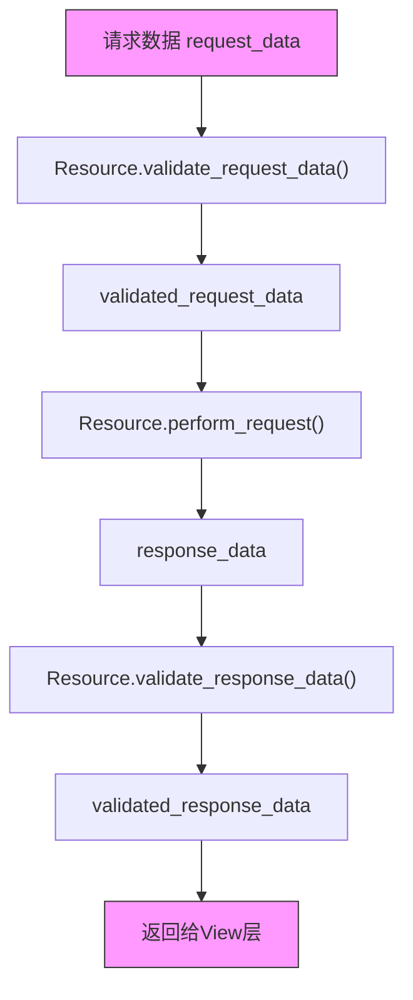
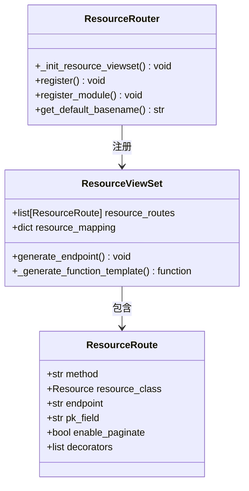

# 资源抽象机制

<cite>
**本文档引用的文件**  
- [base.py](file://bkmonitor/core/drf_resource/base.py)
- [routers.py](file://bkmonitor/core/drf_resource/routers.py)
- [viewsets.py](file://bkmonitor/core/drf_resource/viewsets.py)
- [strategy.py](file://bkmonitor/kernel_api/resource/strategy.py)
- [v4/strategy.py](file://bkmonitor/kernel_api/views/v4/strategy.py)
</cite>

## 目录
1. [引言](#引言)
2. [核心架构概览](#核心架构概览)
3. [Resource基类设计与实现](#resource基类设计与实现)
4. [资源注册与路由集成](#资源注册与路由集成)
5. [策略资源实现示例分析](#策略资源实现示例分析)
6. [新资源类型开发指南](#新资源类型开发指南)
7. [总结](#总结)

## 引言

蓝鲸监控平台（BlueKing - Monitor）基于Django REST Framework（DRF）构建了一套高度标准化的资源抽象机制，旨在统一API接口的封装方式，提升开发效率与代码可维护性。该机制通过`core/drf_resource`模块提供的`Resource`基类和`ResourceViewSet`视图集，实现了请求处理、参数校验、响应格式化、异步任务支持等核心功能的自动化与规范化。本文档将深入解析该资源抽象机制的设计原理、核心组件及实际应用，为开发者提供完整的开发指导。

## 核心架构概览

蓝鲸监控的资源抽象机制遵循“serializers -> resources -> views”的三层架构模式：

- **Serializers层**：负责请求和响应数据的定义、校验与序列化。
- **Resources层**：封装核心业务逻辑，是开发工作的主要焦点。
- **Views层**：配置请求方法、权限控制、分页等，代码量极少。

这种分层设计实现了关注点分离，使开发者能够专注于业务逻辑的实现，而无需关心底层的HTTP协议细节和数据校验逻辑。



**图示来源**  
- [base.py](file://bkmonitor/core/drf_resource/base.py#L200-L300)

## Resource基类设计与实现

`Resource`基类（`core/drf_resource/base.py`）是整个资源抽象机制的核心，它通过抽象方法和钩子函数定义了标准化的API处理流程。

### 核心属性

- **RequestSerializer / ResponseSerializer**：分别指定请求和响应数据的序列化器类，用于自动校验输入输出。
- **serializers_module**：指定自动查找序列化器的模块，支持按命名约定自动发现。
- **many_request_data / many_response_data**：标识输入/输出数据是否为对象列表。
- **support_data_collect**：是否支持记录请求参数，用于审计和调试。

### 核心方法

#### perform_request 方法

```python
@abc.abstractmethod
def perform_request(self, validated_request_data):
    """
    此处为Resource的业务逻辑，由子类实现
    将request_data通过一定的逻辑转化为response_data
    """
    raise NotImplementedError
```

`perform_request`是抽象方法，必须由子类实现。它接收经过校验的`validated_request_data`，执行具体的业务逻辑，并返回结果。这是开发者编写核心代码的地方。

#### validate_request_data 方法

该方法负责校验请求数据。如果`RequestSerializer`已定义，它会使用该序列化器对`request_data`进行校验。校验失败时，会抛出`CustomException`异常，并附带详细的错误信息。对于Django模型或查询集，会直接序列化其数据。

#### validate_response_data 方法

与`validate_request_data`类似，但作用于返回数据。它确保`response_data`符合`ResponseSerializer`定义的格式，保证API响应的一致性和可靠性。

#### request 方法

`request`方法是资源执行的入口，它串联了整个处理流程：

1.  调用`validate_request_data`校验输入。
2.  调用`perform_request`执行业务逻辑。
3.  调用`validate_response_data`校验输出。
4.  返回最终结果。

该方法还集成了OpenTelemetry追踪，便于监控和性能分析。

#### 异步与批量执行

- **delay / apply_async**：将资源执行封装为Celery异步任务，返回任务ID，适用于耗时操作。
- **bulk_request**：基于线程池实现批量并发请求，提高处理效率。

**本节来源**  
- [base.py](file://bkmonitor/core/drf_resource/base.py#L66-L310)

## 资源注册与路由集成

资源抽象机制通过`ResourceRouter`和`ResourceViewSet`与Django路由系统无缝集成，实现了API端点的动态发现和注册。

### ResourceViewSet

`ResourceViewSet`（`core/drf_resource/viewsets.py`）是DRF `GenericViewSet`的子类，它不直接处理请求，而是作为一个配置容器。

- **resource_routes**：一个`ResourceRoute`对象列表，每个对象定义了一个API端点的配置，包括请求方法、关联的`Resource`类、端点名称、是否分页等。
- **generate_endpoint 类方法**：这是关键的动态方法生成器。在视图集注册前，它会遍历`resource_routes`，为每个配置动态生成对应的视图方法（如`list`, `create`或自定义action），并应用Swagger文档装饰器。



**图示来源**  
- [viewsets.py](file://bkmonitor/core/drf_resource/viewsets.py#L1-L230)
- [routers.py](file://bkmonitor/core/drf_resource/routers.py#L1-L55)

### ResourceRouter

`ResourceRouter`继承自DRF的`DefaultRouter`，扩展了注册功能。

- **register**：在调用父类注册前，先调用`_init_resource_viewset`，触发`ResourceViewSet.generate_endpoint()`，确保视图方法已生成。
- **register_module**：可以一次性注册整个Python模块中的所有`ResourceViewSet`子类，根据类名自动生成URL前缀，极大地简化了路由配置。

这种设计实现了“约定优于配置”，开发者只需定义`Resource`和`ResourceViewSet`，系统即可自动将其暴露为RESTful API。

**本节来源**  
- [routers.py](file://bkmonitor/core/drf_resource/routers.py#L1-L55)
- [viewsets.py](file://bkmonitor/core/drf_resource/viewsets.py#L1-L230)

## 策略资源实现示例分析

以策略管理功能为例，分析`kernel_api`中的资源实现。

### 实现文件定位

虽然`kernel_api/resource/strategy.py`文件为空，但通过搜索发现，具体的策略资源实现在`kernel_api/views/v4/strategy.py`中，例如`SaveStrategyResource`和`SearchStrategyResource`。

### 领域特定接口定义

```python
# 示例：SaveStrategyResource (简化版)
class SaveStrategyResource(Resource):
    """
    保存策略
    """
    RequestSerializer = SaveStrategyRequestSerializer
    ResponseSerializer = SaveStrategyResponseSerializer

    def perform_request(self, validated_request_data):
        # 领域特定的业务逻辑：保存或更新监控策略
        strategy_id = validated_request_data.get("id")
        if strategy_id:
            # 更新现有策略
            strategy = StrategyModel.objects.get(id=strategy_id)
            # ... 更新逻辑
        else:
            # 创建新策略
            strategy = StrategyModel.objects.create(**validated_request_data)
            # ... 创建逻辑
        return {"id": strategy.id, "message": "保存成功"}
```

此示例展示了如何定义一个领域特定的资源：
1.  继承`Resource`基类。
2.  指定`RequestSerializer`和`ResponseSerializer`来定义接口契约。
3.  在`perform_request`中实现保存策略的核心业务逻辑。

### 权限控制策略

权限控制通常通过装饰器或自定义权限类在`ResourceViewSet`层面实现。例如，`insert_permission_field`装饰器可以为返回的数据批量插入权限信息，实现细粒度的访问控制。

**本节来源**  
- [v4/strategy.py](file://bkmonitor/kernel_api/views/v4/strategy.py#L24-L132)

## 新资源类型开发指南

创建一个新的资源类型遵循以下步骤：

### 1. 定义序列化器

在相应的`serializers`模块中，创建请求和响应序列化器。

```python
# 示例：myapp/serializers.py
class MyRequestSerializer(serializers.Serializer):
    name = serializers.CharField(max_length=100)
    value = serializers.IntegerField()

class MyResponseSerializer(serializers.Serializer):
    result = serializers.CharField()
    code = serializers.IntegerField()
```

### 2. 创建Resource子类

```python
# 示例：myapp/resources.py
from core.drf_resource.base import Resource

class MyNewResource(Resource):
    RequestSerializer = MyRequestSerializer
    ResponseSerializer = MyResponseSerializer
    # serializers_module = myapp.serializers # 可选，启用自动发现

    def perform_request(self, validated_request_data):
        # 实现你的业务逻辑
        name = validated_request_data['name']
        # ... 业务处理
        return {"result": f"Hello {name}", "code": 0}
```

### 3. 创建ResourceViewSet

```python
# 示例：myapp/viewsets.py
from core.drf_resource.viewsets import ResourceViewSet, ResourceRoute
from .resources import MyNewResource

class MyNewViewSet(ResourceViewSet):
    resource_routes = [
        ResourceRoute(
            method='POST',
            resource_class=MyNewResource,
            endpoint='process',  # URL: /my_new/process/
            enable_paginate=False,
        ),
        ResourceRoute(
            method='GET',
            resource_class=MyNewResource,
            endpoint='info',     # URL: /my_new/info/
            enable_paginate=True,
        ),
    ]
```

### 4. 注册路由

在应用的`urls.py`中，使用`ResourceRouter`注册视图集。

```python
# 示例：myapp/urls.py
from django.urls import path, include
from rest_framework.routers import DefaultRouter
from core.drf_resource.routers import ResourceRouter
from . import viewsets

router = ResourceRouter()
router.register(r'my_new', viewsets.MyNewViewSet, basename='my_new')

urlpatterns = [
    path('api/', include(router.urls)),
]
```

### 最佳实践

- **单一职责**：每个`Resource`应只负责一个明确的业务操作。
- **合理使用序列化器**：充分利用DRF序列化器的强大校验和序列化功能。
- **善用异步**：对于耗时操作，使用`delay`方法转为异步任务。
- **文档化**：为`Resource`类添加清晰的文档字符串，以便自动生成API文档。

## 总结

bk-monitor的DRF资源抽象机制通过`Resource`基类、`ResourceViewSet`和`ResourceRouter`的协同工作，构建了一套高效、规范的API开发框架。它通过自动化参数校验、响应格式化、路由注册和异步支持，显著降低了开发复杂度，提高了代码质量和可维护性。开发者只需遵循既定模式，即可快速创建出功能完备、接口统一的API服务。该机制是蓝鲸监控平台可扩展性和易用性的重要基石。