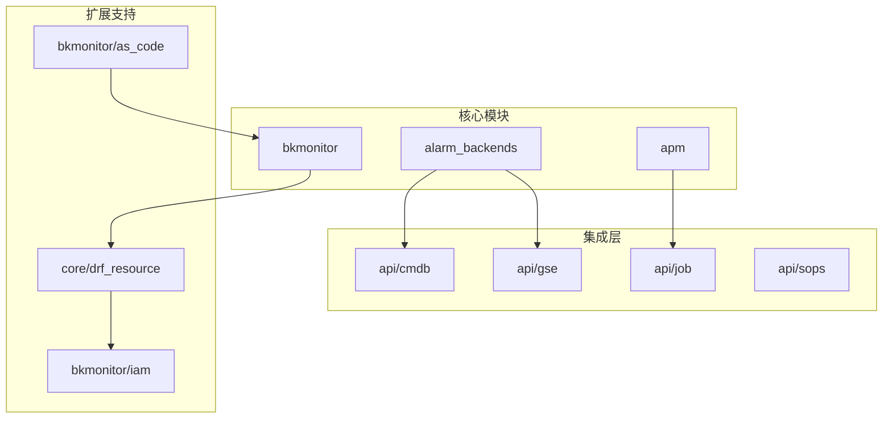
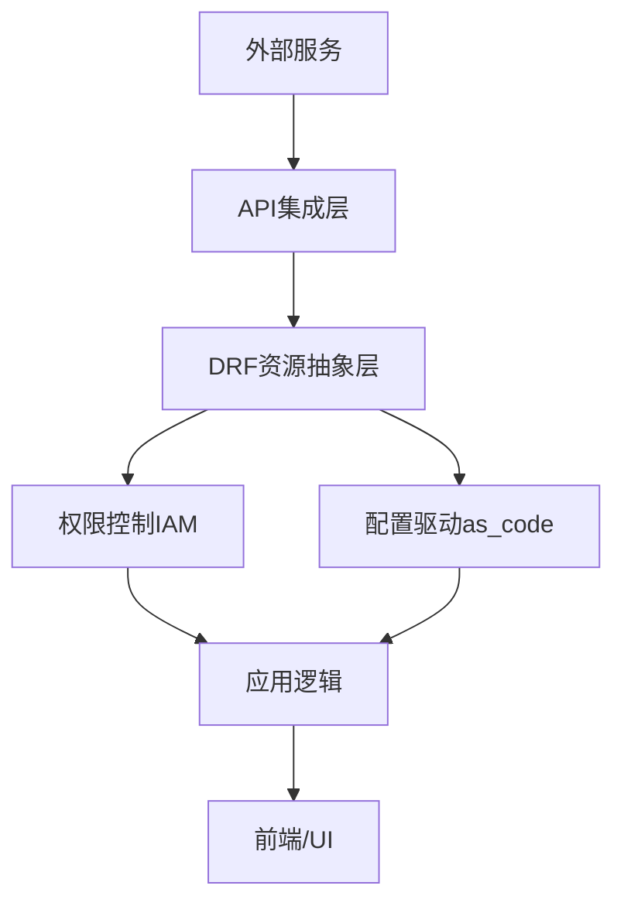
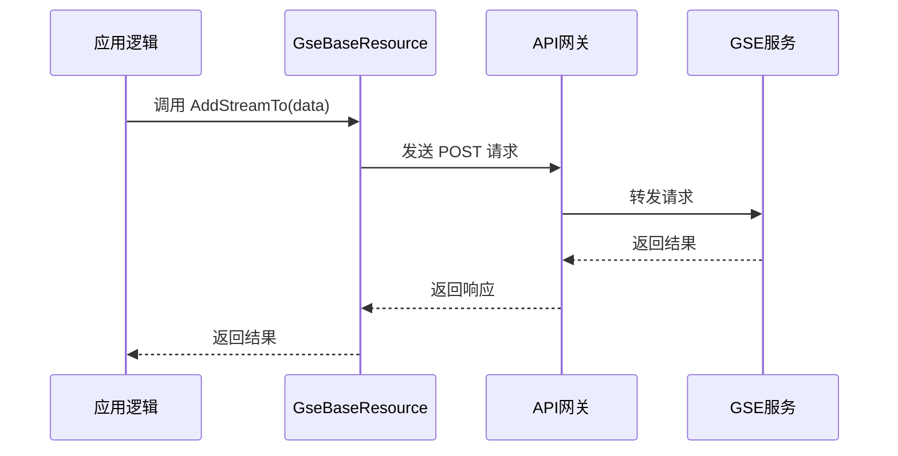
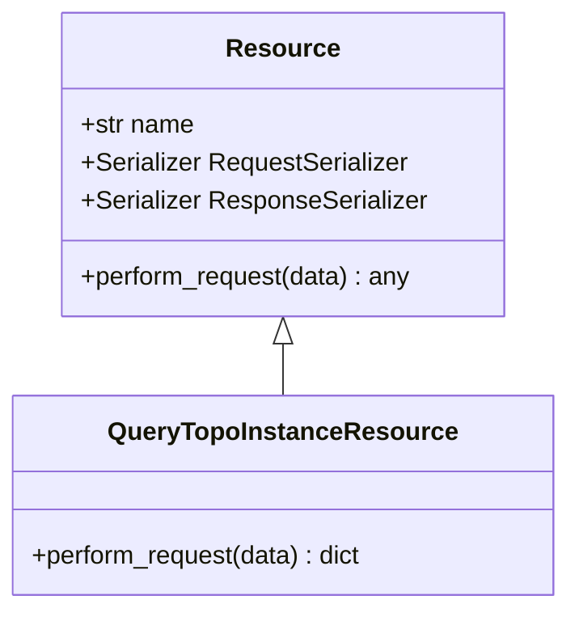
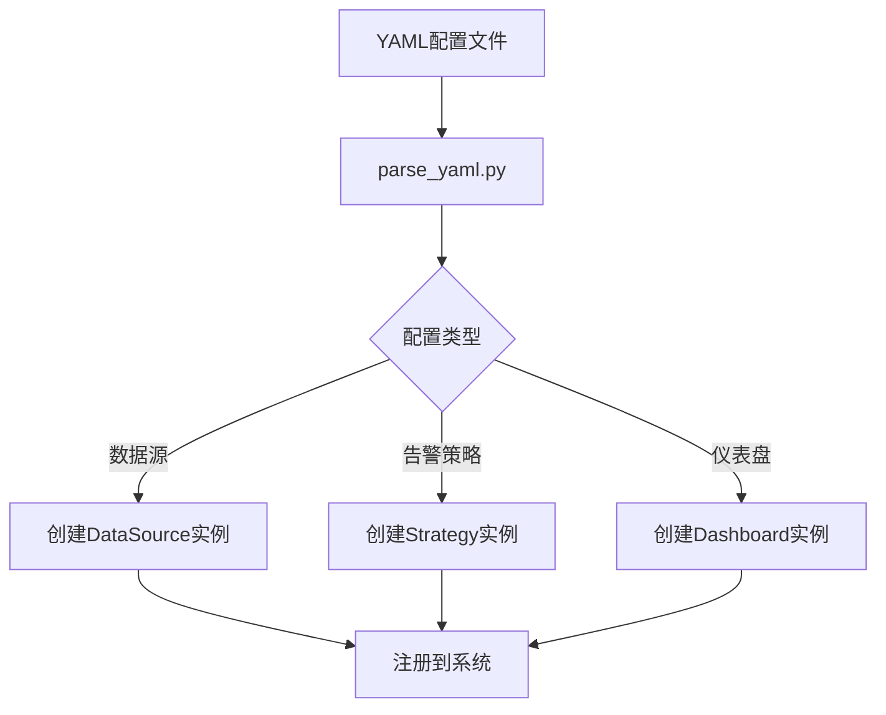
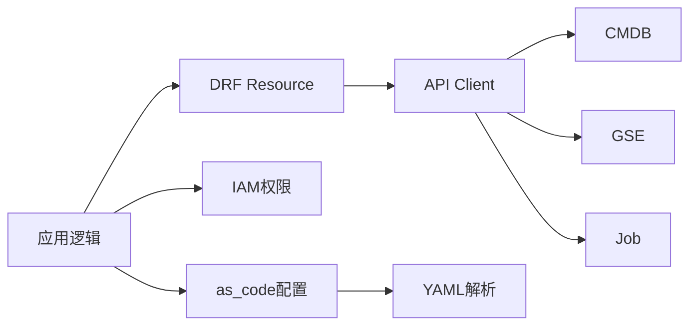

# 扩展机制

<cite>
**本文档引用的文件**  
- [gse.py](file://bkmonitor/api/gse/default.py)
- [cmdb.py](file://bkmonitor/api/cmdb/default.py)
- [job.py](file://bkmonitor/api/job/default.py)
- [resources.py](file://bkmonitor/apm/resources.py)
- [resource.py](file://bkmonitor/core/drf_resource/base.py)
- [action.py](file://bkmonitor/bkmonitor/iam/action.py)
- [resource.py](file://bkmonitor/bkmonitor/iam/resource.py)
- [parse_yaml.py](file://bkmonitor/bkmonitor/as_code/parse_yaml.py)
- [constants.py](file://bkmonitor/constants/data_source.py)
</cite>

## 目录
1. [引言](#引言)
2. [项目结构](#项目结构)
3. [核心组件](#核心组件)
4. [架构概述](#架构概述)
5. [详细组件分析](#详细组件分析)
6. [依赖分析](#依赖分析)
7. [性能考虑](#性能考虑)
8. [故障排除指南](#故障排除指南)
9. [结论](#结论)

## 引言
蓝鲸智云监控平台（BK-Monitor）是一款面向企业级的智能监控系统，具备强大的数据采集、处理与告警能力。本系统设计高度可扩展，支持通过插件化架构、API集成、资源抽象层、权限控制模型及配置驱动等多种方式实现功能扩展。本文档旨在全面介绍 BK-Monitor 的扩展机制，帮助开发者理解其可扩展性设计，并指导如何基于现有框架进行二次开发和功能增强。

## 项目结构
BK-Monitor 采用模块化分层架构，代码组织清晰，主要分为核心监控逻辑、API 集成层、数据处理后端、配置管理与扩展支持等部分。系统通过 `api` 目录集成蓝鲸生态组件，通过 `core/drf_resource` 提供统一的资源访问接口，通过 `iam` 模块实现细粒度权限控制，并支持通过 YAML 配置实现声明式扩展。



**图示来源**  
- [api](file://bkmonitor/api)
- [core/drf_resource](file://bkmonitor/core/drf_resource)
- [bkmonitor/iam](file://bkmonitor/bkmonitor/iam)

## 核心组件
系统的核心组件包括告警后端（alarm_backends）、应用性能监控（APM）、数据源管理、策略引擎等。这些组件通过统一的资源抽象层对外暴露接口，并依赖 `api` 目录下的客户端与 CMDB、GSE、Job 等蓝鲸组件进行交互。

**本节来源**  
- [alarm_backends](file://bkmonitor/alarm_backends)
- [apm](file://bkmonitor/apm)
- [data_source](file://bkmonitor/bkmonitor/data_source)

## 架构概述
BK-Monitor 的扩展架构采用分层设计理念，自底向上分别为：外部服务集成层、资源抽象层、权限控制层、配置管理层和应用逻辑层。各层职责明确，耦合度低，便于独立扩展。



**图示来源**  
- [api/cmdb/default.py](file://bkmonitor/api/cmdb/default.py)
- [core/drf_resource/base.py](file://bkmonitor/core/drf_resource/base.py)
- [bkmonitor/iam/action.py](file://bkmonitor/bkmonitor/iam/action.py)
- [bkmonitor/as_code/parse_yaml.py](file://bkmonitor/bkmonitor/as_code/parse_yaml.py)

## 详细组件分析

### 插件化架构与外部服务集成

BK-Monitor 通过 `api` 目录下的模块实现与蓝鲸生态组件的集成。每个外部服务（如 CMDB、GSE、Job）都有独立的 Python 模块，封装了 API 调用逻辑。

#### GSE 集成示例
GSE（通用服务引擎）用于执行主机命令和进程管理。系统通过 `api/gse/default.py` 定义资源类，继承自 `APIResource`，封装了 `add_streamto` 等操作。

```python
class AddStreamTo(GseBaseResource):
    action = "config_add_streamto/"
    method = "POST"
    class RequestSerializer(serializers.Serializer):
        ip = serializers.CharField(required=True)
        port = serializers.IntegerField(required=True)
```

该设计使得调用 GSE API 变得简单且类型安全，开发者只需实例化资源并调用即可。

**本节来源**  
- [gse.py](file://bkmonitor/api/gse/default.py)
- [blueking/component/apis/gse.py](file://bkmonitor/blueking/component/apis/gse.py)

#### CMDB 集成与缓存机制
CMDB 提供主机和拓扑信息。系统通过 `api/cmdb/default.py` 封装客户端，并在 `alarm_backends/core/api_cache/library.py` 中实现缓存机制，以减少对 CMDB 的频繁调用，提升性能。



**图示来源**  
- [gse.py](file://bkmonitor/api/gse/default.py)
- [cmdb.py](file://bkmonitor/api/cmdb/default.py)

### 资源抽象层（DRF Resource）

系统使用自研的 DRF Resource 机制暴露可扩展的 API 接口。该机制基于 Django REST framework，通过 `core/drf_resource` 模块提供统一的资源定义方式。

#### 资源定义示例
在 APM 模块中，`resources.py` 定义了查询拓扑实例的资源：

```python
class QueryTopoInstanceResource(Resource):
    def perform_request(self, validated_request_data):
        # 业务逻辑
        return result
```

该资源会自动注册为 `/api/apm/query_topo_instance/` 接口，支持参数校验、权限检查和序列化。



**本节来源**  
- [resources.py](file://bkmonitor/apm/resources.py)
- [base.py](file://bkmonitor/core/drf_resource/base.py)

### 权限控制系统（IAM）

BK-Monitor 使用蓝鲸 IAM 实现细粒度权限控制。通过定义资源类型和操作，实现对监控对象的访问控制。

#### 资源与操作定义
在 `bkmonitor/iam/action.py` 和 `resource.py` 中，定义了如“查看策略”、“编辑告警”等操作。

```python
class ActionProvider:
    actions = [
        {"id": "view_strategy", "name": "查看策略"},
        {"id": "edit_alert", "name": "编辑告警"}
    ]
```

资源类型如“业务”、“主机”、“策略”在 `resource.py` 中注册，与 IAM 系统同步。

**本节来源**  
- [action.py](file://bkmonitor/bkmonitor/iam/action.py)
- [resource.py](file://bkmonitor/bkmonitor/iam/resource.py)

### 配置驱动的扩展方式

系统支持通过 YAML 配置定义新的数据源类型或告警方式，实现声明式扩展。

#### 数据源类型配置
在 `constants/data_source.py` 中定义了数据源类型常量，而具体的配置通过 YAML 文件在 `as_code` 模块中解析。

```yaml
data_source:
  type: prometheus
  config:
    url: http://prometheus.example.com
    metrics: [up, cpu_usage]
```

`as_code/parse_yaml.py` 负责解析此类配置，并动态创建数据源实例。



**本节来源**  
- [parse_yaml.py](file://bkmonitor/bkmonitor/as_code/parse_yaml.py)
- [constants.py](file://bkmonitor/constants/data_source.py)

## 依赖分析
系统各模块间依赖关系清晰，核心模块通过 API 资源依赖外部服务，通过 DRF Resource 依赖核心框架，通过 IAM 模块依赖权限系统。配置管理模块（as_code）依赖 YAML 解析器和资源注册机制。



**图示来源**  
- [api](file://bkmonitor/api)
- [core/drf_resource](file://bkmonitor/core/drf_resource)
- [bkmonitor/iam](file://bkmonitor/bkmonitor/iam)
- [as_code](file://bkmonitor/bkmonitor/as_code)

## 性能考虑
- **API 缓存**：对 CMDB 等高频调用接口实施缓存，减少外部依赖延迟。
- **异步处理**：告警收敛、事件处理等耗时操作采用 Celery 异步执行。
- **资源池化**：使用 Gevent 协程池处理并发 API 请求，提升吞吐量。
- **数据库优化**：关键查询使用 Redis 缓存，减少数据库压力。

## 故障排除指南
- **API 调用失败**：检查 `settings.py` 中对应组件的 URL 配置及认证信息。
- **权限不足**：确认用户在 IAM 系统中拥有对应资源的操作权限。
- **配置不生效**：检查 YAML 语法是否正确，日志中是否有解析错误。
- **性能瓶颈**：通过 Prometheus 监控系统自身指标，定位慢查询或高负载模块。

**本节来源**  
- [settings.py](file://bkmonitor/settings.py)
- [logging.py](file://bkmonitor/core/unit/models.py)

## 结论
BK-Monitor 通过插件化架构、API 集成、DRF 资源抽象、IAM 权限控制和 YAML 配置驱动等多种机制，构建了一个高度可扩展的监控平台。开发者可以基于这些机制，轻松集成新的数据源、告警通道或业务系统，满足多样化的监控需求。建议在扩展开发时，遵循现有设计模式，确保代码的可维护性和兼容性。