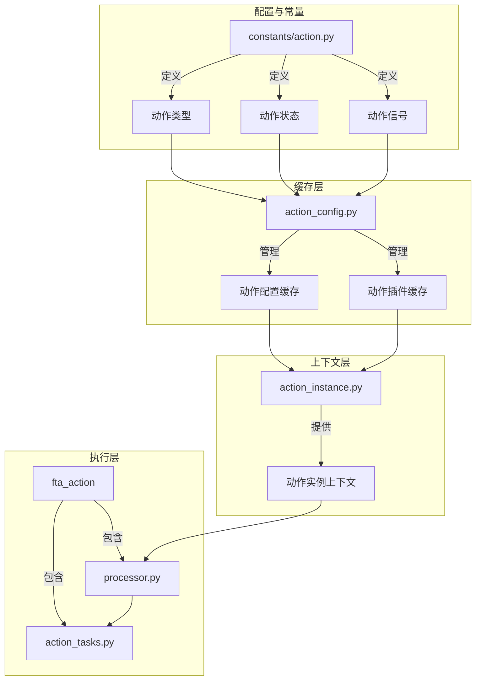
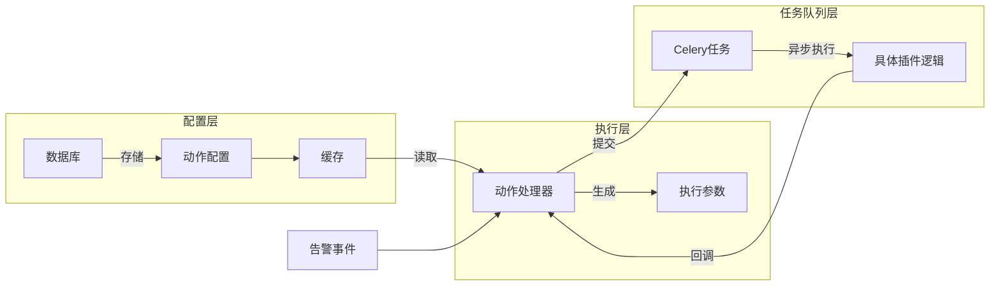
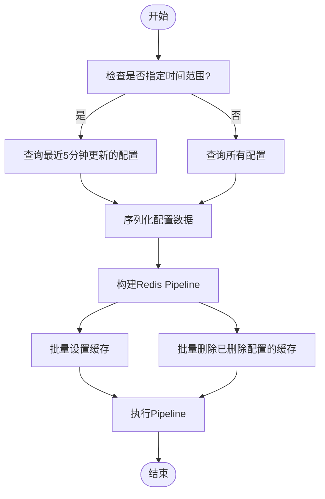
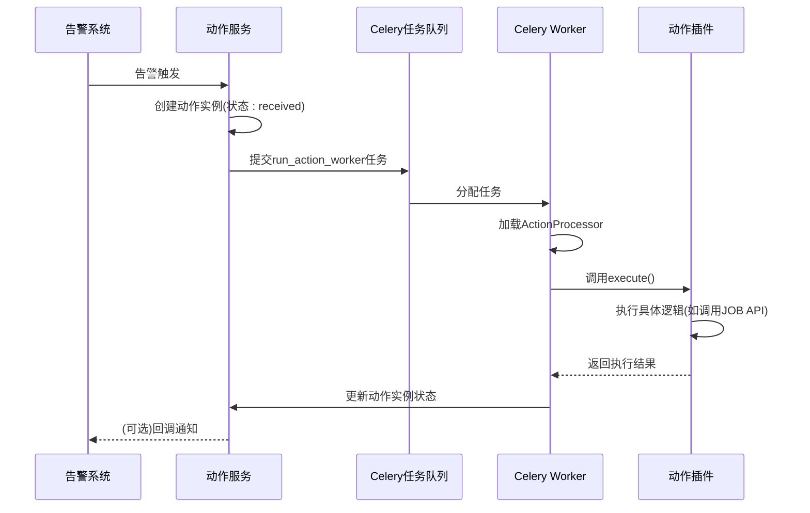

# 动作插件

<cite>
**本文档引用的文件**  
- [action.py](file://bkmonitor/constants/action.py)
- [action_config.py](file://bkmonitor/alarm_backends/core/cache/action_config.py)
- [action_instance.py](file://bkmonitor/alarm_backends/core/context/action_instance.py)
- [processor.py](file://bkmonitor/alarm_backends/service/fta_action/common/processor.py)
- [__init__.py](file://bkmonitor/alarm_backends/service/fta_action/__init__.py)
- [action_tasks.py](file://bkmonitor/alarm_backends/service/fta_action/tasks/action_tasks.py)
</cite>

## 目录
1. [引言](#引言)  
2. [项目结构](#项目结构)  
3. [核心组件](#核心组件)  
4. [架构概览](#架构概览)  
5. [详细组件分析](#详细组件分析)  
6. [依赖分析](#依赖分析)  
7. [性能考量](#性能考量)  
8. [故障排查指南](#故障排查指南)  
9. [结论](#结论)

## 引言
本文档旨在全面阐述蓝鲸监控平台中的**动作插件**机制。动作插件是告警处理流程中的核心自动化组件，用于在告警触发时执行预定义的操作，如通知、执行作业、创建流程等。本文将深入解析动作插件的实现机制、生命周期、与FTA（故障自愈）系统的集成方式，并提供开发自定义插件的指导。

## 项目结构
动作插件相关的代码主要分布在`bkmonitor`模块下的多个子目录中，遵循清晰的分层架构：
- `constants/action.py`：定义动作插件相关的所有常量，如状态、信号、类型等。
- `alarm_backends/core/cache/action_config.py`：负责动作配置的缓存管理。
- `alarm_backends/core/context/action_instance.py`：提供动作实例的上下文管理。
- `alarm_backends/service/fta_action/`：包含动作处理器的核心逻辑和任务调度。



**图示来源**  
- [action.py](file://bkmonitor/constants/action.py)
- [action_config.py](file://bkmonitor/alarm_backends/core/cache/action_config.py)
- [action_instance.py](file://bkmonitor/alarm_backends/core/context/action_instance.py)

## 核心组件
动作插件系统由以下几个核心组件构成：
1.  **动作插件类型 (ActionPluginType)**：定义了插件的种类，如通知、作业平台、标准运维等。
2.  **动作状态 (ActionStatus)**：描述了动作从创建到结束的全生命周期状态。
3.  **动作信号 (ActionSignal)**：触发动作执行的事件类型，如告警触发、告警恢复等。
4.  **动作配置缓存管理器 (ActionConfigCacheManager)**：负责高效地加载和缓存动作配置，避免频繁的数据库查询。
5.  **动作实例上下文 (ActionInstanceContext)**：为执行过程提供丰富的上下文数据，如告警信息、策略信息等。

**组件来源**  
- [action.py](file://bkmonitor/constants/action.py#L100-L200)
- [action_config.py](file://bkmonitor/alarm_backends/core/cache/action_config.py#L10-L20)
- [action_instance.py](file://bkmonitor/alarm_backends/core/context/action_instance.py#L10-L50)

## 架构概览
整个动作插件系统的架构可以分为三层：**配置层**、**执行层**和**任务队列层**。



**图示来源**  
- [action_config.py](file://bkmonitor/alarm_backends/core/cache/action_config.py)
- [action_tasks.py](file://bkmonitor/alarm_backends/service/fta_action/tasks/action_tasks.py)

## 详细组件分析

### 动作插件常量分析
`constants/action.py` 文件是整个动作插件系统的基石，它定义了所有关键的枚举和常量。

#### 动作插件类型
该文件定义了多种插件类型，每种类型对应不同的自动化能力：
```python
class ActionPluginType:
    NOTICE = "notice"        # 通知
    WEBHOOK = "webhook"      # HTTP回调
    JOB = "job"              # 作业平台
    SOPS = "sops"            # 标准运维
    ITSM = "itsm"            # 流程服务
    COMMON = "common"        # 通用插件
    COLLECT = "collect"      # 汇总
    MESSAGE_QUEUE = "message_queue" # 消息队列
    AUTHORIZE = "authorize"  # 授权
```

#### 动作状态
`ActionStatus` 类定义了动作的完整生命周期状态，分为“进行中”和“最终状态”两大类，便于流程控制和状态判断。
```python
class ActionStatus:
    # 进行中状态
    PROCEED_STATUS = [RECEIVED, WAITING, CONVERGING, SLEEP, CONVERGED, RUNNING]
    # 最终状态
    END_STATUS = [SUCCESS, PARTIAL_SUCCESS, FAILURE, PARTIAL_FAILURE, SKIPPED, SHIELD]
```

#### 动作信号
`ActionSignal` 类定义了触发动作的信号，系统根据不同的信号执行不同的处理逻辑。
```python
class ActionSignal:
    ABNORMAL = "abnormal"    # 告警触发时
    RECOVERED = "recovered"  # 告警恢复时
    CLOSED = "closed"        # 告警关闭时
    MANUAL = "manual"        # 手动处理时
    ACK = "ack"              # 告警确认时
    NO_DATA = "no_data"      # 无数据时
```

**组件来源**  
- [action.py](file://bkmonitor/constants/action.py#L100-L900)

### 动作配置缓存机制分析
`ActionConfigCacheManager` 类负责管理动作配置的缓存，是系统性能的关键。

#### 缓存键设计
该类使用精心设计的Redis缓存键来存储不同粒度的数据：
- `PLUGIN_CACHE_KEY`: 以 `action_plugin_{plugin_id}` 的形式缓存动作插件元数据。
- `CACHE_KEY_TEMPLATE`: 以 `action_config.config_id_{config_id}` 的形式缓存具体的动作配置。

#### 缓存刷新策略
提供了两种刷新策略：
- `refresh_total()`: 刷新所有缓存。
- `refresh_latest_5_minutes()`: 仅刷新最近5分钟内更新的配置，提高效率。



**图示来源**  
- [action_config.py](file://bkmonitor/alarm_backends/core/cache/action_config.py#L50-L130)

### 动作实例上下文分析
`ActionInstanceContext` 类为动作执行提供了丰富的上下文数据。

#### 上下文属性
该类通过 `@cached_property` 装饰器实现了属性的惰性加载和缓存，主要属性包括：
- `name`: 动作套餐名称。
- `plugin_type_name`: 插件类型名称。
- `assignees`: 负责人列表。
- `operate_target_string`: 执行目标（如IP地址）。
- `start_time` / `end_time`: 执行的起止时间。
- `duration_string`: 执行耗时的字符串表示。
- `status_display`: 状态的可读文本。
- `opt_content`: 执行过程中的详细内容，支持Jinja2模板渲染。

#### 模板渲染
`jinja_render` 方法允许在配置中使用变量（如 `{{alarm.name}}`），并在执行时动态替换为实际值，极大地增强了灵活性。

**组件来源**  
- [action_instance.py](file://bkmonitor/alarm_backends/core/context/action_instance.py#L50-L300)

### 动作处理器与执行流程分析
动作的执行流程是一个典型的异步任务处理模式。

#### 执行流程
1.  **告警触发**：当告警事件发生时，系统根据策略匹配到相应的动作配置。
2.  **创建动作实例**：创建一个 `ActionInstance` 记录，状态为 `RECEIVED`。
3.  **提交Celery任务**：通过 `action_tasks.py` 中的 `run_action_worker` 任务，将动作实例ID提交到Celery任务队列。
4.  **执行处理器**：Celery Worker 消费任务，动态导入对应的 `ActionProcessor` 子类，并调用其 `execute` 方法。
5.  **结果回调**：插件执行完成后，更新 `ActionInstance` 的状态和结果。



**图示来源**  
- [__init__.py](file://bkmonitor/alarm_backends/service/fta_action/__init__.py#L127-L170)
- [action_tasks.py](file://bkmonitor/alarm_backends/service/fta_action/tasks/action_tasks.py#L79-L107)

## 依赖分析
动作插件系统依赖于多个内部和外部组件。

```mermaid
graph TD
A[动作插件] --> B[CMDB]
A --> C[作业平台(JOB)]
A --> D[标准运维(SOPS)]
A --> E[流程服务(ITSM)]
A --> F[消息队列]
A --> G[数据库]
A --> H[Redis缓存]
A --> I[Celery]
A --> J[API网关]
```

**图示来源**  
- [action.py](file://bkmonitor/constants/action.py)
- [action_tasks.py](file://bkmonitor/alarm_backends/service/fta_action/tasks/action_tasks.py)

## 性能考量
- **缓存机制**：`ActionConfigCacheManager` 通过Redis缓存显著减少了数据库查询压力。
- **异步执行**：利用Celery实现异步处理，避免了同步执行导致的阻塞，保证了告警处理的实时性。
- **批量操作**：缓存刷新使用Redis Pipeline，减少了网络往返次数。

## 故障排查指南
- **动作未执行**：检查Celery Worker是否正常运行，以及 `run_action_worker` 任务是否被成功提交。
- **状态不更新**：检查插件执行逻辑中是否正确调用了状态更新接口。
- **配置未生效**：检查 `ActionConfigCacheManager` 的缓存是否已刷新。
- **变量渲染失败**：检查Jinja2模板语法是否正确，以及上下文数据是否包含所需字段。

**组件来源**  
- [action_tasks.py](file://bkmonitor/alarm_backends/service/fta_action/tasks/action_tasks.py)
- [action_instance.py](file://bkmonitor/alarm_backends/core/context/action_instance.py)

## 结论
蓝鲸监控的动作插件系统设计精巧，通过清晰的常量定义、高效的缓存机制、丰富的上下文管理和强大的异步执行框架，实现了高度灵活和可靠的自动化运维能力。开发者可以基于此框架，通过继承 `BaseActionProcessor` 类，轻松开发出满足特定业务需求的自定义动作插件，如重启服务、清理磁盘、扩容实例等，极大地提升了运维效率。