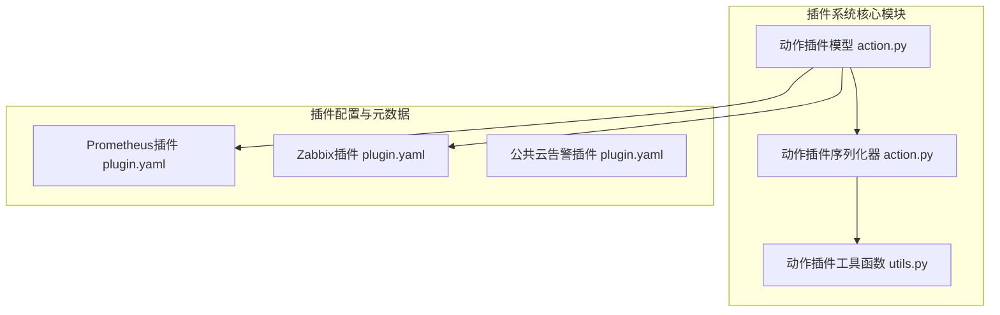
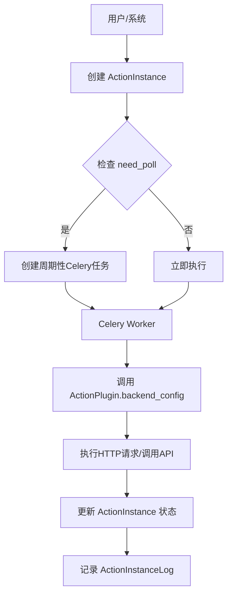
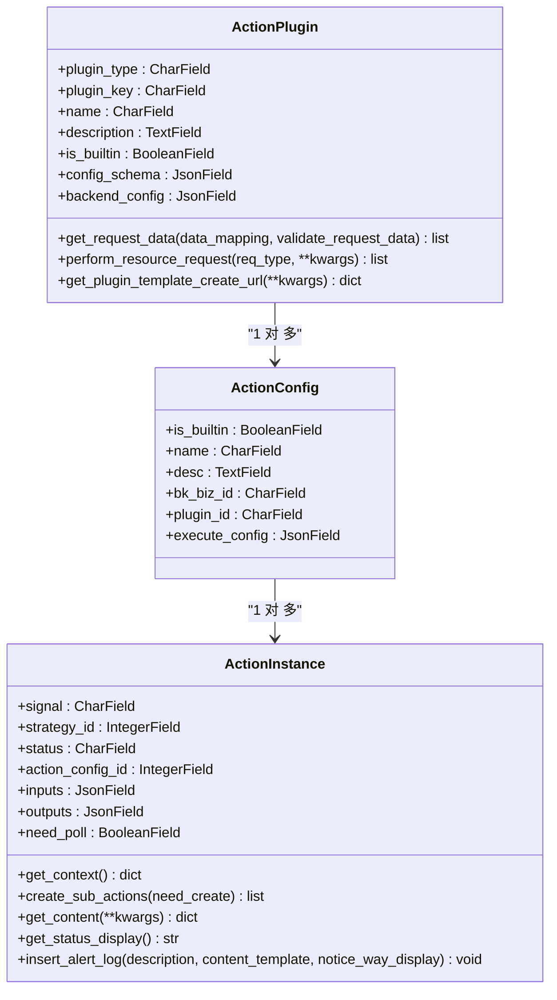
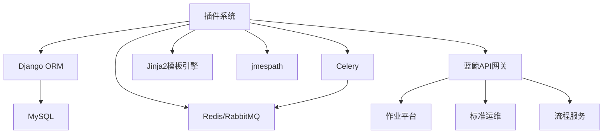

# 插件系统

<cite>
**本文档中引用的文件**  
- [action.py](file://bkmonitor/bkmonitor/models/fta/action.py)
- [plugin.yaml](file://bkmonitor/packages/fta_web/event_plugin/plugins/prom/plugin.yaml)
- [plugin.yaml](file://bkmonitor/packages/fta_web/event_plugin/plugins/zabbix/plugin.yaml)
- [action.py](file://bkmonitor/bkmonitor/action/serializers/action.py)
- [utils.py](file://bkmonitor/bkmonitor/action/utils.py)
</cite>

## 目录
1. [简介](#简介)
2. [项目结构](#项目结构)
3. [核心组件](#核心组件)
4. [架构概述](#架构概述)
5. [详细组件分析](#详细组件分析)
6. [依赖分析](#依赖分析)
7. [性能考虑](#性能考虑)
8. [故障排除指南](#故障排除指南)
9. [结论](#结论)

## 简介
本文档全面介绍蓝鲸监控平台（BlueKing Monitor）的插件化架构设计，重点阐述动作插件（Action Plugin）的实现机制。文档详细说明了插件的注册、配置管理、执行调度和结果回调流程，涵盖插件生命周期管理（安装、启用、禁用、卸载）以及与核心系统的交互模式。特别分析了通过Celery任务队列实现的异步执行架构，并描述了插件配置的JSON Schema定义和YAML元数据声明方式。旨在为开发者提供创建自定义告警处理、通知发送和自动化运维插件的指导。

## 项目结构
蓝鲸监控平台的插件系统主要分布在`bkmonitor`目录下的多个子模块中。核心的插件模型定义位于`bkmonitor/models/fta/action.py`，而插件的序列化和API接口逻辑则在`bkmonitor/action/serializers/action.py`中实现。插件的元数据和配置通过YAML文件在`packages/fta_web/event_plugin/plugins/`目录下进行声明。工具函数和业务逻辑辅助方法则封装在`bkmonitor/action/utils.py`中。整个系统通过Django框架构建，并利用Celery进行异步任务处理。



**图示来源**
- [action.py](file://bkmonitor/bkmonitor/models/fta/action.py)
- [plugin.yaml](file://bkmonitor/packages/fta_web/event_plugin/plugins/prom/plugin.yaml)
- [plugin.yaml](file://bkmonitor/packages/fta_web/event_plugin/plugins/zabbix/plugin.yaml)

## 核心组件
插件系统的核心组件包括`ActionPlugin`、`ActionConfig`和`ActionInstance`三个主要模型。`ActionPlugin`定义了插件的类型、名称、描述和配置模式（`config_schema`），是插件的静态元数据。`ActionConfig`代表一个具体的“处理套餐”，它引用一个`ActionPlugin`并配置了具体的执行参数（`execute_config`）。`ActionInstance`则代表一次具体的插件执行实例，记录了执行状态、输入输出和结果。

**组件来源**
- [action.py](file://bkmonitor/bkmonitor/models/fta/action.py#L150-L199)

## 架构概述
插件系统的架构采用分层设计。最上层是基于YAML的插件元数据声明，定义了插件的ID、版本、类型和配置参数。中间层是Django模型，将YAML配置映射到数据库结构，并通过`ActionPlugin`的`config_schema`字段定义了前端表单和后端执行的JSON Schema。最下层是执行引擎，通过Celery任务队列异步处理`ActionInstance`的创建和执行。当告警事件触发时，系统会根据策略关联的`ActionConfig`创建`ActionInstance`，然后由Celery Worker负责调用相应的插件逻辑。



**图示来源**
- [action.py](file://bkmonitor/bkmonitor/models/fta/action.py)
- [utils.py](file://bkmonitor/bkmonitor/action/utils.py)

## 详细组件分析

### 动作插件模型分析
`ActionPlugin`模型是插件系统的核心，它通过`config_schema`和`backend_config`两个JSON字段实现了高度的灵活性。

#### 配置模式 (config_schema)
`config_schema`定义了插件在前端的配置界面。例如，对于“标准运维”插件，它可以定义一个下拉选择框（`type: "select"`）来让用户选择模板，并通过`data`字段的`url`属性从后端API动态获取模板列表。这使得插件的配置界面可以动态生成，无需硬编码。

#### 后端执行配置 (backend_config)
`backend_config`定义了插件在后端的执行逻辑。它支持两种主要模式：
- **轮询类 (Polling)**：适用于需要监控任务状态的场景（如作业平台任务）。配置中包含`create`、`execute`和`schedule`三个阶段的URL和参数，系统会先创建任务，然后周期性地调用`schedule`接口查询状态。
- **回调类 (Callback)**：适用于Webhook等一次性调用。配置中包含`execute`和`callback_url`，系统执行`execute`后，等待第三方系统通过`callback_url`回传结果。



**图示来源**
- [action.py](file://bkmonitor/bkmonitor/models/fta/action.py#L150-L600)

### 插件配置与执行流程分析
插件的执行流程是一个典型的异步任务处理流程。

#### 插件配置声明
插件的元数据通过YAML文件声明。以Prometheus插件为例：
- `plugin_id`和`version`定义了插件的唯一标识。
- `plugin_type: http_pull`指明了插件类型。
- `config_params`定义了用户可配置的参数，如`url`、`status`等。
- `ingest_config`定义了数据拉取的配置，如HTTP方法、URL模板、数据路径等。
- `normalization_config`定义了数据清洗规则，使用Jinja2模板和表达式将原始数据映射到平台的告警模型。

```yaml
plugin_id: prom_alerts
version: 1.0.0
plugin_display_name: Prometheus
plugin_type: http_pull
config_params:
  - field: url
    name: 请求url
    default_value: http://127.0.0.1:9095/api/v1/alerts
ingest_config:
  method: GET
  url: "{{ url }}"
  events_path: data.alerts
normalization_config:
  - field: alert_name
    expr: labels.alertname
```

#### 执行调度与回调
当一个`ActionInstance`被创建且`need_poll`为`True`时，系统会通过Celery的`PeriodicTask`机制创建一个周期性任务。该任务会调用`ActionInstance`的`schedule`方法，该方法根据`backend_config`中的`schedule`配置向第三方系统发起状态查询请求。一旦任务完成或失败，第三方系统应通过回调接口或任务自身检测到最终状态，然后更新`ActionInstance`的`status`和`outputs`字段。

```mermaid
sequenceDiagram
participant 策略引擎
participant 动作服务
participant Celery
participant 第三方系统
策略引擎->>动作服务 : 告警触发，创建ActionInstance
动作服务->>动作服务 : 检查ActionConfig.backend_config
动作服务->>动作服务 : 初始化ActionInstance.inputs
动作服务->>Celery : 创建ActionInstance并启动周期任务
Celery->>第三方系统 : 调用backend_config.create URL
第三方系统-->>Celery : 返回任务ID
loop 每隔interval秒
Celery->>第三方系统 : 调用backend_config.schedule URL
第三方系统-->>Celery : 返回任务状态
alt 任务完成
Celery->>动作服务 : 更新ActionInstance.status=SUCCESS, outputs=结果
动作服务->>动作服务 : 记录ActionInstanceLog
break
else 任务失败
Celery->>动作服务 : 更新ActionInstance.status=FAILURE, ex_data=错误信息
break
end
end
```

**图示来源**
- [action.py](file://bkmonitor/bkmonitor/models/fta/action.py)
- [utils.py](file://bkmonitor/bkmonitor/action/utils.py)

## 依赖分析
插件系统依赖于多个核心模块和外部服务。



**图示来源**
- [action.py](file://bkmonitor/bkmonitor/models/fta/action.py)
- [settings.py](file://settings.py) (隐含)

## 性能考虑
- **异步处理**：通过Celery将耗时的插件执行操作异步化，避免阻塞主业务流程。
- **数据库优化**：`ActionInstance`表在`create_time`和`status`等字段上建立了复合索引，以加速按时间和状态的查询。
- **批量操作**：`BulkCreateIgnoreManager`提供了`bulk_insert_ignore`方法，用于高效地批量插入数据，避免了逐条插入的性能开销。
- **缓存**：`ActionConfigBaseInfoSlz`使用`@cached_property`缓存了所有插件信息，减少了重复的数据库查询。

## 故障排除指南
- **插件不执行**：检查`ActionInstance`的`need_poll`字段是否为`True`，并确认Celery Worker是否正常运行。
- **配置参数不生效**：检查`ActionPlugin`的`config_schema`是否正确定义了前端表单，并确认`ActionConfig.execute_config`中的值是否符合Schema。
- **HTTP请求失败**：检查`backend_config`中的URL、方法和参数是否正确，确认网络连通性和认证信息。
- **数据清洗失败**：检查`normalization_config`中的`expr`表达式语法是否正确，确保引用的字段在原始数据中存在。
- **状态未更新**：对于轮询类插件，检查`schedule`接口的返回数据结构是否符合预期，确保能正确解析出任务状态。

**组件来源**
- [action.py](file://bkmonitor/bkmonitor/models/fta/action.py)
- [utils.py](file://bkmonitor/bkmonitor/action/utils.py)

## 结论
蓝鲸监控平台的插件系统通过`ActionPlugin`、`ActionConfig`和`ActionInstance`三层模型，结合灵活的JSON Schema配置和YAML元数据声明，构建了一个强大且可扩展的插件化架构。其核心优势在于利用Celery实现了异步、可靠的执行调度，并通过`backend_config`支持了轮询和回调等多种执行模式。该设计不仅满足了告警通知、自动化运维等多样化需求，也为开发者提供了清晰的开发范式，是平台实现功能解耦和生态扩展的关键。