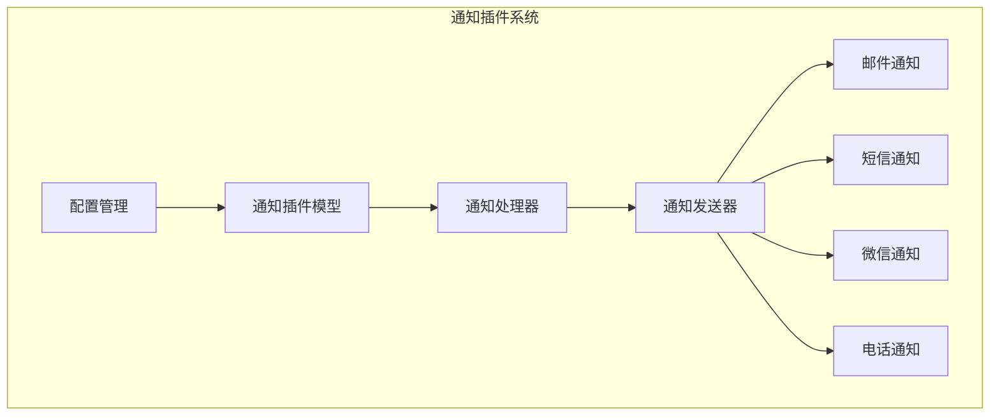
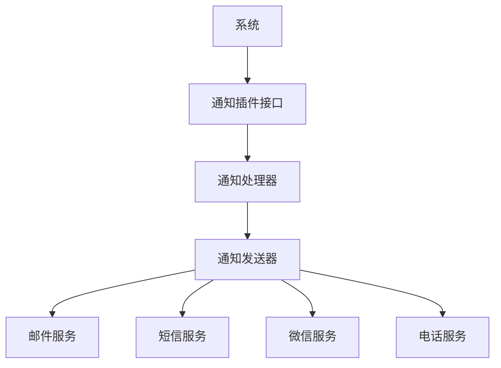
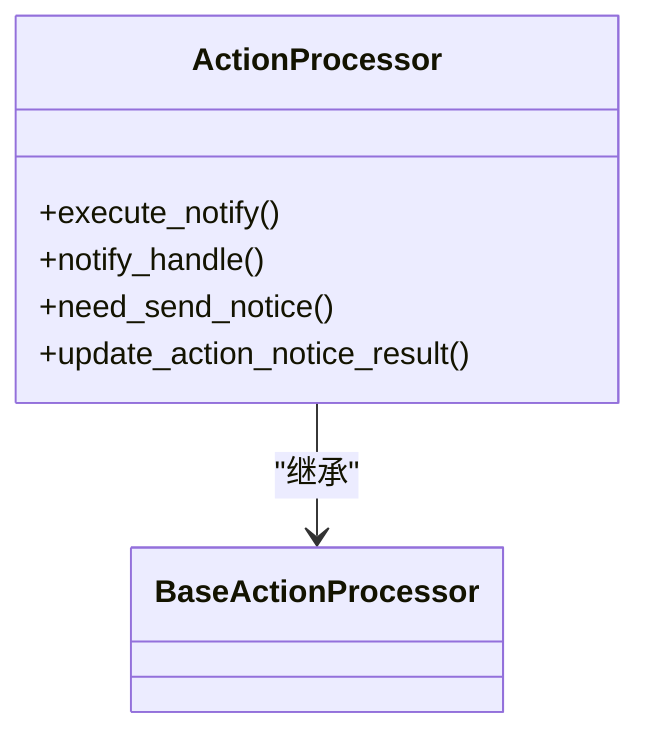
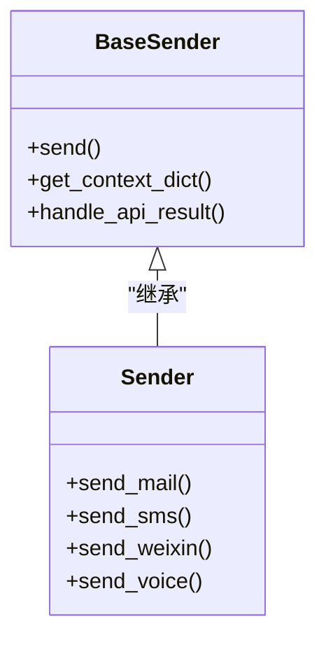
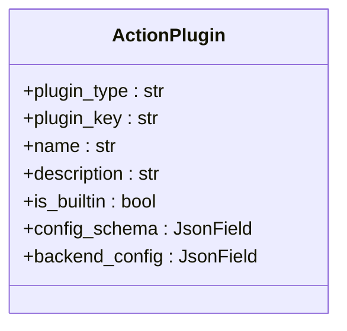
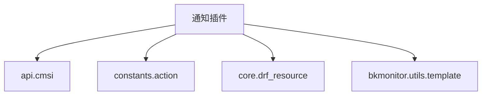

# 通知插件

<cite>
**本文档引用的文件**   
- [processor.py](file://bkmonitor/alarm_backends/service/fta_action/notice/processor.py)
- [send.py](file://bkmonitor/bkmonitor/utils/send.py)
- [action.py](file://bkmonitor/bkmonitor/models/fta/action.py)
- [action.py](file://bkmonitor/constants/action.py)
- [action_plugin_initial.json](file://bkmonitor/support-files/fta/action_plugin_initial.json)
</cite>

## 目录
1. [简介](#简介)
2. [项目结构](#项目结构)
3. [核心组件](#核心组件)
4. [架构概述](#架构概述)
5. [详细组件分析](#详细组件分析)
6. [依赖分析](#依赖分析)
7. [性能考虑](#性能考虑)
8. [故障排除指南](#故障排除指南)
9. [结论](#结论)

## 简介
本文档深入解析了bk-monitor通知插件的架构设计和实现细节。文档详细说明了通知插件的类型体系，包括邮件、短信、微信、电话等多种通知方式的实现机制。同时，文档解释了插件配置管理，涵盖通知模板定义、变量替换规则和多语言支持。此外，文档描述了通知调度流程，包括如何根据告警级别、时间窗口和接收组策略选择合适的通知方式并执行发送。最后，文档分析了通知状态跟踪机制，特别是如何记录发送结果、处理失败重试和生成通知审计日志。

## 项目结构
bk-monitor项目采用模块化设计，将不同的功能划分为独立的模块。通知插件功能主要分布在`alarm_backends`和`bkmonitor`两个核心模块中。`alarm_backends`模块负责告警处理的后端逻辑，其中`service/fta_action/notice`目录包含了通知处理器的核心实现。`bkmonitor`模块则包含了通知插件的模型定义、工具函数和配置文件。这种分层设计使得通知功能的逻辑清晰，易于维护和扩展。

**图示来源**
- [processor.py](file://bkmonitor/alarm_backends/service/fta_action/notice/processor.py)
- [send.py](file://bkmonitor/bkmonitor/utils/send.py)
- [action.py](file://bkmonitor/bkmonitor/models/fta/action.py)

## 核心组件
通知插件系统的核心组件包括通知处理器、通知发送器和通知插件模型。通知处理器负责协调整个通知流程，从接收通知请求到最终发送通知。通知发送器是具体实现各种通知方式的类，它根据不同的通知渠道调用相应的API。通知插件模型则定义了通知插件的数据结构和行为，是整个系统的基础。

**组件来源**
- [processor.py](file://bkmonitor/alarm_backends/service/fta_action/notice/processor.py)
- [send.py](file://bkmonitor/bkmonitor/utils/send.py)
- [action.py](file://bkmonitor/bkmonitor/models/fta/action.py)

## 架构概述
通知插件系统的架构采用分层设计，分为接口层、处理层和执行层。接口层接收来自系统的通知请求，并将其转换为内部数据结构。处理层负责解析请求，根据配置选择合适的通知方式，并调用相应的发送器。执行层则具体实现各种通知方式的发送逻辑，与外部服务进行交互。

**图示来源**
- [processor.py](file://bkmonitor/alarm_backends/service/fta_action/notice/processor.py)
- [send.py](file://bkmonitor/bkmonitor/utils/send.py)

## 详细组件分析

### 通知处理器分析
通知处理器是整个通知插件系统的核心，它负责协调整个通知流程。处理器首先检查通知配置是否为空，然后根据通知方式调用相应的发送逻辑。处理器还负责处理通知的重试机制和错误处理。

**图示来源**
- [processor.py](file://bkmonitor/alarm_backends/service/fta_action/notice/processor.py)

### 通知发送器分析
通知发送器是具体实现各种通知方式的类。它提供了一个统一的接口`send`，根据不同的通知方式调用相应的发送方法。发送器还负责处理消息的编码、长度限制和API调用结果。

**图示来源**
- [send.py](file://bkmonitor/bkmonitor/utils/send.py)

### 通知插件模型分析
通知插件模型定义了通知插件的数据结构和行为。模型包含了插件类型、插件键、名称、描述等字段，以及配置模式和后端配置等复杂数据结构。

**图示来源**
- [action.py](file://bkmonitor/bkmonitor/models/fta/action.py)

## 依赖分析
通知插件系统依赖于多个外部服务和内部模块。系统依赖`api.cmsi`模块来调用各种通知服务的API，依赖`constants.action`模块来获取通知方式的定义，依赖`core.drf_resource`模块来处理API请求。

**图示来源**
- [send.py](file://bkmonitor/bkmonitor/utils/send.py)
- [action.py](file://bkmonitor/constants/action.py)

## 性能考虑
通知插件系统在设计时考虑了性能因素。系统使用缓存来存储通知配置，减少数据库查询次数。同时，系统对消息长度进行了限制，避免发送过长的消息导致性能问题。此外，系统还实现了通知的批量发送机制，提高发送效率。

## 故障排除指南
当通知插件出现问题时，可以按照以下步骤进行排查：首先检查通知配置是否正确，然后检查相关服务是否正常运行，最后查看日志文件以获取详细的错误信息。常见的问题包括API调用失败、消息长度超限和配置错误等。

**组件来源**
- [processor.py](file://bkmonitor/alarm_backends/service/fta_action/notice/processor.py)
- [send.py](file://bkmonitor/bkmonitor/utils/send.py)

## 结论
bk-monitor通知插件系统是一个功能强大且灵活的通知解决方案。系统采用模块化设计，易于扩展和维护。通过深入理解系统的架构和实现细节，开发者可以更好地利用该系统来满足各种通知需求。