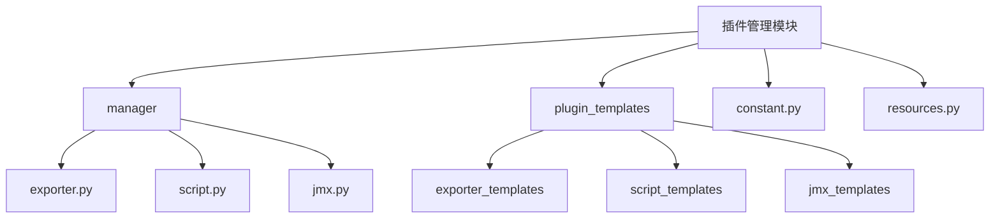
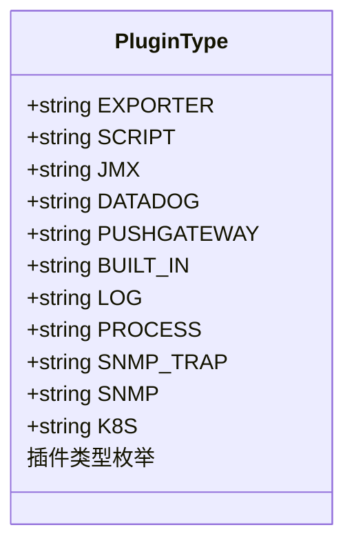
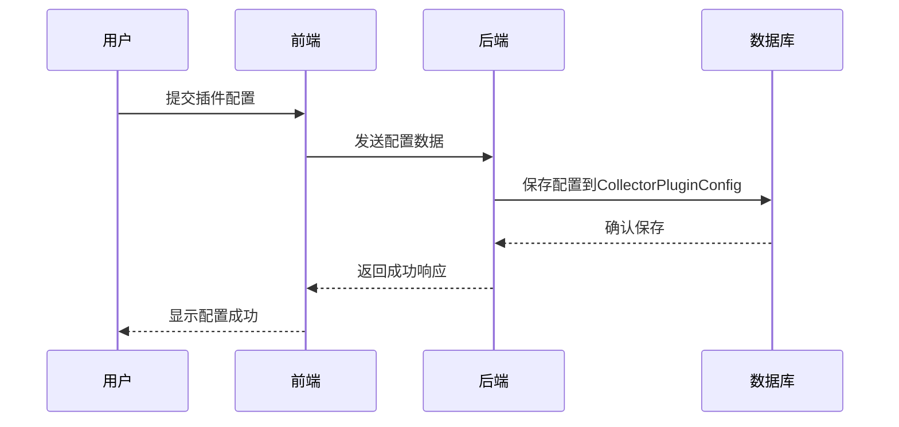
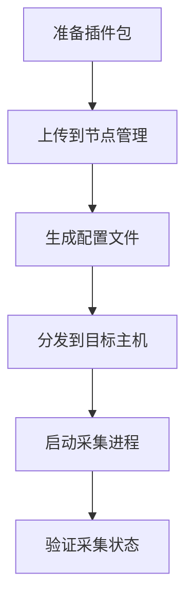
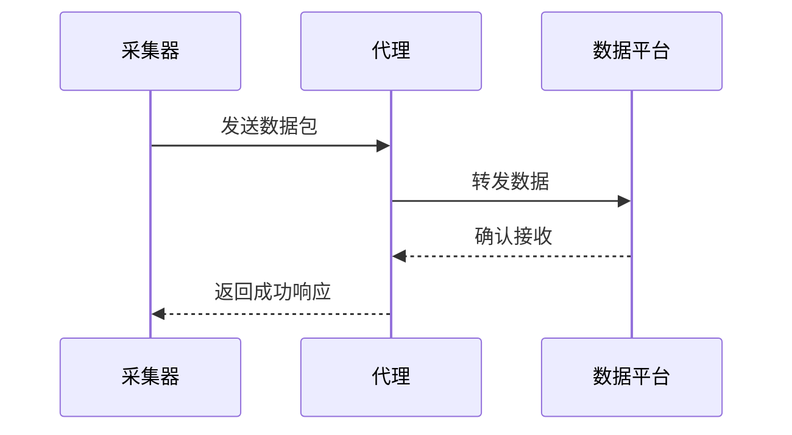
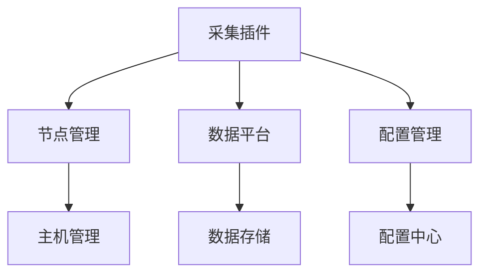

# 采集插件

<cite>
**本文档引用的文件**   
- [plugin.py](file://bkmonitor/packages/monitor_web/models/plugin.py)
- [constant.py](file://bkmonitor/packages/monitor_web/plugin/constant.py)
- [meta.yaml](file://bkmonitor/packages/monitor_web/plugin/plugin_templates/exporter_templates/external_plugins_linux_x86_64/plugin_name/info/meta.yaml)
- [default.py](file://bkmonitor/api/node_man/default.py)
- [base.py](file://bkmonitor/packages/monitor_web/plugin/manager/base.py)
- [process.py](file://bkmonitor/packages/monitor_web/plugin/manager/process.py)
- [custom_report_tools.py](file://bkmonitor/bkmonitor/utils/custom_report_tools.py)
</cite>

## 目录
1. [简介](#简介)
2. [项目结构](#项目结构)
3. [核心组件](#核心组件)
4. [架构概述](#架构概述)
5. [详细组件分析](#详细组件分析)
6. [依赖分析](#依赖分析)
7. [性能考虑](#性能考虑)
8. [故障排除指南](#故障排除指南)
9. [结论](#结论)

## 简介
本文档全面介绍蓝鲸监控平台中数据采集插件的架构设计与实现方式。文档详细阐述了插件的类型体系、配置管理机制、部署流程、数据上报机制以及自定义插件开发指南。通过本指南，用户可以深入理解采集插件的工作原理，并能够创建和管理自定义的数据采集器。

## 项目结构
采集插件相关的核心代码主要位于`bkmonitor/packages/monitor_web/plugin`目录下，该目录包含了插件管理、模板、常量定义等关键模块。插件的元数据和配置信息通过Django模型进行管理，存储在数据库中。

**图源**
- [plugin.py](file://bkmonitor/packages/monitor_web/models/plugin.py#L41-L716)
- [constant.py](file://bkmonitor/packages/monitor_web/plugin/constant.py#L104-L115)

## 核心组件
采集插件系统的核心组件包括插件元数据模型（CollectorPluginMeta）、插件配置模型（CollectorPluginConfig）和插件版本历史模型（PluginVersionHistory）。这些模型共同定义了插件的属性、配置和版本管理。

**节源**
- [plugin.py](file://bkmonitor/packages/monitor_web/models/plugin.py#L41-L716)

## 架构概述
采集插件系统采用分层架构，包括插件定义层、配置管理层、部署执行层和数据上报层。插件定义层负责描述插件的基本信息和类型；配置管理层处理插件的参数配置和默认值设置；部署执行层通过节点管理将插件分发到目标主机并启动采集进程；数据上报层则负责将采集到的数据格式化并发送到数据平台。

**图源**
- [plugin.py](file://bkmonitor/packages/monitor_web/models/plugin.py#L41-L716)
- [default.py](file://bkmonitor/api/node_man/default.py#L26-L68)

## 详细组件分析

### 插件类型体系分析
采集插件根据采集方式和数据源的不同，分为多种类型，每种类型适用于不同的场景。

#### 插件类型类图

**图源**
- [constant.py](file://bkmonitor/packages/monitor_web/plugin/constant.py#L104-L115)

**节源**
- [constant.py](file://bkmonitor/packages/monitor_web/plugin/constant.py#L104-L115)

### 插件配置管理分析
插件配置管理机制允许用户定义插件的参数、设置默认值，并支持动态更新策略。配置信息存储在CollectorPluginConfig模型中，通过JSON字段保存。

#### 插件配置序列图

**图源**
- [plugin.py](file://bkmonitor/packages/monitor_web/models/plugin.py#L719-L771)

**节源**
- [plugin.py](file://bkmonitor/packages/monitor_web/models/plugin.py#L719-L771)

### 插件部署流程分析
插件部署通过节点管理（Node Man）实现，将插件分发到目标主机并启动采集进程。部署过程包括插件包的上传、配置文件的生成和分发、以及进程的启动。

#### 插件部署流程图

**图源**
- [default.py](file://bkmonitor/api/node_man/default.py#L254-L278)

**节源**
- [default.py](file://bkmonitor/api/node_man/default.py#L254-L278)

### 数据上报机制分析
数据上报机制负责将采集到的指标数据格式化为统一的数据结构，并发送到数据平台。上报过程支持批量发送和并行处理，以提高效率。

#### 数据上报序列图

**图源**
- [custom_report_tools.py](file://bkmonitor/bkmonitor/utils/custom_report_tools.py#L70-L93)

**节源**
- [custom_report_tools.py](file://bkmonitor/bkmonitor/utils/custom_report_tools.py#L70-L93)

## 依赖分析
采集插件系统依赖于多个外部组件，包括节点管理、数据平台、配置管理等。这些组件通过API进行交互，确保系统的稳定性和可扩展性。

**图源**
- [default.py](file://bkmonitor/api/node_man/default.py#L26-L68)
- [custom_report_tools.py](file://bkmonitor/bkmonitor/utils/custom_report_tools.py#L70-L93)

**节源**
- [default.py](file://bkmonitor/api/node_man/default.py#L26-L68)
- [custom_report_tools.py](file://bkmonitor/bkmonitor/utils/custom_report_tools.py#L70-L93)

## 性能考虑
在设计和实现采集插件时，需要考虑性能因素，如数据采集的频率、数据上报的批量处理、以及插件进程的资源消耗。通过合理的配置和优化，可以确保系统在高负载下的稳定运行。

## 故障排除指南
当采集插件出现问题时，可以通过检查日志、验证配置、以及测试网络连接来定位和解决问题。常见的故障包括插件无法启动、数据上报失败、以及配置错误等。

**节源**
- [base.py](file://bkmonitor/packages/monitor_web/plugin/manager/base.py#L861-L889)

## 结论
本文档详细介绍了蓝鲸监控平台中数据采集插件的架构设计和实现方式。通过理解插件的类型体系、配置管理、部署流程和数据上报机制，用户可以更好地利用和扩展监控系统，满足多样化的监控需求。