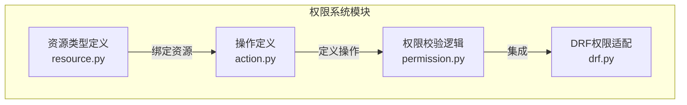
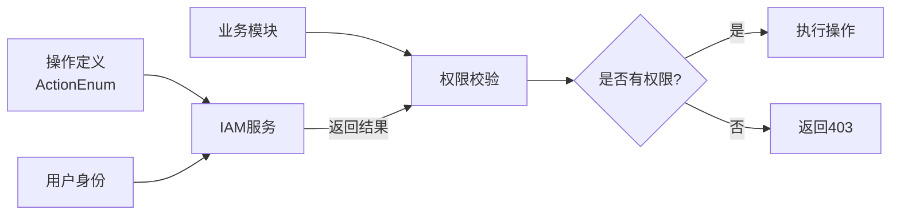
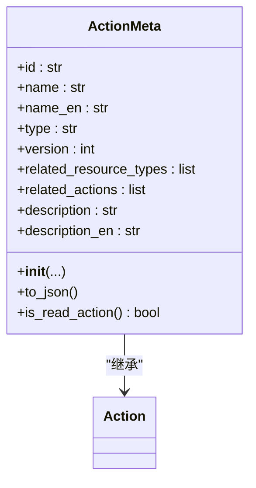
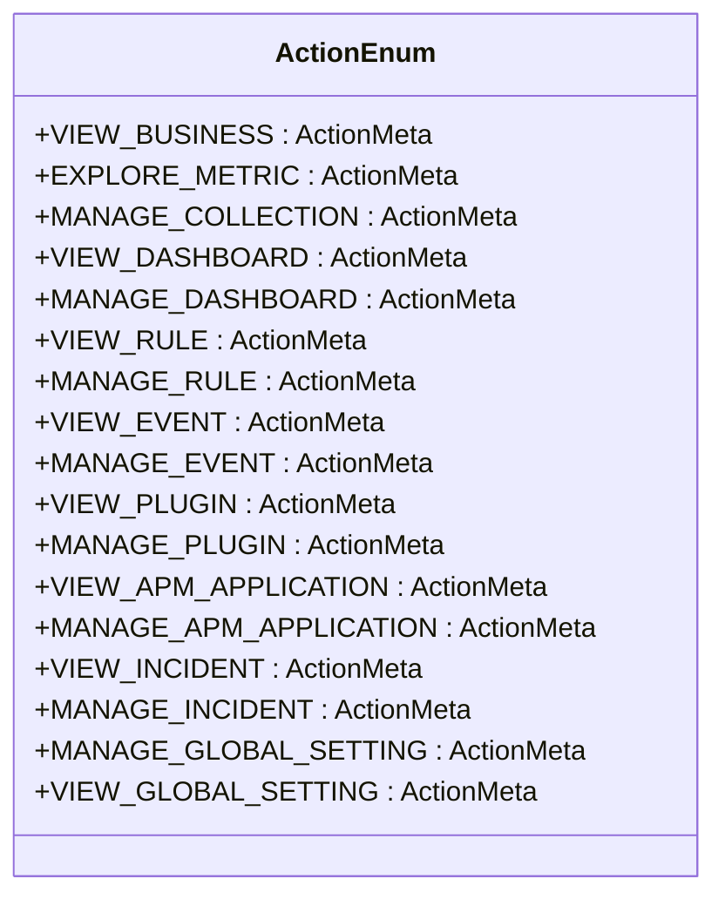
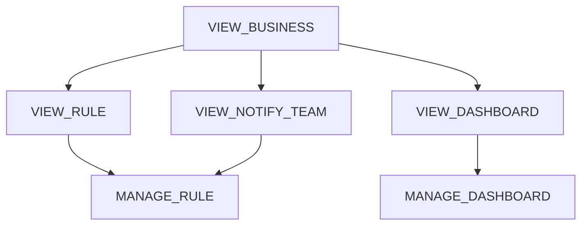
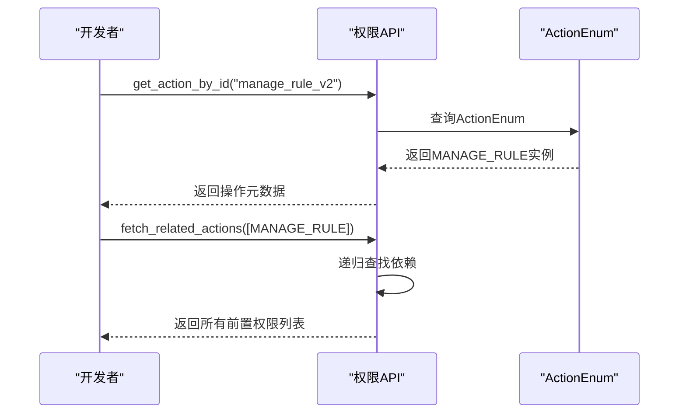
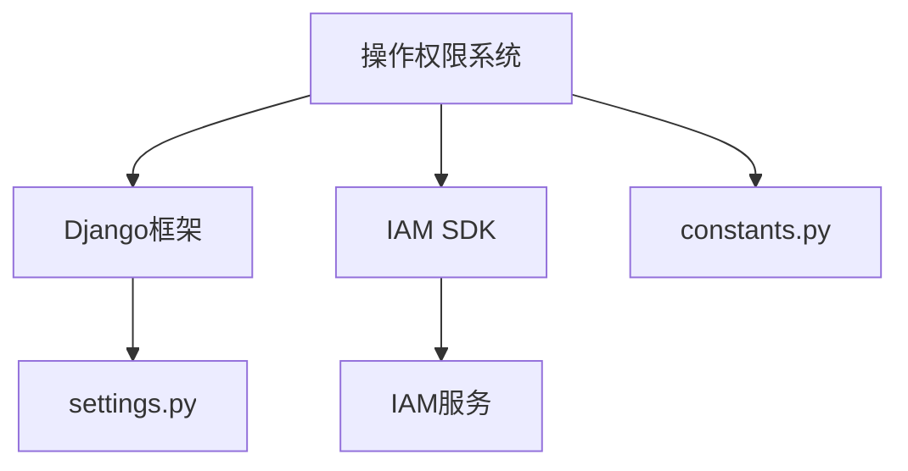

# 操作权限配置

<cite>
**本文档引用的文件**  
- [bkmonitor\iam\action.py](file://bkmonitor\iam\action.py#L1-L621)
- [constants\action.py](file://constants\action.py)
</cite>

## 目录
1. [简介](#简介)
2. [项目结构](#项目结构)
3. [核心组件](#核心组件)
4. [架构概述](#架构概述)
5. [详细组件分析](#详细组件分析)
6. [依赖分析](#依赖分析)
7. [性能考虑](#性能考虑)
8. [故障排除指南](#故障排除指南)
9. [结论](#结论)

## 简介
本文档全面介绍蓝鲸监控平台（BlueKing - Monitor）中基于IAM（Identity and Access Management）系统的操作权限配置机制。重点分析`bkmonitor/iam/action.py`文件中定义的操作权限模型，包括操作的声明方式、分类组织、敏感级别、资源绑定关系以及权限继承与组合规则。文档还涵盖权限调试方法和最佳实践建议，旨在为开发者提供完整的权限系统理解与使用指导。

## 项目结构
蓝鲸监控平台的代码库采用模块化设计，核心权限系统位于`bkmonitor/iam/`目录下。该目录包含权限定义、资源类型、权限校验等核心模块。`action.py`文件是操作权限的集中定义点，通过枚举类`ActionEnum`声明了系统中所有可被授权的操作。

**图示来源**
- [bkmonitor\iam\action.py](file://bkmonitor\iam\action.py#L1-L621)

**本节来源**
- [bkmonitor\iam\action.py](file://bkmonitor\iam\action.py#L1-L621)

## 核心组件
操作权限系统的核心是`ActionMeta`类和`ActionEnum`枚举。`ActionMeta`定义了操作的元数据结构，而`ActionEnum`则实例化了系统中所有具体的操作权限。通过`get_action_by_id`和`fetch_related_actions`等工具函数，系统实现了权限的动态查询和依赖关系解析。

**本节来源**
- [bkmonitor\iam\action.py](file://bkmonitor\iam\action.py#L80-L511)

## 架构概述
权限系统采用声明式架构，将操作、资源和策略分离。操作权限的定义独立于具体的业务逻辑，通过`ActionMeta`对象进行描述。这些定义在系统启动时被注册到IAM服务中，后续的权限校验通过调用IAM API完成。

**图示来源**
- [bkmonitor\iam\action.py](file://bkmonitor\iam\action.py#L1-L621)

## 详细组件分析

### 操作权限元数据定义
`ActionMeta`类继承自IAM SDK的`Action`类，扩展了丰富的元数据字段，用于精确描述一个操作。

**图示来源**
- [bkmonitor\iam\action.py](file://bkmonitor\iam\action.py#L80-L150)

#### 关键属性说明
- **id**: 操作的唯一标识符，用于系统内部引用。
- **name / name_en**: 操作的中文和英文名称，用于界面展示。
- **type**: 操作类型，主要分为"view"（查看）和"manage"（管理）。
- **related_resource_types**: 该操作所关联的资源类型列表。
- **related_actions**: 执行此操作所依赖的前置操作权限列表，用于实现权限继承。

**本节来源**
- [bkmonitor\iam\action.py](file://bkmonitor\iam\action.py#L80-L150)

### 操作权限枚举
`ActionEnum`类通过类属性的方式，集中定义了系统中所有的操作权限。每个属性都是一个`ActionMeta`实例。

**图示来源**
- [bkmonitor\iam\action.py](file://bkmonitor\iam\action.py#L87-L511)

#### 操作分类与组织
操作权限按功能模块进行组织，主要类别包括：
- **业务访问**: `VIEW_BUSINESS`，是大多数操作的前置权限。
- **数据采集**: `VIEW_COLLECTION`, `MANAGE_COLLECTION`, `VIEW_PLUGIN`, `MANAGE_PLUGIN`。
- **告警管理**: `VIEW_RULE`, `MANAGE_RULE`, `VIEW_EVENT`, `MANAGE_EVENT`, `VIEW_NOTIFY_TEAM`, `MANAGE_NOTIFY_TEAM`。
- **仪表盘**: `VIEW_DASHBOARD`, `MANAGE_DASHBOARD`, `VIEW_SINGLE_DASHBOARD`, `EDIT_SINGLE_DASHBOARD`。
- **APM应用**: `VIEW_APM_APPLICATION`, `MANAGE_APM_APPLICATION`。
- **故障管理**: `VIEW_INCIDENT`, `MANAGE_INCIDENT`。
- **系统管理**: `VIEW_GLOBAL_SETTING`, `MANAGE_GLOBAL_SETTING`。

**本节来源**
- [bkmonitor\iam\action.py](file://bkmonitor\iam\action.py#L87-L511)

### 权限继承与依赖
系统通过`related_actions`字段实现权限的继承和依赖。例如，要拥有`MANAGE_RULE`（策略管理）权限，用户必须先拥有`VIEW_BUSINESS`（业务访问）、`VIEW_RULE`（策略查看）和`VIEW_NOTIFY_TEAM`（告警组查看）权限。

**图示来源**
- [bkmonitor\iam\action.py](file://bkmonitor\iam\action.py#L250-L280)

#### 权限组合模式
- **继承**: 管理权限通常继承其对应的查看权限。
- **覆盖**: 拥有管理权限通常意味着自动拥有查看权限。
- **限制**: 某些操作（如`USE_PUBLIC_SYNTHETIC_LOCATION`）仅依赖于特定的查看权限，而非业务访问权限。

**本节来源**
- [bkmonitor\iam\action.py](file://bkmonitor\iam\action.py#L250-L280)

### 权限调试与验证
系统提供了`get_action_by_id`和`fetch_related_actions`等工具函数，便于开发者调试和验证权限。

**图示来源**
- [bkmonitor\iam\action.py](file://bkmonitor\iam\action.py#L250-L300)

#### 调试方法
1. **查询单个操作**: 使用`get_action_by_id`获取操作的详细信息。
2. **获取依赖链**: 使用`fetch_related_actions`递归获取一个操作所需的所有前置权限。
3. **检查权限集**: 对比`ALL_ACTION_IDS`、`MINI_ACTION_IDS`等预定义权限集。

**本节来源**
- [bkmonitor\iam\action.py](file://bkmonitor\iam\action.py#L250-L300)

## 依赖分析
操作权限系统依赖于Django框架和IAM SDK。`ActionMeta`类直接继承自IAM SDK的`Action`类，并利用Django的`gettext`进行国际化。

**图示来源**
- [bkmonitor\iam\action.py](file://bkmonitor\iam\action.py#L1-L20)
- [constants\action.py](file://constants\action.py)

**本节来源**
- [bkmonitor\iam\action.py](file://bkmonitor\iam\action.py#L1-L20)
- [constants\action.py](file://constants\action.py)

## 性能考虑
权限定义在模块加载时被一次性解析并缓存到`_all_actions`字典中，确保了`get_action_by_id`等查询操作的时间复杂度为O(1)。`fetch_related_actions`函数采用递归算法，其性能取决于权限依赖链的深度，在实际应用中通常较浅。

## 故障排除指南
- **权限不存在错误**: 确保操作ID拼写正确，并检查`ActionEnum`中是否已定义。
- **权限校验失败**: 使用`fetch_related_actions`检查是否缺少前置权限。
- **国际化问题**: 确认`name`和`name_en`字段已正确设置。

**本节来源**
- [bkmonitor\iam\action.py](file://bkmonitor\iam\action.py#L250-L300)

## 结论
bk-monitor的权限系统通过`ActionMeta`和`ActionEnum`提供了清晰、可维护的操作权限定义机制。通过合理的分类、继承和依赖关系，实现了细粒度的权限控制。开发者应遵循现有模式定义新操作，并利用提供的工具函数进行权限调试，以确保系统的安全性和可用性。