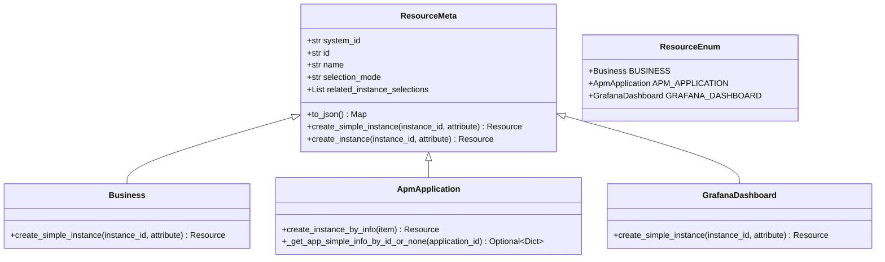
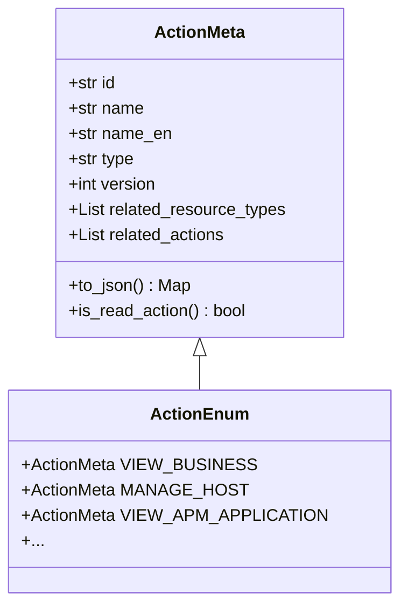
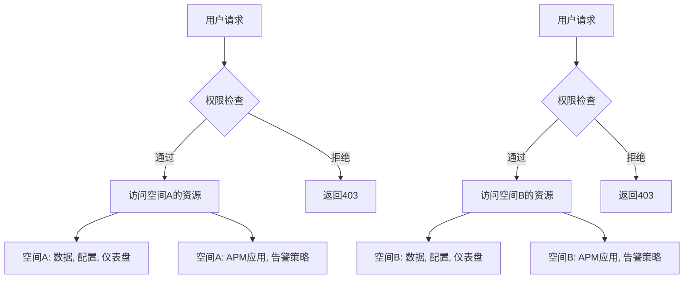
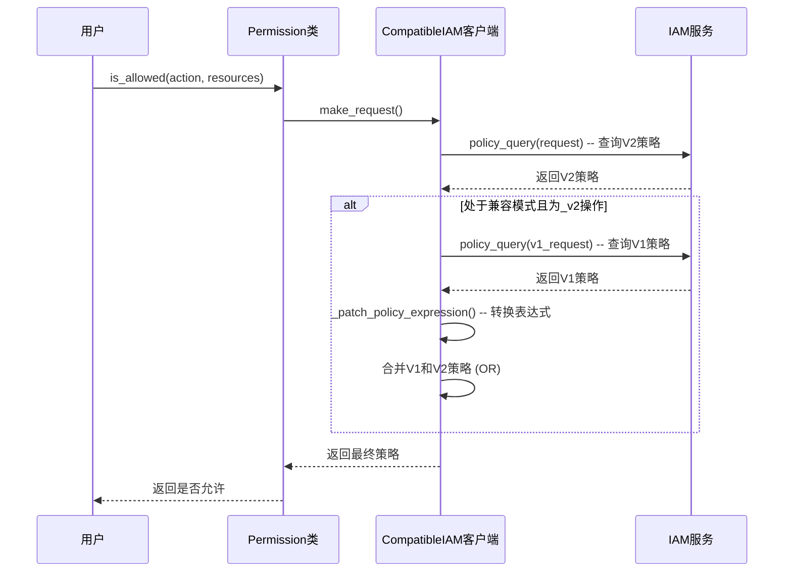

# 权限模型扩展

<cite>
**本文档引用的文件**   
- [resource.py](file://bkmonitor/bkmonitor/iam/resource.py)
- [action.py](file://bkmonitor/bkmonitor/iam/action.py)
- [permission.py](file://bkmonitor/bkmonitor/iam/permission.py)
- [compatible.py](file://bkmonitor/bkmonitor/iam/compatible.py)
- [utils.py](file://bkmonitor/metadata/models/space/utils.py)
- [strategy_check.py](file://bkmonitor/alarm_backends/management/commands/strategy_check.py)
- [iam_upgrade_action_v2.py](file://bkmonitor/bkmonitor/management/commands/iam_upgrade_action_v2.py)
</cite>

## 目录
1. [引言](#引言)
2. [资源类型定义机制](#资源类型定义机制)
3. [操作权限配置方式](#操作权限配置方式)
4. [空间概念与多租户权限隔离](#空间概念与多租户权限隔离)
5. [权限策略评估流程](#权限策略评估流程)
6. [权限调试工具使用指南](#权限调试工具使用指南)
7. [权限模型演进历史与未来规划](#权限模型演进历史与未来规划)

## 引言
本文档旨在深入解析bk-monitor系统中基于IAM（Identity and Access Management）的细粒度权限控制系统。该系统是保障平台安全与数据隔离的核心组件，通过定义资源类型、操作权限、空间隔离等机制，实现了对用户行为的精确控制。文档将从代码实现层面，详细阐述权限模型的各个组成部分，包括资源与操作的声明、多租户架构下的空间隔离、权限策略的评估与继承，以及相关的调试与迁移工具，为开发者提供全面的技术参考。

## 资源类型定义机制

在bk-monitor的权限模型中，资源（Resource）是权限控制的基本单元，代表了系统中可以被访问或操作的实体，如业务、APM应用、仪表盘等。资源类型的定义主要在`iam/resource.py`文件中完成。

### 资源元类与基类
系统定义了一个抽象基类`ResourceMeta`，它作为所有具体资源类型的元类。该类定义了资源的通用属性：
- **system_id**: 资源所属的系统ID，通常为`settings.BK_IAM_SYSTEM_ID`。
- **id**: 资源类型的唯一标识符，如`"space"`代表空间。
- **name**: 资源类型的中文名称，使用`_lazy()`进行国际化。
- **selection_mode**: 选择模式，通常为`"instance"`，表示基于实例的权限。
- **related_instance_selections**: 关联的实例视图，用于在权限申请页面展示资源选择器。

`ResourceMeta`类还提供了`to_json()`方法，用于将资源定义序列化为JSON格式，供IAM系统注册使用。

### 具体资源类型实现
具体的资源类型通过继承`ResourceMeta`来实现。例如：

```python
class Business(ResourceMeta):
    """
    CMDB业务 (在系统中已演进为空间)
    """
    system_id = settings.BK_IAM_SYSTEM_ID
    id = "space"
    name = _lazy("空间")
    selection_mode = "instance"
    related_instance_selections = [{"system_id": system_id, "id": "space_list"}]
```

此代码定义了名为“空间”的资源类型。值得注意的是，尽管类名为`Business`，但其ID已从传统的“biz”（业务）演进为“space”（空间），体现了系统从CMDB业务模型向更通用的“空间”多租户模型的转变。

### 资源实例创建
`ResourceMeta`提供了`create_simple_instance()`和`create_instance()`两个类方法来创建具体的资源实例。子类可以重载这些方法以提供更丰富的实例信息。例如，`Business`类的`create_simple_instance`方法会尝试将传入的`instance_id`（可能是`bk_biz_id`或`space_uid`）统一转换为标准的`bk_biz_id`，并填充实例的名称等属性，确保权限系统接收到一致的数据。

### 资源类型枚举
`ResourceEnum`类作为一个枚举，集中管理了系统中所有可用的资源类型，如`BUSINESS`、`APM_APPLICATION`、`GRAFANA_DASHBOARD`等。这为其他模块（如权限检查）提供了一个清晰、统一的资源类型访问入口。



**图例来源**
- [resource.py](file://bkmonitor/bkmonitor/iam/resource.py#L27-L199)

**本节来源**
- [resource.py](file://bkmonitor/bkmonitor/iam/resource.py#L27-L199)

## 操作权限配置方式

操作权限（Action）定义了用户可以在特定资源上执行的具体行为，如“查看”、“管理”等。操作的配置在`iam/action.py`文件中完成。

### 操作元类
`ActionMeta`类继承自IAM SDK的`Action`类，用于定义操作的元数据。其构造函数接收以下关键参数：
- **id**: 操作的唯一标识符，通常以`_v2`后缀结尾，表明这是新版本的权限模型。
- **name**: 操作的中文名称。
- **name_en**: 操作的英文名称。
- **type**: 操作类型，如`"view"`（查看）、`"manage"`（管理）。
- **related_resource_types**: 关联的资源类型列表，定义了此操作作用于哪些资源。
- **related_actions**: 关联的其他操作，用于权限继承。例如，拥有“管理”权限通常意味着也拥有“查看”权限。
- **version**: 版本号。

### 操作类型枚举
`ActionEnum`类集中定义了系统中所有的操作权限。每个操作都是一个`ActionMeta`的实例。例如：

```python
VIEW_BUSINESS = ActionMeta(
    id="view_business_v2",
    name=_("业务访问"),
    name_en="View Business",
    type="view",
    related_resource_types=[SPACE_RESOURCE],
    related_actions=[],
    version=1,
)

MANAGE_HOST = ActionMeta(
    id="manage_host_v2",
    name=_("主机详情管理"),
    name_en="Manage Host",
    type="manage",
    related_resource_types=[SPACE_RESOURCE],
    related_actions=[VIEW_BUSINESS.id, VIEW_HOST.id],
    version=1,
)
```

此代码定义了“查看业务”和“管理主机”两个操作。`MANAGE_HOST`的`related_actions`包含了`VIEW_BUSINESS`和`VIEW_HOST`，这意味着当用户被授予“管理主机”权限时，系统会自动检查并继承“查看业务”和“查看主机”的权限，实现了权限的层级继承。

### 操作与资源的关联
在`ActionMeta`的定义中，通过`related_resource_types`参数将操作与资源类型关联起来。例如，`VIEW_BUSINESS`操作关联了`SPACE_RESOURCE`，这表明该操作只能在“空间”资源上执行。这种关联是权限策略评估的基础。



**图例来源**
- [action.py](file://bkmonitor/bkmonitor/iam/action.py#L34-L199)

**本节来源**
- [action.py](file://bkmonitor/bkmonitor/iam/action.py#L34-L199)

## 空间概念与多租户权限隔离

“空间”（Space）是bk-monitor实现多租户权限隔离的核心概念。它取代了传统的CMDB“业务”（Business）模型，提供了一个更灵活、可扩展的租户隔离方案。

### 空间的定义与作用
在权限模型中，“空间”作为一种资源类型（`ResourceEnum.BUSINESS`），是所有其他资源（如监控策略、仪表盘、APM应用）的归属容器。用户的权限被授予到特定的“空间”实例上，从而实现了数据和操作的隔离。一个用户只能访问和管理其被授权的空间内的资源。

### 空间与资源的归属关系
`metadata/models/space/utils.py`文件中的工具函数负责管理空间与资源的归属关系。核心函数`create_space()`用于创建新的空间实例。在创建过程中，系统会：
1.  **校验唯一性**: 确保空间ID和名称在指定的空间类型下是唯一的。
2.  **创建空间对象**: 在数据库中创建`Space`模型实例。
3.  **刷新缓存**: 将新创建的空间信息推送到Redis等缓存中，确保系统其他组件能及时感知到变更。
4.  **授权创建者**: 调用`Permission.grant_creator_action()`方法，自动将该空间的“创建者”权限授予给创建者用户，使其成为该空间的管理员。

此外，`SpaceResource`模型用于建立空间与其他系统资源（如BCS集群、蓝盾项目）的关联，实现跨系统的统一视图和权限联动。

### 多租户架构实现
通过“空间”模型，bk-monitor实现了逻辑上的多租户。每个“空间”可以看作是一个独立的租户单元。系统通过以下方式实现隔离：
- **数据隔离**: 所有数据（如监控数据、配置）都通过`space_type_id`和`space_id`进行标记。
- **权限隔离**: IAM权限策略基于“空间”资源实例进行评估，确保用户只能访问其被授权的空间。
- **配置隔离**: 空间级别的配置（如数据源、采集配置）仅对该空间有效。



**图例来源**
- [utils.py](file://bkmonitor/metadata/models/space/utils.py#L0-L199)

**本节来源**
- [utils.py](file://bkmonitor/metadata/models/space/utils.py#L0-L199)

## 权限策略评估流程

权限策略的评估是权限系统的核心，它决定了用户是否能执行某个操作。该流程主要在`iam/compatible.py`文件中实现，特别是`CompatibleIAM`类。

### 策略匹配
当进行权限检查时，系统会构造一个`Request`对象，包含用户（Subject）、操作（Action）和资源（Resources）。IAM客户端会查询与该请求匹配的所有策略。

### 继承规则
权限继承主要通过两种方式实现：
1.  **操作继承**: 如`MANAGE_HOST`操作的`related_actions`包含了`VIEW_HOST`，系统在评估`MANAGE_HOST`权限时，会自动将`VIEW_HOST`的策略考虑在内。
2.  **版本兼容继承**: 为了平滑升级，系统实现了V1（旧模型，基于`biz`）和V2（新模型，基于`space`）权限的兼容。`CompatibleIAM`类的`_do_policy_query`方法会同时查询V2和V1的策略。

### 冲突解决机制
当存在多个策略时，系统采用“或”（OR）逻辑进行合并，确保权限是累加的。在兼容模式下，如果用户同时拥有V1和V2的策略，系统会将两者的策略条件合并：
```python
policies = {
    "op": "OR",
    "content": [v2_policies, v1_policies], # V2策略或V1策略满足即可
}
```
此外，`_patch_policy_expression`方法会将V1策略中的`biz.id`字段自动转换为`space.id`，确保新旧模型的策略能正确匹配。

### 评估流程总结
1.  接收权限检查请求（用户、操作、资源）。
2.  查询该操作在V2模型下的所有策略。
3.  如果操作是V2版本且处于兼容模式，则查询其对应的V1操作的策略。
4.  将V1策略的资源表达式从`biz`转换为`space`。
5.  将V1和V2的策略通过“或”操作合并。
6.  返回合并后的策略，供IAM引擎进行最终的匹配计算。



**图例来源**
- [compatible.py](file://bkmonitor/bkmonitor/iam/compatible.py#L0-L157)

**本节来源**
- [compatible.py](file://bkmonitor/bkmonitor/iam/compatible.py#L0-L157)

## 权限调试工具使用指南

为了帮助开发者验证权限配置的正确性，系统提供了多种调试工具。

### 策略检查命令
`alarm_backends/management/commands/strategy_check.py`文件中的`Command`类提供了一个强大的命令行工具，可用于调试告警策略的执行流程，间接验证权限。其主要用法如下：

```bash
# 基本用法
./bin/manage.sh strategy_check -s [strategy_id] --from=[timestamp] --until=[timestamp] --filter=key:value

# 示例
./bin/manage.sh strategy_check -s 123 --from=1653137100 --filter=pod_name:logstash-v3-app-logstash-0
```

- **-s [strategy_id]**: 指定要调试的策略ID。
- **--from/--until**: 指定数据拉取的时间范围。
- **--filter**: 指定过滤条件，用于缩小调试范围。

该工具会模拟策略的执行过程，输出数据接入（access）、检测（detect）等各个阶段的日志，帮助开发者定位问题。

### 权限检查API
系统还提供了直接的权限检查API。开发者可以通过调用`CheckAllowedResource`等资源，传入用户、操作ID和资源列表，来获取详细的权限评估结果，包括每个操作是否被允许以及申请权限的URL。

### 使用建议
1.  **明确目标**: 确定要调试的具体操作和资源。
2.  **使用过滤**: 在`strategy_check`中使用`--filter`参数，避免处理过多数据。
3.  **检查日志**: 仔细阅读工具输出的各阶段日志，定位问题发生在哪个环节。
4.  **结合IAM日志**: 查看IAM服务的详细日志，获取最底层的策略匹配信息。

**本节来源**
- [strategy_check.py](file://bkmonitor/alarm_backends/management/commands/strategy_check.py#L0-L199)

## 权限模型演进历史与未来规划

### 历史背景
权限模型的演进历程清晰地体现在`iam_upgrade_action_v2.py`这个管理命令中。该命令的名称和内容揭示了系统从V1到V2的迁移过程。
- **V1模型**: 基于CMDB的“业务”（biz）模型，权限直接与`bk_biz_id`绑定。
- **V2模型**: 引入“空间”（space）概念，作为更通用的租户隔离单元。所有操作ID都增加了`_v2`后缀。

`iam_upgrade_action_v2.py`的核心任务就是将旧V1模型下的权限策略，批量迁移到新的V2模型下。它通过`query_polices()`获取旧策略，然后利用`policy_to_resource()`方法将`biz`相关的策略转换为`space`相关的策略，并通过`grant_resource()`进行重新授权。

### 未来规划
从代码中可以推断出未来的规划方向：
1.  **全面V2化**: 一旦迁移完成，`IAM_V1_COMPATIBLE`开关将被关闭，系统将完全运行在V2模型上，简化权限逻辑。
2.  **持续扩展**: `ACTIONS_TO_UPGRADE`列表中包含了大量待升级的操作，表明权限模型的迁移是一个持续进行的过程。
3.  **性能优化**: 使用`ThreadPool`进行并发授权，表明系统关注大规模权限迁移的性能问题。
4.  **模型标准化**: 通过`IAMMigrator`执行`initial.json`等迁移脚本，预示着未来权限模型的定义将更加标准化和自动化。

**本节来源**
- [iam_upgrade_action_v2.py](file://bkmonitor/bkmonitor/management/commands/iam_upgrade_action_v2.py#L0-L199)