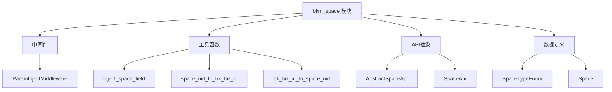
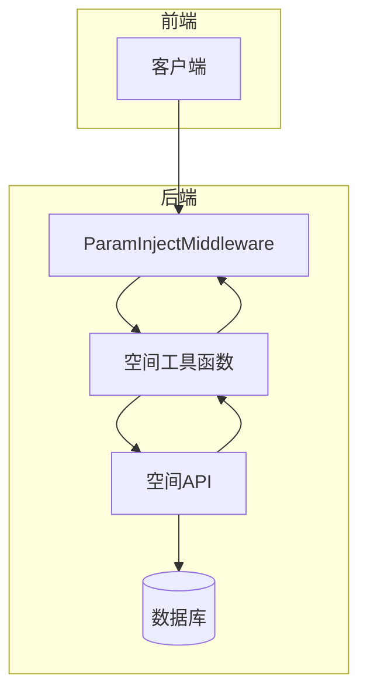
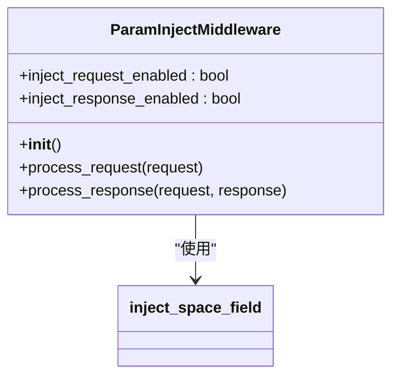
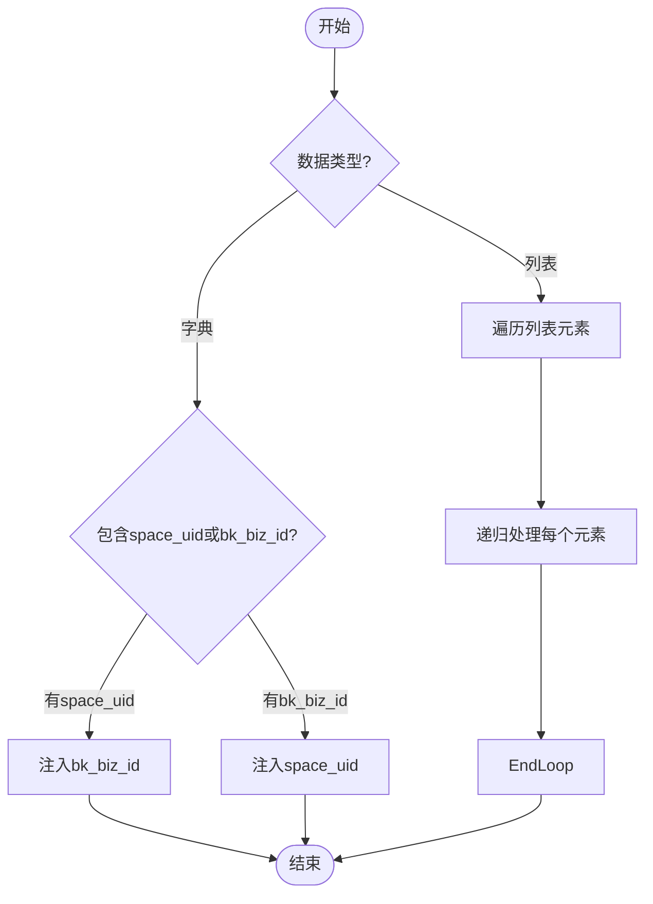
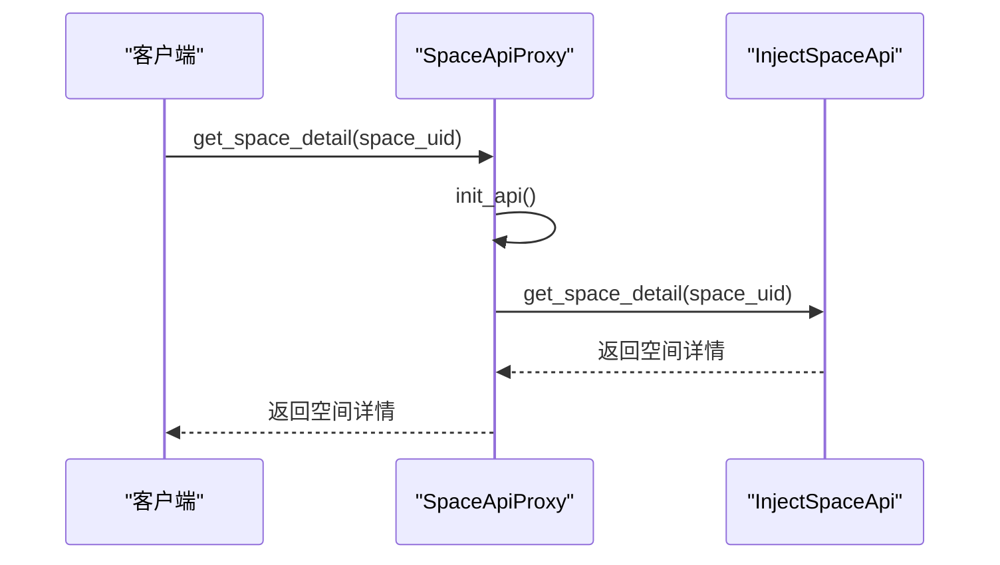
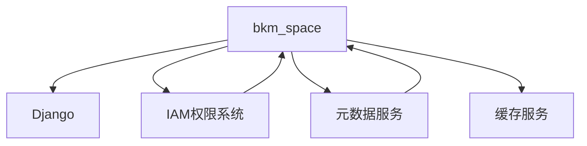

# 空间隔离机制

<cite>
**本文档引用的文件**   
- [README.md](file://bkmonitor/bkm_space/README.md)
- [middleware.py](file://bkmonitor/bkm_space/middleware.py)
- [utils.py](file://bkmonitor/bkm_space/utils.py)
- [api.py](file://bkmonitor/bkm_space/api.py)
- [define.py](file://bkmonitor/bkm_space/define.py)
- [space_api.py](file://bkmonitor/bkmonitor/space/space_api.py)
- [resource.py](file://bkmonitor/bkmonitor/iam/resource.py)
- [permission.py](file://bkmonitor/bkmonitor/iam/permission.py)
- [action.py](file://bkmonitor/bkmonitor/iam/action.py)
</cite>

## 目录
1. [简介](#简介)
2. [项目结构](#项目结构)
3. [核心组件](#核心组件)
4. [架构概述](#架构概述)
5. [详细组件分析](#详细组件分析)
6. [依赖分析](#依赖分析)
7. [性能考量](#性能考量)
8. [故障排除指南](#故障排除指南)
9. [结论](#结论)

## 简介
本文档深入解析了bk-monitor多租户环境下的空间隔离机制。该机制通过`bkm_space`模块实现，为系统提供了强大的多租户支持和权限隔离能力。文档详细阐述了空间模型的设计理念、数据结构、与IAM系统的集成方式，以及跨空间访问的控制策略。

## 项目结构
`bkm_space`模块是实现空间隔离的核心，其结构清晰，职责分明。该模块通过中间件、工具函数和API抽象，实现了请求参数的自动注入和空间信息的统一管理。

**图示来源**
- [middleware.py](file://bkmonitor/bkm_space/middleware.py)
- [utils.py](file://bkmonitor/bkm_space/utils.py)
- [api.py](file://bkmonitor/bkm_space/api.py)
- [define.py](file://bkmonitor/bkm_space/define.py)

## 核心组件
`bkm_space`模块的核心组件包括参数注入中间件、空间字段注入工具和空间API。这些组件协同工作，确保了在多租户环境下，所有请求和响应都能正确地关联到对应的空间。

**组件来源**
- [middleware.py](file://bkmonitor/bkm_space/middleware.py)
- [utils.py](file://bkmonitor/bkm_space/utils.py)
- [api.py](file://bkmonitor/bkm_space/api.py)

## 架构概述
空间隔离机制的架构围绕`bkm_space`模块构建，通过Django中间件在请求处理流程的早期阶段注入空间信息。该架构确保了业务逻辑层无需关心空间上下文的获取，从而简化了代码并提高了安全性。

**图示来源**
- [middleware.py](file://bkmonitor/bkm_space/middleware.py)
- [utils.py](file://bkmonitor/bkm_space/utils.py)
- [space_api.py](file://bkmonitor/bkmonitor/space/space_api.py)

## 详细组件分析

### 参数注入中间件分析
`ParamInjectMiddleware`是空间隔离机制的关键。它在请求处理的早期阶段，自动将`space_uid`和`bk_biz_id`注入到请求参数中，确保了后续业务逻辑的一致性。

**图示来源**
- [middleware.py](file://bkmonitor/bkm_space/middleware.py)
- [utils.py](file://bkmonitor/bkm_space/utils.py)

### 空间字段注入工具分析
`inject_space_field`函数是实现参数双向注入的核心。它通过递归遍历请求数据，根据`space_uid`或`bk_biz_id`的存在情况，自动补充缺失的字段。

**图示来源**
- [utils.py](file://bkmonitor/bkm_space/utils.py)

### 空间API分析
`SpaceApi`是一个代理类，它通过`SpaceApiProxy`动态加载具体的API实现。这种设计模式使得空间API的实现可以灵活替换，而无需修改调用方代码。

**图示来源**
- [api.py](file://bkmonitor/bkm_space/api.py)
- [space_api.py](file://bkmonitor/bkmonitor/space/space_api.py)

## 依赖分析
空间隔离机制依赖于多个核心模块，包括Django框架、IAM权限系统和元数据服务。这些依赖关系确保了系统的完整性和安全性。

**图示来源**
- [settings.py](file://bkmonitor/settings.py)
- [space_api.py](file://bkmonitor/bkmonitor/space/space_api.py)
- [permission.py](file://bkmonitor/bkmonitor/iam/permission.py)

## 性能考量
空间隔离机制对系统性能的影响主要体现在缓存策略和数据库查询上。`InjectSpaceApi`通过本地内存缓存（`local_mem`）显著减少了对数据库的直接访问，从而提高了查询效率。

## 故障排除指南
当遇到空间隔离相关的问题时，应首先检查`BKM_SPACE_INJECT_REQUEST_ENABLED`和`BKM_SPACE_INJECT_RESPONSE_ENABLED`配置项。其次，确认`BKM_SPACE_API_CLASS`指向了正确的API实现类。

**故障排除来源**
- [middleware.py](file://bkmonitor/bkm_space/middleware.py)
- [api.py](file://bkmonitor/bkm_space/api.py)

## 结论
`bkm_space`模块通过精巧的设计，为bk-monitor系统提供了强大而灵活的空间隔离能力。该机制不仅实现了多租户环境下的资源归属和权限边界划分，还通过与IAM系统的深度集成，确保了系统的安全性和可扩展性。