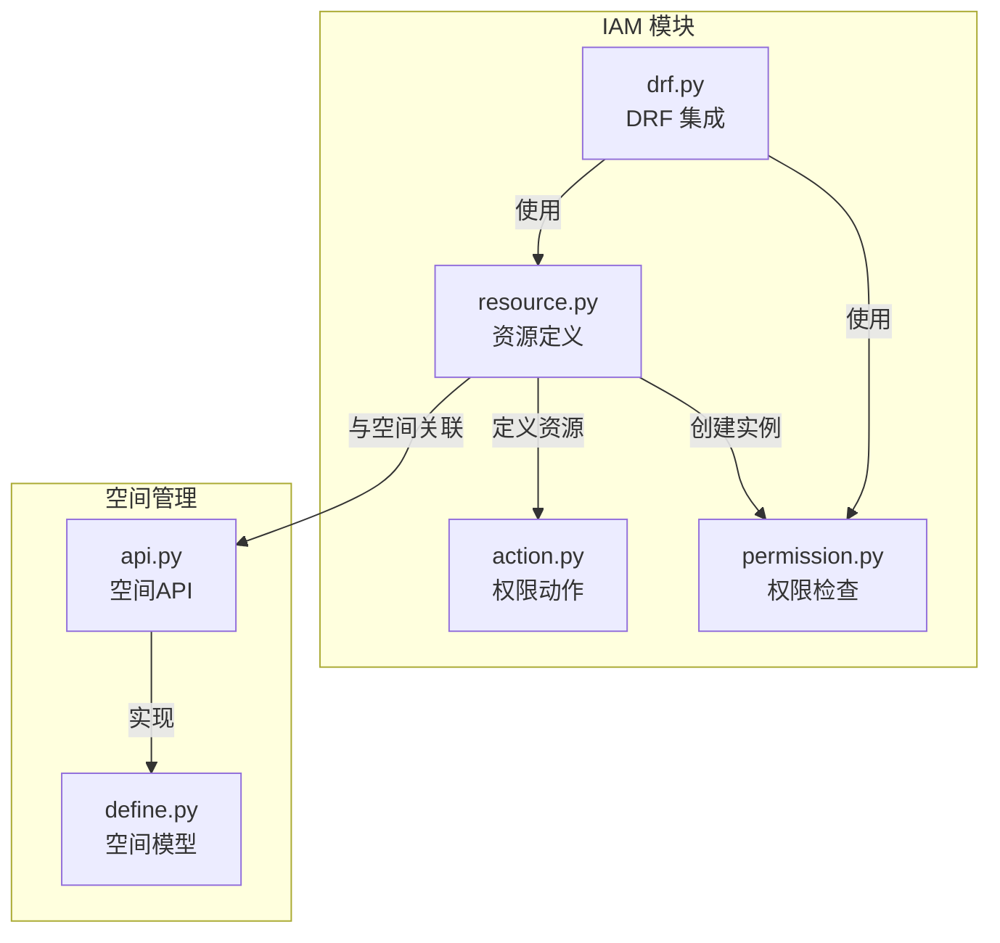
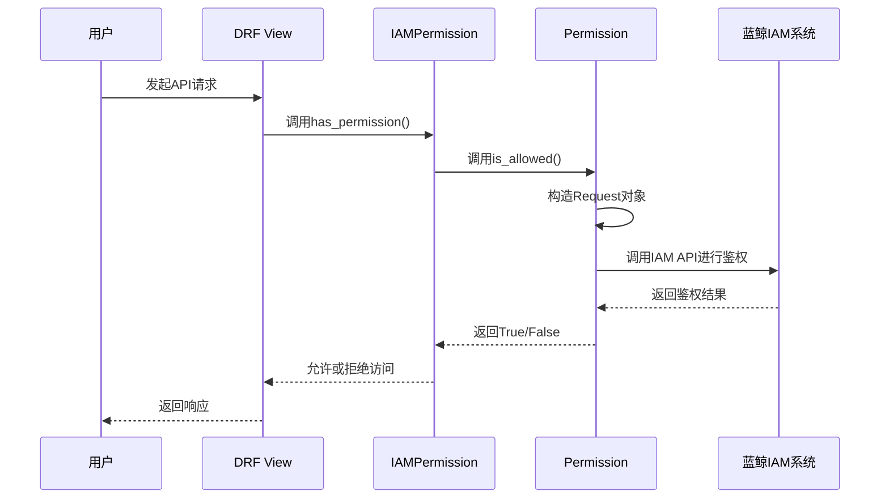
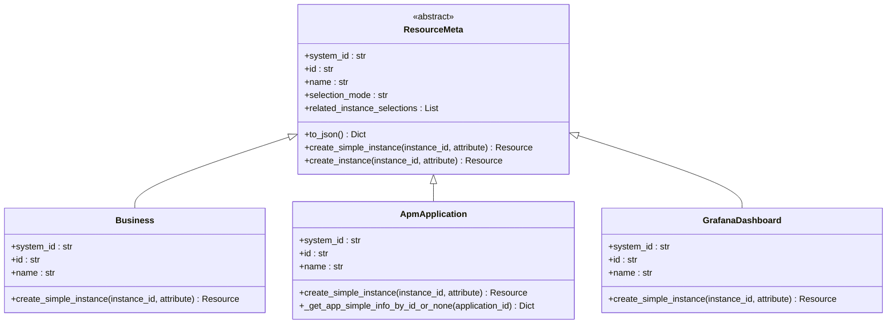
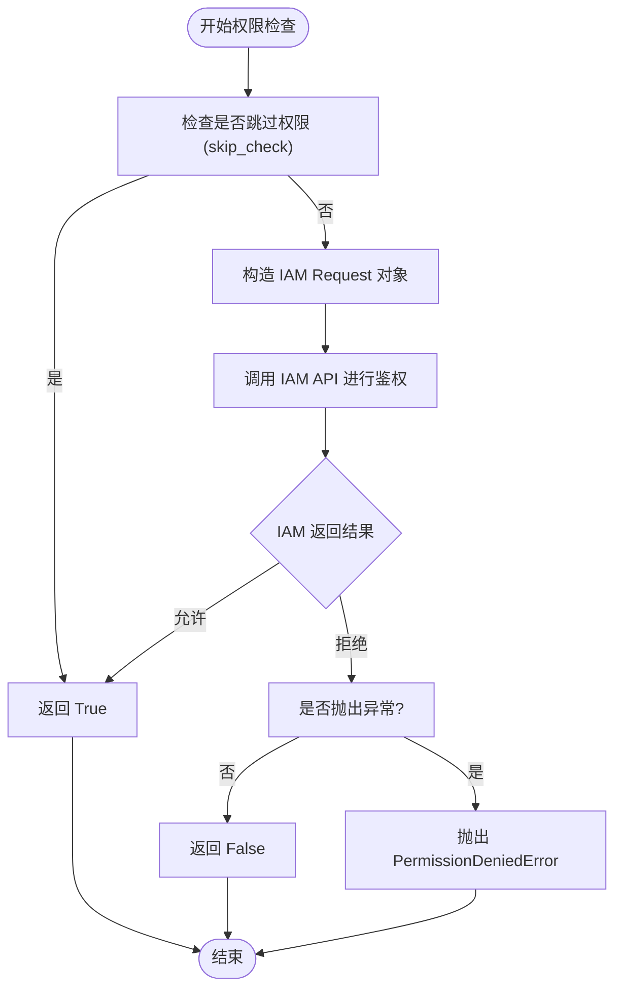

# 资源类型定义

<cite>
**本文档中引用的文件**   
- [resource.py](file://bkmonitor/bkmonitor/iam/resource.py)
- [action.py](file://bkmonitor/bkmonitor/iam/action.py)
- [permission.py](file://bkmonitor/bkmonitor/iam/permission.py)
- [api.py](file://bkmonitor/bkm_space/api.py)
- [define.py](file://bkmonitor/bkm_space/define.py)
- [drf.py](file://bkmonitor/bkmonitor/iam/drf.py)
</cite>

## 目录
1. [简介](#简介)
2. [项目结构](#项目结构)
3. [核心组件](#核心组件)
4. [架构概述](#架构概述)
5. [详细组件分析](#详细组件分析)
6. [依赖分析](#依赖分析)
7. [性能考虑](#性能考虑)
8. [故障排除指南](#故障排除指南)
9. [结论](#结论)

## 简介
本文档详细解析了 `bk-monitor` 项目中基于 IAM（身份与访问管理）的资源模型设计。重点阐述了如何在 `iam/resource.py` 文件中定义资源类型，包括资源标识、名称、描述、归属系统等元数据配置。文档深入解释了资源属性的声明方式，特别是与 `metadata` 模块中 `Space` 模型的关联关系。同时，阐述了资源层级结构的设计原则，如资源的父子关系、继承机制和可见性规则。通过提供自定义资源类型的实现示例、代码片段和配置说明，帮助开发者理解实现细节。此外，还分析了资源注册流程及其在权限评估中的作用，并包含了资源定义的最佳实践和常见错误排查指南。

## 项目结构
`bk-monitor` 项目的结构遵循模块化设计，将不同功能的代码组织在独立的目录中。IAM 相关的代码主要位于 `bkmonitor/iam/` 目录下，其中 `resource.py` 是定义所有资源类型的核心文件。`bkm_space` 模块负责管理“空间”这一核心概念，其 `api.py` 和 `define.py` 文件定义了 `Space` 模型。权限的检查和应用逻辑则分散在 `permission.py` 和 `drf.py` 等文件中。这种结构清晰地分离了资源定义、权限逻辑和业务模型。



**图源**
- [resource.py](file://bkmonitor/bkmonitor/iam/resource.py)
- [action.py](file://bkmonitor/bkmonitor/iam/action.py)
- [permission.py](file://bkmonitor/bkmonitor/iam/permission.py)
- [api.py](file://bkmonitor/bkm_space/api.py)
- [define.py](file://bkmonitor/bkm_space/define.py)
- [drf.py](file://bkmonitor/bkmonitor/iam/drf.py)

**节源**
- [resource.py](file://bkmonitor/bkmonitor/iam/resource.py)
- [api.py](file://bkmonitor/bkm_space/api.py)
- [define.py](file://bkmonitor/bkm_space/define.py)

## 核心组件
`bk-monitor` 的 IAM 资源模型由几个核心组件构成。首先是 `ResourceMeta` 基类，它为所有资源类型提供了统一的元数据结构和实例化方法。其次是具体的资源类，如 `Business`、`ApmApplication` 和 `GrafanaDashboard`，它们继承自 `ResourceMeta` 并定义了各自的特性。`ResourceEnum` 枚举类则集中管理了所有可用的资源类型。`Space` 模型是业务逻辑中的核心实体，而 `Permission` 类则负责与 IAM 系统交互，执行权限检查。这些组件共同协作，实现了细粒度的访问控制。

**节源**
- [resource.py](file://bkmonitor/bkmonitor/iam/resource.py)
- [define.py](file://bkmonitor/bkm_space/define.py)
- [permission.py](file://bkmonitor/bkmonitor/iam/permission.py)

## 架构概述
该系统的权限架构基于蓝鲸 IAM 系统。在 `bk-monitor` 内部，通过 `ResourceMeta` 基类和其子类来声明和定义受保护的资源。这些资源类型在系统启动时通过 `setup_meta` 方法注册到 IAM 系统。当用户发起请求时，`Permission` 类会根据请求上下文（如用户、操作、资源ID）构造一个鉴权请求，并调用 IAM 系统的 API 进行权限评估。`drf.py` 中的权限类（如 `IAMPermission`）将这一过程集成到 Django REST Framework 的权限检查流程中，实现了声明式的权限控制。



**图源**
- [drf.py](file://bkmonitor/bkmonitor/iam/drf.py)
- [permission.py](file://bkmonitor/bkmonitor/iam/permission.py)

## 详细组件分析

### 资源元数据与定义
`ResourceMeta` 是所有资源类型的抽象基类，它定义了资源在 IAM 系统中的元数据。这些元数据包括：
- **system_id**: 资源所属的系统ID，通常从 `settings` 中获取。
- **id**: 资源的唯一标识符，如 `"space"` 或 `"apm_application"`。
- **name**: 资源的中文名称，用于在权限申请页面显示。
- **selection_mode**: 选择模式，通常为 `"instance"`，表示基于实例的权限。
- **related_instance_selections**: 关联的实例视图，定义了在权限申请时如何选择该资源的实例。



**图源**
- [resource.py](file://bkmonitor/bkmonitor/iam/resource.py#L26-L62)

**节源**
- [resource.py](file://bkmonitor/bkmonitor/iam/resource.py#L26-L62)

### 资源类型实现与属性关联
具体的资源类通过继承 `ResourceMeta` 并重写其方法来实现特定的逻辑。一个关键的重写是 `create_simple_instance` 方法，它负责将一个简单的ID转换为一个包含丰富属性的 `Resource` 实例。

以 `Business` 资源为例，其 `id` 为 `"space"`，这表明在 `bk-monitor` 中，“业务”概念已被“空间”（Space）所取代。`create_simple_instance` 方法会尝试将传入的 `instance_id`（可能是 `bk_biz_id` 或 `space_uid`）转换为 `Space` 对象，并从中提取 `space_name` 作为资源的显示名称，从而实现了与 `bkm_space` 模块的 `Space` 模型的关联。

```python
# resource.py 片段
class Business(ResourceMeta):
    id = "space"
    name = _lazy("空间")

    @classmethod
    def create_simple_instance(cls, instance_id: str, attribute=None) -> Resource:
        # ... 转换逻辑 ...
        space = space_api.SpaceApi.get_space_detail(...) # 调用 bkm_space API
        space_name = f"[{space.space_type_id}] {space.space_name}"
        attribute.update({"id": bk_biz_id, "name": space_name})
        return Resource(cls.system_id, cls.id, bk_biz_id, attribute)
```

`ApmApplication` 和 `GrafanaDashboard` 资源也采用了类似的方式，通过查询各自的数据库模型（`Application` 和 `Dashboard`）来获取应用名称或仪表盘标题，并将其作为资源实例的 `name` 属性。这确保了权限系统中显示的资源名称与业务系统中的名称保持一致。

**节源**
- [resource.py](file://bkmonitor/bkmonitor/iam/resource.py#L65-L189)
- [api.py](file://bkmonitor/bkm_space/api.py)
- [define.py](file://bkmonitor/bkm_space/define.py)

### 资源层级与可见性
`bk-monitor` 的资源模型设计了一个隐式的层级结构。`Business`（即 `Space`）资源是顶层资源。其他资源，如 `ApmApplication` 和 `GrafanaDashboard`，在创建其实例时，会通过 `_bk_iam_path_` 属性明确指定其父资源路径。

例如，在 `ApmApplication.create_simple_instance` 方法中，有如下代码：
```python
"_bk_iam_path_": "/{},{}/".format(Business.id, app_simple_info["bk_biz_id"])
```
这行代码构建了一个路径 `/space,123/`，清晰地表明了该 APM 应用实例属于 ID 为 `123` 的空间。这种设计使得 IAM 系统能够理解资源之间的父子关系，从而支持基于路径的权限继承和更复杂的权限策略。

### 资源注册与权限评估
所有定义的资源类型最终都会被注册到 IAM 系统中。这个过程由 `permission.py` 文件中的 `setup_meta` 类方法完成。

```python
# permission.py 片段
@classmethod
def setup_meta(cls):
    # ... 其他代码 ...
    # 注册资源
    for r in _all_resources.values():
        setup_resource(r.system_id, r.id, r.name)
    # ... 其他代码 ...
```
`_all_resources` 字典是通过扫描 `ResourceEnum` 枚举类动态构建的，它包含了所有可用的资源类型。`setup_resource` 函数会调用 IAM 的 API，将这些资源元数据同步到 IAM 系统。

在权限评估阶段，`Permission` 类的 `is_allowed` 方法会使用 `make_request` 构造一个请求对象，然后调用 IAM 客户端进行鉴权。这个过程是权限控制的核心。



**图源**
- [permission.py](file://bkmonitor/bkmonitor/iam/permission.py#L409-L448)

**节源**
- [permission.py](file://bkmonitor/bkmonitor/iam/permission.py#L409-L448)

## 依赖分析
`bk-monitor` 的 IAM 资源模型依赖于多个内部和外部模块。其核心依赖关系如下图所示。

```mermaid
graph TD
IAM[蓝鲸IAM系统] < --> |API调用| Permission[permission.py]
Permission --> |使用| Resource[resource.py]
Resource --> |继承| abc[abc模块]
Resource --> |使用| settings[settings]
Resource --> |使用| iam[iam模块]
Resource --> |使用| space_api[bkm_space.api]
Resource --> |使用| Dashboard[bk_dataview.models]
ResourceEnum[ResourceEnum] --> |枚举| Business
ResourceEnum --> |枚举| ApmApplication
ResourceEnum --> |枚举| GrafanaDashboard
Business --> |实现| ResourceMeta
ApmApplication --> |实现| ResourceMeta
GrafanaDashboard --> |实现| ResourceMeta
space_api --> |实现| SpaceApiProxy
SpaceApiProxy --> |代理| AbstractSpaceApi
AbstractSpaceApi --> |返回| Space[Space模型]
Space --> |定义| define[define.py]
```

**图源**
- [resource.py](file://bkmonitor/bkmonitor/iam/resource.py)
- [permission.py](file://bkmonitor/bkmonitor/iam/permission.py)
- [api.py](file://bkmonitor/bkm_space/api.py)
- [define.py](file://bkmonitor/bkm_space/define.py)

## 性能考虑
在资源实例化过程中，频繁的数据库查询可能成为性能瓶颈。为此，代码中采用了缓存策略。例如，`ApmApplication` 类使用了 `@lru_cache_with_ttl` 装饰器对 `_get_app_simple_info_by_id_or_none` 方法进行缓存，将应用的概要信息缓存60分钟，从而避免了对 `Application` 模型的重复查询，显著提升了鉴权性能。这是一个重要的性能优化实践。

## 故障排除指南
在开发和维护基于 IAM 的资源模型时，可能会遇到以下常见问题：

1.  **权限申请页面看不到资源**：请检查 `setup_meta` 方法是否被正确调用，确保 `setup_resource` 函数成功将资源注册到了 IAM 系统。可以查看系统日志确认注册过程是否成功。
2.  **资源实例名称显示不正确**：检查对应资源类的 `create_simple_instance` 方法。确保其内部的数据库查询逻辑正确，并且能成功获取到 `name` 属性。如果关联的模型（如 `Space`）查询失败，应有合理的默认值处理。
3.  **权限检查始终失败**：首先确认用户是否拥有相应的权限策略。其次，检查 `Permission` 类构造的 `Request` 对象中的 `action`、`resources` 和 `subject` 是否正确。可以使用 `to_json()` 方法打印出请求对象进行调试。
4.  **资源路径错误导致继承失效**：对于有层级关系的资源，务必在 `create_simple_instance` 方法中正确设置 `_bk_iam_path_` 属性，确保其格式为 `/父资源ID,父实例ID/`。

**节源**
- [resource.py](file://bkmonitor/bkmonitor/iam/resource.py)
- [permission.py](file://bkmonitor/bkmonitor/iam/permission.py)

## 结论
`bk-monitor` 的 IAM 资源模型设计精巧，通过 `ResourceMeta` 基类和继承机制，实现了对各类资源的统一管理和灵活扩展。它与 `bkm_space` 模块的 `Space` 模型紧密结合，构建了一个以“空间”为核心的权限体系。通过 `ResourceEnum` 枚举和 `_all_resources` 字典，实现了资源的集中注册和管理。整个设计不仅满足了细粒度权限控制的需求，还通过缓存等手段考虑了性能优化。理解这一模型对于开发和维护 `bk-monitor` 的权限功能至关重要。