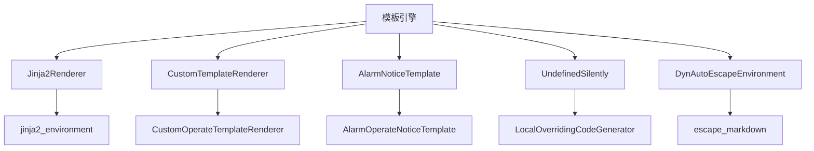
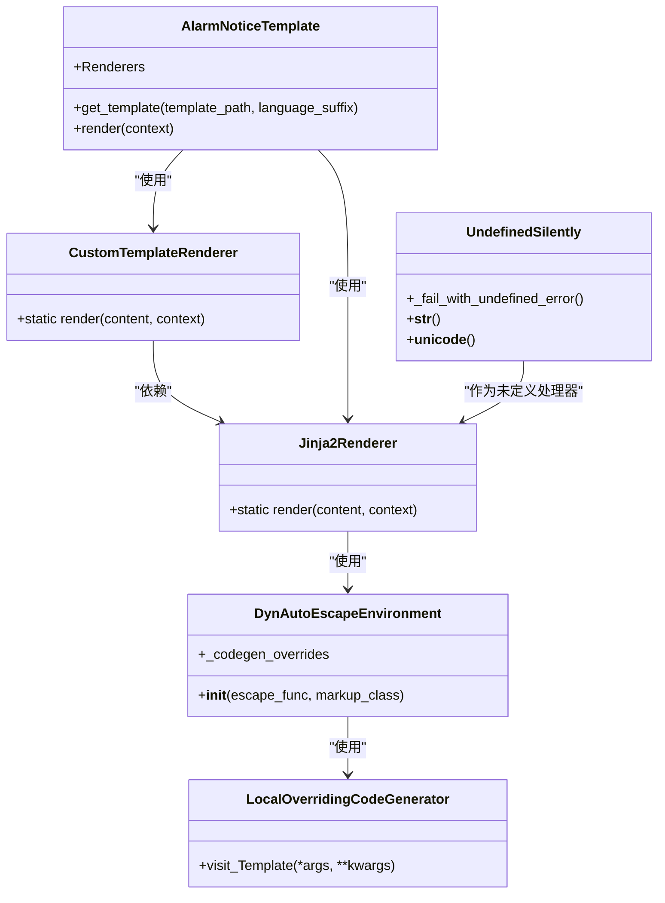
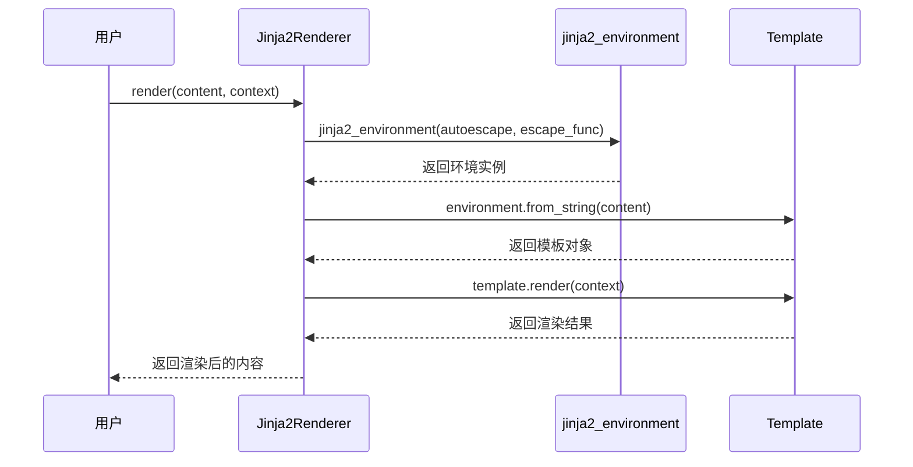
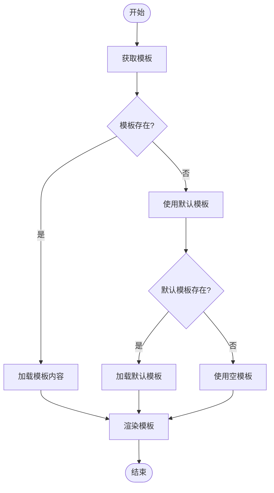
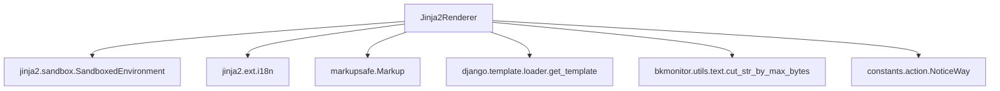

# 模板引擎

<cite>
**本文档引用的文件**   
- [template.py](file://bkmonitor/bkmonitor/utils/template.py#L0-L409)
</cite>

## 目录
1. [简介](#简介)
2. [项目结构](#项目结构)
3. [核心组件](#核心组件)
4. [架构概述](#架构概述)
5. [详细组件分析](#详细组件分析)
6. [依赖分析](#依赖分析)
7. [性能考虑](#性能考虑)
8. [故障排除指南](#故障排除指南)
9. [结论](#结论)

## 简介
本文档系统性地介绍了蓝鲸监控平台（BlueKing - Monitor）中基于Jinja2的动态配置生成机制。文档详细说明了模板文件的组织结构和目录布局，解释了模板变量的定义和作用域规则。通过分析模板渲染流程，包括变量替换、条件判断和循环处理等核心功能的实现，为开发者提供了深入的理解。文档还描述了内置过滤器和函数的使用方法，如字符串处理、数学运算和数据格式化等。此外，提供了模板开发的最佳实践，包括模板继承、宏定义和代码复用策略，并包含了模板调试技巧，如语法错误定位、变量值查看和渲染性能优化。

## 项目结构
蓝鲸监控平台的项目结构遵循典型的Django应用布局，核心模板引擎功能位于`bkmonitor/bkmonitor/utils/template.py`文件中。该文件实现了基于Jinja2的模板渲染系统，支持对象级别的模板渲染和自定义转义函数。项目中存在多个与模板相关的模块，如`alarm_backends`、`api`、`bkm_ipchooser`等，它们都依赖于核心模板引擎进行动态内容生成。

**图表来源**
- [template.py](file://bkmonitor/bkmonitor/utils/template.py#L0-L409)

**本节来源**
- [template.py](file://bkmonitor/bkmonitor/utils/template.py#L0-L409)

## 核心组件
模板引擎的核心组件包括`Jinja2Renderer`、`CustomTemplateRenderer`、`AlarmNoticeTemplate`和`UndefinedSilently`类。`Jinja2Renderer`是主要的渲染器，负责将模板字符串与上下文数据结合生成最终内容。`CustomTemplateRenderer`提供了自定义模板渲染功能，支持内容和标题的独立渲染。`AlarmNoticeTemplate`是通知模板的基类，定义了模板渲染的基本流程。`UndefinedSilently`类用于处理未定义变量，避免渲染过程中出现错误。

**本节来源**
- [template.py](file://bkmonitor/bkmonitor/utils/template.py#L0-L409)

## 架构概述
模板引擎的架构基于Jinja2沙箱环境，通过`SandboxedEnvironment`确保渲染过程的安全性。引擎支持自动转义和自定义转义函数，如`escape_markdown`，用于处理Markdown格式的文本。`DynAutoEscapeEnvironment`类扩展了Jinja2环境，允许动态覆盖转义函数。`jinja2_environment`函数负责创建和配置Jinja2环境实例，设置未定义变量处理器和国际化扩展。

**图表来源**
- [template.py](file://bkmonitor/bkmonitor/utils/template.py#L0-L409)

## 详细组件分析
### Jinja2Renderer 分析
`Jinja2Renderer`是模板引擎的核心，负责执行模板渲染。它通过`jinja2_environment`函数创建Jinja2环境，并使用该环境从字符串创建模板对象。渲染过程中，上下文数据与模板结合，生成最终的文本内容。`Jinja2Renderer`支持JSON和正则表达式函数，增强了模板的灵活性。

**图表来源**
- [template.py](file://bkmonitor/bkmonitor/utils/template.py#L0-L409)

**本节来源**
- [template.py](file://bkmonitor/bkmonitor/utils/template.py#L0-L409)

### AlarmNoticeTemplate 分析
`AlarmNoticeTemplate`类提供了通知模板的渲染功能。它支持多种渲染器，包括`CustomTemplateRenderer`和`Jinja2Renderer`。当模板路径不存在时，会尝试加载默认模板。`get_template_source`方法用于获取模板文件的原始内容，`get_default_path`方法用于生成默认模板路径。

**图表来源**
- [template.py](file://bkmonitor/bkmonitor/utils/template.py#L0-L409)

**本节来源**
- [template.py](file://bkmonitor/bkmonitor/utils/template.py#L0-L409)

## 依赖分析
模板引擎依赖于多个外部库和内部模块。主要依赖包括Jinja2库用于模板渲染，Django框架用于模板加载和国际化，以及Markupsafe库用于安全的字符串处理。内部依赖包括`bkmonitor.utils.text`模块用于文本处理，`constants.action`模块用于通知方式定义。

**图表来源**
- [template.py](file://bkmonitor/bkmonitor/utils/template.py#L0-L409)

**本节来源**
- [template.py](file://bkmonitor/bkmonitor/utils/template.py#L0-L409)

## 性能考虑
模板引擎通过缓存机制和高效的字符串处理来优化性能。`jinja_render`函数支持递归渲染，能够处理嵌套的字典和列表结构。`escape_markdown`函数使用正则表达式进行字符转义，提高了处理效率。`UndefinedSilently`类避免了未定义变量导致的异常，减少了错误处理开销。

## 故障排除指南
在使用模板引擎时，常见的问题包括模板路径错误、上下文数据缺失和语法错误。可以通过检查模板文件是否存在、验证上下文数据的完整性以及使用Jinja2的调试工具来定位问题。`CustomTemplateRenderer`中的异常处理机制可以捕获渲染错误，并提供默认模板作为回退方案。

**本节来源**
- [template.py](file://bkmonitor/bkmonitor/utils/template.py#L0-L409)

## 结论
蓝鲸监控平台的模板引擎基于Jinja2构建，提供了安全、灵活和高效的模板渲染功能。通过`Jinja2Renderer`、`CustomTemplateRenderer`和`AlarmNoticeTemplate`等核心组件，实现了复杂的动态内容生成需求。引擎支持自动转义、自定义过滤器和多级渲染器，满足了不同场景下的使用要求。未来可以进一步优化性能，增加更多的内置函数和过滤器，提升开发者的使用体验。