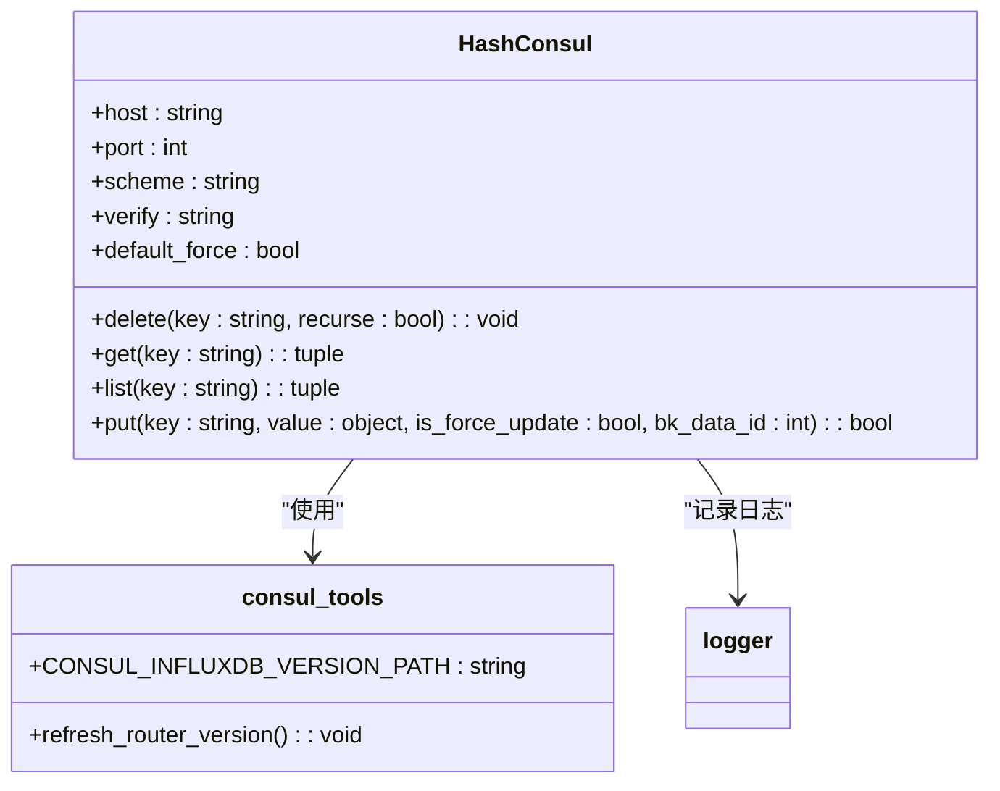
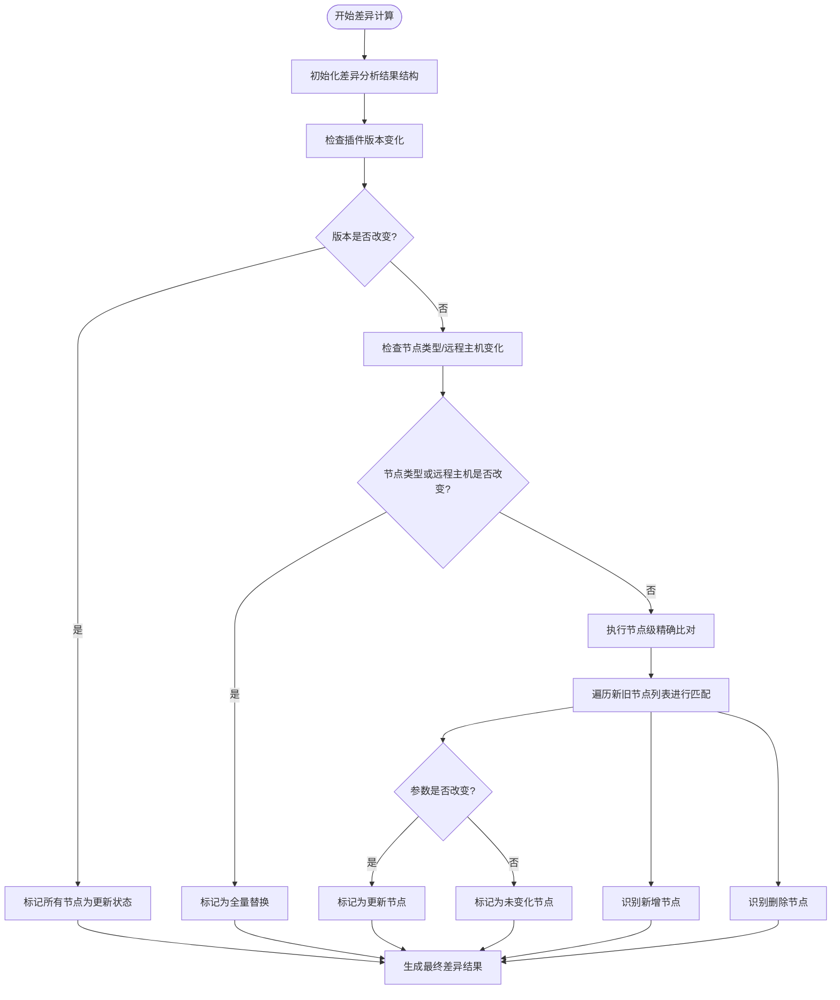
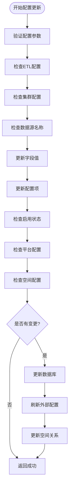
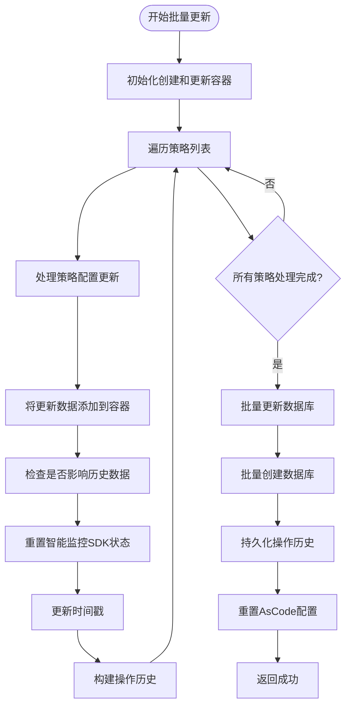

# 热更新机制

<cite>
**本文档引用的文件**   
- [bkmonitor\metadata\utils\consul_tools.py](file://bkmonitor\metadata\utils\consul_tools.py)
- [bkmonitor\packages\monitor_web\models\collecting.py](file://bkmonitor\packages\monitor_web\models\collecting.py)
- [bkmonitor\packages\monitor_web\collecting\deploy\node_man.py](file://bkmonitor\packages\monitor_web\collecting\deploy\node_man.py)
- [bkmonitor\packages\monitor_web\strategies\resources\v2.py](file://bkmonitor\packages\monitor_web\strategies\resources\v2.py)
- [bkmonitor\metadata\models\data_source.py](file://bkmonitor\metadata\models\data_source.py)
- [bkmonitor\bkmonitor\management\commands\kube_state_analysis.py](file://bkmonitor\bkmonitor\management\commands\kube_state_analysis.py)
</cite>

## 目录
1. [引言](#引言)
2. [配置监听机制](#配置监听机制)
3. [配置差异计算](#配置差异计算)
4. [增量生效策略](#增量生效策略)
5. [可靠性保障措施](#可靠性保障措施)
6. [性能优化建议](#性能优化建议)
7. [结论](#结论)

## 引言
蓝鲸监控平台（bk-monitor）的热更新机制是一套完整的配置动态生效解决方案，旨在实现系统配置变更时无需重启服务即可实时生效。该机制通过结合Consul配置中心的长轮询和本地文件系统的inotify监控，实现了高可靠、高性能的配置更新流程。本文档将深入解析热更新机制的核心组件，包括配置监听、差异计算、增量生效、可靠性保障和性能优化等方面，为开发者和运维人员提供全面的技术参考。

## 配置监听机制

热更新机制的配置监听主要依赖于Consul配置中心的长轮询机制和本地文件系统的inotify监控。Consul工具类`HashConsul`提供了配置更新的核心功能，通过MD5哈希比对实现变更检测，有效降低了不必要的配置刷新频率。



**图示来源**
- [bkmonitor\metadata\utils\consul_tools.py](file://bkmonitor\metadata\utils\consul_tools.py#L0-L149)

**本节来源**
- [bkmonitor\metadata\utils\consul_tools.py](file://bkmonitor\metadata\utils\consul_tools.py#L0-L149)

## 配置差异计算

配置差异计算是热更新机制的核心环节，通过精确识别配置项的新增、修改和删除状态，实现增量更新。采集配置模型中的`show_diff`方法实现了多维度的差异分析，包括插件版本、采集参数、远程主机和节点列表等。



**图示来源**
- [bkmonitor\packages\monitor_web\models\collecting.py](file://bkmonitor\packages\monitor_web\models\collecting.py#L440-L523)

**本节来源**
- [bkmonitor\packages\monitor_web\models\collecting.py](file://bkmonitor\packages\monitor_web\models\collecting.py#L440-L523)

## 增量生效策略

增量生效策略通过节点管理部署实现，根据配置差异结果执行相应的操作类型（创建、更新、替换）。`NodeManInstaller`类的`_deploy`方法是增量生效的核心，它根据操作类型调用节点管理API创建、更新或替换订阅任务。

```mermaid
sequenceDiagram
participant Installer as "NodeManInstaller"
participant API as "节点管理API"
participant DB as "数据库"
Installer->>Installer : 检查现有部署配置
Installer->>Installer : 分析配置差异
Installer->>Installer : 确定操作类型
alt 创建新订阅
Installer->>API : create_subscription()
API-->>Installer : subscription_id, task_id
else 更新现有订阅
Installer->>API : update_subscription()
API-->>Installer : task_id
else 替换旧订阅
Installer->>API : create_subscription()
API-->>Installer : subscription_id, task_id
Installer->>API : switch_subscription(disable)
Installer->>API : run_subscription(UNINSTALL)
Installer->>API : delete_subscription()
end
alt 自动巡检启用
Installer->>API : switch_subscription(enable)
end
Installer->>DB : 持久化部署版本信息
Installer-->> : 返回差异节点信息
```

**图示来源**
- [bkmonitor\packages\monitor_web\collecting\deploy\node_man.py](file://bkmonitor\packages\monitor_web\collecting\deploy\node_man.py#L250-L449)

**本节来源**
- [bkmonitor\packages\monitor_web\collecting\deploy\node_man.py](file://bkmonitor\packages\monitor_web\collecting\deploy\node_man.py#L250-L449)

## 可靠性保障措施

热更新机制通过配置校验、事务性更新和回滚机制确保配置变更的可靠性。数据源模型的`update_config`方法实现了事务性更新，通过标志位`is_change`确保只有实际发生变更时才提交数据库更新。



回滚机制通过策略历史记录实现，`rollback`函数从`StrategyHistoryModel`中获取历史配置并重新应用，确保系统可以快速恢复到先前状态。

```mermaid
sequenceDiagram
participant Rollback as "回滚函数"
participant DB as "数据库"
participant Strategy as "策略对象"
Rollback->>DB : 查询策略历史记录
DB-->>Rollback : 返回历史记录
Rollback->>Strategy : 创建策略实例
Rollback->>DB : 删除当前查询配置
DB-->>Rollback : 删除结果
Rollback->>Strategy : 保存历史配置
Strategy-->> : 回滚完成
```

**图示来源**
- [bkmonitor\metadata\models\data_source.py](file://bkmonitor\metadata\models\data_source.py#L880-L1279)
- [bkmonitor\bkmonitor\management\commands\kube_state_analysis.py](file://bkmonitor\bkmonitor\management\commands\kube_state_analysis.py#L340-L365)

**本节来源**
- [bkmonitor\metadata\models\data_source.py](file://bkmonitor\metadata\models\data_source.py#L880-L1279)
- [bkmonitor\bkmonitor\management\commands\kube_state_analysis.py](file://bkmonitor\bkmonitor\management\commands\kube_state_analysis.py#L340-L365)

## 性能优化建议

热更新机制通过批量更新、变更合并和异步处理等技术手段优化性能。策略资源中的`perform_request`方法使用Django的`bulk_update`和`bulk_create`方法实现批量数据库操作，显著提升了更新效率。



**图示来源**
- [bkmonitor\packages\monitor_web\strategies\resources\v2.py](file://bkmonitor\packages\monitor_web\strategies\resources\v2.py#L2800-L2999)

**本节来源**
- [bkmonitor\packages\monitor_web\strategies\resources\v2.py](file://bkmonitor\packages\monitor_web\strategies\resources\v2.py#L2800-L2999)

## 结论
bk-monitor的热更新机制通过多层次的技术组合，实现了高效、可靠的配置动态生效。从Consul配置中心的长轮询监听，到精确的配置差异计算，再到智能的增量生效策略，整个流程设计严谨，考虑周全。同时，通过事务性更新、回滚机制和批量操作等手段，确保了系统的稳定性和性能。这套机制不仅适用于监控系统的配置更新，也为其他需要热更新功能的系统提供了有价值的参考实现。