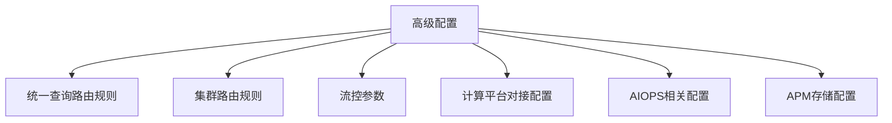
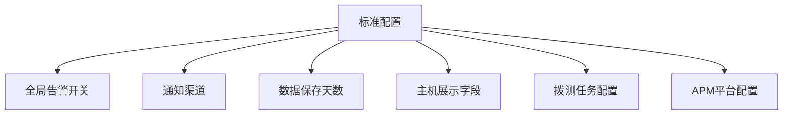
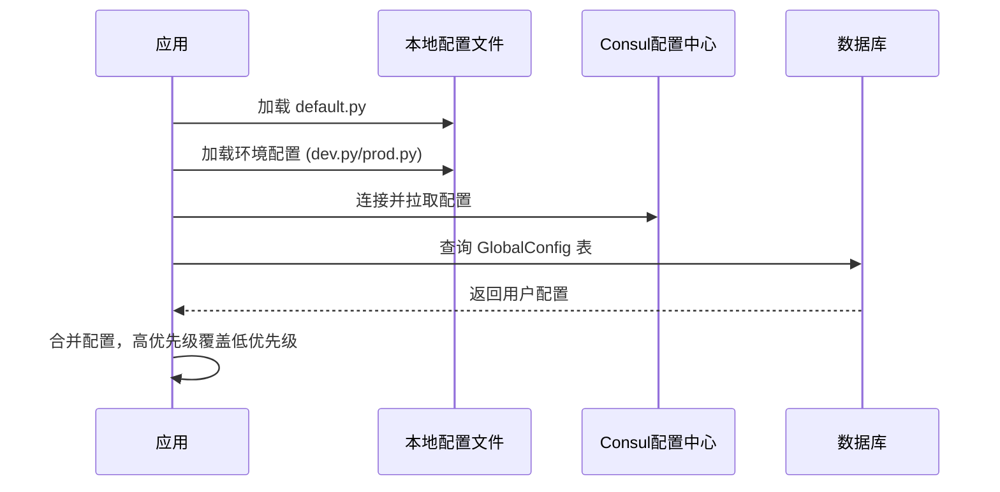

# 配置管理

<cite>
**本文档引用文件**  
- [default.py](file://bkmonitor/config/default.py)
- [dev.py](file://bkmonitor/config/dev.py)
- [prod.py](file://bkmonitor/config/prod.py)
- [consul.py](file://bkmonitor/config/tools/consul.py)
- [consul.py](file://bkmonitor/bkmonitor/utils/consul.py)
- [global_config.py](file://bkmonitor/bkmonitor/define/global_config.py)
- [models.py](file://bkmonitor/bkmonitor/models/config.py)
</cite>

## 目录
1. [引言](#引言)
2. [配置存储结构](#配置存储结构)
3. [配置项分类管理](#配置项分类管理)
4. [配置加载流程](#配置加载流程)
5. [配置命名规范与类型定义](#配置命名规范与类型定义)
6. [配置管理最佳实践](#配置管理最佳实践)
7. [结论](#结论)

## 引言

蓝鲸监控平台（BlueKing Monitor）提供了一套完善的多层级配置管理体系，支持本地配置文件、Consul配置中心和数据库持久化三种存储方式。该体系为监控采集、告警处理、数据存储等核心功能模块提供了灵活且可靠的配置管理能力。本文档旨在深入介绍该配置管理体系的架构设计、实现细节和最佳实践，帮助用户全面理解并有效使用平台的配置功能。

## 配置存储结构

蓝鲸监控平台采用多层级配置存储结构，通过优先级机制确保配置的灵活性和可靠性。配置项的存储方式按优先级从高到低依次为：数据库持久化、Consul配置中心、本地配置文件。

### 本地配置文件

本地配置文件是配置体系的基础，定义了所有配置项的默认值和初始设置。主要配置文件位于 `bkmonitor/config/` 目录下，包括：

- **default.py**: 定义了所有环境通用的默认配置，如操作系统路径、预设数据ID、平台开关等。
- **dev.py**: 开发环境专用配置，覆盖 `default.py` 中的部分设置，如数据库连接、消息队列地址等。
- **prod.py**: 生产环境专用配置，通常只包含环境标识，大部分配置继承自 `default.py`。

```python
# 示例：default.py 中的数据库配置
DATABASES = {
    "default": {
        "ENGINE": "django.db.backends.mysql",
        "NAME": APP_CODE,
        "USER": "root",
        "PASSWORD": "",
        "HOST": "localhost",
        "PORT": "3306",
    },
}
```

**Section sources**
- [default.py](file://bkmonitor/config/default.py#L1-L1631)
- [dev.py](file://bkmonitor/config/dev.py#L1-L75)
- [prod.py](file://bkmonitor/config/prod.py#L1-L24)

### Consul配置中心

Consul配置中心用于在分布式环境中动态管理配置，支持配置的热更新和版本控制。平台通过 `bkmonitor/utils/consul.py` 模块与Consul交互，实现配置的读取和写入。

```python
class BKConsul(consul.Consul):
    def __init__(self, using_settings=True, scheme="http", verify=None, cert=None, port=8500, **kwargs):
        # 从Django settings中读取Consul连接信息
        host = get_settings("CONSUL_CLIENT_HOST")
        port = get_settings("CONSUL_CLIENT_PORT")
        # ... 其他初始化逻辑
        super(BKConsul, self).__init__(scheme=scheme, verify=verify, cert=cert, port=port, **kwargs)
```

**Section sources**
- [consul.py](file://bkmonitor/config/tools/consul.py#L1-L36)
- [consul.py](file://bkmonitor/bkmonitor/utils/consul.py#L1-L94)

### 数据库持久化

数据库持久化是最高优先级的配置存储方式，用于存储用户在运行时动态修改的配置项。配置项存储在 `bkmonitor_globalconfig` 表中，通过 `GlobalConfig` 模型进行管理。

```python
# global_config.py 中定义了所有可持久化的配置项
GLOBAL_CONFIGS = list(ADVANCED_OPTIONS.keys()) + list(STANDARD_CONFIGS.keys())

def init_or_update_global_config(GlobalConfig):
    for config_key in GLOBAL_CONFIGS:
        # ... 初始化或更新数据库中的配置项
        config.save()
```

**Section sources**
- [global_config.py](file://bkmonitor/bkmonitor/define/global_config.py#L1-L703)

## 配置项分类管理

平台将配置项分为高级配置和标准配置两大类，分别对应不同的管理方式和用户可见性。

### 高级配置 (ADVANCED_OPTIONS)

高级配置主要用于系统内部参数和性能调优，不提供用户配置页面。这些配置项通常由运维人员通过数据库或API直接修改。



**Diagram sources**
- [global_config.py](file://bkmonitor/bkmonitor/define/global_config.py#L1-L199)

### 标准配置 (STANDARD_CONFIGS)

标准配置面向平台用户，提供友好的配置界面。用户可以通过Web界面修改这些配置项，修改后的值将持久化到数据库中。



**Diagram sources**
- [global_config.py](file://bkmonitor/bkmonitor/define/global_config.py#L400-L702)

## 配置加载流程

配置加载流程从应用启动时的初始化开始，贯穿整个运行周期，支持运行时的动态加载。

### 初始化流程

应用启动时，配置加载遵循以下顺序：
1. 加载本地配置文件（`default.py` -> `dev.py` 或 `prod.py`）
2. 从Consul配置中心拉取配置
3. 从数据库加载用户自定义配置



**Diagram sources**
- [default.py](file://bkmonitor/config/default.py#L1-L1631)
- [consul.py](file://bkmonitor/bkmonitor/utils/consul.py#L1-L94)
- [global_config.py](file://bkmonitor/bkmonitor/define/global_config.py#L1-L703)

### 动态加载机制

对于存储在数据库中的配置项，平台提供了动态加载机制。当配置项被修改时，系统会自动更新内存中的配置缓存，无需重启应用。

```python
def init_or_update_global_config(GlobalConfig):
    for config_key in GLOBAL_CONFIGS:
        try:
            config = GlobalConfig.objects.get(key=config_key)
        except GlobalConfig.DoesNotExist:
            # 创建新配置项
            config = GlobalConfig(key=config_key, value=serializer.default)
            config.save()
        else:
            # 更新现有配置项
            if config.value != serializer.default:
                continue
            config.value = serializer.default
            config.save()
```

**Section sources**
- [global_config.py](file://bkmonitor/bkmonitor/define/global_config.py#L600-L702)

## 配置命名规范与类型定义

### 命名规范

配置项命名遵循以下规范：
- 使用全大写字母和下划线分隔单词
- 高级配置以 `BK_DATA_`、`APM_` 等功能模块前缀开头
- 标准配置以 `ENABLE_`、`IS_` 等语义化前缀开头
- 预设数据ID以 `_DATAID` 结尾

### 类型定义

配置项支持多种数据类型，通过Django REST framework的序列化器定义：

```python
ADVANCED_OPTIONS = OrderedDict([
    ("UNIFY_QUERY_ROUTING_RULES", slz.ListField(label="统一查询路由规则", default=[])),
    ("FRONTEND_REPORT_DATA_ID", slz.IntegerField(label="前端上报数据ID", default=0)),
    ("FRONTEND_REPORT_DATA_TOKEN", slz.CharField(label="前端上报数据Token", default="")),
    ("HEALTHZ_ALARM_CONFIG", slz.JSONField(label="healthz告警配置", default={}, binary=True)),
    ("ENABLE_MESSAGE_QUEUE", slz.BooleanField(label="是否开启告警通知队列", default=True)),
])
```

**Section sources**
- [global_config.py](file://bkmonitor/bkmonitor/define/global_config.py#L1-L703)

## 配置管理最佳实践

### 敏感信息加密存储

平台使用对称和非对称加密算法保护敏感信息，如API密钥、数据库密码等。

```python
# 加密配置
BKCRYPTO = {
    "ASYMMETRIC_CIPHER_TYPE": ASYMMETRIC_CIPHER_TYPE,
    "SYMMETRIC_CIPHER_TYPE": SYMMETRIC_CIPHER_TYPE,
    "SYMMETRIC_CIPHERS": {
        "default": {
            "get_key_config": "bkmonitor.utils.db.fields.get_key_config",
            "cipher_options": {
                constants.SymmetricCipherType.AES.value: AESSymmetricOptions(
                    enable_iv=True,
                    key_size=32,
                    iv=None,
                    convertor=SymmetricConverter,
                    mode=constants.SymmetricMode.CBC,
                ),
            },
        },
    },
}
```

**Section sources**
- [default.py](file://bkmonitor/config/default.py#L1200-L1400)

### 配置版本控制

通过Consul配置中心和数据库记录，实现配置的版本控制和回滚能力。每次配置变更都会记录操作日志，便于审计和追踪。

### 环境隔离策略

采用分层配置文件策略实现环境隔离：
- `default.py`：通用配置
- `dev.py`：开发环境配置
- `prod.py`：生产环境配置

不同环境使用不同的配置文件，确保配置的独立性和安全性。

**Section sources**
- [dev.py](file://bkmonitor/config/dev.py#L1-L75)
- [prod.py](file://bkmonitor/config/prod.py#L1-L24)

## 结论

蓝鲸监控平台的多层级配置管理体系设计合理，功能完善。通过本地配置、Consul配置中心和数据库持久化三种存储方式的有机结合，实现了配置的灵活性、可靠性和安全性。配置项的分类管理使得系统参数和用户配置各司其职，互不干扰。动态加载机制保证了配置变更的实时生效，提升了运维效率。遵循本文档介绍的最佳实践，可以有效管理和维护平台配置，确保系统的稳定运行。