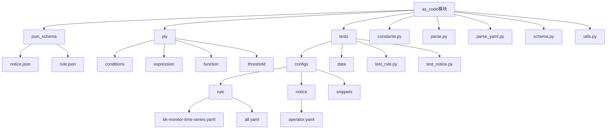
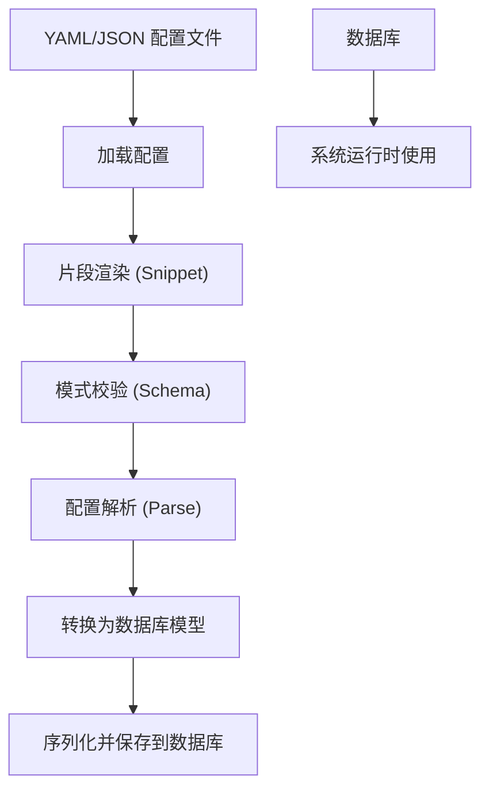
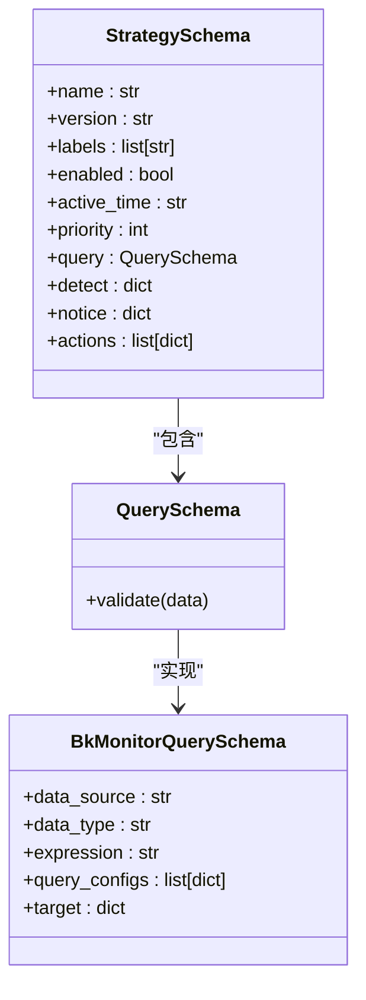
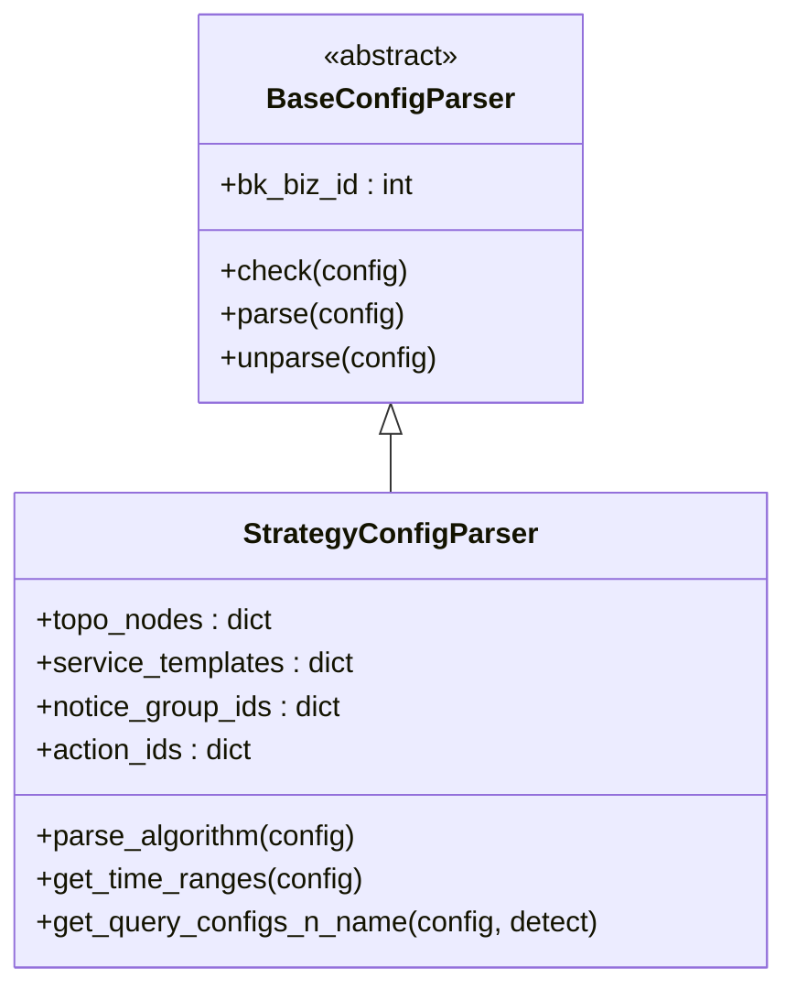
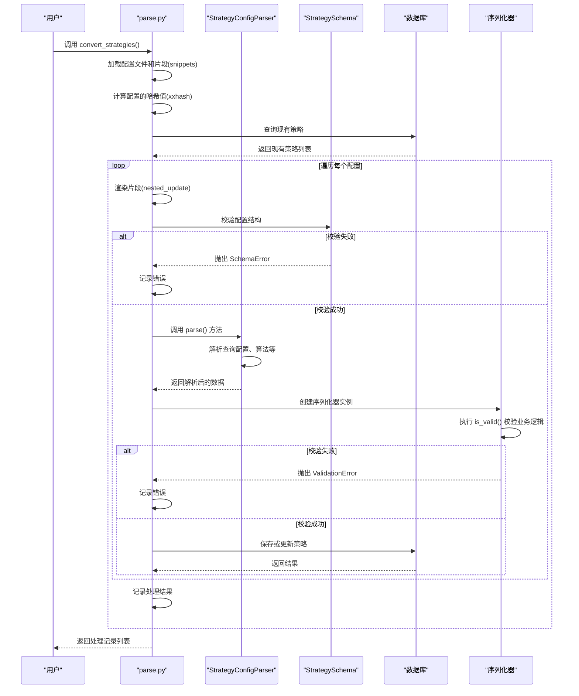
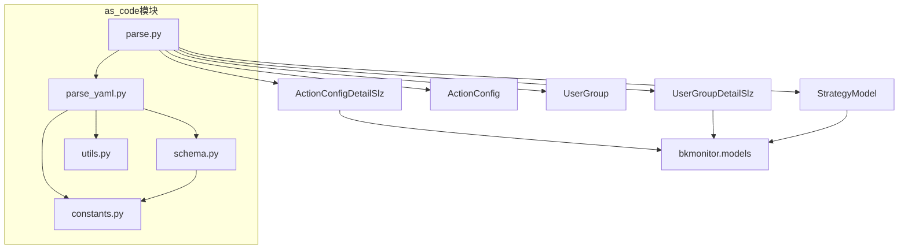

# 配置驱动扩展

<cite>
**本文档引用文件**   
- [schema.py](file://bkmonitor/bkmonitor/as_code/schema.py)
- [parse_yaml.py](file://bkmonitor/bkmonitor/as_code/parse_yaml.py)
- [parse.py](file://bkmonitor/bkmonitor/as_code/parse.py)
- [constants.py](file://bkmonitor/bkmonitor/as_code/constants.py)
- [utils.py](file://bkmonitor/bkmonitor/as_code/utils.py)
- [base.yaml](file://bkmonitor/bkmonitor/as_code/tests/configs/rule/snippets/base.yaml)
- [bk-monitor-time-series.yaml](file://bkmonitor/bkmonitor/as_code/tests/configs/rule/bk-monitor-time-series.yaml)
- [operator.yaml](file://bkmonitor/bkmonitor/as_code/tests/configs/notice/operator.yaml)
- [all.yaml](file://bkmonitor/bkmonitor/as_code/tests/configs/rule/all.yaml)
</cite>

## 目录
1. [引言](#引言)
2. [项目结构](#项目结构)
3. [核心组件](#核心组件)
4. [架构概览](#架构概览)
5. [详细组件分析](#详细组件分析)
6. [依赖分析](#依赖分析)
7. [性能考量](#性能考量)
8. [故障排除指南](#故障排除指南)
9. [结论](#结论)

## 引言
本文档系统性地介绍了蓝鲸监控平台（BlueKing - Monitor）的声明式配置管理模式，即“配置即代码”（As Code）机制。该模式允许用户通过YAML或JSON等配置文件定义监控策略、告警通知、动作执行等系统组件，从而实现配置的版本化、自动化和可追溯管理。文档将深入解析配置文件的定义、解析、校验、转换和持久化流程，并提供最佳实践和示例。

## 项目结构
`as_code` 模块是实现配置驱动扩展的核心目录，其结构清晰地分离了模式定义、解析逻辑、常量和工具函数。



**Diagram sources**
- [as_code](file://bkmonitor/bkmonitor/as_code)

**Section sources**
- [as_code](file://bkmonitor/bkmonitor/as_code)

## 核心组件
配置驱动扩展的核心由以下几个Python文件构成，它们共同完成了从配置文件到数据库模型的转换。

**Section sources**
- [schema.py](file://bkmonitor/bkmonitor/as_code/schema.py#L1-L371)
- [parse_yaml.py](file://bkmonitor/bkmonitor/as_code/parse_yaml.py#L1-L1331)
- [parse.py](file://bkmonitor/bkmonitor/as_code/parse.py#L1-L738)
- [constants.py](file://bkmonitor/bkmonitor/as_code/constants.py#L1-L16)
- [utils.py](file://bkmonitor/bkmonitor/as_code/utils.py#L1-L229)

## 架构概览
整个配置驱动流程遵循一个清晰的管道模式：**定义 -> 解析 -> 校验 -> 转换 -> 持久化**。用户编写的YAML/JSON配置文件首先被加载，然后通过预定义的模式进行校验，接着由特定的解析器转换为内部数据结构，最终通过序列化器写入数据库。



**Diagram sources**
- [parse.py](file://bkmonitor/bkmonitor/as_code/parse.py#L1-L738)
- [parse_yaml.py](file://bkmonitor/bkmonitor/as_code/parse_yaml.py#L1-L1331)

## 详细组件分析

### 模式定义 (schema.py)
`schema.py` 文件定义了所有配置文件必须遵循的结构和数据类型。它使用 `schema` 库来创建严格的验证规则。

#### 策略配置模式
`StrategySchema` 是最复杂的模式，它定义了监控策略的完整结构，包括查询、检测算法、告警通知和动作执行。



**Diagram sources**
- [schema.py](file://bkmonitor/bkmonitor/as_code/schema.py#L1-L371)

**Section sources**
- [schema.py](file://bkmonitor/bkmonitor/as_code/schema.py#L1-L371)

### 配置解析 (parse_yaml.py)
`parse_yaml.py` 文件包含了具体的解析器类，它们负责将经过模式校验的配置字典转换为可以直接用于数据库操作的数据结构。

#### 策略配置解析器
`StrategyConfigParser` 类继承自 `BaseConfigParser`，实现了 `check`, `parse`, `unparse` 三个核心方法。



**Diagram sources**
- [parse_yaml.py](file://bkmonitor/bkmonitor/as_code/parse_yaml.py#L1-L1331)

**Section sources**
- [parse_yaml.py](file://bkmonitor/bkmonitor/as_code/parse_yaml.py#L1-L1331)

### 配置转换流程 (parse.py)
`parse.py` 是配置驱动的入口和协调模块。它定义了 `convert_notices`, `convert_actions`, `convert_strategies` 等函数，这些函数是实际被调用的业务逻辑。

#### 策略配置转换流程
`convert_strategies` 函数展示了处理策略配置的完整流程。



**Diagram sources**
- [parse.py](file://bkmonitor/bkmonitor/as_code/parse.py#L1-L738)

**Section sources**
- [parse.py](file://bkmonitor/bkmonitor/as_code/parse.py#L1-L738)

### 常量与工具 (constants.py & utils.py)
`constants.py` 定义了配置的版本号范围，确保向后兼容性。
`utils.py` 提供了多个解析函数，用于处理配置中的复杂表达式。

```python
# constants.py
class MaxVersion:
    STRATEGY = "1.0"
    NOTICE = "1.0"

class MinVersion:
    STRATEGY = "1.0"
    NOTICE = "1.0"
```

```python
# utils.py
def parse_function(text: str) -> Dict:
    """解析函数表达式，如 'sum(1m, 5m)'"""
    ...

def parse_conditions(text: str) -> List:
    """解析条件表达式，如 'a > 1 and b < 2'"""
    ...

def create_threshold_expression(configs: List[List[Dict]]):
    """将阈值配置转换为可读的表达式字符串"""
    ...
```

**Section sources**
- [constants.py](file://bkmonitor/bkmonitor/as_code/constants.py#L1-L16)
- [utils.py](file://bkmonitor/bkmonitor/as_code/utils.py#L1-L229)

## 依赖分析
`as_code` 模块的内部依赖关系清晰，外部依赖主要来自平台的其他核心模块。



**Diagram sources**
- [parse.py](file://bkmonitor/bkmonitor/as_code/parse.py#L1-L738)
- [parse_yaml.py](file://bkmonitor/bkmonitor/as_code/parse_yaml.py#L1-L1331)
- [schema.py](file://bkmonitor/bkmonitor/as_code/schema.py#L1-L371)
- [utils.py](file://bkmonitor/bkmonitor/as_code/utils.py#L1-L229)
- [constants.py](file://bkmonitor/bkmonitor/as_code/constants.py#L1-L16)

**Section sources**
- [parse.py](file://bkmonitor/bkmonitor/as_code/parse.py#L1-L738)

## 性能考量
该配置驱动系统在设计上考虑了性能：
1.  **哈希比对**：通过 `xxhash` 计算配置的哈希值，避免对未更改的配置进行重复解析和数据库操作。
2.  **批量操作**：`convert_*` 函数设计为处理多个配置，便于进行批量导入。
3.  **惰性解析**：只有在校验通过后才进行复杂的解析操作，减少了无效计算。

## 故障排除指南
当配置导入失败时，可以检查以下几点：
1.  **模式校验错误**：检查 `schema_error`，确保配置文件的结构和字段类型正确。
2.  **业务逻辑校验错误**：检查 `validate_error`，这通常意味着引用了不存在的用户组、动作或拓扑节点。
3.  **解析错误**：检查 `parse_error`，这可能由 `utils.py` 中的解析函数（如 `parse_function`）抛出，常见于表达式语法错误。
4.  **片段引用错误**：确保 `snippet` 字段引用的文件存在于指定路径。

**Section sources**
- [parse.py](file://bkmonitor/bkmonitor/as_code/parse.py#L1-L738)
- [parse_yaml.py](file://bkmonitor/bkmonitor/as_code/parse_yaml.py#L1-L1331)
- [utils.py](file://bkmonitor/bkmonitor/as_code/utils.py#L1-L229)

## 结论
bk-monitor的配置驱动扩展提供了一套强大而灵活的声明式管理方案。通过将系统配置代码化，它极大地提升了监控系统的可维护性、一致性和自动化水平。开发者和运维人员可以通过编写和管理YAML文件来定义复杂的监控策略，利用版本控制系统进行追踪，并通过自动化流程进行部署，从而实现监控即代码（Monitoring as Code）的最佳实践。