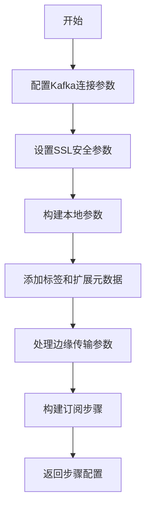
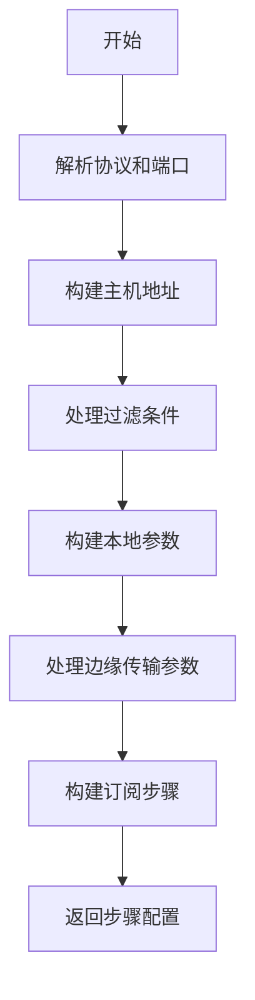
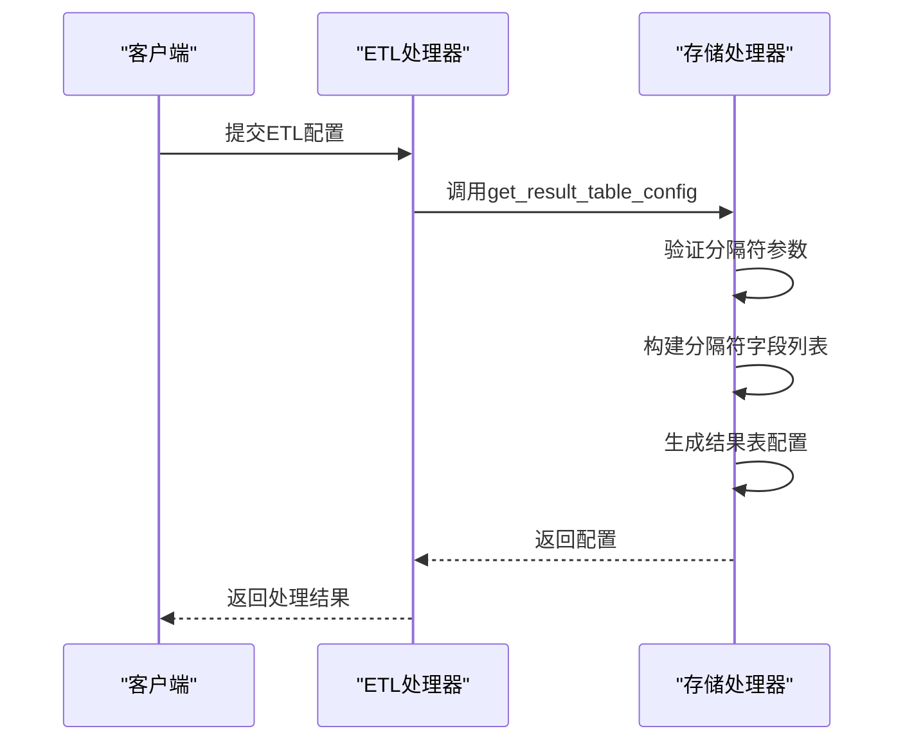
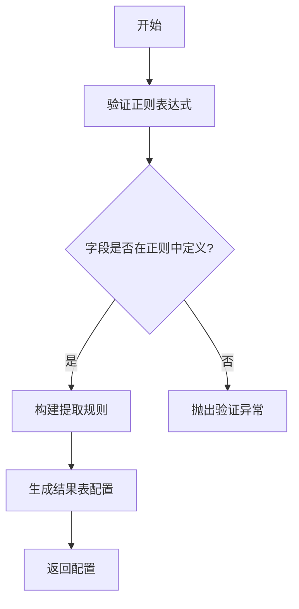
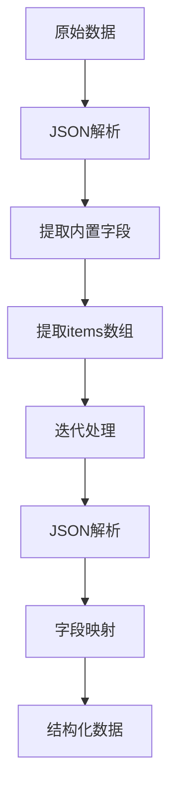
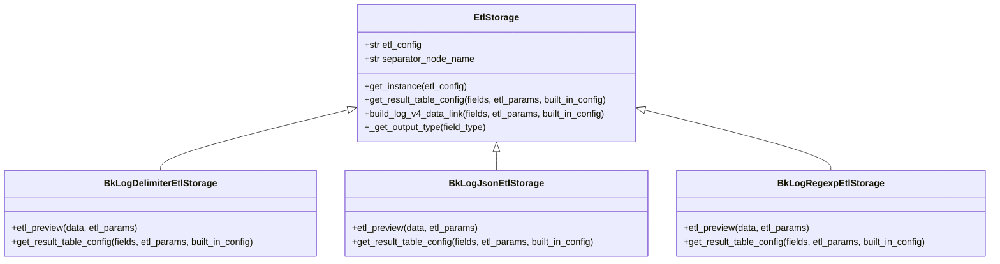
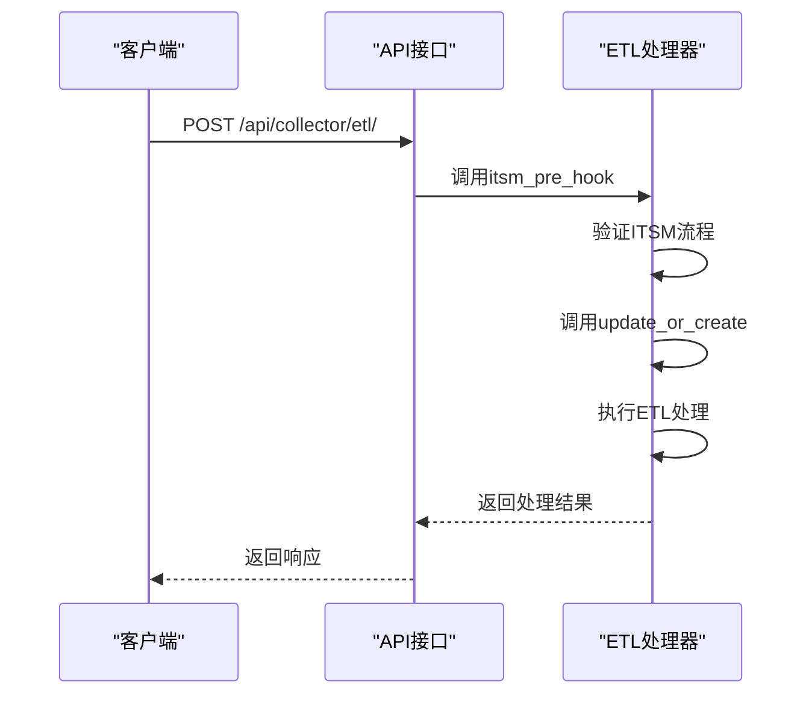

# ETL处理

<cite>
**本文档引用的文件**   
- [base.py](file://bklog/apps/log_databus/handlers/etl/base.py)
- [bk_log_delimiter.py](file://bklog/apps/log_databus/handlers/etl_storage/bk_log_delimiter.py)
- [bk_log_json.py](file://bklog/apps/log_databus/handlers/etl_storage/bk_log_json.py)
- [bk_log_regexp.py](file://bklog/apps/log_databus/handlers/etl_storage/bk_log_regexp.py)
- [collector_scenario/base.py](file://bklog/apps/log_databus/handlers/collector_scenario/base.py)
- [collector_scenario/kafka.py](file://bklog/apps/log_databus/handlers/collector_scenario/kafka.py)
- [collector_scenario/redis_slowlog.py](file://bklog/apps/log_databus/handlers/collector_scenario/redis_slowlog.py)
- [collector_scenario/syslog.py](file://bklog/apps/log_databus/handlers/collector_scenario/syslog.py)
- [serializers.py](file://bklog/apps/log_databus/serializers.py)
- [collector_views.py](file://bklog/apps/log_databus/views/collector_views.py)
</cite>

## 目录
1. [介绍](#介绍)
2. [ETL处理器基类设计](#etl处理器基类设计)
3. [数据提取逻辑](#数据提取逻辑)
4. [数据转换过程](#数据转换过程)
5. [数据清洗规则](#数据清洗规则)
6. [ETL配置管理接口](#etl配置管理接口)
7. [错误处理与日志记录](#错误处理与日志记录)
8. [结论](#结论)

## 介绍
本文档详细描述了蓝鲸日志平台中的ETL（提取、转换、加载）处理流程。重点分析了日志数据的提取、转换和加载机制，包括ETL处理器的基类设计、不同采集场景下的数据提取逻辑、数据转换过程中的字段映射和解析实现，以及数据清洗规则的配置与执行。文档还介绍了ETL配置的管理接口，通过API创建和更新ETL配置的方法，并结合实际代码示例展示从原始日志到结构化数据的完整转换过程。

## ETL处理器基类设计

ETL处理器基类`EtlHandler`定义在`bklog/apps/log_databus/handlers/etl/base.py`文件中，是整个ETL处理流程的核心。该类通过工厂模式实现不同ETL处理器的动态加载和扩展，支持Transfer和BKBase两种数据处理器。

`EtlHandler`类的主要功能包括：
- 初始化时根据采集配置ID获取采集配置信息
- 通过`get_instance`方法根据ETL处理器类型动态加载对应的处理器实例
- 提供统一的ETL处理接口，包括更新或创建清洗配置、字段提取预览、时间解析等功能
- 实现错误处理和日志记录机制

处理器的扩展机制通过Python的`import_string`函数实现，将ETL处理器类型映射到具体的处理器类。例如，`BKBASE`类型映射到`BKBaseEtlHandler`，`TRANSFER`类型映射到`TransferEtlHandler`。这种设计使得系统可以轻松扩展新的ETL处理器，而无需修改核心代码。

**Section sources**
- [base.py](file://bklog/apps/log_databus/handlers/etl/base.py#L72-L106)

## 数据提取逻辑

### Kafka数据提取
Kafka数据采集场景由`KafkaScenario`类处理，位于`bklog/apps/log_databus/handlers/collector_scenario/kafka.py`文件中。该类实现了从Kafka主题提取日志数据的逻辑，支持配置Kafka集群地址、用户名、密码、SSL参数等。

Kafka数据提取的主要参数包括：
- `kafka_hosts`: Kafka集群地址列表
- `kafka_username`: Kafka用户名
- `kafka_password`: Kafka密码
- `kafka_topics`: 要消费的主题列表
- `kafka_group_id`: 消费者组ID
- `kafka_initial_offset`: 初始偏移量（最新或最早）

**Diagram sources**
- [kafka.py](file://bklog/apps/log_databus/handlers/collector_scenario/kafka.py#L24-L88)

### Redis慢日志提取
Redis慢日志采集由`RedisSlowLogCollectorScenario`类处理，位于`bklog/apps/log_databus/handlers/collector_scenario/redis_slowlog.py`文件中。该类实现了从Redis实例提取慢日志的逻辑。

主要参数包括：
- `redis_hosts`: Redis目标地址列表
- `redis_password`: Redis密码
- `redis_password_file`: Redis密码文件路径

**Section sources**
- [redis_slowlog.py](file://bklog/apps/log_databus/handlers/collector_scenario/redis_slowlog.py#L24-L46)

### Syslog数据提取
Syslog日志采集由`SysLogScenario`类处理，支持多种协议和过滤条件。该类实现了从Syslog服务器提取日志数据的逻辑。

主要参数包括：
- `syslog_protocol`: 传输协议（UDP/TCP）
- `syslog_port`: 监听端口
- `syslog_monitor_host`: Syslog监听服务器IP
- `syslog_conditions`: Syslog过滤条件

**Diagram sources**
- [syslog.py](file://bklog/apps/log_databus/handlers/collector_scenario/syslog.py#L66-L253)

## 数据转换过程

### 字段映射与解析
数据转换过程的核心是将原始日志数据转换为结构化数据。系统支持多种解析方式，包括分隔符、正则表达式和JSON解析。

#### 分隔符解析
分隔符解析由`BkLogDelimiterEtlStorage`类实现，位于`bklog/apps/log_databus/handlers/etl_storage/bk_log_delimiter.py`文件中。该类实现了基于分隔符的字段提取逻辑。

**Diagram sources**
- [bk_log_delimiter.py](file://bklog/apps/log_databus/handlers/etl_storage/bk_log_delimiter.py#L43-L200)

#### 正则表达式解析
正则表达式解析由`BkLogRegexpEtlStorage`类实现，支持复杂的日志格式解析。该类验证正则表达式是否定义了所有用户配置的字段。

**Diagram sources**
- [bk_log_regexp.py](file://bklog/apps/log_databus/handlers/etl_storage/bk_log_regexp.py#L101-L285)

#### JSON解析
JSON解析由`BkLogJsonEtlStorage`类实现，支持嵌套JSON对象的解析。该类实现了完整的JSON数据流转规则。

**Diagram sources**
- [bk_log_json.py](file://bklog/apps/log_databus/handlers/etl_storage/bk_log_json.py#L129-L356)

### 自定义分隔符配置
系统支持自定义分隔符配置，用户可以在ETL参数中指定分隔符。分隔符配置通过`separator`参数传递，并在`get_result_table_config`方法中处理。

### JSON路径提取
对于复杂的JSON结构，系统支持JSON路径提取。通过`key_index`配置，可以指定从JSON对象的特定路径提取数据。

## 数据清洗规则

### 字段过滤
数据清洗规则支持字段过滤功能，用户可以配置需要保留或删除的字段。在分隔符解析中，通过`separator_field_list`配置字段列表，其中：
- 字段名：保留该字段
- `ignore`：忽略该字段
- `delete`：删除该字段
- `end`：结束标记

### 空值处理
系统提供了多种空值处理策略：
- `retain_original_text`: 保留原始文本
- `enable_retain_content`: 启用内容保留
- `record_parse_failure`: 记录解析失败标记

### 类型转换
系统支持多种数据类型转换，包括：
- 字符串到整数
- 字符串到浮点数
- 字符串到布尔值
- JSON对象到字典

类型转换通过`_get_output_type`方法实现，将字段类型映射到V4 clean_rules的output_type。

**Diagram sources**
- [base.py](file://bklog/apps/log_databus/handlers/etl_storage/base.py#L62-L85)
- [bk_log_delimiter.py](file://bklog/apps/log_databus/handlers/etl_storage/bk_log_delimiter.py#L43-L200)
- [bk_log_json.py](file://bklog/apps/log_databus/handlers/etl_storage/bk_log_json.py#L29-L200)
- [bk_log_regexp.py](file://bklog/apps/log_databus/handlers/etl_storage/bk_log_regexp.py#L27-L200)

## ETL配置管理接口

### API接口设计
ETL配置管理通过RESTful API接口实现，主要接口位于`collector_views.py`文件中。接口支持创建和更新ETL配置。

请求参数包括：
- `etl_config`: 清洗配置类型
- `table_id`: 结果表ID
- `storage_cluster_id`: 存储集群ID
- `retention`: 数据保留时间
- `fields`: 字段列表
- `etl_params`: 清洗参数

**Diagram sources**
- [collector_views.py](file://bklog/apps/log_databus/views/collector_views.py#L1337-L1387)

### 配置更新流程
配置更新流程包括以下步骤：
1. 验证采集项是否处于激活状态
2. 检查ES存储容量
3. 更新或创建结果表
4. 创建或更新索引集
5. 记录用户操作日志

**Section sources**
- [base.py](file://bklog/apps/log_databus/handlers/etl/base.py#L150-L259)
- [collector_views.py](file://bklog/apps/log_databus/views/collector_views.py#L1380-L1387)

## 错误处理与日志记录

### 错误处理机制
系统实现了完善的错误处理机制，包括：
- `CollectorConfigNotExistException`: 采集配置不存在异常
- `ValidationError`: 参数验证异常
- `ApiResultError`: API调用结果异常
- `EtlParseTimeFormatException`: 时间解析格式异常

错误处理通过try-catch块实现，确保系统在遇到异常时能够优雅地处理并返回有意义的错误信息。

### 日志记录策略
系统使用Python的logging模块进行日志记录，记录关键操作和错误信息。日志记录包括：
- 采集配置的创建和更新
- ETL处理的执行过程
- API调用的详细信息
- 错误和异常信息

日志级别包括INFO、WARNING、ERROR，便于问题排查和系统监控。

**Section sources**
- [base.py](file://bklog/apps/log_databus/handlers/etl/base.py#L68)
- [exceptions.py](file://bklog/apps/log_databus/exceptions.py)

## 结论
本文档详细描述了蓝鲸日志平台的ETL处理流程，涵盖了从数据提取、转换到加载的完整过程。通过分析ETL处理器的基类设计和扩展机制，展示了系统的灵活性和可扩展性。文档详细说明了不同采集场景下的数据提取逻辑，以及数据转换过程中的字段映射、正则解析和JSON解析实现。同时，介绍了数据清洗规则的配置与执行，以及ETL配置的管理接口。最后，文档阐述了系统的错误处理机制和日志记录策略，为系统的稳定运行提供了保障。