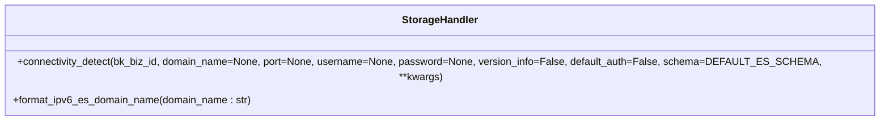
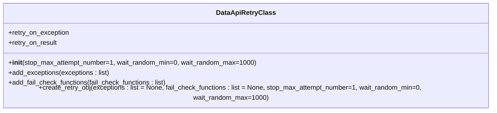
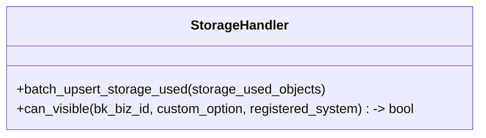
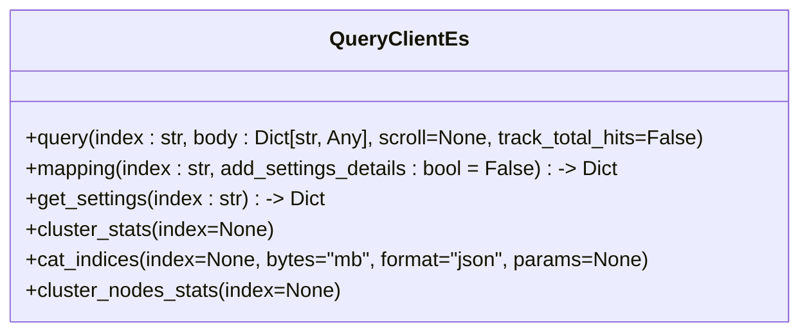

# 数据加载

<cite>
**Referenced Files in This Document**   
- [transfer.py](file://bklog/apps/api/modules/transfer.py)
- [models.py](file://bklog/apps/models.py)
- [base.py](file://bklog/apps/log_databus/handlers/etl_storage/base.py)
- [storage.py](file://bklog/apps/log_databus/handlers/storage.py)
- [QueryClientEs.py](file://bklog/apps/log_esquery/esquery/client/QueryClientEs.py)
</cite>

## 目录
1. [数据模型定义与存储配置](#数据模型定义与存储配置)
2. [数据传输逻辑实现](#数据传输逻辑实现)
3. [Elasticsearch写入配置与连接方式](#elasticsearch写入配置与连接方式)
4. [批量写入策略与性能优化](#批量写入策略与性能优化)
5. [错误处理与重试机制](#错误处理与重试机制)
6. [数据一致性保障措施](#数据一致性保障措施)
7. [监控与性能指标管理](#监控与性能指标管理)

## 数据模型定义与存储配置

数据模型的定义主要通过`models.py`文件中的类和字段来实现，这些模型定义了数据在存储系统中的结构和属性。核心数据模型包括`OperateRecordModel`和`SoftDeleteModel`，它们提供了创建时间、修改时间、创建者和修改者等通用字段的自动记录功能。`JsonField`用于处理JSON格式的数据，确保数据在入库和出库时能够正确地进行序列化和反序列化。此外，`MultiStrSplitByCommaField`和`MultiStrSplitByCommaFieldText`字段类型支持多个字符串以逗号分隔的存储和检索，适用于需要存储列表或数组的场景。

存储配置方面，系统通过`transfer.py`文件中的`TransferApi`类来管理数据源和结果表的创建、修改和删除操作。`TransferApi`提供了丰富的API接口，如`create_data_id`、`modify_data_id`、`create_result_table`等，这些接口允许用户灵活地配置数据源和结果表的属性，包括数据ID、结果表ID、存储集群ID、保留时间、分片数和副本数等。通过这些配置，可以确保数据在目标存储系统中的高效存储和快速检索。

**Section sources**
- [models.py](file://bklog/apps/models.py#L1-L316)
- [transfer.py](file://bklog/apps/api/modules/transfer.py#L1-L493)

## 数据传输逻辑实现

数据传输逻辑主要由`transfer.py`文件中的`_TransferApi`类实现。该类通过调用`DataAPI`方法与后端服务进行交互，完成数据源和结果表的创建、修改和删除等操作。`_TransferApi`类中的每个方法都对应一个具体的API接口，例如`create_data_id`用于创建数据源，`modify_data_id`用于修改数据源，`create_result_table`用于创建结果表等。这些方法通过`before_request`和`after_request`钩子函数来处理请求前后的数据转换和验证，确保数据的完整性和一致性。

在数据传输过程中，`_TransferApi`类还负责处理数据的加密和解密。`EncryptionField`字段类型在数据入库时自动加密，在数据出库时自动解密，确保敏感数据的安全性。此外，`_TransferApi`类还支持缓存机制，通过`cache_time`参数来控制API响应的缓存时间，提高系统的性能和响应速度。

**Section sources**
- [transfer.py](file://bklog/apps/api/modules/transfer.py#L1-L493)

## Elasticsearch写入配置与连接方式

Elasticsearch的写入配置和连接方式主要通过`base.py`文件中的`EtlStorage`类和`storage.py`文件中的`StorageHandler`类来实现。`EtlStorage`类负责处理数据的清洗和入库，而`StorageHandler`类则负责管理存储集群的连接和配置。

### 写入配置

`EtlStorage`类中的`update_or_create_result_table`方法用于创建或更新结果表。该方法接收多个参数，包括`instance`（采集项配置或采集插件）、`table_id`（结果表ID）、`storage_cluster_id`（存储集群ID）、`retention`（数据保留时间）、`allocation_min_days`（执行分配的等待天数）、`storage_replies`（存储副本数量）等。通过这些参数，可以灵活地配置结果表的存储属性，确保数据在Elasticsearch中的高效存储和快速检索。

**Diagram sources**
- [base.py](file://bklog/apps/log_databus/handlers/etl_storage/base.py#L742-L926)

### 连接方式

`StorageHandler`类中的`connectivity_detect`方法用于检测存储集群的连接状态。该方法通过调用`BkLogApi.connectivity_detect`接口来检查Elasticsearch集群的连通性和版本信息。如果连接成功，返回连接状态和版本信息的元组；如果连接失败，返回连接状态的布尔值。此外，`StorageHandler`类还支持IPv6地址的处理，通过`format_ipv6_es_domain_name`方法将IPv6地址格式化为标准的域名格式。

**Diagram sources**
- [storage.py](file://bklog/apps/log_databus/handlers/storage.py#L782-L800)
- [storage.py](file://bklog/apps/log_databus/handlers/storage.py#L629-L629)

## 批量写入策略与性能优化

批量写入策略是提高数据写入性能的关键。系统通过`base.py`文件中的`EtlStorage`类和`storage.py`文件中的`StorageHandler`类来实现批量写入和性能优化。

### 批量写入

`EtlStorage`类中的`update_or_create_result_table`方法支持批量写入。当创建或更新结果表时，可以通过设置`slice_size`和`slice_gap`参数来控制数据的切分大小和时间间隔。`slice_size`参数定义了每个分片的大小阈值（单位：GB），`slice_gap`参数定义了索引分片的时间间隔（单位：分钟）。通过合理设置这些参数，可以确保数据在Elasticsearch中的均匀分布和高效写入。

### 性能优化

为了进一步优化性能，系统还支持冷热数据分离。`StorageHandler`类中的`_deal_hot_warm_config`方法用于处理冷热数据配置。当启用冷热数据功能时，新数据会被路由到热节点，而n天后的数据会被路由到冷节点。通过这种方式，可以有效降低热节点的负载，提高查询性能。

**Diagram sources**
- [base.py](file://bklog/apps/log_databus/handlers/etl_storage/base.py#L742-L926)
- [storage.py](file://bklog/apps/log_databus/handlers/storage.py#L1263-L1291)

## 错误处理与重试机制

错误处理和重试机制是确保数据加载过程稳定可靠的重要组成部分。系统通过`transfer.py`文件中的`_TransferApi`类和`storage.py`文件中的`StorageHandler`类来实现错误处理和重试。

### 错误处理

`_TransferApi`类中的每个方法都包含错误处理逻辑。例如，`create_data_id`方法在创建数据源时，如果遇到错误，会抛出相应的异常，如`ApiResultError`。这些异常会被捕获并记录到日志中，以便后续排查问题。此外，`_TransferApi`类还支持自定义错误处理函数，通过`fail_check_functions`参数来指定检查结果是否失败的函数。

### 重试机制

`_TransferApi`类中的`DataApiRetryClass`类提供了重试机制。通过设置`stop_max_attempt_number`、`wait_random_min`和`wait_random_max`参数，可以控制重试的最大次数和等待时间。当请求失败时，`DataApiRetryClass`会自动进行重试，直到达到最大重试次数或请求成功为止。

**Diagram sources**
- [transfer.py](file://bklog/apps/api/modules/transfer.py#L108-L198)

## 数据一致性保障措施

数据一致性是数据加载过程中的重要目标。系统通过多种机制来确保数据的一致性，包括事务处理、数据校验和日志记录。

### 事务处理

`StorageHandler`类中的`batch_upsert_storage_used`方法使用事务来批量处理`StorageUsed`对象的创建和更新。通过`transaction.atomic()`装饰器，确保所有操作在一个事务中完成，如果任何一个操作失败，整个事务将回滚，从而保证数据的一致性。

### 数据校验

`EtlStorage`类中的`get_result_table_fields`方法在生成结果表字段时，会对字段名进行校验，确保字段名符合变量规则且不与标准字段重复。此外，`StorageHandler`类中的`can_visible`方法会检查存储集群的可见性，确保只有授权的业务才能访问特定的存储集群。

### 日志记录

系统通过`logger`模块记录详细的日志信息，包括操作日志、错误日志和性能日志。这些日志信息可以帮助运维人员及时发现和解决问题，确保系统的稳定运行。

**Diagram sources**
- [storage.py](file://bklog/apps/log_databus/handlers/storage.py#L527-L576)
- [storage.py](file://bklog/apps/log_databus/handlers/storage.py#L88-L142)

## 监控与性能指标管理

监控和性能指标管理是确保数据加载过程高效运行的重要手段。系统通过`QueryClientEs.py`文件中的`QueryClientEs`类来实现Elasticsearch的监控和性能指标管理。

### 监控

`QueryClientEs`类提供了多种监控方法，如`cluster_stats`、`cat_indices`和`cluster_nodes_stats`。这些方法可以获取Elasticsearch集群的统计信息、索引信息和节点信息，帮助运维人员了解集群的运行状态和资源使用情况。

### 性能指标管理

`QueryClientEs`类中的`query`方法支持`track_total_hits`参数，当该参数为`True`时，查询结果会包含总命中数。此外，`mapping`方法可以获取索引的映射信息，`get_settings`方法可以获取索引的设置信息，这些信息对于性能调优和故障排查非常有用。

**Diagram sources**
- [QueryClientEs.py](file://bklog/apps/log_esquery/esquery/client/QueryClientEs.py#L55-L117)