# 数据提取

<cite>
**本文档引用的文件**   
- [base.py](file://bklog/apps/log_databus/handlers/collector/base.py)
- [kafka.py](file://bklog/apps/log_databus/handlers/kafka.py)
- [redis_slowlog.py](file://bklog/apps/log_databus/handlers/collector_scenario/redis_slowlog.py)
- [syslog.py](file://bklog/apps/log_databus/handlers/collector_scenario/syslog.py)
- [collector_scenario/base.py](file://bklog/apps/log_databus/handlers/collector_scenario/base.py)
- [models.py](file://bklog/apps/log_databus/models.py)
- [constants.py](file://bklog/apps/log_databus/constants.py)
</cite>

## 目录
1. [引言](#引言)
2. [采集场景基类设计](#采集场景基类设计)
3. [具体采集场景实现](#具体采集场景实现)
4. [采集配置参数定义](#采集配置参数定义)
5. [数据源连接与消息消费模式](#数据源连接与消息消费模式)
6. [采集任务配置与启动](#采集任务配置与启动)
7. [错误处理与重试机制](#错误处理与重试机制)
8. [性能优化策略](#性能优化策略)
9. [API管理采集配置](#api管理采集配置)
10. [结论](#结论)

## 引言
本文档详细描述了蓝鲸日志平台的数据提取机制，重点分析了不同日志源的数据采集实现。文档涵盖了采集场景基类的设计原理、Kafka、Redis慢日志、Syslog等具体场景的实现细节，以及采集配置的参数定义、连接方式、消费模式、错误处理和性能优化策略。

## 采集场景基类设计
采集场景基类`CollectorScenario`是数据采集功能的核心抽象，定义了不同采集场景的通用接口和行为规范。该基类通过工厂模式实现不同采集场景的实例化，支持行日志、段日志、Windows事件、Redis慢日志、Syslog日志和Kafka等多种采集场景。

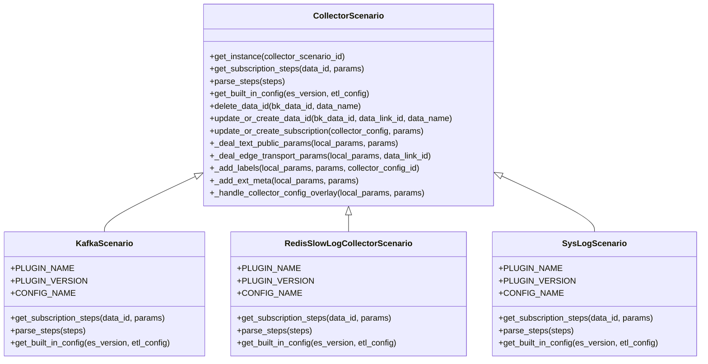

**图源**
- [base.py](file://bklog/apps/log_databus/handlers/collector_scenario/base.py#L49-L804)
- [kafka.py](file://bklog/apps/log_databus/handlers/collector_scenario/kafka.py#L35-L333)
- [redis_slowlog.py](file://bklog/apps/log_databus/handlers/collector_scenario/redis_slowlog.py#L29-L207)
- [syslog.py](file://bklog/apps/log_databus/handlers/collector_scenario/syslog.py#L29-L264)

**节源**
- [base.py](file://bklog/apps/log_databus/handlers/collector_scenario/base.py#L49-L804)

## 具体采集场景实现

### Kafka采集场景
Kafka采集场景通过`KafkaScenario`类实现，支持从Kafka集群消费消息并进行日志采集。该实现在订阅步骤中配置了Kafka消费者参数，包括主机列表、主题、消费者组、初始偏移量等。

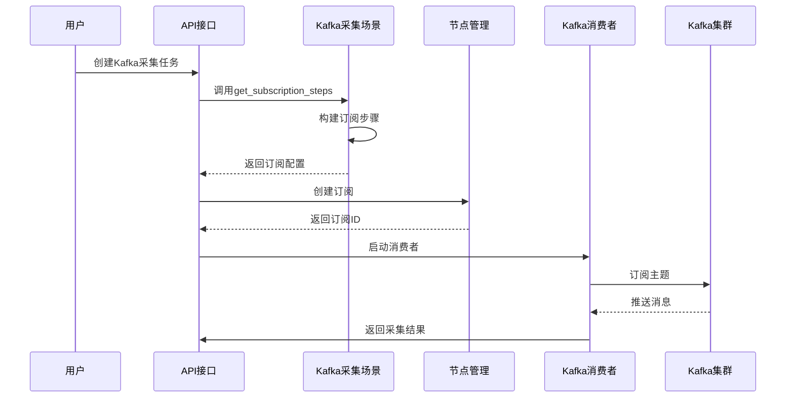

**图源**
- [kafka.py](file://bklog/apps/log_databus/handlers/collector_scenario/kafka.py#L35-L333)
- [kafka.py](file://bklog/apps/log_databus/handlers/kafka.py#L24-L60)

**节源**
- [kafka.py](file://bklog/apps/log_databus/handlers/collector_scenario/kafka.py#L35-L333)

### Redis慢日志采集场景
Redis慢日志采集场景通过`RedisSlowLogCollectorScenario`类实现，专门用于采集Redis服务器的慢查询日志。该实现配置了Redis主机、端口、密码等连接信息，并通过节点管理插件进行部署。

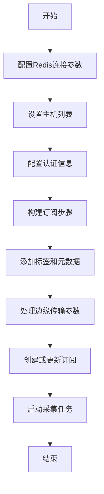

**图源**
- [redis_slowlog.py](file://bklog/apps/log_databus/handlers/collector_scenario/redis_slowlog.py#L29-L207)

**节源**
- [redis_slowlog.py](file://bklog/apps/log_databus/handlers/collector_scenario/redis_slowlog.py#L29-L207)

### Syslog采集场景
Syslog采集场景通过`SysLogScenario`类实现，支持通过UDP/TCP协议接收Syslog消息。该实现配置了监听协议、端口、IP地址和过滤规则，能够对Syslog消息进行条件过滤。

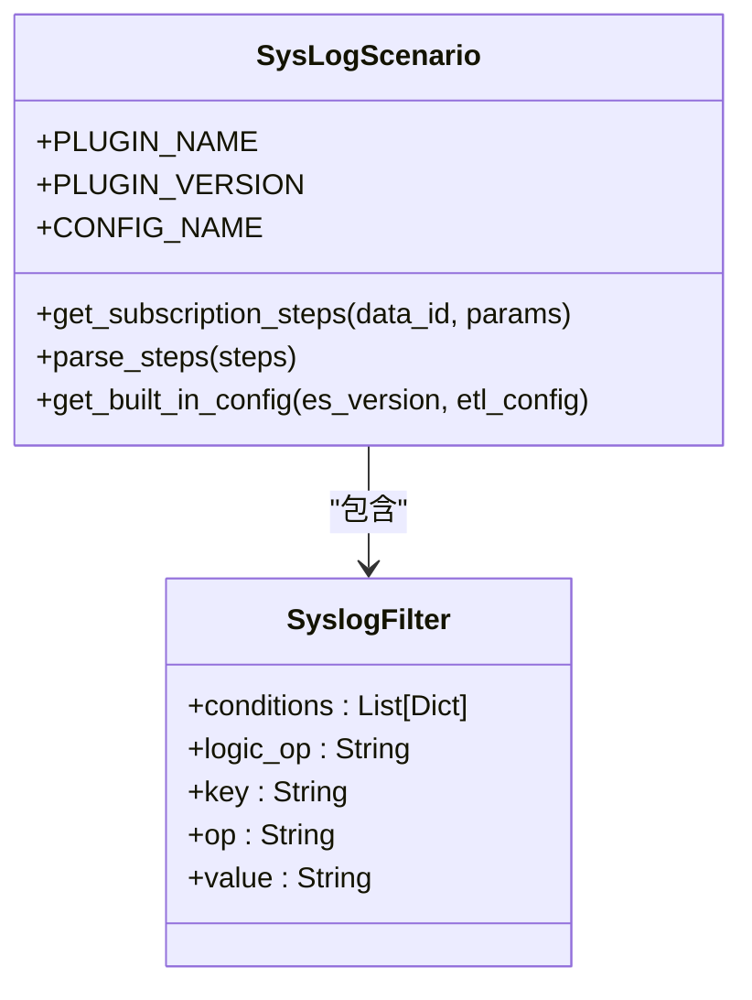

**图源**
- [syslog.py](file://bklog/apps/log_databus/handlers/collector_scenario/syslog.py#L29-L264)

**节源**
- [syslog.py](file://bklog/apps/log_databus/handlers/collector_scenario/syslog.py#L29-L264)

## 采集配置参数定义
采集配置参数定义了不同采集场景的配置选项，包括通用参数和特定场景参数。这些参数通过模型类`CollectorConfig`进行存储和管理。

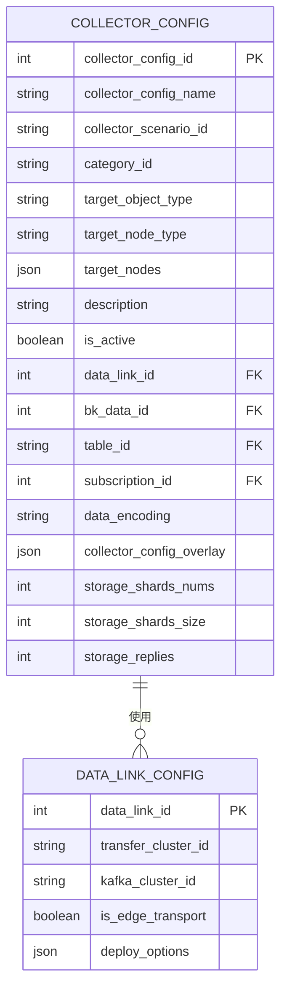

**图源**
- [models.py](file://bklog/apps/log_databus/models.py#L101-L200)
- [constants.py](file://bklog/apps/log_databus/constants.py#L1-L200)

**节源**
- [models.py](file://bklog/apps/log_databus/models.py#L101-L200)

## 数据源连接与消息消费模式
数据源连接和消息消费模式是采集功能的核心部分，决定了如何与不同数据源建立连接并消费数据。

### Kafka消息消费模式
Kafka消息消费模式实现了从Kafka主题消费消息的完整流程，包括创建消费者、设置偏移量、消费消息和错误处理。

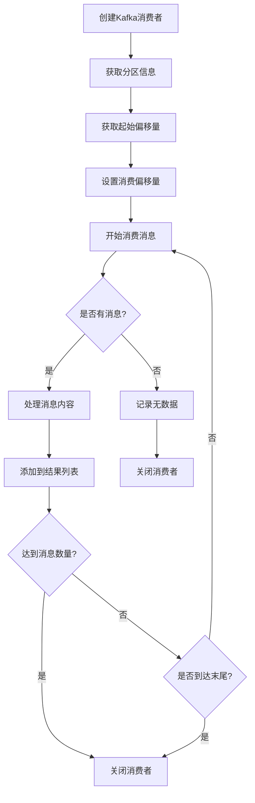

**图源**
- [kafka.py](file://bklog/apps/log_databus/handlers/kafka.py#L95-L126)
- [kafka_checker.py](file://bklog/apps/log_databus/handlers/check_collector/checker/kafka_checker.py#L88-L128)

**节源**
- [kafka.py](file://bklog/apps/log_databus/handlers/kafka.py#L95-L126)

### 数据源连接方式
数据源连接方式定义了与不同数据源建立连接的机制，包括Kafka、Redis和Syslog等。

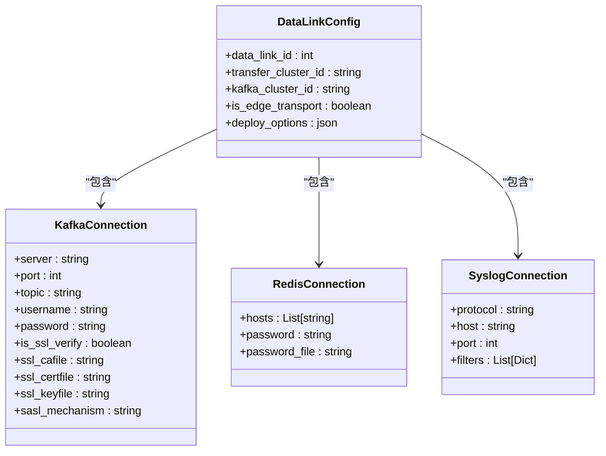

**图源**
- [base.py](file://bklog/apps/log_databus/handlers/collector/base.py#L124-L804)
- [constants.py](file://bklog/apps/log_databus/constants.py#L1-L200)

**节源**
- [base.py](file://bklog/apps/log_databus/handlers/collector/base.py#L124-L804)

## 采集任务配置与启动
采集任务的配置与启动流程涉及多个组件的协同工作，从创建采集配置到最终启动采集任务。

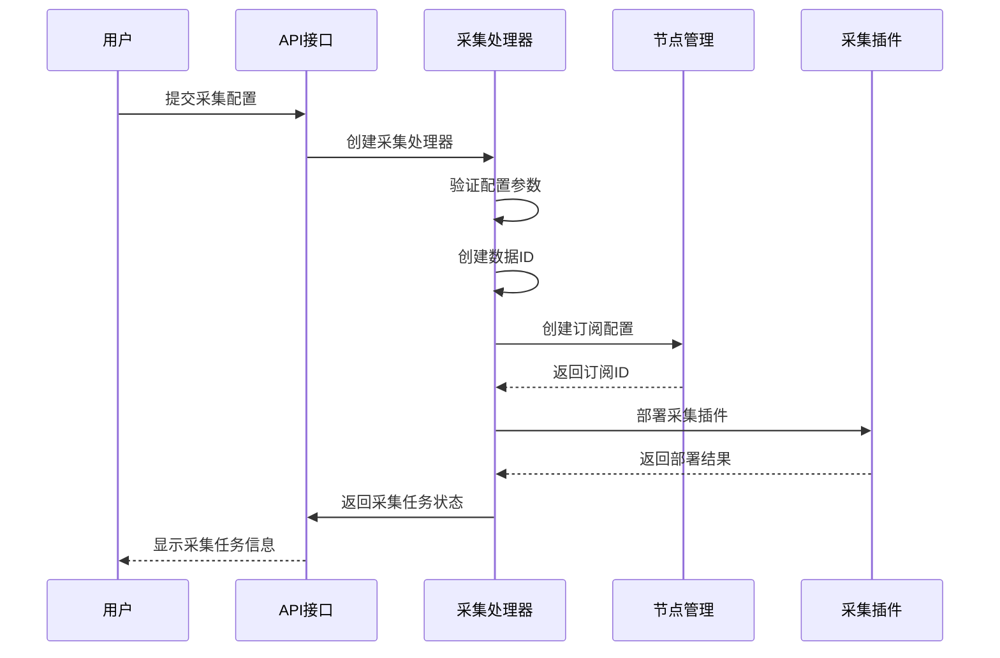

**图源**
- [base.py](file://bklog/apps/log_databus/handlers/collector/base.py#L408-L441)
- [base.py](file://bklog/apps/log_databus/handlers/collector/base.py#L293-L322)

**节源**
- [base.py](file://bklog/apps/log_databus/handlers/collector/base.py#L408-L441)

## 错误处理与重试机制
错误处理与重试机制确保了采集任务的稳定性和可靠性，能够应对各种异常情况。

### 错误处理流程
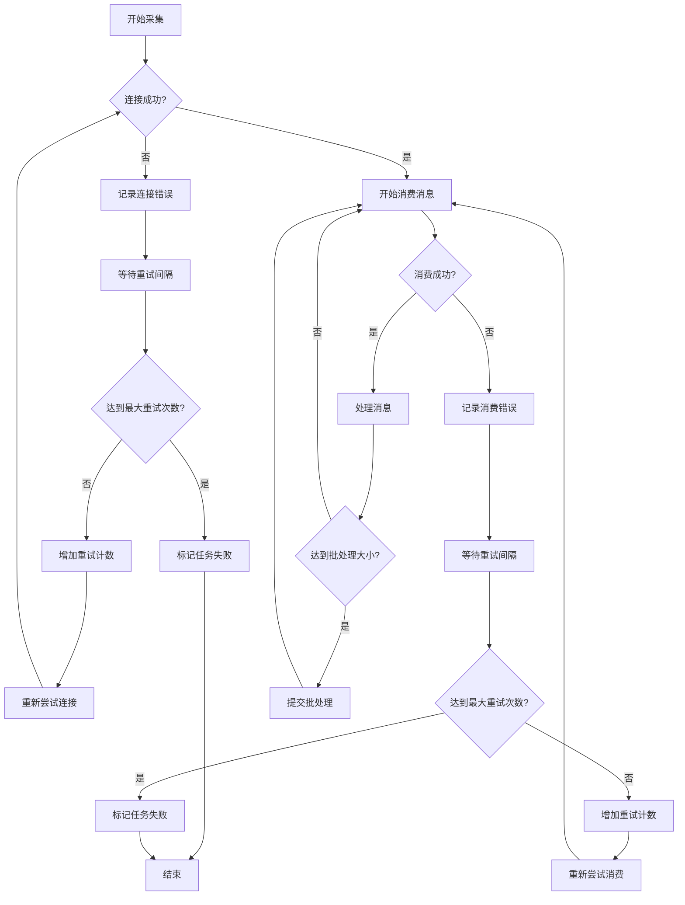

### 重试机制配置
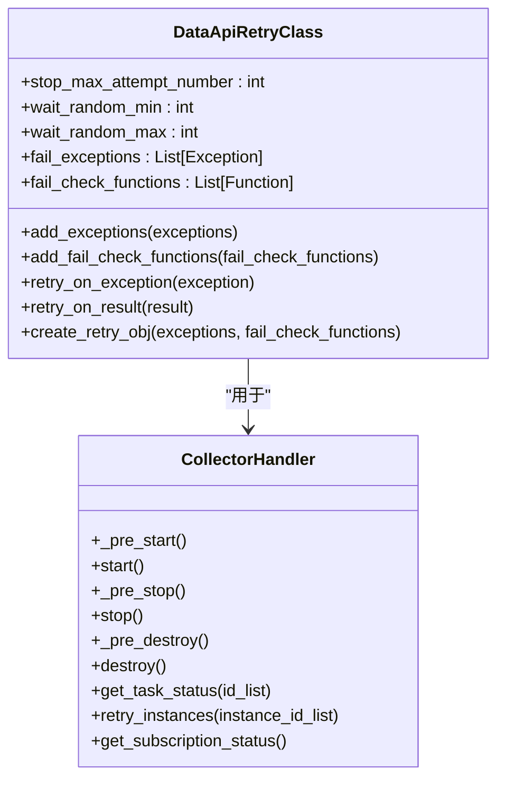

**图源**
- [base.py](file://bklog/apps/log_databus/handlers/collector/base.py#L408-L441)
- [base.py](file://bklog/apps/api/base.py#L108-L198)

**节源**
- [base.py](file://bklog/apps/log_databus/handlers/collector/base.py#L408-L441)

## 性能优化策略
性能优化策略通过多种技术手段提升采集系统的效率和稳定性。

### 批量处理优化
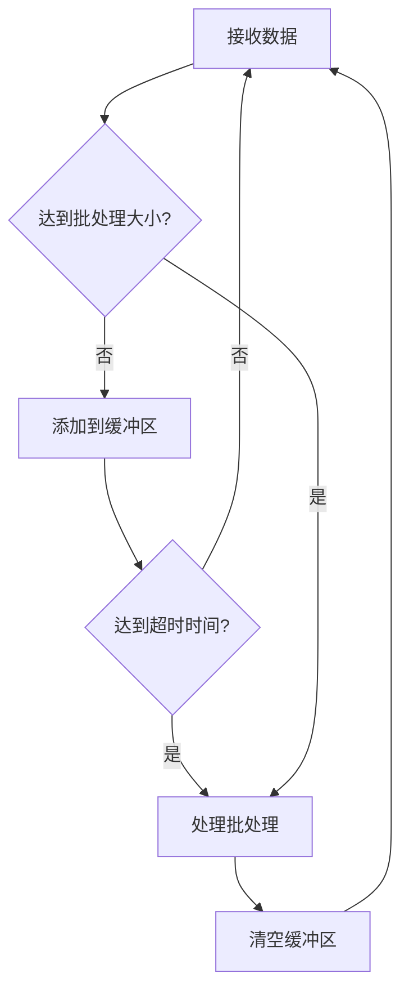

### 并发处理优化
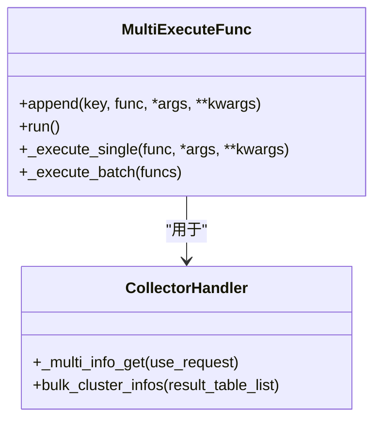

**图源**
- [base.py](file://bklog/apps/log_databus/handlers/collector/base.py#L162-L196)
- [base.py](file://bklog/apps/log_databus/handlers/collector/base.py#L731-L800)

**节源**
- [base.py](file://bklog/apps/log_databus/handlers/collector/base.py#L162-L196)

## API管理采集配置
API管理采集配置提供了对采集任务的全生命周期管理功能。

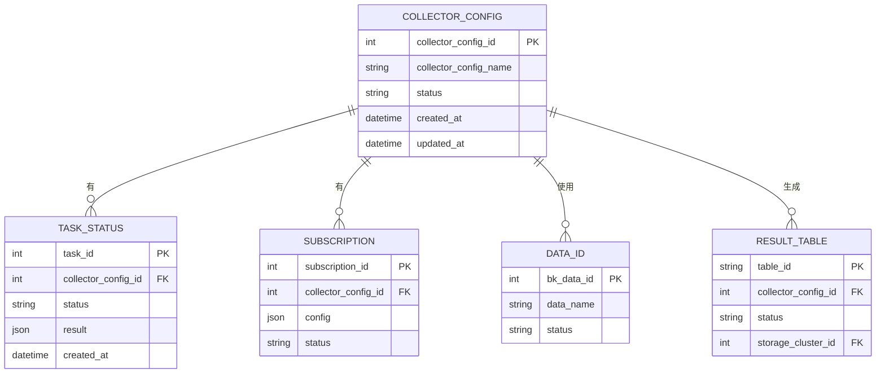

**图源**
- [base.py](file://bklog/apps/log_databus/handlers/collector/base.py#L481-L499)
- [models.py](file://bklog/apps/log_databus/models.py#L101-L200)

**节源**
- [base.py](file://bklog/apps/log_databus/handlers/collector/base.py#L481-L499)

## 结论
本文档详细分析了蓝鲸日志平台的数据提取机制，涵盖了采集场景基类的设计原理、具体采集场景的实现细节、采集配置参数、数据源连接方式、消息消费模式、错误处理机制和性能优化策略。通过这些机制，系统能够高效、稳定地从多种数据源采集日志数据，并提供灵活的配置和管理功能。