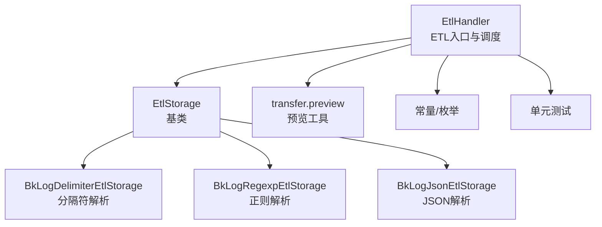
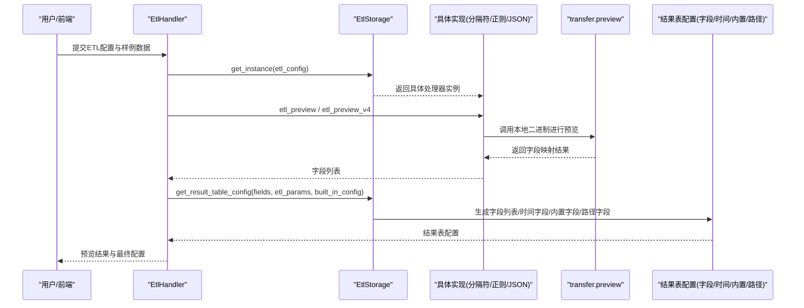
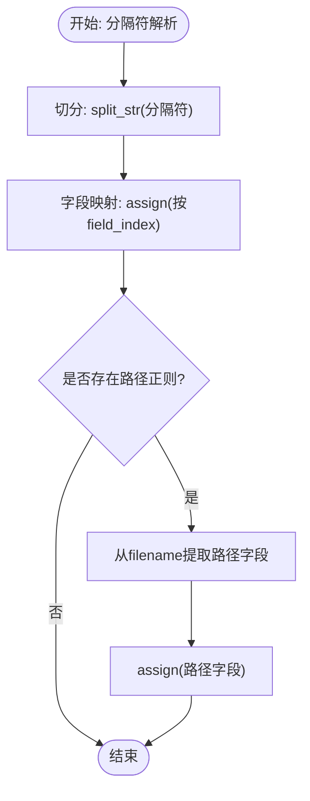
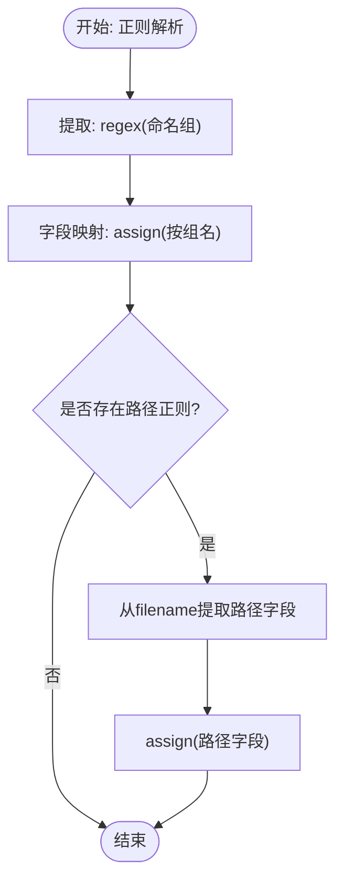
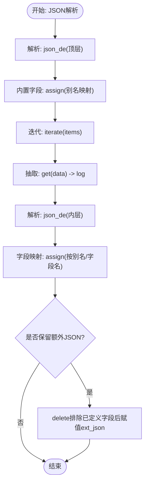
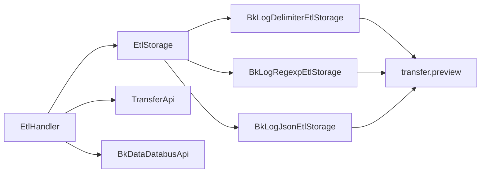

# 数据转换

<cite>
**本文引用的文件**
- [base.py](file://bklog/apps/log_databus/handlers/etl/base.py)
- [base.py](file://bklog/apps/log_databus/handlers/etl_storage/base.py)
- [bk_log_delimiter.py](file://bklog/apps/log_databus/handlers/etl_storage/bk_log_delimiter.py)
- [bk_log_regexp.py](file://bklog/apps/log_databus/handlers/etl_storage/bk_log_regexp.py)
- [bk_log_json.py](file://bklog/apps/log_databus/handlers/etl_storage/bk_log_json.py)
- [transfer.py](file://bklog/apps/log_databus/handlers/etl_storage/utils/transfer.py)
- [__init__.py](file://bklog/apps/log_databus/handlers/etl_storage/__init__.py)
- [constants.py](file://bklog/apps/log_databus/constants.py)
- [test_etl.py](file://bklog/apps/tests/log_databus/test_etl.py)
</cite>

## 目录
1. [简介](#简介)
2. [项目结构](#项目结构)
3. [核心组件](#核心组件)
4. [架构总览](#架构总览)
5. [详细组件分析](#详细组件分析)
6. [依赖关系分析](#依赖关系分析)
7. [性能考量](#性能考量)
8. [故障排查指南](#故障排查指南)
9. [结论](#结论)
10. [附录](#附录)

## 简介
本文件围绕蓝鲸日志平台中的“ETL处理器”与“日志数据结构化处理流程”，系统性梳理从原始日志到结构化数据的完整转换过程。重点覆盖：
- ETL处理器基类设计与扩展机制
- 分隔符、正则表达式、JSON三种解析实现
- 字段映射规则、正则提取模式、JSON路径查询配置
- 自定义分隔符、正则表达式组匹配、嵌套字段提取
- 数据清洗规则（字段过滤、空值处理、类型转换）
- 错误处理与日志记录策略
- 实际代码示例路径与流程图

## 项目结构
日志数据转换相关代码主要位于以下模块：
- ETL处理器入口与调度：bklog/apps/log_databus/handlers/etl/base.py
- ETL存储策略基类与具体实现：bklog/apps/log_databus/handlers/etl_storage/base.py、bklog/apps/log_databus/handlers/etl_storage/bk_log_*.py
- 预览工具（调用本地二进制）：bklog/apps/log_databus/handlers/etl_storage/utils/transfer.py
- 常量与枚举：bklog/apps/log_databus/constants.py
- 单元测试：bklog/apps/tests/log_databus/test_etl.py

图表来源
- [base.py](file://bklog/apps/log_databus/handlers/etl/base.py#L72-L120)
- [base.py](file://bklog/apps/log_databus/handlers/etl_storage/base.py#L62-L120)
- [bk_log_delimiter.py](file://bklog/apps/log_databus/handlers/etl_storage/bk_log_delimiter.py#L43-L120)
- [bk_log_regexp.py](file://bklog/apps/log_databus/handlers/etl_storage/bk_log_regexp.py#L33-L120)
- [bk_log_json.py](file://bklog/apps/log_databus/handlers/etl_storage/bk_log_json.py#L29-L120)
- [transfer.py](file://bklog/apps/log_databus/handlers/etl_storage/utils/transfer.py#L34-L103)
- [constants.py](file://bklog/apps/log_databus/constants.py#L1-L200)
- [test_etl.py](file://bklog/apps/tests/log_databus/test_etl.py#L970-L1257)

章节来源
- [base.py](file://bklog/apps/log_databus/handlers/etl/base.py#L72-L120)
- [__init__.py](file://bklog/apps/log_databus/handlers/etl_storage/__init__.py#L1-L25)

## 核心组件
- EtlHandler：ETL入口与调度，负责根据采集配置选择具体处理器、预览、索引集创建、时间解析等。
- EtlStorage：ETL存储策略基类，定义通用接口与V4数据链路构建能力。
- BkLogDelimiterEtlStorage：分隔符解析实现，支持预览、V4数据链路、路径字段提取。
- BkLogRegexpEtlStorage：正则解析实现，支持预览、V4数据链路、路径字段提取。
- BkLogJsonEtlStorage：JSON解析实现，支持预览、V4数据链路、嵌套字段提取、额外JSON保留。
- transfer.preview：调用本地二进制进行字段提取预览，支持分隔符、正则、JSON三类。

章节来源
- [base.py](file://bklog/apps/log_databus/handlers/etl/base.py#L72-L120)
- [base.py](file://bklog/apps/log_databus/handlers/etl_storage/base.py#L62-L120)
- [bk_log_delimiter.py](file://bklog/apps/log_databus/handlers/etl_storage/bk_log_delimiter.py#L43-L120)
- [bk_log_regexp.py](file://bklog/apps/log_databus/handlers/etl_storage/bk_log_regexp.py#L33-L120)
- [bk_log_json.py](file://bklog/apps/log_databus/handlers/etl_storage/bk_log_json.py#L29-L120)
- [transfer.py](file://bklog/apps/log_databus/handlers/etl_storage/utils/transfer.py#L34-L103)

## 架构总览
整体流程：采集配置决定ETL处理器类型，随后根据字段定义与清洗参数生成结果表配置（含字段列表、时间字段、内置字段、路径字段等），并通过V4数据链路或传统配置下发到存储。

图表来源
- [base.py](file://bklog/apps/log_databus/handlers/etl/base.py#L261-L269)
- [base.py](file://bklog/apps/log_databus/handlers/etl_storage/base.py#L72-L85)
- [bk_log_delimiter.py](file://bklog/apps/log_databus/handlers/etl_storage/bk_log_delimiter.py#L46-L118)
- [bk_log_regexp.py](file://bklog/apps/log_databus/handlers/etl_storage/bk_log_regexp.py#L36-L119)
- [bk_log_json.py](file://bklog/apps/log_databus/handlers/etl_storage/bk_log_json.py#L32-L84)
- [transfer.py](file://bklog/apps/log_databus/handlers/etl_storage/utils/transfer.py#L34-L103)

## 详细组件分析

### ETL处理器基类设计与扩展机制
- EtlHandler
  - 依据采集配置动态选择ETL处理器（Transfer/BKBase），并提供预览、索引集创建、时间解析等能力。
  - 关键方法：get_instance、etl_preview、etl_time、update_or_create、_update_or_create_index_set。
- EtlStorage
  - 定义统一接口：etl_preview、etl_preview_v4、get_result_table_config、get_bkdata_etl_config、build_log_v4_data_link。
  - 提供V4数据链路构建通用能力：内置字段注入、时间字段转换、iterationIndex、ext_json、清洗失败标记、输出类型映射等。
  - 字段生成：get_result_table_fields，负责字段合法性校验、真实路径(real_path)、维度/指标、分词器、时间精度等。
  - 元数据路径：add_metadata_path_configs、get_path_field_configs、separate_fields_config、add_path_configs。
  - 结果表创建：update_or_create_result_table，整合ES配置、冷热数据、分片/副本、mapping优化等。

章节来源
- [base.py](file://bklog/apps/log_databus/handlers/etl/base.py#L72-L387)
- [base.py](file://bklog/apps/log_databus/handlers/etl_storage/base.py#L62-L1457)

### 分隔符解析（BkLogDelimiterEtlStorage）
- 预览流程
  - etl_preview：先用本地二进制预览，再回填字段值。
  - etl_preview_v4：直接调用BkDataDatabusApi.databus_clean_debug，按split_str算子切分。
- 结果表配置
  - get_result_table_config：组装option（保留原文、分隔符、字段列表、扁平化等），并生成字段列表。
  - V4数据链路：build_log_v4_data_link，包含JSON解析、内置字段、items迭代、log原文抽取、分隔符切分、字段映射、路径字段提取、清洗失败标记。
- 路径字段提取
  - 支持通过separator_configs配置正则，从filename中提取路径字段并注入到字段列表。
- 计算平台兼容
  - get_bkdata_etl_config：生成计算平台所需的extract/conf结构，包含from_json、iterate、split、assign等步骤。

图表来源
- [bk_log_delimiter.py](file://bklog/apps/log_databus/handlers/etl_storage/bk_log_delimiter.py#L241-L332)
- [bk_log_delimiter.py](file://bklog/apps/log_databus/handlers/etl_storage/bk_log_delimiter.py#L334-L387)
- [bk_log_delimiter.py](file://bklog/apps/log_databus/handlers/etl_storage/bk_log_delimiter.py#L389-L506)

章节来源
- [bk_log_delimiter.py](file://bklog/apps/log_databus/handlers/etl_storage/bk_log_delimiter.py#L46-L118)
- [bk_log_delimiter.py](file://bklog/apps/log_databus/handlers/etl_storage/bk_log_delimiter.py#L119-L178)
- [bk_log_delimiter.py](file://bklog/apps/log_databus/handlers/etl_storage/bk_log_delimiter.py#L179-L333)
- [bk_log_delimiter.py](file://bklog/apps/log_databus/handlers/etl_storage/bk_log_delimiter.py#L334-L387)
- [bk_log_delimiter.py](file://bklog/apps/log_databus/handlers/etl_storage/bk_log_delimiter.py#L389-L506)

### 正则表达式解析（BkLogRegexpEtlStorage）
- 预览流程
  - etl_preview：先用Python正则匹配groupdict，再调用本地二进制预览校验。
  - etl_preview_v4：调用BkDataDatabusApi.databus_clean_debug，按regex算子提取命名组。
- 结果表配置
  - get_result_table_config：校验字段是否在正则中定义，组装option与字段列表。
  - V4数据链路：build_log_v4_data_link，包含JSON解析、内置字段、items迭代、log原文抽取、正则提取、字段映射、路径字段提取、清洗失败标记。
- 计算平台兼容
  - get_bkdata_etl_config：生成from_json、iterate、regex_extract、assign等步骤。

图表来源
- [bk_log_regexp.py](file://bklog/apps/log_databus/handlers/etl_storage/bk_log_regexp.py#L226-L309)
- [bk_log_regexp.py](file://bklog/apps/log_databus/handlers/etl_storage/bk_log_regexp.py#L311-L421)

章节来源
- [bk_log_regexp.py](file://bklog/apps/log_databus/handlers/etl_storage/bk_log_regexp.py#L36-L119)
- [bk_log_regexp.py](file://bklog/apps/log_databus/handlers/etl_storage/bk_log_regexp.py#L121-L158)
- [bk_log_regexp.py](file://bklog/apps/log_databus/handlers/etl_storage/bk_log_regexp.py#L160-L309)
- [bk_log_regexp.py](file://bklog/apps/log_databus/handlers/etl_storage/bk_log_regexp.py#L311-L421)

### JSON解析（BkLogJsonEtlStorage）
- 预览流程
  - etl_preview：调用本地二进制进行JSON键级预览。
  - etl_preview_v4：调用BkDataDatabusApi.databus_clean_debug，按json_de算子解析。
- 结果表配置
  - get_result_table_config：组装option（保留原文、扁平化、保留额外JSON等），生成字段列表。
  - V4数据链路：build_log_v4_data_link，包含JSON解析、内置字段、items迭代、log原文抽取、二次JSON解析、字段映射、ext_json、路径字段提取、清洗失败标记。
- 计算平台兼容
  - get_bkdata_etl_config：生成from_json、iterate、from_json、assign等步骤，区分object与非object字段。

图表来源
- [bk_log_json.py](file://bklog/apps/log_databus/handlers/etl_storage/bk_log_json.py#L129-L227)
- [bk_log_json.py](file://bklog/apps/log_databus/handlers/etl_storage/bk_log_json.py#L284-L428)

章节来源
- [bk_log_json.py](file://bklog/apps/log_databus/handlers/etl_storage/bk_log_json.py#L32-L84)
- [bk_log_json.py](file://bklog/apps/log_databus/handlers/etl_storage/bk_log_json.py#L86-L128)
- [bk_log_json.py](file://bklog/apps/log_databus/handlers/etl_storage/bk_log_json.py#L129-L227)
- [bk_log_json.py](file://bklog/apps/log_databus/handlers/etl_storage/bk_log_json.py#L284-L428)

### 字段映射规则、正则提取模式与JSON路径查询
- 字段映射
  - 分隔符：按field_index映射到切分后的对应位置。
  - 正则：按命名组名映射到字段。
  - JSON：按字段名或别名映射到JSON键值。
- 正则提取模式
  - 支持命名组，预览与V4均使用命名组作为字段名。
  - 路径字段：通过separator_configs配置的正则从filename中提取路径字段。
- JSON路径查询
  - V4数据链路中，先解析顶层JSON，再从items.data中解析内层JSON，最后按字段名/别名映射。

章节来源
- [bk_log_delimiter.py](file://bklog/apps/log_databus/handlers/etl_storage/bk_log_delimiter.py#L241-L276)
- [bk_log_regexp.py](file://bklog/apps/log_databus/handlers/etl_storage/bk_log_regexp.py#L226-L251)
- [bk_log_json.py](file://bklog/apps/log_databus/handlers/etl_storage/bk_log_json.py#L194-L219)
- [base.py](file://bklog/apps/log_databus/handlers/etl_storage/base.py#L229-L298)

### 数据清洗规则执行逻辑
- 字段过滤
  - is_delete为真时跳过字段映射。
  - JSON中可配置separator_fields_remove删除字段。
- 空值处理
  - 访问算子默认值与类型由EtlStorage统一处理。
  - V4中支持清洗失败标记字段。
- 类型转换
  - 输出类型映射：string/int/float/object/bool等映射到V4输出类型。
  - 时间字段转换：V3到V4时间格式映射，支持纳秒时间戳。
- 保留原文与额外JSON
  - retain_original_text：保留原始文本字段。
  - retain_extra_json：保留未定义字段到ext_json。

章节来源
- [base.py](file://bklog/apps/log_databus/handlers/etl_storage/base.py#L133-L157)
- [base.py](file://bklog/apps/log_databus/handlers/etl_storage/base.py#L158-L228)
- [bk_log_delimiter.py](file://bklog/apps/log_databus/handlers/etl_storage/bk_log_delimiter.py#L389-L506)
- [bk_log_regexp.py](file://bklog/apps/log_databus/handlers/etl_storage/bk_log_regexp.py#L311-L421)
- [bk_log_json.py](file://bklog/apps/log_databus/handlers/etl_storage/bk_log_json.py#L284-L428)

### 预览与错误处理
- 预览
  - transfer.preview：支持分隔符、正则、JSON三类，调用本地二进制进行字段提取。
- 错误处理
  - 分隔符/正则/JSON预览均抛出验证异常；V4预览异常捕获并抛出统一异常。
  - EtlHandler.etl_time对时间解析失败抛出特定异常。
  - EtlHandler.update_or_create对结果表重复、容量限制、聚类场景等进行检查与异常处理。

章节来源
- [transfer.py](file://bklog/apps/log_databus/handlers/etl_storage/utils/transfer.py#L34-L103)
- [base.py](file://bklog/apps/log_databus/handlers/etl/base.py#L270-L303)
- [base.py](file://bklog/apps/log_databus/handlers/etl/base.py#L150-L205)

### 实际代码示例（示例路径）
- 分隔符预览
  - 示例路径：[分隔符预览V4](file://bklog/apps/log_databus/handlers/etl_storage/bk_log_delimiter.py#L73-L118)
  - 示例路径：[分隔符预览V4调用API](file://bklog/apps/log_databus/handlers/etl_storage/bk_log_delimiter.py#L80-L107)
- 正则预览
  - 示例路径：[正则预览V4](file://bklog/apps/log_databus/handlers/etl_storage/bk_log_regexp.py#L71-L119)
  - 示例路径：[正则预览V4调用API](file://bklog/apps/log_databus/handlers/etl_storage/bk_log_regexp.py#L81-L106)
- JSON预览
  - 示例路径：[JSON预览V4](file://bklog/apps/log_databus/handlers/etl_storage/bk_log_json.py#L41-L84)
  - 示例路径：[JSON预览V4调用API](file://bklog/apps/log_databus/handlers/etl_storage/bk_log_json.py#L48-L83)
- 预览工具
  - 示例路径：[transfer.preview](file://bklog/apps/log_databus/handlers/etl_storage/utils/transfer.py#L34-L103)
- 单元测试
  - 示例路径：[分隔符预览V4测试](file://bklog/apps/tests/log_databus/test_etl.py#L1211-L1232)
  - 示例路径：[JSON复杂预览测试](file://bklog/apps/tests/log_databus/test_etl.py#L984-L1004)
  - 示例路径：[正则预览异常测试](file://bklog/apps/tests/log_databus/test_etl.py#L970-L983)

## 依赖关系分析
- 组件耦合
  - EtlHandler依赖EtlStorage工厂方法与具体实现。
  - 具体实现依赖EtlStorage提供的V4构建能力与字段生成逻辑。
  - 预览依赖transfer.preview本地二进制。
- 外部依赖
  - BkDataDatabusApi：用于V4预览与调试。
  - TransferApi：用于结果表创建/更新与存储配置。
- 可能的循环依赖
  - 通过模块导入字符串与延迟导入避免循环。

图表来源
- [base.py](file://bklog/apps/log_databus/handlers/etl/base.py#L72-L120)
- [base.py](file://bklog/apps/log_databus/handlers/etl_storage/base.py#L72-L120)
- [bk_log_delimiter.py](file://bklog/apps/log_databus/handlers/etl_storage/bk_log_delimiter.py#L80-L107)
- [bk_log_regexp.py](file://bklog/apps/log_databus/handlers/etl_storage/bk_log_regexp.py#L81-L106)
- [bk_log_json.py](file://bklog/apps/log_databus/handlers/etl_storage/bk_log_json.py#L48-L83)

## 性能考量
- 预览工具
  - 本地二进制调用仅支持特定操作系统，跨平台预览需通过V4 API。
- V4数据链路
  - 通过算子流水线减少多次序列化/反序列化，提升解析效率。
- 字段生成
  - 通过real_path与es_type映射减少字段歧义，降低存储与查询成本。
- 分词器
  - 自定义analyzer/tokenizer按需启用，避免不必要的分词开销。

## 故障排查指南
- 预览失败
  - 检查分隔符/正则/JSON格式是否正确；确认操作系统支持与本地二进制权限。
  - 参考路径：[预览异常捕获](file://bklog/apps/log_databus/handlers/etl_storage/utils/transfer.py#L96-L103)
- 时间解析失败
  - 检查时间格式与时区配置；确认自定义格式与标准格式分支。
  - 参考路径：[时间解析异常](file://bklog/apps/log_databus/handlers/etl/base.py#L270-L303)
- 结果表冲突
  - 检查table_id是否已存在；确认业务容量限制。
  - 参考路径：[结果表冲突与容量检查](file://bklog/apps/log_databus/handlers/etl/base.py#L150-L205)
- 聚类场景字段映射
  - 注意聚类默认字段与前缀替换逻辑。
  - 参考路径：[聚类场景字段处理](file://bklog/apps/log_databus/handlers/etl/base.py#L172-L199)

章节来源
- [transfer.py](file://bklog/apps/log_databus/handlers/etl_storage/utils/transfer.py#L96-L103)
- [base.py](file://bklog/apps/log_databus/handlers/etl/base.py#L270-L303)
- [base.py](file://bklog/apps/log_databus/handlers/etl/base.py#L150-L205)

## 结论
该ETL体系通过基类抽象与具体实现分离，实现了对分隔符、正则、JSON三类日志格式的统一处理，并提供了强大的V4数据链路能力。结合字段生成、时间转换、路径字段与清洗失败标记等机制，能够稳定地将原始日志转化为结构化数据，满足检索与分析需求。同时，预览工具与严格的错误处理保障了配置的可验证性与系统的可靠性。

## 附录
- 常量与枚举
  - ETL处理器与配置类型、内置字段、时间格式等定义。
  - 参考路径：[常量定义](file://bklog/apps/log_databus/constants.py#L1-L200)