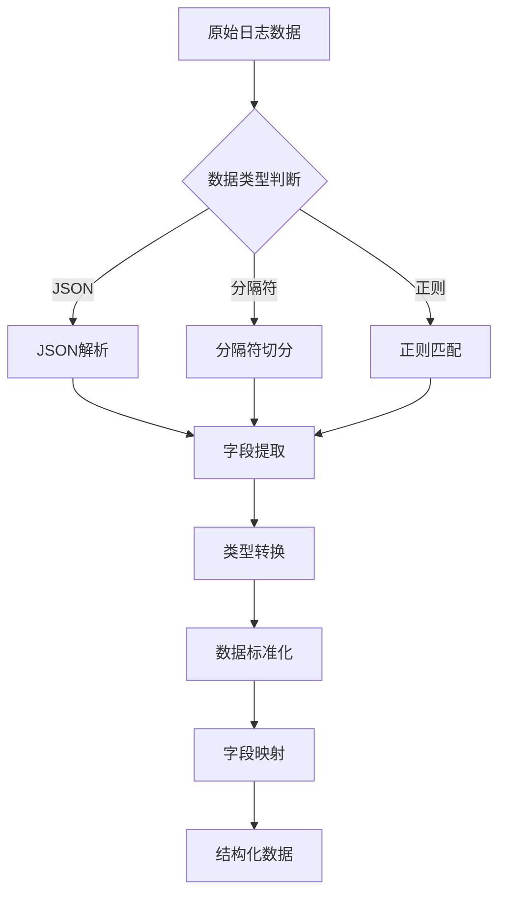
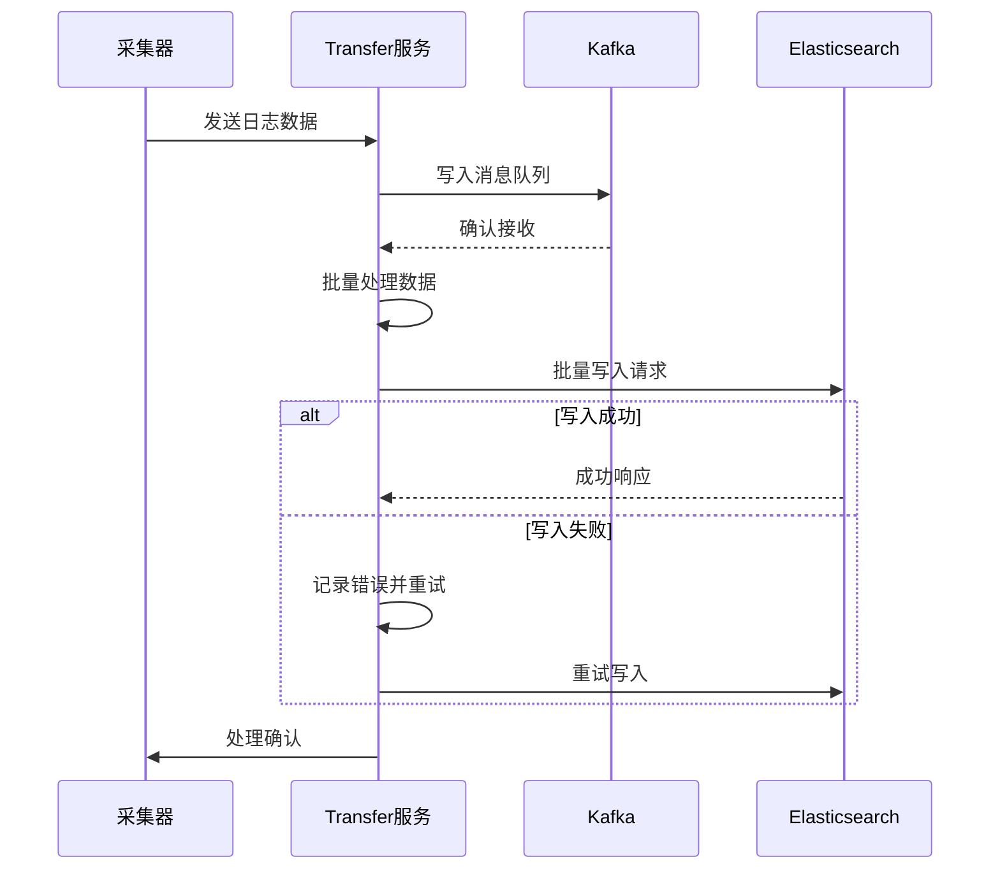
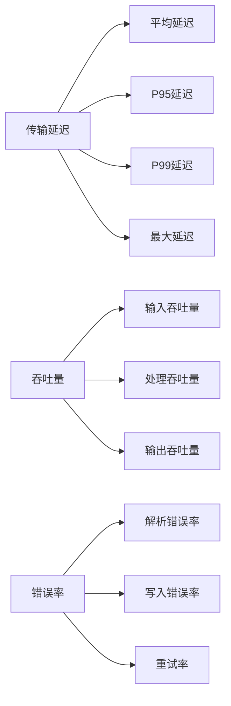
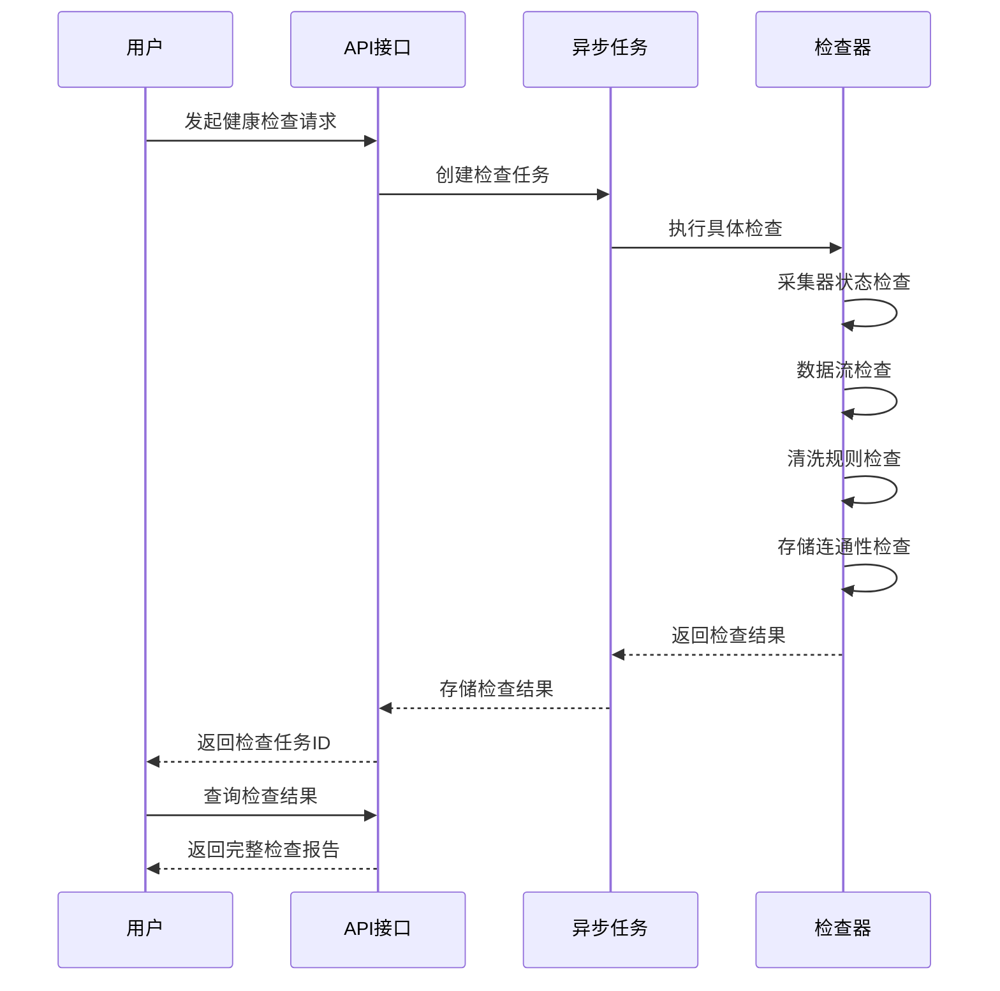

# 数据传输

<cite>
**本文档引用的文件**   
- [transfer.py](file://bklog/apps/log_databus/handlers/etl/transfer.py)
- [etl_storage/bk_log_json.py](file://bklog/apps/log_databus/handlers/etl_storage/bk_log_json.py)
- [etl_storage/bk_log_delimiter.py](file://bklog/apps/log_databus/handlers/etl_storage/bk_log_delimiter.py)
- [etl_storage/utils/transfer.py](file://bklog/apps/log_databus/handlers/etl_storage/utils/transfer.py)
- [storage.py](file://bklog/apps/log_databus/handlers/storage.py)
- [transfer_checker.py](file://bklog/apps/log_databus/handlers/check_collector/checker/transfer_checker.py)
- [check_collector_views.py](file://bklog/apps/log_databus/views/check_collector_views.py)
- [constants.py](file://bklog/apps/log_databus/constants.py)
</cite>

## 目录
1. [日志数据传输流程](#日志数据传输流程)
2. [ETL流程实现机制](#etl流程实现机制)
3. [数据转发到Elasticsearch实现细节](#数据转发到elasticsearch实现细节)
4. [性能监控指标](#性能监控指标)
5. [健康检查机制](#健康检查机制)
6. [数据格式转换示例](#数据格式转换示例)
7. [性能优化建议](#性能优化建议)

## 日志数据传输流程

日志数据从采集端到存储端的传输过程遵循一个完整的ETL（提取、转换、加载）流程。整个流程始于日志采集器（如bkunifylogbeat）从各种数据源收集原始日志数据，这些数据随后被发送到数据传输服务（Transfer）进行处理。

数据首先通过Kafka等消息队列进行缓冲，确保数据传输的可靠性和稳定性。在数据进入处理管道后，系统会根据预定义的ETL配置对数据进行清洗和转换。这个过程包括字段提取、格式标准化、数据类型转换等操作，将非结构化的原始日志转换为结构化的数据格式。

处理后的数据最终被写入Elasticsearch集群进行存储和索引。整个传输链路设计为高可用架构，支持批量写入、错误重试和流量控制，确保在高负载情况下仍能稳定运行。系统还提供了完善的监控和健康检查机制，可以实时跟踪数据传输的状态和性能指标。

**Section sources**
- [transfer.py](file://bklog/apps/log_databus/handlers/etl/transfer.py#L42-L267)
- [storage.py](file://bklog/apps/log_databus/handlers/storage.py#L83-L768)

## ETL流程实现机制

ETL（提取、转换、加载）流程的实现机制基于灵活的插件化架构，支持多种数据清洗和转换方式。核心实现位于`etl_storage`模块中，通过不同的处理器类来处理不同类型的日志数据。

### 数据清洗与格式转换

系统支持多种ETL配置类型，包括JSON、分隔符、正则表达式等，每种类型都有对应的处理器实现。例如，`BkLogJsonEtlStorage`类负责处理JSON格式的日志数据，而`BkLogDelimiterEtlStorage`类则处理基于分隔符的日志数据。

数据清洗过程主要包括以下几个步骤：
1. **字段提取**：根据配置的分隔符或JSON路径提取原始数据中的字段
2. **类型转换**：将提取的字段转换为适当的Elasticsearch数据类型
3. **数据标准化**：统一时间格式、编码等数据属性
4. **字段映射**：将原始字段映射到目标索引的字段结构



**Diagram sources **
- [etl_storage/bk_log_json.py](file://bklog/apps/log_databus/handlers/etl_storage/bk_log_json.py#L29-L427)
- [etl_storage/bk_log_delimiter.py](file://bklog/apps/log_databus/handlers/etl_storage/bk_log_delimiter.py#L43-L505)

### 字段提取处理逻辑

字段提取的处理逻辑通过`etl_preview`方法实现，该方法接受原始日志数据和ETL参数，返回提取后的字段列表。对于JSON格式的数据，系统使用内置的JSON解析器来提取字段；对于分隔符格式的数据，则根据配置的分隔符进行字符串分割。

在处理过程中，系统会维护一个字段索引，记录每个字段的位置、名称和类型信息。对于需要删除的字段，系统会在配置中标记为删除状态，而在最终的输出中将其排除。系统还支持保留原始日志文本的选项，将原始数据作为一个特殊字段存储，便于后续的审计和调试。

**Section sources**
- [etl_storage/bk_log_json.py](file://bklog/apps/log_databus/handlers/etl_storage/bk_log_json.py#L32-L84)
- [etl_storage/bk_log_delimiter.py](file://bklog/apps/log_databus/handlers/etl_storage/bk_log_delimiter.py#L46-L71)
- [etl_storage/utils/transfer.py](file://bklog/apps/log_databus/handlers/etl_storage/utils/transfer.py#L34-L102)

## 数据转发到Elasticsearch实现细节

数据转发到Elasticsearch的实现细节涉及批量写入、错误重试和流量控制等多个方面，确保数据能够高效、可靠地存储。

### 批量写入策略

系统采用批量写入策略来提高数据写入效率。数据首先在内存中积累到一定数量或达到时间窗口后，一次性批量写入Elasticsearch。这种策略减少了网络往返次数和Elasticsearch的索引开销，显著提高了写入吞吐量。

批量大小可以通过配置进行调整，通常在1000-5000条记录之间。系统会根据Elasticsearch集群的负载情况动态调整批量大小，避免对存储集群造成过大压力。同时，系统还实现了批量写入的超时机制，防止数据在内存中积压过久。

### 错误重试机制

为了确保数据不丢失，系统实现了完善的错误重试机制。当向Elasticsearch写入数据失败时，系统会根据错误类型采取不同的重试策略：

- **临时性错误**（如网络超时、连接拒绝）：立即进行重试，最多重试3次
- **资源不足错误**（如集群过载）：采用指数退避策略，逐步增加重试间隔
- **永久性错误**（如数据格式错误）：将错误数据写入专门的错误日志，便于后续分析

重试过程中，系统会记录每次重试的详细信息，包括错误原因、重试次数和时间戳，这些信息可用于故障排查和性能分析。

### 流量控制策略

流量控制策略用于防止数据生产速度超过消费能力，导致系统崩溃或数据丢失。系统实现了基于令牌桶算法的流量控制机制，通过限制单位时间内的数据处理量来平滑流量波动。

当系统检测到处理延迟增加或资源使用率过高时，会自动降低数据采集速率或暂时暂停非关键数据的采集。同时，系统还支持基于优先级的流量控制，确保关键业务日志的优先处理。



**Diagram sources **
- [transfer.py](file://bklog/apps/log_databus/handlers/etl/transfer.py#L42-L267)
- [storage.py](file://bklog/apps/log_databus/handlers/storage.py#L83-L768)

**Section sources**
- [transfer.py](file://bklog/apps/log_databus/handlers/etl/transfer.py#L42-L267)
- [storage.py](file://bklog/apps/log_databus/handlers/storage.py#L83-L768)

## 性能监控指标

系统提供了全面的性能监控指标，用于跟踪数据传输过程中的关键性能参数。这些指标通过Prometheus等监控系统收集和展示，帮助运维人员及时发现和解决性能问题。

### 传输延迟

传输延迟是指日志数据从产生到成功写入Elasticsearch的时间差。系统通过在数据中添加时间戳来测量传输延迟，主要监控以下指标：

- **平均延迟**：所有数据的平均传输时间
- **P95/P99延迟**：95%和99%的数据传输时间
- **最大延迟**：单条数据的最长传输时间

这些指标可以帮助识别传输链路中的瓶颈，如网络延迟、处理能力不足等问题。

### 吞吐量

吞吐量表示单位时间内处理的日志数据量，是衡量系统处理能力的重要指标。系统监控以下吞吐量指标：

- **输入吞吐量**：从采集器接收数据的速率（条/秒）
- **处理吞吐量**：ETL处理的速率（条/秒）
- **输出吞吐量**：写入Elasticsearch的速率（条/秒）

通过对比这些指标，可以判断系统是否存在处理瓶颈。例如，如果输入吞吐量远高于处理吞吐量，说明ETL处理能力不足。

### 错误率

错误率反映了数据传输过程中的可靠性，主要包括：

- **解析错误率**：ETL处理失败的比例
- **写入错误率**：向Elasticsearch写入失败的比例
- **重试率**：需要重试的数据比例

高错误率可能表明数据格式问题、配置错误或存储集群问题，需要及时排查。



**Diagram sources **
- [constants.py](file://bklog/apps/log_databus/constants.py#L575-L586)
- [metrics.py](file://bklog/apps/log_esquery/metrics.py#L7-L21)

**Section sources**
- [constants.py](file://bklog/apps/log_databus/constants.py#L575-L586)
- [metrics.py](file://bklog/apps/log_esquery/metrics.py#L7-L21)

## 健康检查机制

系统提供了完善的健康检查机制，用于验证数据通道的连通性和各组件的运行状态。健康检查功能主要通过`check_collector`模块实现，可以对整个数据传输链路进行全面的诊断。

### 数据通道连通性验证

健康检查模块通过以下步骤验证数据通道的连通性：

1. **采集器状态检查**：验证采集器进程是否正常运行，配置是否正确
2. **数据流检查**：从Kafka消费最新日志数据，验证数据是否正常流入
3. **清洗规则检查**：使用样本数据测试ETL清洗规则，验证字段提取是否正确
4. **存储连通性检查**：测试与Elasticsearch集群的连接，验证写入能力

检查结果会以结构化的格式返回，包含每个检查项的状态、详细信息和建议。系统还支持将检查结果持久化存储，便于历史对比和趋势分析。

### 检查流程实现

健康检查的实现基于异步任务机制，避免长时间的检查操作阻塞主线程。检查流程由`CheckCollectorViewSet`控制器触发，通过Celery任务队列执行具体的检查逻辑。

`TransferChecker`类负责执行与Transfer服务相关的检查，包括清洗规则测试和性能指标获取。检查过程中，系统会调用监控API获取Transfer服务的实时性能数据，如处理速率、错误计数等，综合判断服务的健康状态。



**Diagram sources **
- [check_collector_views.py](file://bklog/apps/log_databus/views/check_collector_views.py#L34-L50)
- [transfer_checker.py](file://bklog/apps/log_databus/handlers/check_collector/checker/transfer_checker.py#L43-L182)

**Section sources**
- [check_collector_views.py](file://bklog/apps/log_databus/views/check_collector_views.py#L34-L50)
- [transfer_checker.py](file://bklog/apps/log_databus/handlers/check_collector/checker/transfer_checker.py#L43-L182)

## 数据格式转换示例

以下是几种常见的数据格式转换示例，展示了从原始日志到结构化数据的转换规则。

### JSON格式转换

对于JSON格式的日志，系统会解析JSON对象并提取指定字段。例如，原始日志：
```json
{"time": "2023-01-01T12:00:00Z", "level": "ERROR", "message": "Database connection failed", "trace_id": "abc123"}
```

经过ETL处理后，转换为结构化数据：
```json
{
  "time": "2023-01-01T12:00:00Z",
  "level": "ERROR",
  "message": "Database connection failed",
  "trace_id": "abc123",
  "log": "{\"time\": \"2023-01-01T12:00:00Z\", \"level\": \"ERROR\", \"message\": \"Database connection failed\", \"trace_id\": \"abc123\"}"
}
```

### 分隔符格式转换

对于分隔符格式的日志，如CSV格式：
```
2023-01-01 12:00:00,ERROR,Database connection failed,abc123
```

系统根据配置的分隔符（逗号）进行切分，并映射到相应的字段：
```json
{
  "field1": "2023-01-01 12:00:00",
  "field2": "ERROR",
  "field3": "Database connection failed",
  "field4": "abc123",
  "log": "2023-01-01 12:00:00,ERROR,Database connection failed,abc123"
}
```

### 正则表达式转换

对于复杂的日志格式，可以使用正则表达式进行提取。例如，Apache访问日志：
```
192.168.1.1 - - [01/Jan/2023:12:00:00 +0000] "GET /api/users HTTP/1.1" 200 1234
```

通过正则表达式`^(\S+) \S+ \S+ \[([\w:/]+\s[+\-]\d{4})\] "(\S+) (\S+) (\S+)" (\d{3}) (\d+)`提取字段：
```json
{
  "client_ip": "192.168.1.1",
  "timestamp": "01/Jan/2023:12:00:00 +0000",
  "method": "GET",
  "path": "/api/users",
  "protocol": "HTTP/1.1",
  "status": "200",
  "size": "1234",
  "log": "192.168.1.1 - - [01/Jan/2023:12:00:00 +0000] \"GET /api/users HTTP/1.1\" 200 1234"
}
```

**Section sources**
- [etl_storage/bk_log_json.py](file://bklog/apps/log_databus/handlers/etl_storage/bk_log_json.py#L32-L84)
- [etl_storage/bk_log_delimiter.py](file://bklog/apps/log_databus/handlers/etl_storage/bk_log_delimiter.py#L46-L71)

## 性能优化建议

为了提高数据传输效率，建议从以下几个方面进行性能优化：

### 批量大小调整

批量大小是影响写入性能的关键参数。建议根据以下原则调整批量大小：

- **初始设置**：从1000条记录开始，作为基准值
- **性能测试**：在测试环境中逐步增加批量大小，观察Elasticsearch的响应时间和资源使用率
- **最优值确定**：找到在不导致Elasticsearch过载情况下的最大批量大小
- **动态调整**：根据系统负载动态调整批量大小，高负载时减小批量，低负载时增大批量

通常，批量大小在2000-5000条之间能获得较好的性能平衡。

### 并发数优化

并发数决定了同时处理数据的线程或进程数量。优化建议包括：

- **CPU核心数匹配**：并发数不宜超过CPU核心数的2-3倍，避免过度上下文切换
- **内存限制**：考虑每个并发任务的内存占用，确保总内存使用在安全范围内
- **I/O瓶颈**：监控磁盘I/O和网络带宽，避免并发过高导致I/O瓶颈
- **逐步增加**：从较低的并发数开始，逐步增加并观察系统性能变化

### 其他优化策略

- **索引优化**：合理设置Elasticsearch的分片数和副本数，避免过多分片导致管理开销过大
- **硬件升级**：对于高吞吐量场景，考虑使用SSD存储和更高性能的网络设备
- **数据压缩**：在传输过程中启用数据压缩，减少网络带宽消耗
- **缓存机制**：对于频繁访问的元数据，使用本地缓存减少数据库查询

通过综合运用这些优化策略，可以显著提高数据传输系统的整体性能和稳定性。

**Section sources**
- [transfer.py](file://bklog/apps/log_databus/handlers/etl/transfer.py#L42-L267)
- [storage.py](file://bklog/apps/log_databus/handlers/storage.py#L83-L768)
- [constants.py](file://bklog/apps/log_databus/constants.py#L575-L586)