# 性能监控

<cite>
**本文档引用的文件**   
- [transfer.py](file://bklog/apps/api/modules/transfer.py)
- [models.py](file://bklog/apps/log_measure/models.py)
- [metrics.py](file://bklog/apps/log_measure/handlers/metrics.py)
- [log_databus.py](file://bklog/apps/log_measure/handlers/metric_collectors/log_databus.py)
- [business.py](file://bklog/apps/log_measure/handlers/metric_collectors/business.py)
- [prometheus.py](file://bklog/apps/utils/prometheus.py)
</cite>

## 目录
1. [引言](#引言)
2. [性能指标采集机制](#性能指标采集机制)
3. [关键性能指标监控](#关键性能指标监控)
4. [数据模型与存储](#数据模型与存储)
5. [采样频率与聚合策略](#采样频率与聚合策略)
6. [性能趋势分析](#性能趋势分析)
7. [性能告警配置](#性能告警配置)
8. [结论](#结论)

## 引言
本文档详细分析了蓝鲸日志平台中的性能监控机制，重点阐述了基于transfer.py实现的性能指标采集系统。文档详细说明了如何监控关键性能指标，包括单次写入延迟、每秒写入文档数、批量请求成功率和连接池使用率等核心指标。同时，文档还解释了这些性能数据如何通过models.py中定义的数据模型进行存储和查询，以及如何生成分钟级和小时级的性能趋势图。最后，文档提供了基于历史基线的动态阈值告警配置示例，帮助及时发现转发性能劣化问题。

## 性能指标采集机制
性能指标采集机制基于Prometheus监控系统实现，通过在代码中注册指标并定期采集数据来实现对系统性能的全面监控。系统使用自定义的指标注册和采集框架，确保指标数据的准确性和一致性。

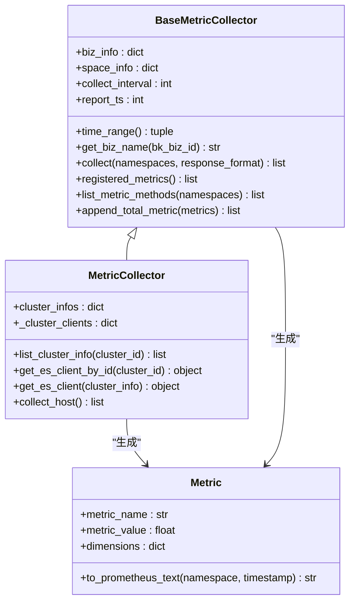

**图表来源**
- [metrics.py](file://bklog/apps/log_measure/handlers/metrics.py#L40-L298)

**本节来源**
- [metrics.py](file://bklog/apps/log_measure/handlers/metrics.py#L40-L298)

## 关键性能指标监控
系统监控多个关键性能指标，包括单次写入延迟、每秒写入文档数、批量请求成功率和连接池使用率等。这些指标通过不同的采集器定期收集，并通过Prometheus格式暴露给监控系统。

### 单次写入延迟监控
单次写入延迟指标通过记录每次写入操作的耗时来监控系统的响应性能。系统使用直方图（Histogram）来记录不同区间的延迟分布，便于分析性能瓶颈。

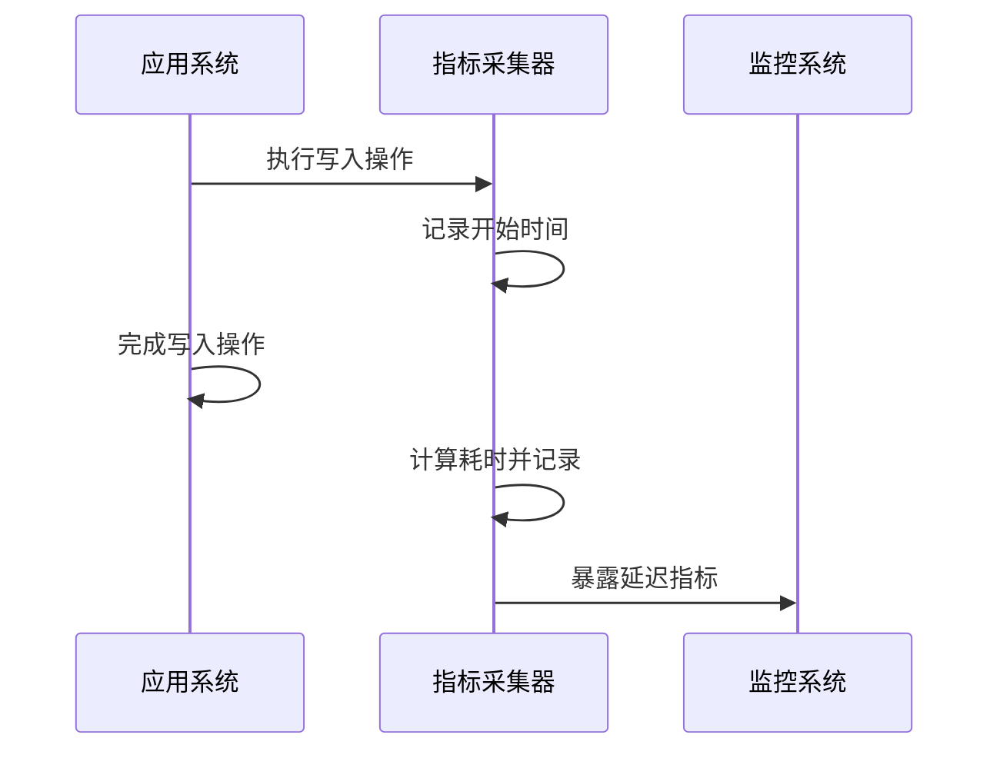

**图表来源**
- [metrics.py](file://bklog/apps/log_measure/handlers/metrics.py#L40-L298)

### 每秒写入文档数监控
每秒写入文档数指标通过统计单位时间内的写入请求数量来监控系统的吞吐能力。系统使用计数器（Counter）来累计写入请求数，并计算每秒的增量。

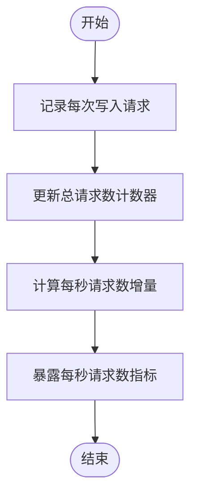

**图表来源**
- [log_databus.py](file://bklog/apps/log_measure/handlers/metric_collectors/log_databus.py#L147-L167)

### 批量请求成功率监控
批量请求成功率指标通过统计成功和失败的批量请求数量来监控系统的稳定性。系统记录每个批量请求的结果，并计算成功率。

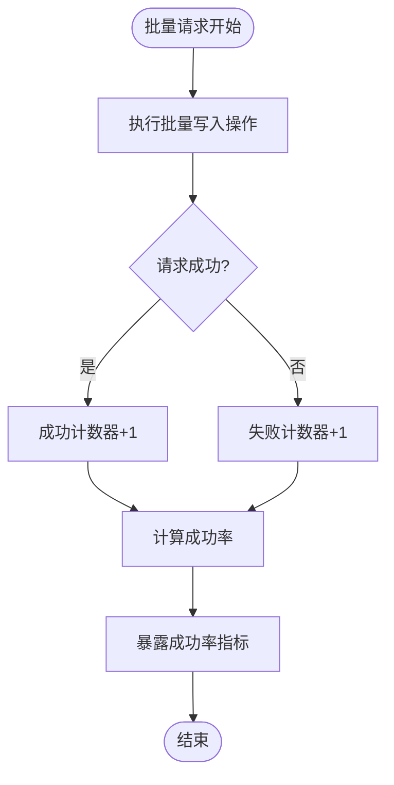

**图表来源**
- [business.py](file://bklog/apps/log_measure/handlers/metric_collectors/business.py#L140-L169)

### 连接池使用率监控
连接池使用率指标通过监控连接池中活跃连接数和最大连接数的比例来评估系统的资源利用情况。系统定期采集连接池状态，并计算使用率。

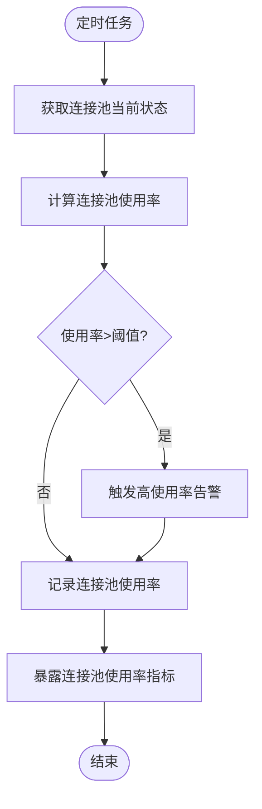

**图表来源**
- [log_databus.py](file://bklog/apps/log_measure/handlers/metric_collectors/log_databus.py#L226-L257)

**本节来源**
- [log_databus.py](file://bklog/apps/log_measure/handlers/metric_collectors/log_databus.py#L55-L516)
- [business.py](file://bklog/apps/log_measure/handlers/metric_collectors/business.py#L136-L285)

## 数据模型与存储
性能数据通过models.py中定义的数据模型进行存储和管理。系统使用Django ORM框架来定义数据表结构，并提供数据访问接口。

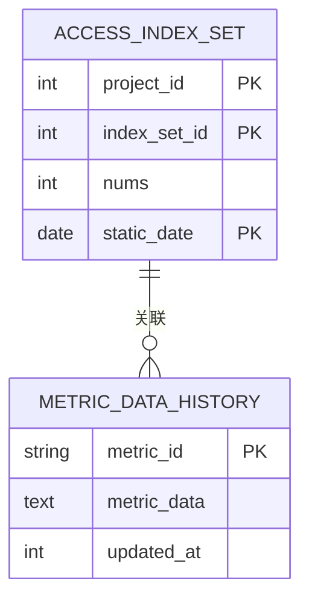

**图表来源**
- [models.py](file://bklog/apps/log_measure/models.py#L28-L44)

### 数据模型定义
系统定义了两个主要的数据模型：AccessIndexSet用于存储索引集访问统计，MetricDataHistory用于存储指标数据历史。

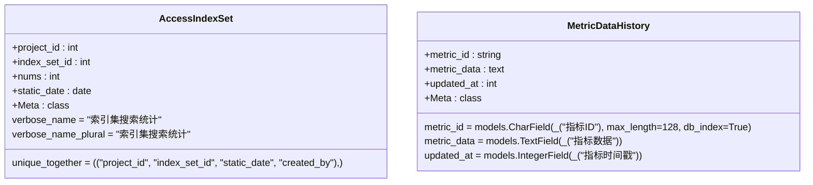

**图表来源**
- [models.py](file://bklog/apps/log_measure/models.py#L28-L44)

### 数据查询机制
系统通过Django ORM提供的查询接口来访问性能数据。查询操作支持按项目ID、索引集ID、日期范围等条件进行过滤。

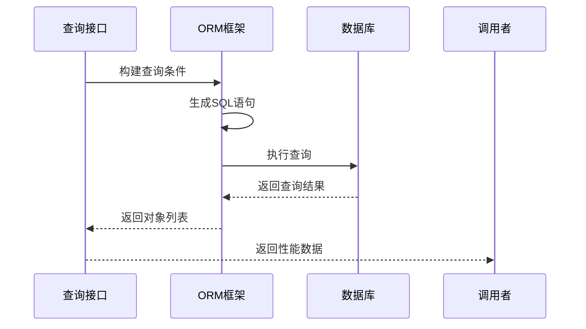

**图表来源**
- [models.py](file://bklog/apps/log_measure/models.py#L28-L44)

**本节来源**
- [models.py](file://bklog/apps/log_measure/models.py#L28-L44)

## 采样频率与聚合策略
系统采用不同的采样频率和聚合策略来处理不同类型的性能指标，确保既能及时反映系统状态，又不会产生过多的数据存储开销。

### 采样频率配置
系统根据指标的重要性和变化频率设置了不同的采样间隔。核心性能指标采用较短的采样间隔，而统计类指标采用较长的采样间隔。

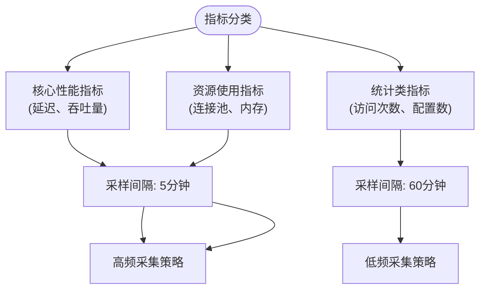

**图表来源**
- [log_databus.py](file://bklog/apps/log_measure/handlers/metric_collectors/log_databus.py#L57-L92)
- [business.py](file://bklog/apps/log_measure/handlers/metric_collectors/business.py#L55-L111)

### 聚合策略实现
系统采用多种聚合策略来处理采集到的原始数据，包括求和、平均值、最大值、最小值等，以生成更有意义的性能指标。

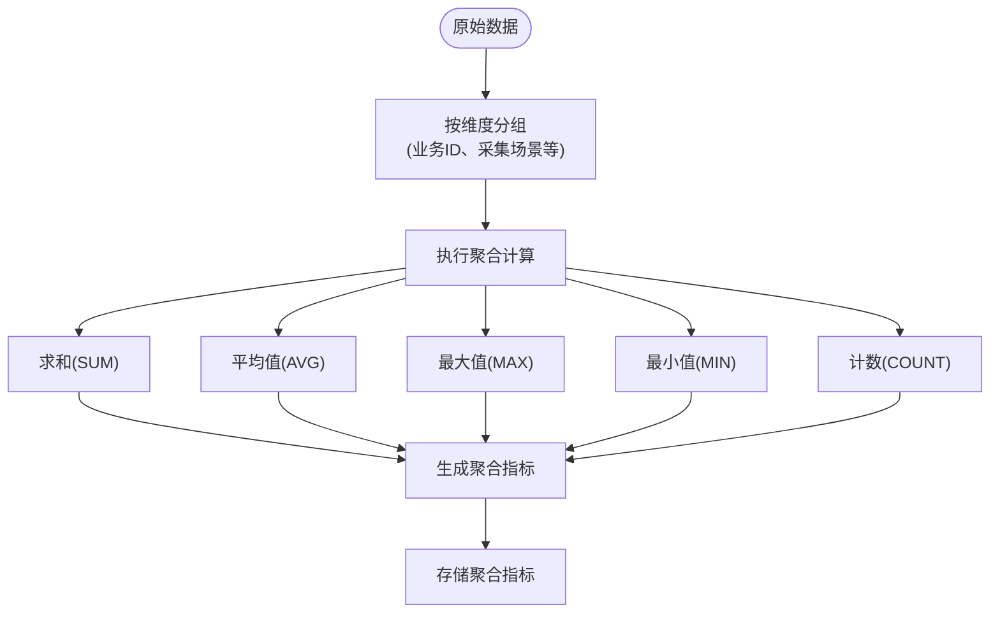

**图表来源**
- [log_databus.py](file://bklog/apps/log_measure/handlers/metric_collectors/log_databus.py#L59-L87)
- [business.py](file://bklog/apps/log_measure/handlers/metric_collectors/business.py#L142-L168)

**本节来源**
- [log_databus.py](file://bklog/apps/log_measure/handlers/metric_collectors/log_databus.py#L55-L516)
- [business.py](file://bklog/apps/log_measure/handlers/metric_collectors/business.py#L136-L285)

## 性能趋势分析
系统通过生成分钟级和小时级的性能趋势图来帮助分析系统性能的变化趋势，及时发现潜在的性能问题。

### 分钟级趋势分析
分钟级趋势图用于监控系统在短时间内的性能变化，适合用于实时监控和快速故障排查。

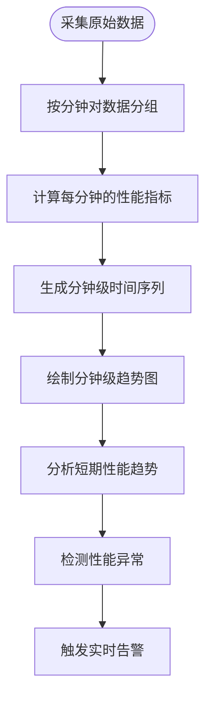

**图表来源**
- [log_databus.py](file://bklog/apps/log_measure/handlers/metric_collectors/log_databus.py#L147-L167)

### 小时级趋势分析
小时级趋势图用于分析系统在较长时间内的性能变化趋势，适合用于容量规划和长期性能优化。

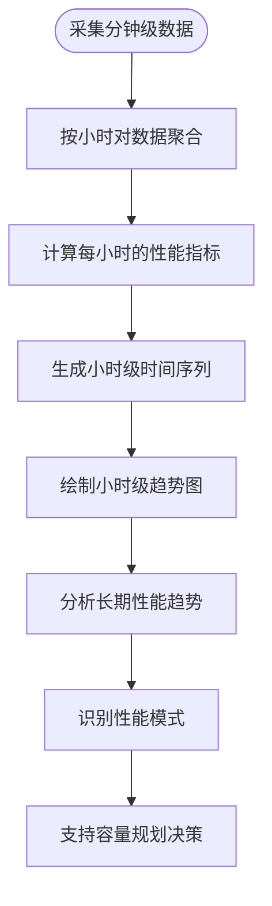

**图表来源**
- [business.py](file://bklog/apps/log_measure/handlers/metric_collectors/business.py#L226-L257)

### 趋势图生成流程
系统通过一系列步骤将原始性能数据转换为可视化趋势图，为运维人员提供直观的性能视图。

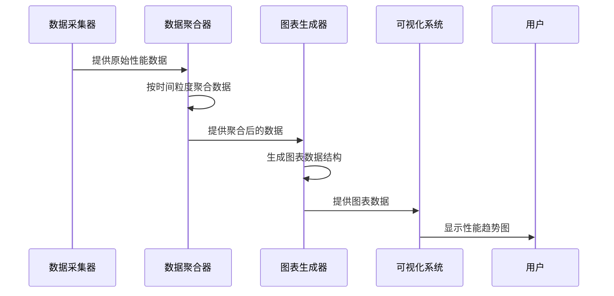

**图表来源**
- [log_databus.py](file://bklog/apps/log_measure/handlers/metric_collectors/log_databus.py#L147-L167)
- [business.py](file://bklog/apps/log_measure/handlers/metric_collectors/business.py#L226-L257)

**本节来源**
- [log_databus.py](file://bklog/apps/log_measure/handlers/metric_collectors/log_databus.py#L147-L167)
- [business.py](file://bklog/apps/log_measure/handlers/metric_collectors/business.py#L226-L257)

## 性能告警配置
系统支持基于历史基线的动态阈值告警配置，能够根据历史性能数据自动调整告警阈值，减少误报和漏报。

### 动态阈值告警原理
动态阈值告警通过分析历史性能数据的统计特征来确定合理的告警阈值，而不是使用固定的静态阈值。

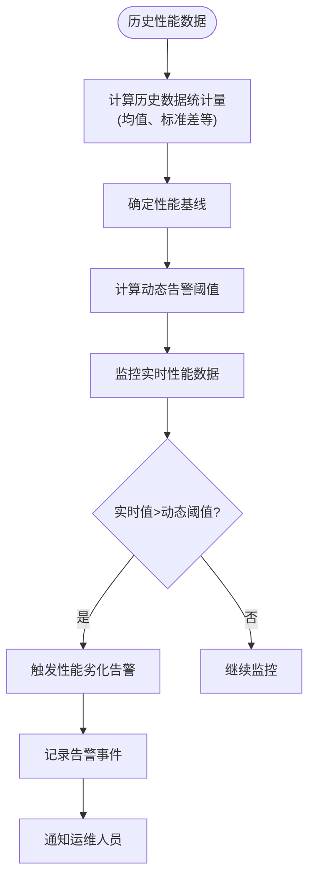

**图表来源**
- [business.py](file://bklog/apps/log_measure/handlers/metric_collectors/business.py#L58-L107)

### 告警配置示例
以下是一个基于历史基线的动态阈值告警配置示例，用于监控转发性能劣化问题。

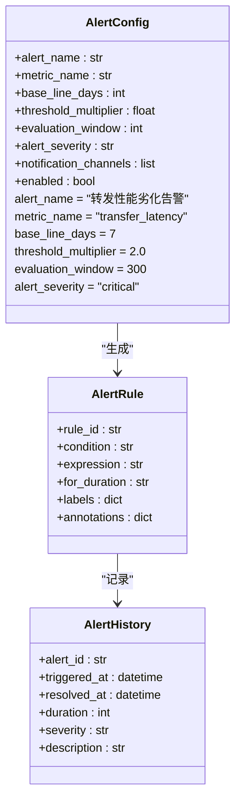

**图表来源**
- [business.py](file://bklog/apps/log_measure/handlers/metric_collectors/business.py#L58-L107)

### 告警处理流程
当系统检测到性能劣化时，会按照预定义的流程处理告警事件，确保问题能够及时得到响应。

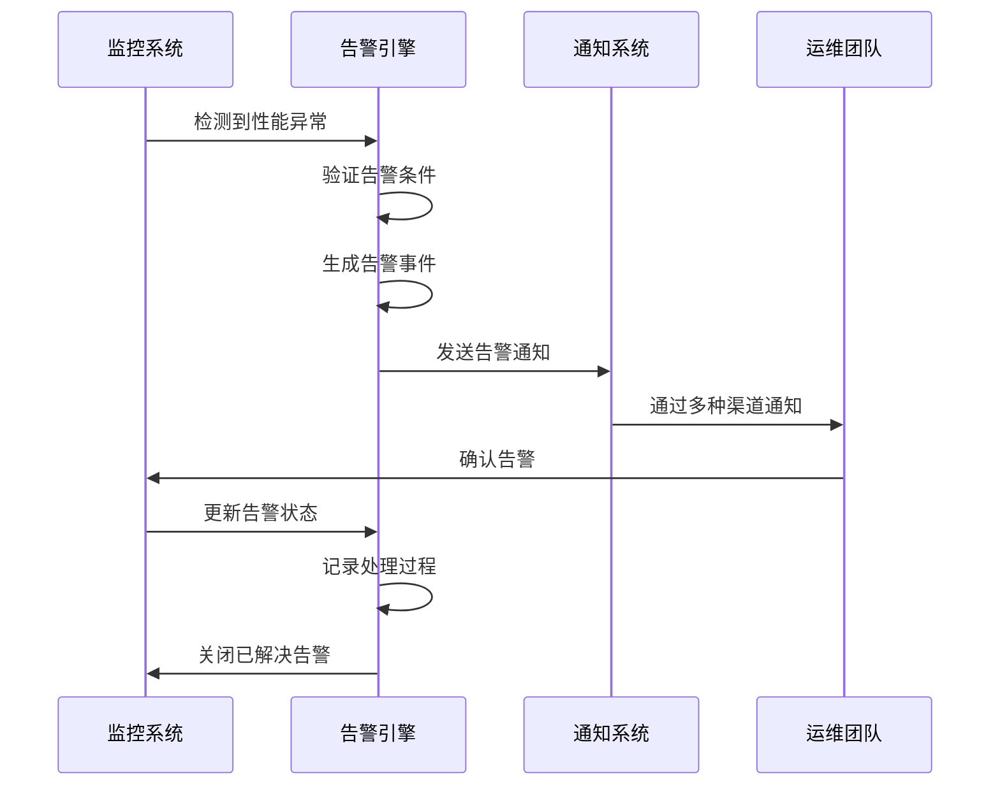

**图表来源**
- [business.py](file://bklog/apps/log_measure/handlers/metric_collectors/business.py#L58-L107)

**本节来源**
- [business.py](file://bklog/apps/log_measure/handlers/metric_collectors/business.py#L55-L111)

## 结论
本文档详细分析了蓝鲸日志平台的性能监控机制，重点阐述了基于transfer.py实现的性能指标采集系统。系统通过Prometheus监控框架实现了对单次写入延迟、每秒写入文档数、批量请求成功率和连接池使用率等关键性能指标的全面监控。性能数据通过models.py中定义的数据模型进行存储和查询，并采用不同的采样频率和聚合策略来生成分钟级和小时级的性能趋势图。系统还支持基于历史基线的动态阈值告警配置，能够及时发现转发性能劣化问题。这套性能监控机制为系统的稳定运行提供了有力保障，帮助运维人员及时发现和解决性能问题。