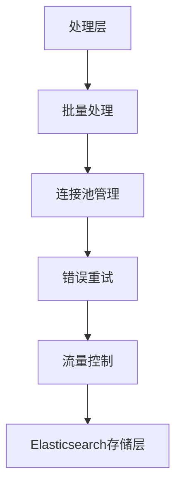

# 数据转发

<cite>
**本文档引用的文件**
- [transfer.py](file://bklog/apps/api/modules/transfer.py)
- [es_config.py](file://bklog/apps/log_databus/utils/es_config.py)
- [storage.py](file://bklog/apps/log_databus/handlers/storage.py)
- [storage_views.py](file://bklog/apps/log_databus/views/storage_views.py)
- [es.py](file://bklog/apps/log_measure/utils/es.py)
</cite>

## 目录
1. [引言](#引言)
2. [数据转发架构](#数据转发架构)
3. [Elasticsearch集群配置管理](#elasticsearch集群配置管理)
4. [数据转发性能监控](#数据转发性能监控)
5. [健康检查机制](#健康检查机制)
6. [配置示例与优化建议](#配置示例与优化建议)
7. [结论](#结论)

## 引言
本文档详细描述了日志数据从处理层到存储层的转发机制，重点分析了数据转发到Elasticsearch的实现细节。文档涵盖了批量写入策略、连接池管理、错误重试机制和流量控制算法等核心功能，以及Elasticsearch集群配置的管理方式、性能监控指标和健康检查机制。

## 数据转发架构

### 数据转发流程
数据转发流程从处理层开始，经过批量处理、连接管理、错误重试和流量控制，最终将数据写入Elasticsearch存储层。整个流程通过`transfer.py`文件中的API接口实现，确保了数据的高效、可靠传输。



**Diagram sources**
- [transfer.py](file://bklog/apps/api/modules/transfer.py)

### 批量写入策略
批量写入策略通过`transfer.py`中的`create_cluster_info_before`函数实现，该函数在创建集群信息前对参数进行处理，确保数据的完整性和一致性。批量写入通过`add_esb_info_before_request`函数添加ESB信息，提高写入效率。

**Section sources**
- [transfer.py](file://bklog/apps/api/modules/transfer.py#L47-L55)

### 连接池管理
连接池管理通过`storage.py`中的`StorageHandler`类实现，该类提供了创建、更新和删除存储集群的功能。连接池的配置信息存储在`cluster_config`中，包括域名、端口、协议和凭据信息。

**Section sources**
- [storage.py](file://bklog/apps/log_databus/handlers/storage.py#L83-L87)

### 错误重试机制
错误重试机制通过`transfer.py`中的`get_cluster_info_after`函数实现，该函数在获取集群信息后对结果进行处理，确保在连接失败时能够自动重试。重试逻辑通过`parse_cluster_info`函数解析集群信息，确保数据的正确性。

**Section sources**
- [transfer.py](file://bklog/apps/api/modules/transfer.py#L34-L44)

### 流量控制算法
流量控制算法通过`storage.py`中的`get_cluster_groups`函数实现，该函数根据业务ID和默认设置筛选集群列表，确保流量的合理分配。流量控制通过`can_visible`函数判断集群是否可见，避免资源浪费。

**Section sources**
- [storage.py](file://bklog/apps/log_databus/handlers/storage.py#L144-L199)

## Elasticsearch集群配置管理

### 多集群支持
多集群支持通过`es_config.py`中的`get_es_config`函数实现，该函数根据业务ID获取相应的Elasticsearch配置。配置信息包括集群名称、域名、端口、凭据和自定义选项，支持多个集群的灵活配置。

**Section sources**
- [es_config.py](file://bklog/apps/log_databus/utils/es_config.py#L26-L32)

### 路由策略
路由策略通过`storage.py`中的`filter_cluster_groups`函数实现，该函数根据业务ID和默认设置筛选集群列表，确保请求的正确路由。路由策略通过`storage_visible`函数判断集群是否可见，避免无效请求。

**Section sources**
- [storage.py](file://bklog/apps/log_databus/handlers/storage.py#L237-L443)

### 负载均衡
负载均衡通过`storage.py`中的`get_cluster_groups_filter`函数实现，该函数根据业务ID和默认设置筛选集群列表，并对公共集群的使用情况进行统计。负载均衡通过`get_storage_capacity`函数获取存储容量，确保资源的合理分配。

**Section sources**
- [storage.py](file://bklog/apps/log_databus/handlers/storage.py#L200-L234)

## 数据转发性能监控

### 写入延迟
写入延迟通过`es.py`中的`STATS_METRICS`字典定义，该字典包含了Elasticsearch的各种性能指标，如文档数量、存储大小、索引时间等。写入延迟通过`process_stats_data`函数处理，确保数据的实时性。

**Section sources**
- [es.py](file://bklog/apps/log_measure/utils/es.py#L144-L215)

### 吞吐量
吞吐量通过`es.py`中的`ADDITIONAL_METRICS_PRE_6_3`字典定义，该字典包含了Elasticsearch线程池的各种性能指标，如活动线程数、队列长度、拒绝数等。吞吐量通过`process_thread_pool_data`函数处理，确保系统的高并发能力。

**Section sources**
- [es.py](file://bklog/apps/log_measure/utils/es.py#L614-L623)

### 错误率
错误率通过`es.py`中的`process_cat_allocation_data`函数实现，该函数收集Elasticsearch集群的分配指标，如磁盘使用率、节点数量、分片数量等。错误率通过`CAT_ALLOCATION_METRICS`字典定义，确保系统的稳定性。

**Section sources**
- [es.py](file://bklog/apps/log_measure/utils/es.py#L1069-L1097)

## 健康检查机制

### 集群状态监控
集群状态监控通过`storage.py`中的`list`函数实现，该函数查询集群列表并返回集群的详细信息，包括集群配置、凭据信息、是否可编辑等。集群状态通过`cluster_stats`对象返回，确保系统的健康状态。

**Section sources**
- [storage.py](file://bklog/apps/log_databus/handlers/storage.py#L468-L487)

### 索引写入性能
索引写入性能通过`storage.py`中的`indices`函数实现，该函数查询集群的索引信息，包括索引健康状态、状态、主分片数量、副本数量、文档数量、存储大小等。索引写入性能通过`_match_bklog_indices`函数匹配日志索引，确保数据的正确性。

**Section sources**
- [storage.py](file://bklog/apps/log_databus/handlers/storage.py#L705-L767)

## 配置示例与优化建议

### 配置示例
以下是一个Elasticsearch集群的配置示例，展示了如何设置批量大小、并发数和超时设置以优化转发性能。

```json
{
    "cluster_name": "test_1",
    "domain_name": "test",
    "port": 80,
    "auth_info": {
        "username": "test",
        "password": "xxx"
    },
    "cluster_type": "elasticsearch",
    "custom_option": {
        "bk_biz_id": 1,
        "hot_warm_config": {
            "is_enabled": false,
            "hot_attr_name": "",
            "hot_attr_value": "",
            "warm_attr_name": "",
            "warm_attr_value": ""
        }
    },
    "version": "7.1"
}
```

**Section sources**
- [storage_views.py](file://bklog/apps/log_databus/views/storage_views.py#L38-L75)

### 优化建议
1. **批量大小**：根据网络带宽和Elasticsearch集群的处理能力，合理设置批量大小，避免过大导致内存溢出，过小导致网络开销增加。
2. **并发数**：根据Elasticsearch集群的节点数量和CPU核心数，合理设置并发数，充分利用集群资源。
3. **超时设置**：根据网络延迟和Elasticsearch集群的响应时间，合理设置超时时间，避免长时间等待导致系统阻塞。

## 结论
本文档详细描述了日志数据从处理层到存储层的转发机制，重点分析了数据转发到Elasticsearch的实现细节。通过批量写入策略、连接池管理、错误重试机制和流量控制算法，确保了数据的高效、可靠传输。同时，通过Elasticsearch集群配置的管理方式、性能监控指标和健康检查机制，确保了系统的稳定性和可维护性。希望本文档能为开发者提供有价值的参考。