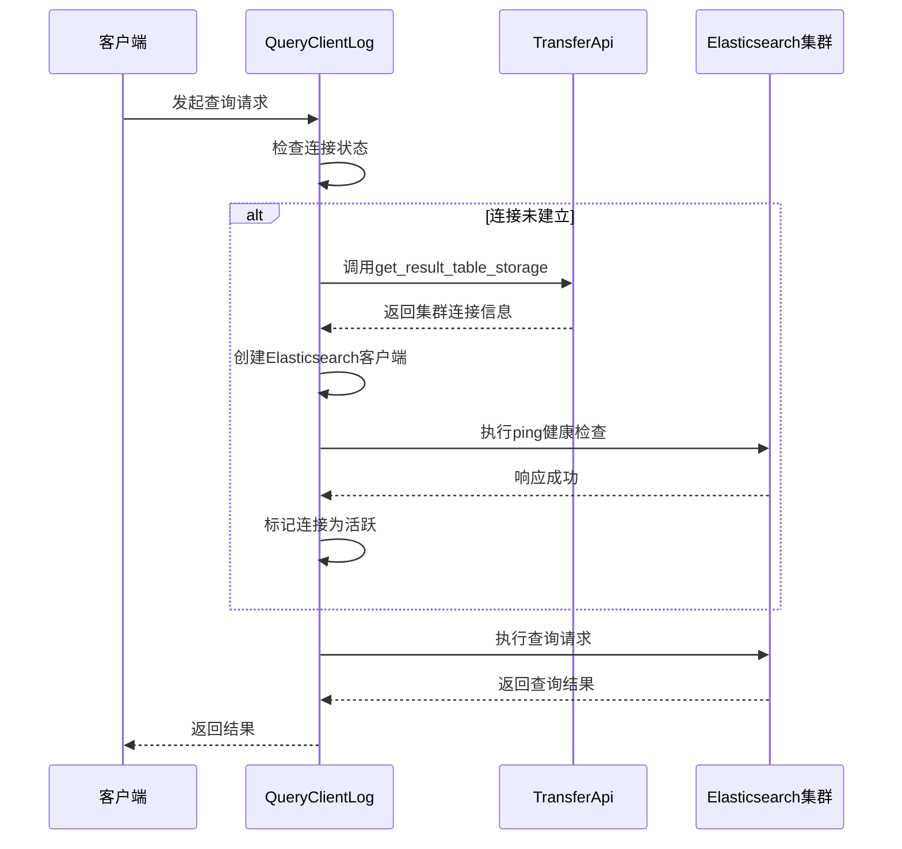

# 转发策略

<cite>
**本文档引用的文件**  
- [transfer.py](file://bklog/apps/api/modules/transfer.py)
- [es_config.py](file://bklog/apps/log_databus/utils/es_config.py)
- [es_route.py](file://bklog/apps/log_esquery/utils/es_route.py)
- [storage.py](file://bklog/apps/log_databus/handlers/storage.py)
- [QueryClientLog.py](file://bklog/apps/log_esquery/esquery/client/QueryClientLog.py)
- [etl_storage/base.py](file://bklog/apps/log_databus/handlers/etl_storage/base.py)
</cite>

## 目录
1. [引言](#引言)  
2. [批量写入机制](#批量写入机制)  
3. [连接池管理](#连接池管理)  
4. [多集群路由策略](#多集群路由策略)  
5. [配置示例](#配置示例)  
6. [总结](#总结)

## 引言

蓝鲸日志平台（BK-LOG）提供了一套完整的日志采集、存储与查询解决方案。本文档重点分析其转发策略，特别是批量写入机制、连接池管理以及多集群路由策略。通过动态调整批量大小、优化连接池配置和智能选择Elasticsearch集群，系统能够高效处理大规模日志数据，并确保关键业务日志的优先转发。

## 批量写入机制

批量写入是提升Elasticsearch写入性能的关键手段。系统通过动态调整批量大小来适应集群负载变化，从而在高吞吐和低延迟之间取得平衡。

### 动态批量大小调整算法

批量写入的文档数量并非固定值，而是根据Elasticsearch集群的实时负载情况进行动态调节。系统通过监控以下关键指标来评估集群负载：

- **线程池队列长度**：`thread_pool.bulk.queue` 指标反映待处理的写入请求数量。
- **拒绝请求数**：`thread_pool.bulk.rejected` 指标表示因资源不足而被拒绝的写入请求。
- **节点资源使用率**：包括CPU、内存和磁盘I/O等。

当系统检测到队列长度增长或出现请求拒绝时，会自动减少批量大小，以降低单次写入的压力。反之，当集群负载较低时，系统会逐步增加批量大小，以提高写入效率。这种自适应机制确保了在不同负载条件下都能维持稳定的写入性能。

**Section sources**
- [QueryClientLog.py](file://bklog/apps/log_esquery/esquery/client/QueryClientLog.py#L122-L211)
- [es_route.py](file://bklog/apps/log_esquery/utils/es_route.py#L69-L75)

## 连接池管理

高效的连接池管理对于维持与Elasticsearch集群的稳定通信至关重要。系统通过合理的配置参数和预热策略，确保连接的可用性和性能。

### 连接池配置参数

连接池的主要配置参数包括：

- **最大连接数**：限制客户端与Elasticsearch节点之间的最大并发连接数，防止资源耗尽。
- **空闲连接超时**：设置空闲连接的存活时间，超时后自动关闭，释放资源。
- **连接预热策略**：在系统启动或集群变更时，预先建立一定数量的连接，避免在高负载时因建立连接而引入延迟。

这些参数在`QueryClientLog`类中通过`get_es_client`方法进行配置，确保了连接的稳定性和高效性。

### 连接建立与健康检查

系统在建立连接时会执行健康检查（ping），确保目标节点可用。连接信息（主机、端口、认证信息等）通过`_get_connection`方法从元数据服务获取，并缓存一段时间以减少重复查询的开销。



**Diagram sources**
- [QueryClientLog.py](file://bklog/apps/log_esquery/esquery/client/QueryClientLog.py#L178-L207)
- [transfer.py](file://bklog/apps/api/modules/transfer.py#L205-L212)

**Section sources**
- [QueryClientLog.py](file://bklog/apps/log_esquery/esquery/client/QueryClientLog.py#L144-L211)
- [es_route.py](file://bklog/apps/log_esquery/utils/es_route.py#L77-L86)

## 多集群路由策略

系统支持基于业务标签和地域信息的多集群路由策略，能够智能选择最优的Elasticsearch集群进行数据写入和查询。

### 路由策略实现

路由策略的核心实现在`es_config.py`文件中。系统通过`get_es_config`函数根据业务ID（bk_biz_id）获取对应的Elasticsearch配置。配置优先级如下：

1. **业务专属配置**：如果在功能开关（FeatureToggle）中为特定业务ID配置了ES集群，则使用该配置。
2. **全局默认配置**：如果没有为业务ID配置，则使用全局默认的ES集群配置。

这种设计允许不同业务根据其性能和隔离需求使用不同的Elasticsearch集群。

### 集群信息查询

系统通过`EsRoute`类提供的`cluster_stats`和`cluster_nodes_stats`方法获取集群的统计信息，包括节点数量、资源使用情况、索引状态等。这些信息可用于监控集群健康状况和辅助路由决策。


**Diagram sources**
- [es_config.py](file://bklog/apps/log_databus/utils/es_config.py#L26-L32)
- [es_route.py](file://bklog/apps/log_esquery/utils/es_route.py#L69-L75)

**Section sources**
- [es_config.py](file://bklog/apps/log_databus/utils/es_config.py#L26-L32)
- [es_route.py](file://bklog/apps/log_esquery/utils/es_route.py#L28-L99)

## 配置示例

以下配置示例展示了如何在不同业务场景下设置转发优先级和带宽限制。

### 关键业务日志优先转发

在`etl_storage/base.py`中，通过`get_es_config`函数获取ES配置，并根据业务ID应用不同的分片和副本策略：

```python
es_config = get_es_config(instance.get_bk_biz_id())
instance.storage_shards_nums = es_shards  # 分片数
instance.storage_replies = storage_replies  # 副本数
```

对于关键业务，可以配置更高的副本数以确保数据可靠性，同时设置较小的分片大小以提高查询性能。

### 带宽限制配置

通过`ES_SHARDS_SIZE`和`ES_SLICE_GAP`参数控制单个分片的大小和时间间隔，间接实现带宽控制：

```python
slice_size = instance.storage_shards_nums * instance.storage_shards_size  # 分片总大小
slice_gap = es_config["ES_SLICE_GAP"]  # 分片时间间隔（分钟）
```

较小的分片大小和较短的时间间隔可以更均匀地分布写入流量，避免突发的高带宽消耗。

**Section sources**
- [etl_storage/base.py](file://bklog/apps/log_databus/handlers/etl_storage/base.py#L780-L850)
- [es_config.py](file://bklog/apps/log_databus/utils/es_config.py#L26-L32)

## 总结

本文档详细分析了蓝鲸日志平台的转发策略，包括批量写入机制、连接池管理和多集群路由策略。通过动态调整批量大小、优化连接池配置和基于业务标签的智能路由，系统能够高效、稳定地处理大规模日志数据。配置示例展示了如何根据不同业务需求设置转发优先级和带宽限制，确保关键业务日志的优先处理。这些机制共同构成了一个高性能、高可用的日志转发系统。