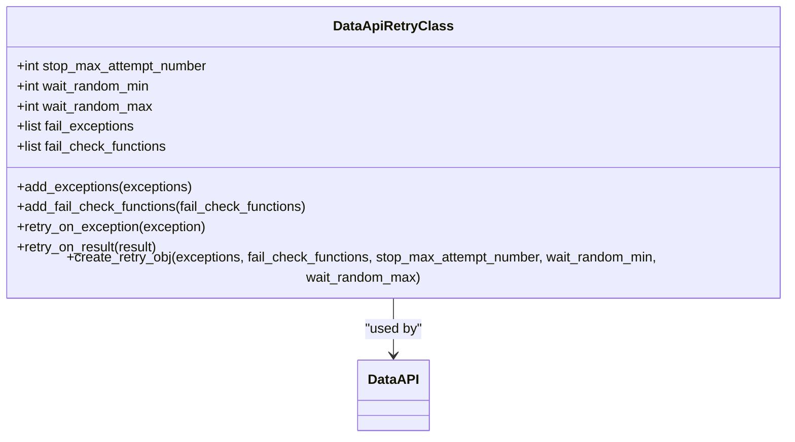
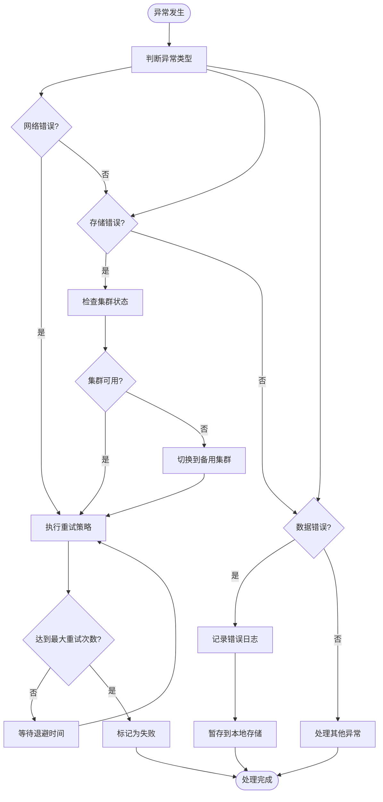
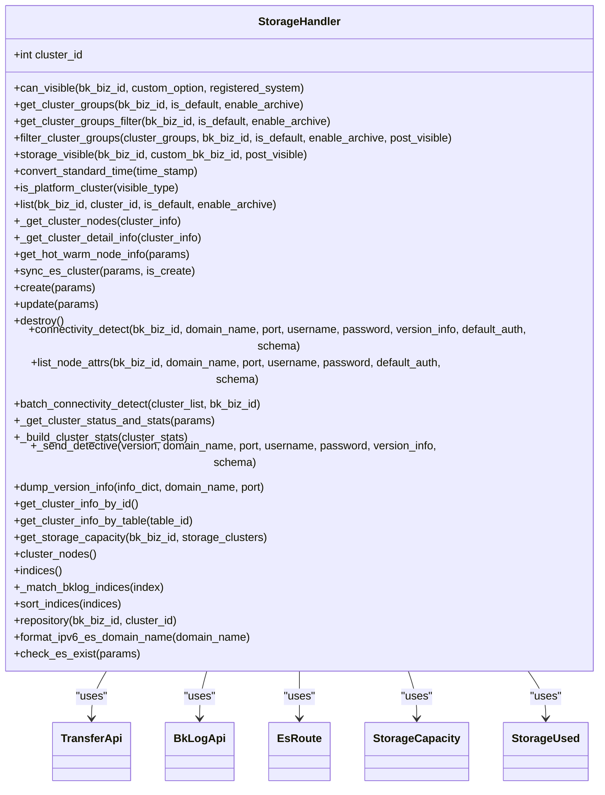
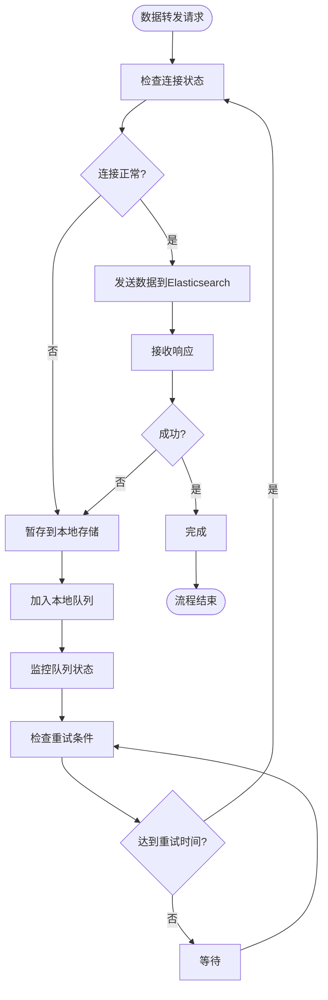
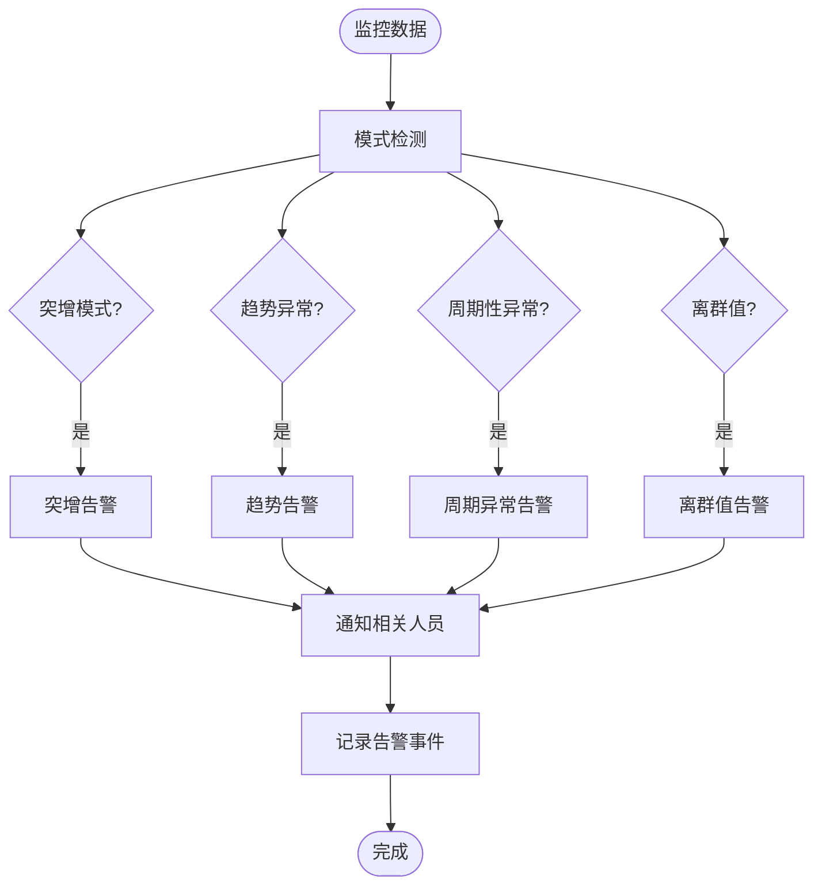

# 错误处理

<cite>
**本文档引用的文件**   
- [transfer.py](file://bklog/apps/api/modules/transfer.py)
- [storage.py](file://bklog/apps/log_databus/handlers/storage.py)
- [base.py](file://bklog/apps/api/base.py)
</cite>

## 目录
1. [引言](#引言)
2. [错误重试策略](#错误重试策略)
3. [异常处理流程](#异常处理流程)
4. [数据持久化备份机制](#数据持久化备份机制)
5. [监控告警配置建议](#监控告警配置建议)
6. [结论](#结论)

## 引言
本文档详细分析了日志平台中的错误处理机制，重点阐述了数据转发过程中的错误重试策略、异常处理流程以及数据持久化备份机制。文档深入探讨了不同错误类型的分类处理方式，包括网络超时、Elasticsearch拒绝写入和数据格式错误的处理机制。同时，文档还详细说明了重试策略的退避算法，包括指数退避和最大重试次数的配置。此外，文档还解释了当转发失败时如何将数据暂存到本地存储以保证数据不丢失，并提供了监控告警配置的建议。

## 错误重试策略

### 重试机制实现
系统在`base.py`中实现了通用的重试机制，通过`DataApiRetryClass`类来配置重试策略。该机制支持基于异常类型和结果检查的重试条件，允许开发者灵活配置重试逻辑。

**Diagram sources**
- [base.py](file://bklog/apps/api/base.py#L108-L173)

### 退避算法
系统采用指数退避算法来处理重试，避免在短时间内对服务造成过大压力。重试间隔时间从最小值开始，每次重试后按指数增长，直到达到最大间隔时间。这种策略可以有效应对临时性故障，同时避免对后端服务造成雪崩效应。

**Section sources**
- [base.py](file://bklog/apps/api/base.py#L109-L173)

## 异常处理流程

### 错误类型分类
系统对不同类型的错误进行了分类处理，主要包括以下几类：

| 错误类型 | 处理方式 | 配置参数 |
|---------|---------|---------|
| 网络超时 | 自动重试，指数退避 | timeout, retry_count |
| Elasticsearch拒绝写入 | 检查集群状态，重试或切换集群 | cluster_status, retry_strategy |
| 数据格式错误 | 记录错误日志，丢弃或转换数据 | error_log_level, data_conversion |
| 认证失败 | 更新凭据，重新尝试连接 | auth_info, credential_refresh |

**Section sources**
- [transfer.py](file://bklog/apps/api/modules/transfer.py)
- [storage.py](file://bklog/apps/log_databus/handlers/storage.py)

### 异常处理流程
当发生异常时，系统按照以下流程进行处理：

**Diagram sources**
- [transfer.py](file://bklog/apps/api/modules/transfer.py)
- [storage.py](file://bklog/apps/log_databus/handlers/storage.py)

**Section sources**
- [transfer.py](file://bklog/apps/api/modules/transfer.py)
- [storage.py](file://bklog/apps/log_databus/handlers/storage.py)

## 数据持久化备份机制

### 本地存储实现
当数据转发失败时，系统会将数据暂存到本地存储中，确保数据不会丢失。`storage.py`文件中的`StorageHandler`类负责管理存储集群的连接和状态检查。

**Diagram sources**
- [storage.py](file://bklog/apps/log_databus/handlers/storage.py#L83-L1199)

### 数据备份流程
数据备份流程确保在转发失败时数据能够安全地存储在本地：

**Diagram sources**
- [storage.py](file://bklog/apps/log_databus/handlers/storage.py)
- [transfer.py](file://bklog/apps/api/modules/transfer.py)

**Section sources**
- [storage.py](file://bklog/apps/log_databus/handlers/storage.py)
- [transfer.py](file://bklog/apps/api/modules/transfer.py)

## 监控告警配置建议

### 错误率阈值设置
为了及时发现系统异常，建议设置以下错误率阈值：

- **网络超时率**：超过5%时触发告警
- **写入失败率**：超过3%时触发告警
- **认证失败率**：超过1%时触发告警
- **数据格式错误率**：超过2%时触发告警

### 异常模式检测
建议配置以下异常模式检测规则：

**Diagram sources**
- [base.py](file://bklog/apps/api/base.py)
- [storage.py](file://bklog/apps/log_databus/handlers/storage.py)

**Section sources**
- [base.py](file://bklog/apps/api/base.py)
- [storage.py](file://bklog/apps/log_databus/handlers/storage.py)

## 结论
本文档详细分析了日志平台的错误处理机制，包括错误重试策略、异常处理流程和数据持久化备份机制。通过合理的重试策略和本地存储机制，系统能够在面对各种异常情况时保持稳定运行，确保数据的完整性和可靠性。同时，通过配置合理的监控告警规则，可以及时发现和处理系统异常，提高系统的可用性和稳定性。