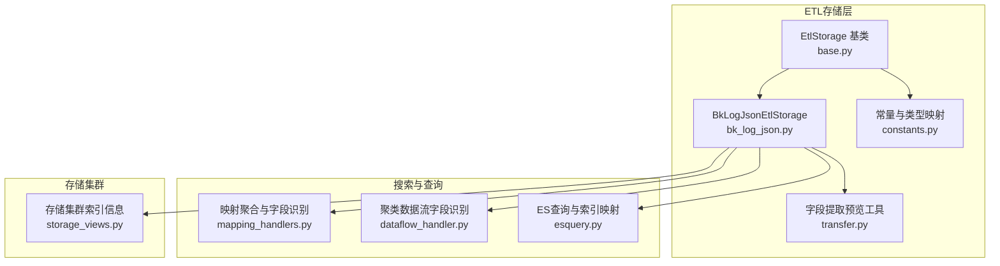
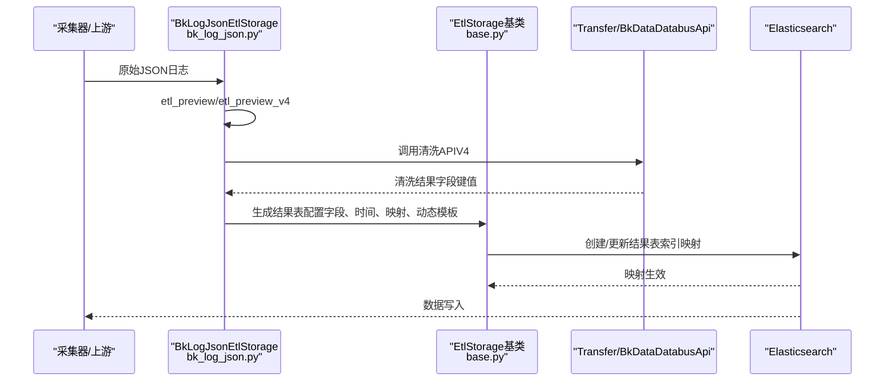
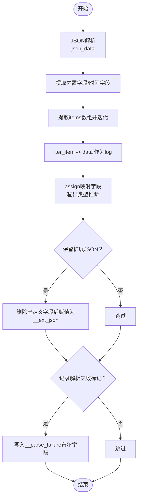
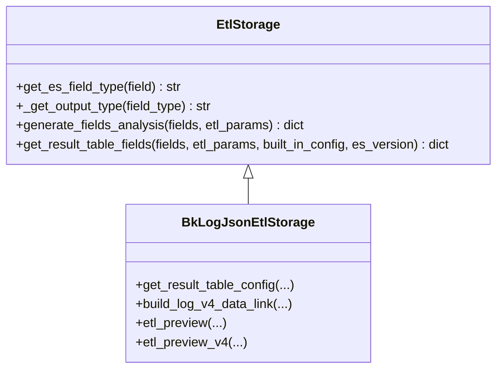
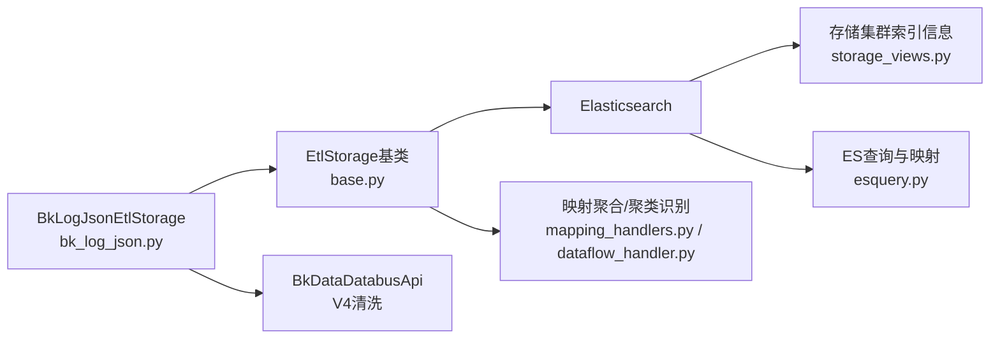

# JSON存储

<cite>
**本文引用的文件**
- [bk_log_json.py](file://bklog/apps/log_databus/handlers/etl_storage/bk_log_json.py)
- [base.py](file://bklog/apps/log_databus/handlers/etl_storage/base.py)
- [constants.py](file://bklog/apps/log_databus/constants.py)
- [transfer.py](file://bklog/apps/log_databus/handlers/etl_storage/utils/transfer.py)
- [exceptions.py](file://bklog/apps/log_databus/exceptions.py)
- [mapping_handlers.py](file://bklog/apps/log_search/handlers/search/mapping_handlers.py)
- [dataflow_handler.py](file://bklog/apps/log_clustering/handlers/dataflow/dataflow_handler.py)
- [storage_views.py](file://bklog/apps/log_databus/views/storage_views.py)
- [esquery.py](file://bklog/apps/log_esquery/esquery/esquery.py)
</cite>

## 目录
1. [简介](#简介)
2. [项目结构](#项目结构)
3. [核心组件](#核心组件)
4. [架构总览](#架构总览)
5. [详细组件分析](#详细组件分析)
6. [依赖分析](#依赖分析)
7. [性能考量](#性能考量)
8. [故障排查指南](#故障排查指南)
9. [结论](#结论)
10. [附录](#附录)

## 简介
本文件围绕蓝鲸日志平台中“结构化JSON日志在Elasticsearch中的存储机制”展开，重点说明：
- JSON日志解析与清洗流程（含V4数据链路）
- 动态映射字段类型推断与动态模板配置
- 嵌套对象的存储与扁平化策略
- 复杂对象查询效率、存储空间开销与索引创建时间的性能特征
- 避免映射爆炸、合理设置动态模板与处理大型嵌套对象的最佳实践
- 常见问题（字段类型冲突、嵌套深度超限、映射更新失败等）的定位与解决思路

## 项目结构
与JSON存储直接相关的代码主要位于日志采集与清洗模块的“ETL存储”子系统中，核心文件如下：
- JSON清洗与结果表配置：bk_log_json.py
- ETL基类与通用映射/索引配置：base.py
- 常量与类型映射：constants.py
- 字段提取预览工具：transfer.py
- 异常定义：exceptions.py
- 搜索侧映射聚合与字段识别：mapping_handlers.py、dataflow_handler.py
- ES查询与索引信息：esquery.py
- 存储集群与索引信息展示：storage_views.py

图表来源
- [base.py](file://bklog/apps/log_databus/handlers/etl_storage/base.py#L1-L120)
- [bk_log_json.py](file://bklog/apps/log_databus/handlers/etl_storage/bk_log_json.py#L1-L120)
- [constants.py](file://bklog/apps/log_databus/constants.py#L377-L418)
- [transfer.py](file://bklog/apps/log_databus/handlers/etl_storage/utils/transfer.py#L34-L103)
- [mapping_handlers.py](file://bklog/apps/log_search/handlers/search/mapping_handlers.py#L760-L777)
- [dataflow_handler.py](file://bklog/apps/log_clustering/handlers/dataflow/dataflow_handler.py#L1462-L1479)
- [esquery.py](file://bklog/apps/log_esquery/esquery/esquery.py#L272-L298)
- [storage_views.py](file://bklog/apps/log_databus/views/storage_views.py#L705-L734)

章节来源
- [bk_log_json.py](file://bklog/apps/log_databus/handlers/etl_storage/bk_log_json.py#L1-L120)
- [base.py](file://bklog/apps/log_databus/handlers/etl_storage/base.py#L1-L120)

## 核心组件
- BkLogJsonEtlStorage：负责JSON日志的清洗、字段映射、结果表配置与V4数据链路构建。
- EtlStorage基类：提供通用的字段类型推断、ES映射设置、索引创建参数组装、动态模板注入、分析器配置等。
- 常量与类型映射：定义ETL配置枚举、ES字段类型映射、默认参数等。
- 字段提取预览工具：通过本地可执行程序对样例JSON进行ETL预览，辅助调试清洗规则。
- 搜索与查询侧：映射聚合、字段识别、索引信息查询，支撑运行期诊断与排障。

章节来源
- [bk_log_json.py](file://bklog/apps/log_databus/handlers/etl_storage/bk_log_json.py#L29-L120)
- [base.py](file://bklog/apps/log_databus/handlers/etl_storage/base.py#L62-L120)
- [constants.py](file://bklog/apps/log_databus/constants.py#L377-L418)
- [transfer.py](file://bklog/apps/log_databus/handlers/etl_storage/utils/transfer.py#L34-L103)

## 架构总览
JSON存储的整体流程包括：采集原始JSON → 清洗与映射 → 结果表配置下发 → Elasticsearch索引创建与动态映射生效 → 查询与检索。

图表来源
- [bk_log_json.py](file://bklog/apps/log_databus/handlers/etl_storage/bk_log_json.py#L32-L84)
- [bk_log_json.py](file://bklog/apps/log_databus/handlers/etl_storage/bk_log_json.py#L129-L282)
- [base.py](file://bklog/apps/log_databus/handlers/etl_storage/base.py#L800-L926)

## 详细组件分析

### JSON解析与清洗（V4数据链路）
- JSON解析阶段：将原始数据解析为JSON对象，提取内置字段、时间字段、路径字段等。
- 数组迭代：对items数组进行迭代，逐条提取data字段作为原文，同时生成iterationIndex。
- 字段映射：将清洗后的字段映射到最终字段名，输出类型由字段类型推断决定。
- 扩展JSON：可选保留未显式定义的JSON字段，便于后续检索。
- 清洗失败标记：可选记录解析失败标记字段，便于问题定位。

图表来源
- [bk_log_json.py](file://bklog/apps/log_databus/handlers/etl_storage/bk_log_json.py#L129-L282)
- [base.py](file://bklog/apps/log_databus/handlers/etl_storage/base.py#L341-L418)

章节来源
- [bk_log_json.py](file://bklog/apps/log_databus/handlers/etl_storage/bk_log_json.py#L129-L282)
- [base.py](file://bklog/apps/log_databus/handlers/etl_storage/base.py#L341-L418)

### 字段类型推断与映射设置
- 字段类型推断：优先使用字段的es_type（来自option），否则依据字段类型与是否分词推断ES字段类型。
- 输出类型映射（V4）：将字段类型映射为V4 operator的output_type，确保类型一致性。
- ES映射设置：注入dynamic_templates，将字符串类型映射为keyword；兼容不同ES版本的_all/include_in_all等设置。
- 分词器与分析器：根据字段是否分词生成自定义analyzer/tokenizer，控制大小写与字符分组。

图表来源
- [base.py](file://bklog/apps/log_databus/handlers/etl_storage/base.py#L133-L157)
- [base.py](file://bklog/apps/log_databus/handlers/etl_storage/base.py#L465-L541)
- [base.py](file://bklog/apps/log_databus/handlers/etl_storage/base.py#L543-L740)
- [bk_log_json.py](file://bklog/apps/log_databus/handlers/etl_storage/bk_log_json.py#L86-L128)

章节来源
- [base.py](file://bklog/apps/log_databus/handlers/etl_storage/base.py#L133-L157)
- [base.py](file://bklog/apps/log_databus/handlers/etl_storage/base.py#L465-L541)
- [base.py](file://bklog/apps/log_databus/handlers/etl_storage/base.py#L543-L740)
- [constants.py](file://bklog/apps/log_databus/constants.py#L407-L415)

### 动态模板与字段类型冲突处理
- 动态模板：注入“字符串作为keyword”的dynamic_templates，减少因字符串类型自动映射带来的keyword与text混用问题。
- 字段类型冲突：若同一字段在不同文档中出现不同类型（如string与object），ES会拒绝映射更新。建议：
  - 在清洗阶段统一字段类型（如将object序列化为字符串）。
  - 使用保留扩展JSON（__ext_json）承载未定义字段，避免直接写入未知结构。
  - 通过字段预览与V4规则验证，提前发现潜在冲突。

章节来源
- [base.py](file://bklog/apps/log_databus/handlers/etl_storage/base.py#L800-L840)
- [bk_log_json.py](file://bklog/apps/log_databus/handlers/etl_storage/bk_log_json.py#L106-L127)

### 嵌套对象存储与扁平化
- 嵌套对象存储：默认将JSON字段映射为object类型，便于结构化检索。
- 扁平化策略：当ES版本支持flattened类型时，可将特定字段声明为flattened以降低映射复杂度；否则保持object。
- 聚类场景识别：聚类侧会识别object字段及其扁平化后的根字段，避免误判。

章节来源
- [base.py](file://bklog/apps/log_databus/handlers/etl_storage/base.py#L685-L700)
- [dataflow_handler.py](file://bklog/apps/log_clustering/handlers/dataflow/dataflow_handler.py#L1462-L1479)
- [constants.py](file://bklog/apps/log_databus/constants.py#L743-L745)

### 字段提取预览与调试
- 预览工具：通过本地可执行程序对样例数据进行ETL测试，返回字段键值列表，辅助清洗规则调试。
- V4预览：调用BkDataDatabusApi进行清洗调试，返回字段键值与值，便于确认映射效果。

章节来源
- [transfer.py](file://bklog/apps/log_databus/handlers/etl_storage/utils/transfer.py#L34-L103)
- [bk_log_json.py](file://bklog/apps/log_databus/handlers/etl_storage/bk_log_json.py#L32-L84)

## 依赖分析
- 组件耦合
  - BkLogJsonEtlStorage依赖EtlStorage基类提供的字段类型推断、映射设置、索引参数组装。
  - 与Transfer/BkDataDatabusApi交互，用于V4清洗调试与规则生成。
  - 与搜索侧映射聚合、聚类字段识别协同，保障运行期字段一致性。
- 外部依赖
  - Elasticsearch：动态映射、索引创建、查询映射。
  - 存储集群：索引健康、分片与副本配置、存储使用量统计。

图表来源
- [bk_log_json.py](file://bklog/apps/log_databus/handlers/etl_storage/bk_log_json.py#L129-L282)
- [base.py](file://bklog/apps/log_databus/handlers/etl_storage/base.py#L800-L926)
- [mapping_handlers.py](file://bklog/apps/log_search/handlers/search/mapping_handlers.py#L760-L777)
- [dataflow_handler.py](file://bklog/apps/log_clustering/handlers/dataflow/dataflow_handler.py#L1462-L1479)
- [storage_views.py](file://bklog/apps/log_databus/views/storage_views.py#L705-L734)
- [esquery.py](file://bklog/apps/log_esquery/esquery/esquery.py#L272-L298)

## 性能考量
- 复杂对象查询效率
  - object字段的深度与键数量直接影响查询成本。建议：
    - 仅映射必要字段，避免将整个JSON写入。
    - 使用保留扩展JSON（__ext_json）承载未定义字段，减少顶层映射膨胀。
    - 对热点字段采用keyword+doc_values，提升聚合与过滤性能。
- 存储空间开销
  - keyword与text的存储差异显著，动态模板将字符串映射为keyword有助于减少冗余字段。
  - 合理设置分片与副本，避免过度分片导致元数据开销增大。
- 索引创建时间
  - 动态映射首次写入可能触发映射更新，建议在创建索引前明确字段类型，减少映射冲突与重建。
  - 使用V4数据链路在清洗阶段就完成字段映射，降低写入期的映射冲突概率。

章节来源
- [base.py](file://bklog/apps/log_databus/handlers/etl_storage/base.py#L800-L926)
- [base.py](file://bklog/apps/log_databus/handlers/etl_storage/base.py#L465-L541)

## 故障排查指南
- 字段类型冲突
  - 现象：ES拒绝映射更新，提示字段类型不一致。
  - 处理：在清洗阶段统一字段类型；使用保留扩展JSON承载未知结构；通过预览与V4调试确认字段类型。
- 嵌套深度超限
  - 现象：映射更新失败或查询性能下降。
  - 处理：限制嵌套层级；将深层结构扁平化或拆分为多个字段；必要时使用flattened类型（ES版本满足要求）。
- 映射爆炸
  - 现象：字段数量过多导致映射膨胀、内存占用上升。
  - 处理：仅映射必要字段；使用动态模板统一字符串类型；定期清理未使用字段；通过聚类识别与映射聚合核对字段。
- 清洗失败标记
  - 使用清洗失败标记字段（__parse_failure）定位解析异常数据，结合预览工具复现问题。

章节来源
- [exceptions.py](file://bklog/apps/log_databus/exceptions.py#L221-L234)
- [base.py](file://bklog/apps/log_databus/handlers/etl_storage/base.py#L391-L418)
- [bk_log_json.py](file://bklog/apps/log_databus/handlers/etl_storage/bk_log_json.py#L106-L127)

## 结论
- JSON存储的关键在于“清洗阶段的类型约束与结构化映射”，配合动态模板与分析器配置，可在保证查询性能的同时降低映射爆炸风险。
- V4数据链路与字段提取预览工具为调试与验证提供了高效手段，建议在上线前充分验证。
- 对于复杂嵌套对象，应优先考虑扁平化与扩展JSON策略，避免深层结构带来的查询与存储压力。

## 附录
- 常用配置要点
  - 保留原文：便于全文检索与溯源。
  - 保留扩展JSON：承载未定义字段，避免直接写入未知结构。
  - 记录解析失败标记：便于问题定位与修复。
  - 动态模板：统一字符串类型为keyword，减少类型冲突。
  - 分词器：按需开启，控制大小写与字符分组。

章节来源
- [bk_log_json.py](file://bklog/apps/log_databus/handlers/etl_storage/bk_log_json.py#L106-L127)
- [base.py](file://bklog/apps/log_databus/handlers/etl_storage/base.py#L800-L926)