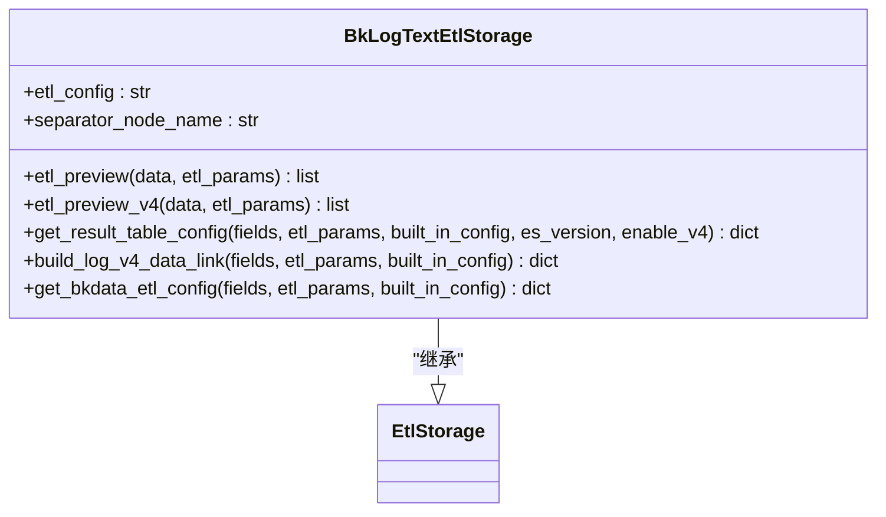
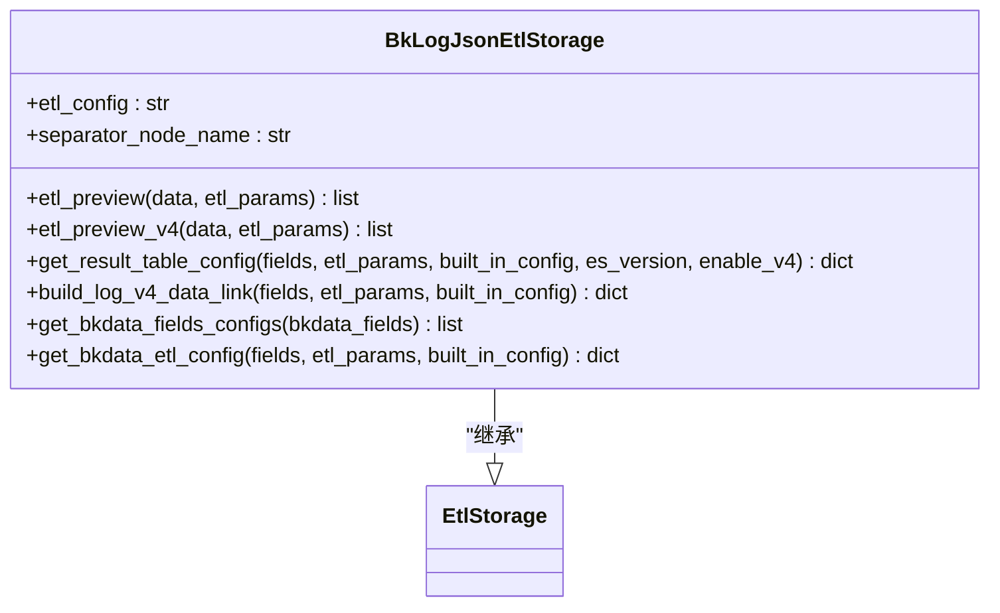
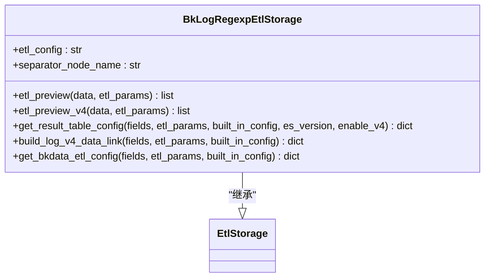
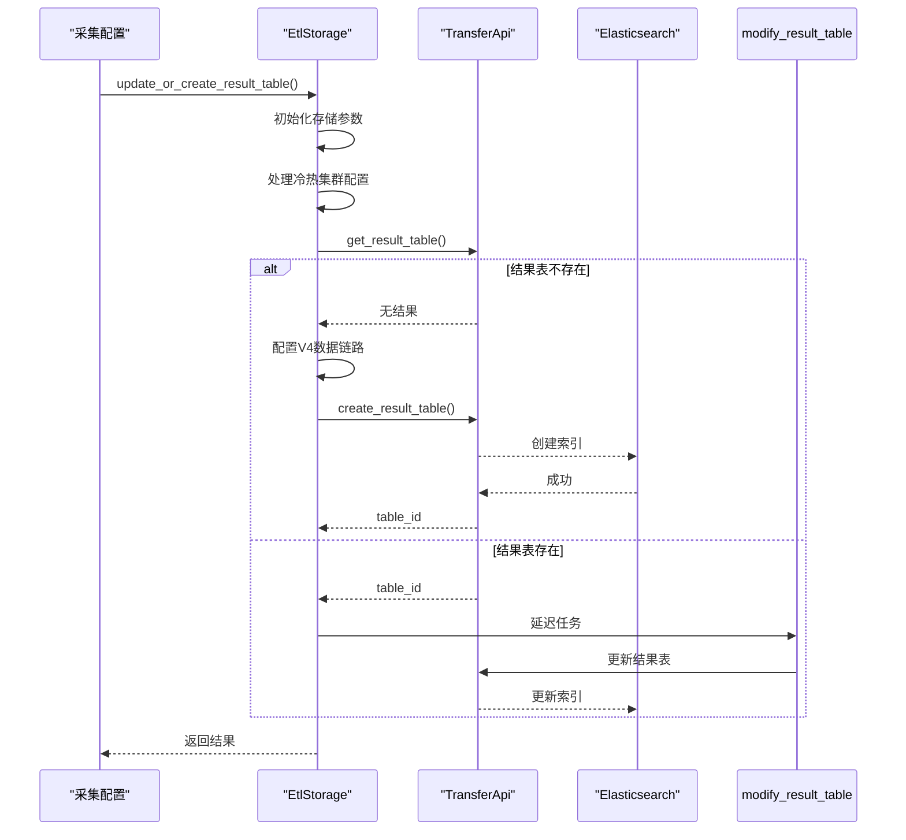
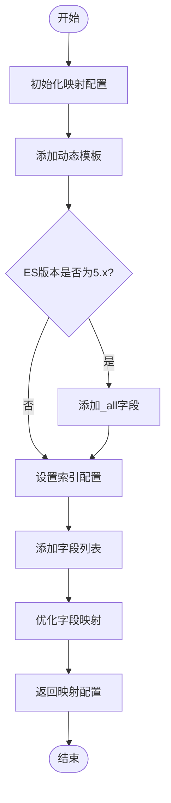
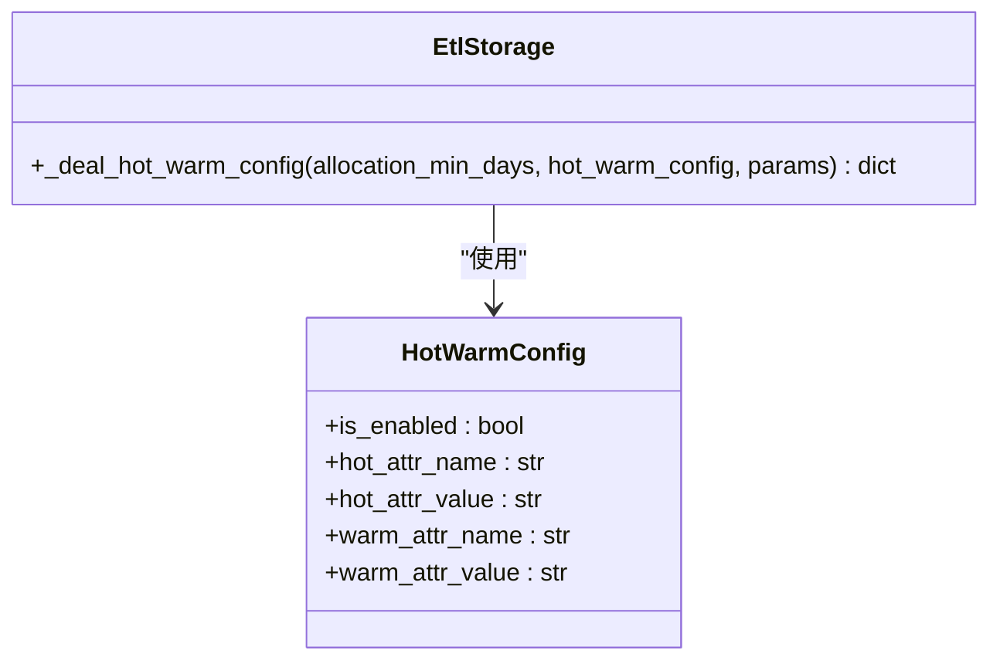
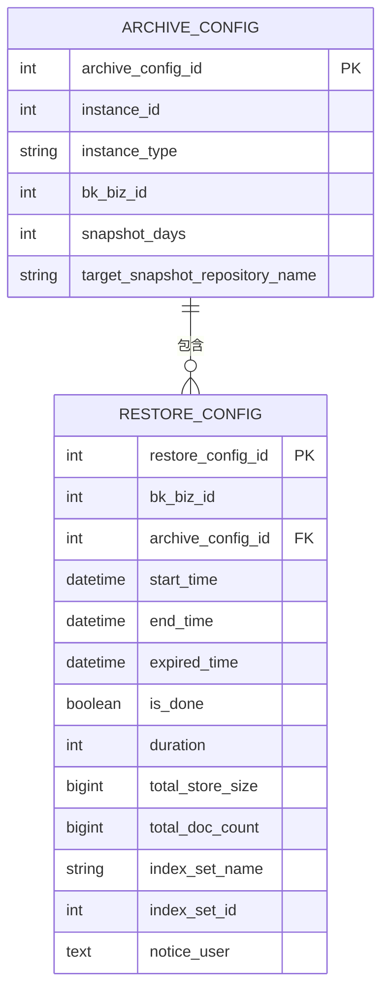

# 数据存储

<cite>
**本文档引用的文件**   
- [bk_log_text.py](file://bklog/apps/log_databus/handlers/etl_storage/bk_log_text.py)
- [bk_log_json.py](file://bklog/apps/log_databus/handlers/etl_storage/bk_log_json.py)
- [bk_log_regexp.py](file://bklog/apps/log_databus/handlers/etl_storage/bk_log_regexp.py)
- [base.py](file://bklog/apps/log_databus/handlers/etl_storage/base.py)
- [storage.py](file://bklog/apps/log_databus/handlers/storage.py)
- [collector_batch_operation.py](file://bklog/apps/log_databus/handlers/collector_batch_operation.py)
- [models.py](file://bklog/apps/log_databus/models.py)
</cite>

## 目录
1. [日志存储机制概述](#日志存储机制概述)
2. [不同日志类型的存储策略](#不同日志类型的存储策略)
3. [数据索引创建与映射定义](#数据索引创建与映射定义)
4. [索引生命周期管理](#索引生命周期管理)
5. [存储性能优化建议](#存储性能优化建议)
6. [存储容量规划指南](#存储容量规划指南)
7. [常见存储问题解决方案](#常见存储问题解决方案)

## 日志存储机制概述

蓝鲸日志平台采用Elasticsearch作为核心存储引擎，通过etl_storage模块实现日志数据的存储管理。系统支持多种日志格式的存储，包括纯文本、JSON和正则表达式提取的存储实现。数据存储流程从日志采集开始，经过清洗、转换，最终写入Elasticsearch集群。平台通过结果表（Result Table）的概念来组织和管理日志数据，每个结果表对应一个或多个Elasticsearch索引。

系统实现了V3和V4两个版本的数据链路，其中V4版本采用了更先进的数据处理架构。存储配置通过元数据管理（META）系统进行管理，包括分片策略、副本数、刷新间隔等关键参数。平台还支持热温架构，能够根据数据的访问频率自动将数据从热节点迁移到温节点，实现存储成本的优化。

**Section sources**
- [base.py](file://bklog/apps/log_databus/handlers/etl_storage/base.py#L62-L85)
- [storage.py](file://bklog/apps/log_databus/handlers/storage.py#L266-L286)

## 不同日志类型的存储策略

### 纯文本日志存储

纯文本日志采用直接入库的存储策略，通过BkLogTextEtlStorage类实现。该策略将日志原文作为"log"字段存储，字段类型为"text"，支持全文检索。对于需要大小写敏感或自定义分词的场景，系统会生成唯一的analyzer名称，确保索引的正确分裂。



**Diagram sources **
- [bk_log_text.py](file://bklog/apps/log_databus/handlers/etl_storage/bk_log_text.py#L28-L271)

### JSON日志存储

JSON日志存储通过BkLogJsonEtlStorage类实现，支持JSON格式的解析和字段提取。系统会将JSON数据解析为扁平化的字段结构，保留原始JSON结构的字段可以配置为"object"类型。对于需要保留原始JSON内容的场景，可以通过"retain_extra_json"参数实现。



**Diagram sources **
- [bk_log_json.py](file://bklog/apps/log_databus/handlers/etl_storage/bk_log_json.py#L29-L428)

### 正则表达式日志存储

正则表达式日志存储通过BkLogRegexpEtlStorage类实现，支持通过正则表达式提取日志中的字段。系统要求字段必须在正则表达式中定义，确保数据的一致性。存储配置中包含了正则表达式的定义和字段映射关系。



**Diagram sources **
- [bk_log_regexp.py](file://bklog/apps/log_databus/handlers/etl_storage/bk_log_regexp.py#L33-L421)

**Section sources**
- [bk_log_text.py](file://bklog/apps/log_databus/handlers/etl_storage/bk_log_text.py#L28-L271)
- [bk_log_json.py](file://bklog/apps/log_databus/handlers/etl_storage/bk_log_json.py#L29-L428)
- [bk_log_regexp.py](file://bklog/apps/log_databus/handlers/etl_storage/bk_log_regexp.py#L33-L421)

## 数据索引创建与映射定义

### 索引创建流程

索引创建通过EtlStorage基类的update_or_create_result_table方法实现。该方法负责创建或更新结果表，并配置相应的Elasticsearch存储参数。创建流程包括参数初始化、冷热集群配置、结果表状态检查和最终创建/更新操作。



**Diagram sources **
- [base.py](file://bklog/apps/log_databus/handlers/etl_storage/base.py#L742-L926)

### 分片策略

分片策略通过es_shards参数控制，系统会根据业务需求和数据量设置合理的分片数。分片数的设置遵循以下原则：
- 单个分片大小控制在10-50GB之间
- 每个节点的分片总数不超过20个
- 热节点分片数可适当增加，温节点分片数应减少

分片策略的配置在update_or_create_result_table方法中实现，通过instance.storage_shards_nums参数设置。

### 映射定义

映射定义通过mapping_settings参数实现，系统为字符串类型字段配置了动态模板，将所有字符串字段默认映射为keyword类型。对于需要全文检索的字段，会显式设置为text类型。



**Diagram sources **
- [base.py](file://bklog/apps/log_databus/handlers/etl_storage/base.py#L803-L816)

**Section sources**
- [base.py](file://bklog/apps/log_databus/handlers/etl_storage/base.py#L742-L926)

## 索引生命周期管理

### 热温架构

热温架构通过冷热集群配置实现，系统支持将高频访问的热数据存储在高性能节点，低频访问的温数据存储在成本较低的节点。配置通过hot_warm_config参数实现，包含热节点和温节点的属性名称和值。



**Diagram sources **
- [base.py](file://bklog/apps/log_databus/handlers/etl_storage/base.py#L1262-L1291)

### 数据滚动

数据滚动通过slice_size和slice_gap参数控制，系统根据分片大小和时间间隔自动创建新的索引。当当前索引达到指定大小或时间间隔时，系统会创建新的索引来存储后续数据。

### 归档策略

归档策略通过ArchiveConfig模型实现，支持将历史数据归档到快照仓库。归档配置包含快照天数、快照仓库名称等参数。系统还提供了回溯功能，可以从归档中恢复数据。



**Diagram sources **
- [models.py](file://bklog/apps/log_databus/models.py#L547-L635)

**Section sources**
- [base.py](file://bklog/apps/log_databus/handlers/etl_storage/base.py#L1262-L1291)
- [models.py](file://bklog/apps/log_databus/models.py#L547-L635)

## 存储性能优化建议

### 分片数设计

合理的分片数设计是存储性能优化的关键。建议遵循以下原则：
- 单个分片大小控制在10-50GB之间
- 避免创建过多的小分片，这会增加集群开销
- 根据数据增长速度预估未来分片数量
- 热节点可以配置更多的分片，温节点应减少分片数量

分片数可以通过collector_batch_operation模块的modify_storage方法进行调整。

### 副本数设置

副本数设置影响数据的可用性和写入性能：
- 生产环境建议设置1-2个副本
- 高可用要求高的场景可设置2个副本
- 副本数增加会降低写入性能，但提高查询性能和容错能力

### 清刷新间隔

刷新间隔（refresh_interval）影响数据的可见性：
- 默认刷新间隔为1秒，适合实时性要求高的场景
- 对于写入密集型场景，可适当增加刷新间隔（如30秒）以提高写入性能
- 需要平衡实时性和性能需求

**Section sources**
- [collector_batch_operation.py](file://bklog/apps/log_databus/handlers/collector_batch_operation.py#L79-L112)
- [base.py](file://bklog/apps/log_databus/handlers/etl_storage/base.py#L787-L790)

## 存储容量规划指南

存储需求计算需要考虑以下因素：
- 日志量：每日产生的日志数据量
- 保留周期：数据需要保留的时间
- 副本数：每个分片的副本数量
- 压缩比：Elasticsearch的压缩效率

计算公式：
```
总存储需求 = 日均日志量 × 保留天数 × (1 + 副本数) / 压缩比
```

例如，日均1TB日志，保留30天，1个副本，压缩比为3:1，则总存储需求为：
```
1TB × 30 × (1 + 1) / 3 = 20TB
```

系统通过storage模块获取集群的存储配置，包括最大保留天数、默认副本数和分片数等参数。

**Section sources**
- [storage.py](file://bklog/apps/log_databus/handlers/storage.py#L266-L286)

## 常见存储问题解决方案

### 索引创建失败

索引创建失败的常见原因及解决方案：
- **集群空间不足**：清理旧数据或扩容集群
- **分片数过多**：减少分片数或增加节点
- **映射冲突**：检查字段类型是否一致
- **权限问题**：检查用户权限配置

### 写入性能下降

写入性能下降的优化方案：
- **增加刷新间隔**：降低refresh频率
- **批量写入**：增加批量写入大小
- **优化分片策略**：调整分片大小和数量
- **检查硬件资源**：确保CPU、内存、磁盘IO充足

### 查询性能问题

查询性能优化建议：
- **合理使用filter**：filter结果可缓存
- **避免通配符查询**：尽量使用精确查询
- **优化聚合查询**：限制聚合范围和数量
- **使用分页**：避免一次性返回大量数据

**Section sources**
- [base.py](file://bklog/apps/log_databus/handlers/etl_storage/base.py#L856-L917)
- [collector_batch_operation.py](file://bklog/apps/log_databus/handlers/collector_batch_operation.py#L79-L112)