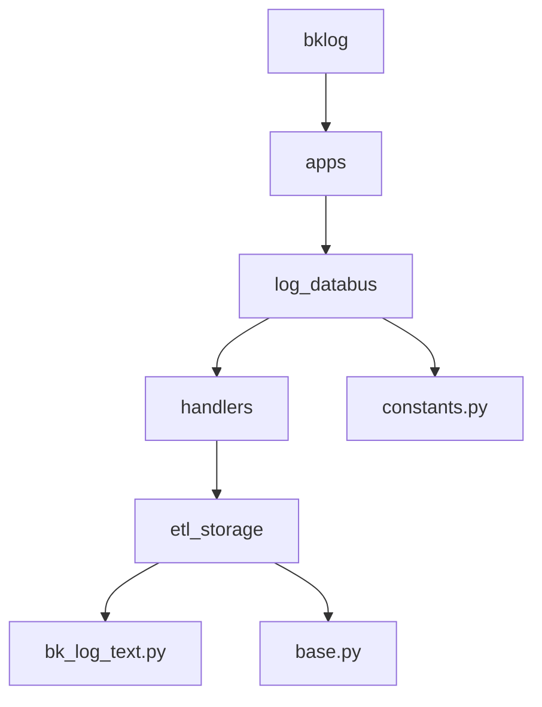
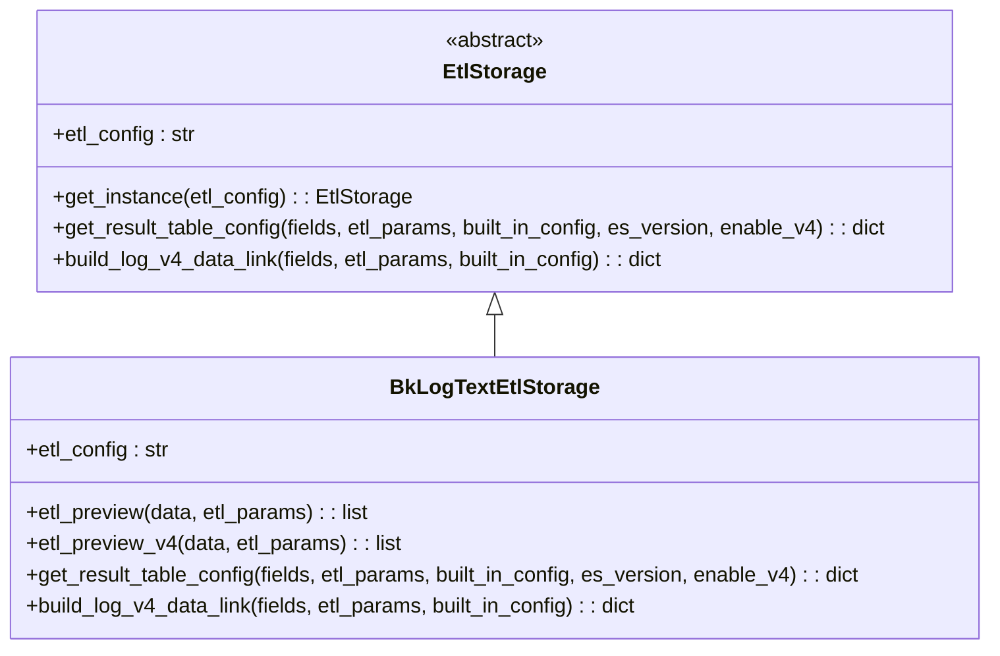
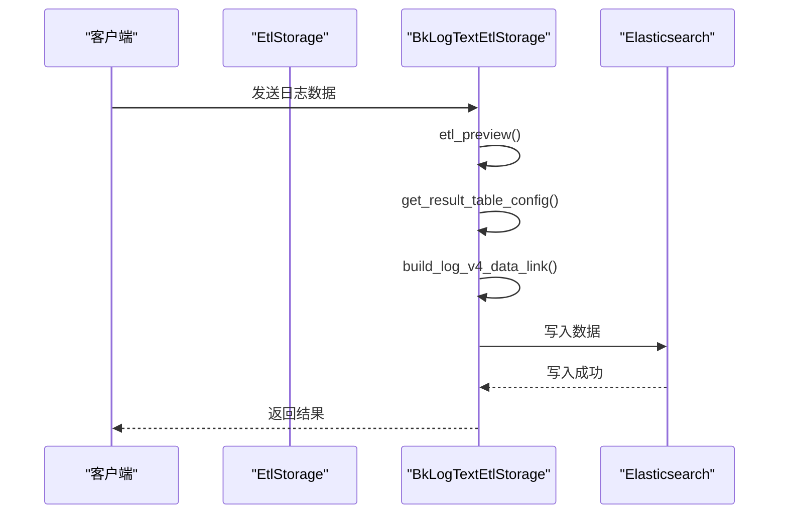
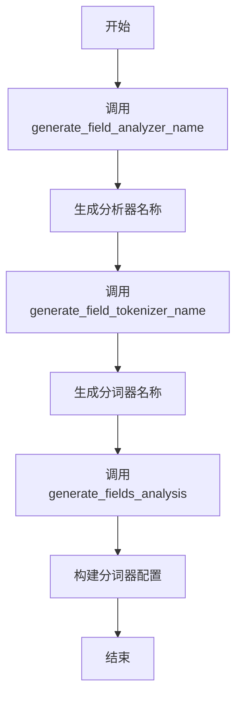
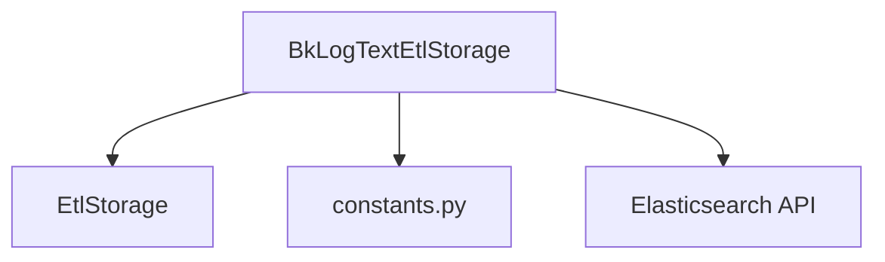

# 文本存储

<cite>
**本文档引用的文件**   
- [bk_log_text.py](file://bklog/apps/log_databus/handlers/etl_storage/bk_log_text.py)
- [base.py](file://bklog/apps/log_databus/handlers/etl_storage/base.py)
- [constants.py](file://bklog/apps/log_databus/constants.py)
</cite>

## 目录
1. [简介](#简介)
2. [项目结构](#项目结构)
3. [核心组件](#核心组件)
4. [架构概述](#架构概述)
5. [详细组件分析](#详细组件分析)
6. [依赖分析](#依赖分析)
7. [性能考虑](#性能考虑)
8. [故障排除指南](#故障排除指南)
9. [结论](#结论)

## 简介
本文档详细描述了蓝鲸日志平台中纯文本日志在Elasticsearch中的存储实现。重点分析了`bk_log_text.py`文件中如何处理原始文本日志的索引创建、字段映射和数据写入流程。文档还详细说明了文本日志的分词策略、分析器配置和搜索优化技术，分析了文本存储的性能特征，包括写入吞吐量、查询延迟和存储空间占用。此外，文档提供了文本存储的最佳实践，如如何配置合理的分片大小、刷新间隔和合并策略，并包含文本存储的常见问题排查指南，如中文分词问题、特殊字符处理异常等。

## 项目结构
蓝鲸日志平台的项目结构清晰，主要功能模块分布在`bklog/apps/`目录下。文本存储相关的代码主要位于`log_databus`应用中，特别是`handlers/etl_storage`目录下的`bk_log_text.py`文件，负责处理文本日志的清洗和入库。`constants.py`文件定义了系统中使用的各种常量，包括ETL配置类型等。`base.py`文件定义了`EtlStorage`基类，`BkLogTextEtlStorage`类继承自该基类，实现了具体的文本存储逻辑。

**Diagram sources**
- [bk_log_text.py](file://bklog/apps/log_databus/handlers/etl_storage/bk_log_text.py)
- [base.py](file://bklog/apps/log_databus/handlers/etl_storage/base.py)
- [constants.py](file://bklog/apps/log_databus/constants.py)

**Section sources**
- [bk_log_text.py](file://bklog/apps/log_databus/handlers/etl_storage/bk_log_text.py)
- [base.py](file://bklog/apps/log_databus/handlers/etl_storage/base.py)
- [constants.py](file://bklog/apps/log_databus/constants.py)

## 核心组件
文本存储的核心组件是`BkLogTextEtlStorage`类，它位于`bk_log_text.py`文件中。该类继承自`EtlStorage`基类，实现了文本日志的清洗和入库逻辑。`BkLogTextEtlStorage`类的主要功能包括：处理字段提取预览、配置清洗入库策略、构建V4数据链路的清洗规则等。该类通过`etl_config`属性标识其为文本存储类型，并通过`get_result_table_config`方法生成Elasticsearch的索引配置。

**Section sources**
- [bk_log_text.py](file://bklog/apps/log_databus/handlers/etl_storage/bk_log_text.py#L28-L91)
- [base.py](file://bklog/apps/log_databus/handlers/etl_storage/base.py#L61-L85)

## 架构概述
蓝鲸日志平台的文本存储架构基于Elasticsearch，通过`EtlStorage`基类和具体的`BkLogTextEtlStorage`实现类来处理日志数据的清洗和入库。架构分为几个主要部分：数据采集、数据清洗、索引创建和数据写入。数据采集模块负责从各种来源收集日志数据；数据清洗模块使用`BkLogTextEtlStorage`类处理原始日志，提取字段并生成Elasticsearch索引配置；索引创建模块根据配置创建Elasticsearch索引；数据写入模块将处理后的日志数据写入Elasticsearch。

**Diagram sources**
- [bk_log_text.py](file://bklog/apps/log_databus/handlers/etl_storage/bk_log_text.py)
- [base.py](file://bklog/apps/log_databus/handlers/etl_storage/base.py)

## 详细组件分析

### BkLogTextEtlStorage 类分析
`BkLogTextEtlStorage`类是文本存储的核心实现，它继承自`EtlStorage`基类。该类的主要方法包括`etl_preview`、`etl_preview_v4`、`get_result_table_config`和`build_log_v4_data_link`。`etl_preview`和`etl_preview_v4`方法用于预览字段提取结果，`get_result_table_config`方法生成Elasticsearch索引配置，`build_log_v4_data_link`方法构建V4数据链路的清洗规则。

#### 类图

**Diagram sources**
- [bk_log_text.py](file://bklog/apps/log_databus/handlers/etl_storage/bk_log_text.py#L28-L91)
- [base.py](file://bklog/apps/log_databus/handlers/etl_storage/base.py#L61-L85)

#### 数据处理流程
`BkLogTextEtlStorage`类的数据处理流程如下：首先，通过`etl_preview`方法预览字段提取结果；然后，通过`get_result_table_config`方法生成Elasticsearch索引配置；接着，通过`build_log_v4_data_link`方法构建V4数据链路的清洗规则；最后，将处理后的日志数据写入Elasticsearch。

**Diagram sources**
- [bk_log_text.py](file://bklog/apps/log_databus/handlers/etl_storage/bk_log_text.py)
- [base.py](file://bklog/apps/log_databus/handlers/etl_storage/base.py)

### 分词策略和分析器配置
`BkLogTextEtlStorage`类通过`generate_field_analyzer_name`和`generate_field_tokenizer_name`方法生成分析器和分词器的名称。这些方法根据字段的配置生成唯一的哈希值，用于触发索引分裂。`generate_fields_analysis`方法构建各个字段的分词器，根据字段的配置生成相应的分析器和分词器配置。

**Diagram sources**
- [base.py](file://bklog/apps/log_databus/handlers/etl_storage/base.py#L442-L541)

**Section sources**
- [base.py](file://bklog/apps/log_databus/handlers/etl_storage/base.py#L442-L541)

## 依赖分析
`BkLogTextEtlStorage`类依赖于`EtlStorage`基类和`constants.py`文件中的常量。`EtlStorage`基类提供了基本的清洗和入库功能，`constants.py`文件定义了ETL配置类型等常量。此外，`BkLogTextEtlStorage`类还依赖于Elasticsearch的API，用于创建和更新索引。

**Diagram sources**
- [bk_log_text.py](file://bklog/apps/log_databus/handlers/etl_storage/bk_log_text.py)
- [base.py](file://bklog/apps/log_databus/handlers/etl_storage/base.py)
- [constants.py](file://bklog/apps/log_databus/constants.py)

## 性能考虑
文本存储的性能主要受分片大小、副本数量和刷新间隔的影响。合理的分片大小可以提高查询性能，过多的副本会增加写入开销，而刷新间隔则影响数据的实时性。建议根据数据量和查询需求调整这些参数，以达到最佳性能。

**Section sources**
- [base.py](file://bklog/apps/log_databus/handlers/etl_storage/base.py#L780-L800)

## 故障排除指南
常见的文本存储问题包括中文分词问题和特殊字符处理异常。对于中文分词问题，可以检查分析器配置是否正确，确保使用了适合中文的分词器。对于特殊字符处理异常，可以检查日志数据的编码是否正确，确保特殊字符被正确处理。

**Section sources**
- [base.py](file://bklog/apps/log_databus/handlers/etl_storage/base.py#L442-L541)

## 结论
本文档详细描述了蓝鲸日志平台中纯文本日志在Elasticsearch中的存储实现。通过分析`BkLogTextEtlStorage`类的实现，我们了解了文本日志的索引创建、字段映射和数据写入流程。文档还详细说明了分词策略、分析器配置和搜索优化技术，分析了文本存储的性能特征，并提供了最佳实践和故障排除指南。这些信息对于理解和优化文本存储系统非常有帮助。