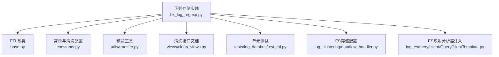
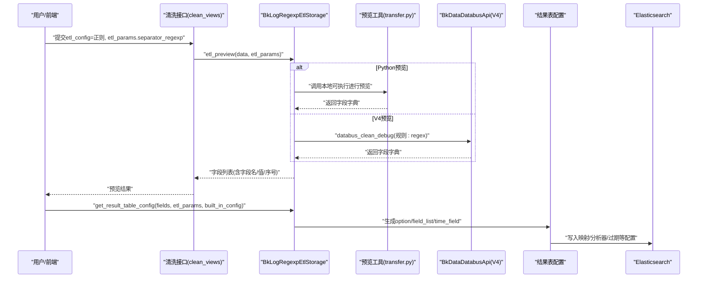
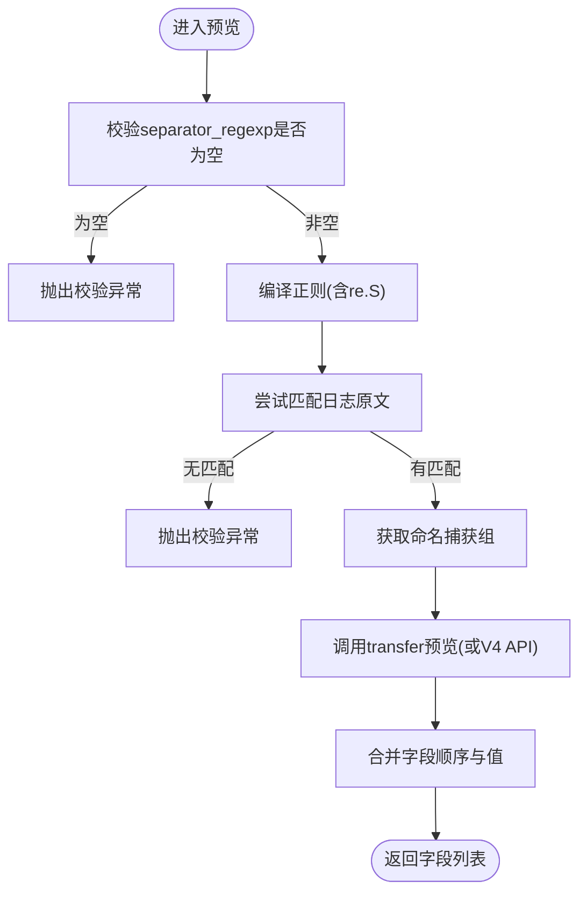
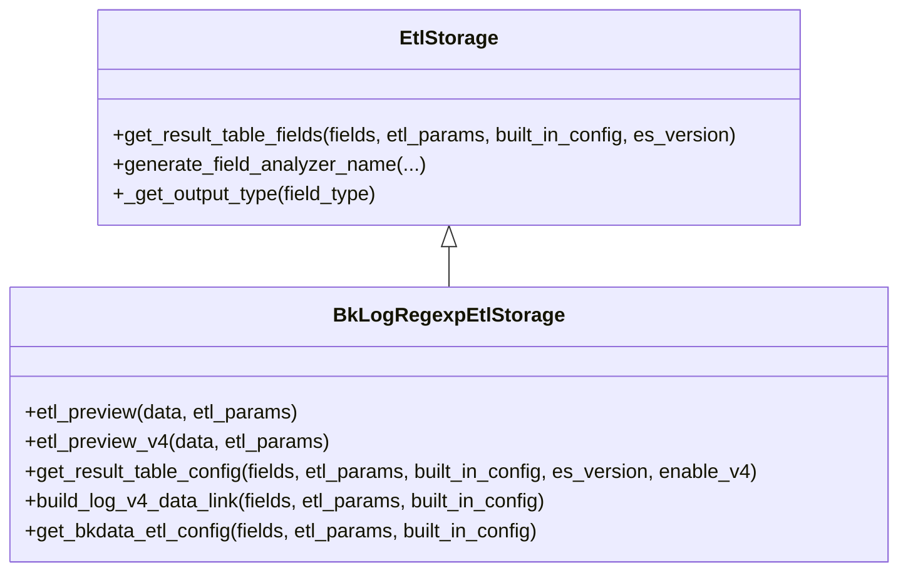
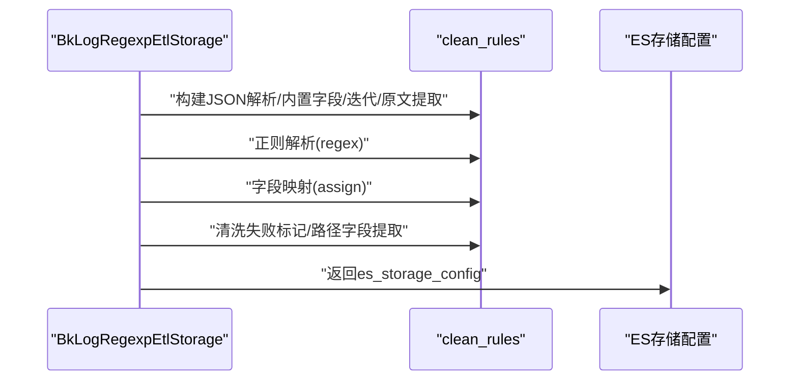
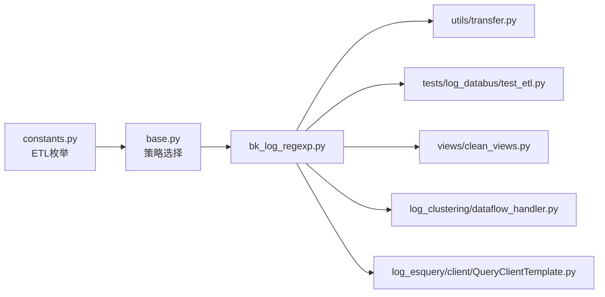

# 正则存储

<cite>
**本文引用的文件**
- [bk_log_regexp.py](file://bklog/apps/log_databus/handlers/etl_storage/bk_log_regexp.py)
- [base.py](file://bklog/apps/log_databus/handlers/etl_storage/base.py)
- [constants.py](file://bklog/apps/log_databus/constants.py)
- [transfer.py](file://bklog/apps/log_databus/handlers/etl_storage/utils/transfer.py)
- [clean_views.py](file://bklog/apps/log_databus/views/clean_views.py)
- [test_etl.py](file://bklog/apps/tests/log_databus/test_etl.py)
- [dataflow_handler.py](file://bklog/apps/log_clustering/handlers/dataflow/dataflow_handler.py)
- [QueryClientTemplate.py](file://bklog/apps/log_esquery/esquery/client/QueryClientTemplate.py)
</cite>

## 目录
1. [简介](#简介)
2. [项目结构](#项目结构)
3. [核心组件](#核心组件)
4. [架构总览](#架构总览)
5. [组件详解](#组件详解)
6. [依赖关系分析](#依赖关系分析)
7. [性能考量](#性能考量)
8. [故障排查指南](#故障排查指南)
9. [结论](#结论)
10. [附录](#附录)

## 简介
本篇文档围绕“正则存储”展开，系统阐述通过正则表达式对非结构化日志进行字段提取，并将其结构化后写入Elasticsearch的完整实现路径。重点覆盖：
- 正则提取规则的编译、执行与错误处理
- 预览与调试流程（含V4数据链路）
- 结果表字段生成、ES映射与分析器配置
- 性能特征与最佳实践
- 常见问题定位与排障建议

## 项目结构
与“正则存储”相关的核心模块位于日志采集与清洗子系统中，主要涉及：
- ETL存储策略选择与正则实现：bk_log_regexp.py
- ETL基类与通用逻辑：base.py
- 常量与清洗配置枚举：constants.py
- 字段提取预览工具（调用本地可执行）：utils/transfer.py
- 清洗接口入口（API文档与参数校验）：views/clean_views.py
- 单元测试与V4预览验证：tests/log_databus/test_etl.py
- ES存储配置与聚类输出：log_clustering/dataflow_handler.py
- ES映射与分析器详情注入：log_esquery/client/QueryClientTemplate.py

图表来源
- [bk_log_regexp.py](file://bklog/apps/log_databus/handlers/etl_storage/bk_log_regexp.py#L1-L421)
- [base.py](file://bklog/apps/log_databus/handlers/etl_storage/base.py#L80-L279)
- [constants.py](file://bklog/apps/log_databus/constants.py#L370-L420)
- [transfer.py](file://bklog/apps/log_databus/handlers/etl_storage/utils/transfer.py#L1-L103)
- [clean_views.py](file://bklog/apps/log_databus/views/clean_views.py#L510-L557)
- [test_etl.py](file://bklog/apps/tests/log_databus/test_etl.py#L940-L1139)
- [dataflow_handler.py](file://bklog/apps/log_clustering/handlers/dataflow/dataflow_handler.py#L1430-L1505)
- [QueryClientTemplate.py](file://bklog/apps/log_esquery/esquery/client/QueryClientTemplate.py#L63-L104)

章节来源
- [bk_log_regexp.py](file://bklog/apps/log_databus/handlers/etl_storage/bk_log_regexp.py#L1-L421)
- [base.py](file://bklog/apps/log_databus/handlers/etl_storage/base.py#L80-L279)
- [constants.py](file://bklog/apps/log_databus/constants.py#L370-L420)

## 核心组件
- BkLogRegexpEtlStorage：实现正则清洗的ETL存储策略，负责：
  - 预览与调试（Python正则与V4数据链路两种路径）
  - 结果表配置生成（含保留原文、扁平化、清洗失败标记等）
  - V4数据链路clean_rules构建（JSON解析、迭代、正则提取、字段映射、路径字段提取）
  - 传统ETL配置（BkData）生成
- EtlStorage基类：提供通用字段生成、ES映射与分析器配置、V3/V4时间格式转换、内置字段处理等能力
- constants：定义ETL配置枚举（含正则）、默认ETL参数等
- transfer：封装本地可执行程序调用，用于预览正则提取结果
- clean_views：清洗接口文档与参数校验，明确正则参数传递方式
- 测试：覆盖空正则、无匹配、V4预览等关键场景
- ES存储与聚类：聚类输出时从存储配置中读取ES过期时间、字段集合等

章节来源
- [bk_log_regexp.py](file://bklog/apps/log_databus/handlers/etl_storage/bk_log_regexp.py#L33-L421)
- [base.py](file://bklog/apps/log_databus/handlers/etl_storage/base.py#L80-L279)
- [constants.py](file://bklog/apps/log_databus/constants.py#L370-L420)
- [transfer.py](file://bklog/apps/log_databus/handlers/etl_storage/utils/transfer.py#L34-L103)
- [clean_views.py](file://bklog/apps/log_databus/views/clean_views.py#L510-L557)
- [test_etl.py](file://bklog/apps/tests/log_databus/test_etl.py#L940-L1139)
- [dataflow_handler.py](file://bklog/apps/log_clustering/handlers/dataflow/dataflow_handler.py#L1430-L1505)

## 架构总览
正则存储在“采集-清洗-入库”的链路中承担“结构化提取”职责，整体流程如下：

图表来源
- [clean_views.py](file://bklog/apps/log_databus/views/clean_views.py#L510-L557)
- [bk_log_regexp.py](file://bklog/apps/log_databus/handlers/etl_storage/bk_log_regexp.py#L33-L120)
- [transfer.py](file://bklog/apps/log_databus/handlers/etl_storage/utils/transfer.py#L34-L103)
- [base.py](file://bklog/apps/log_databus/handlers/etl_storage/base.py#L543-L739)

## 组件详解

### 1) 正则预览与调试
- Python预览路径：
  - 参数校验：要求提供正则表达式；若未提供或无法匹配，抛出校验异常
  - 编译与匹配：使用re.S标志编译正则并尝试匹配，获取命名捕获组
  - 预览整合：结合transfer工具返回的字段字典，按顺序输出字段名与值
- V4预览路径：
  - 组装规则：输入原始数据，operator为regex，regex来自etl_params
  - 调用BkDataDatabusApi.databus_clean_debug
  - 解析返回：按key_index顺序组装字段列表

图表来源
- [bk_log_regexp.py](file://bklog/apps/log_databus/handlers/etl_storage/bk_log_regexp.py#L33-L120)
- [transfer.py](file://bklog/apps/log_databus/handlers/etl_storage/utils/transfer.py#L34-L103)
- [test_etl.py](file://bklog/apps/tests/log_databus/test_etl.py#L940-L1139)

章节来源
- [bk_log_regexp.py](file://bklog/apps/log_databus/handlers/etl_storage/bk_log_regexp.py#L33-L120)
- [transfer.py](file://bklog/apps/log_databus/handlers/etl_storage/utils/transfer.py#L34-L103)
- [test_etl.py](file://bklog/apps/tests/log_databus/test_etl.py#L940-L1139)

### 2) 结果表配置与字段生成
- 字段校验：确保用户定义的字段均在正则表达式中出现，否则抛出异常
- option配置：包含保留原文、正则节点来源/动作/名称、正则表达式、扁平化开关、保留额外JSON等
- 字段列表生成：
  - 可选保留原文字段（log），支持自定义分析器与分词器
  - 可选保留未定义JSON（__ext_json）
  - 可选清洗失败标记字段（PARSE_FAILURE_FIELD）
  - 对每个用户字段生成ES映射：类型推断、分析器、doc_values、real_path、时间字段特殊处理等
- 时间字段处理：支持多种时间格式到ES格式的转换，必要时追加纳秒时间字段

图表来源
- [base.py](file://bklog/apps/log_databus/handlers/etl_storage/base.py#L543-L739)
- [bk_log_regexp.py](file://bklog/apps/log_databus/handlers/etl_storage/bk_log_regexp.py#L121-L159)

章节来源
- [base.py](file://bklog/apps/log_databus/handlers/etl_storage/base.py#L543-L739)
- [bk_log_regexp.py](file://bklog/apps/log_databus/handlers/etl_storage/bk_log_regexp.py#L121-L159)

### 3) V4数据链路（正则）
- 规则构建：
  - JSON解析：从原始数据提取json_data
  - 内置字段映射：assign规则
  - items迭代：从json_data取出items并迭代
  - 原文提取：从iter_item提取data字段作为log
  - 正则解析：对iter_string应用regex规则
  - 字段映射：将正则命名捕获组映射到最终字段
  - 清洗失败标记：附加布尔标记字段
  - 路径字段提取：基于separator_configs中的正则，对path字段再次正则提取并映射
- ES存储配置：注入unique_field_list与时区等

图表来源
- [bk_log_regexp.py](file://bklog/apps/log_databus/handlers/etl_storage/bk_log_regexp.py#L160-L310)

章节来源
- [bk_log_regexp.py](file://bklog/apps/log_databus/handlers/etl_storage/bk_log_regexp.py#L160-L310)

### 4) 传统ETL（BkData）配置
- 从JSON提取items并迭代
- 可选保留原文字段
- 正则提取：将字段别名或字段名作为keys传入regex_extract，同时对正则进行兼容性替换
- 字段映射：将提取结果赋值到最终字段
- 默认字段与时间字段配置

章节来源
- [bk_log_regexp.py](file://bklog/apps/log_databus/handlers/etl_storage/bk_log_regexp.py#L311-L421)

### 5) ES映射与分析器
- 字段映射：
  - 字段类型推断：字符串、整数、长整型、浮点、双精度、布尔、对象等
  - 文本字段支持自定义分析器与分词器（大小写敏感、自定义字符分组）
  - doc_values与include_in_all（ES 5.x）控制
  - real_path指向separator节点下的字段路径
- 时间字段：
  - 支持严格日期时间、Unix时间戳等多种格式到ES格式的转换
  - 可选纳秒时间字段
- 映射增强：
  - ES映射中注入分析器与分词器详情，便于查询侧展示

章节来源
- [base.py](file://bklog/apps/log_databus/handlers/etl_storage/base.py#L493-L739)
- [QueryClientTemplate.py](file://bklog/apps/log_esquery/esquery/client/QueryClientTemplate.py#L63-L104)

## 依赖关系分析
- ETL策略选择：
  - constants定义ETL配置枚举（含正则）
  - base.etl_config_map根据option中的separator_node_action返回etl_config
- 接口与参数：
  - clean_views对正则参数进行文档化与校验
- 预览与调试：
  - transfer封装本地可执行，支持正则预览
  - V4预览通过BkDataDatabusApi
- 存储与聚类：
  - dataflow_handler从存储配置读取ES过期时间、字段集合等

图表来源
- [constants.py](file://bklog/apps/log_databus/constants.py#L370-L420)
- [base.py](file://bklog/apps/log_databus/handlers/etl_storage/base.py#L80-L100)
- [bk_log_regexp.py](file://bklog/apps/log_databus/handlers/etl_storage/bk_log_regexp.py#L1-L421)
- [transfer.py](file://bklog/apps/log_databus/handlers/etl_storage/utils/transfer.py#L34-L103)
- [clean_views.py](file://bklog/apps/log_databus/views/clean_views.py#L510-L557)
- [test_etl.py](file://bklog/apps/tests/log_databus/test_etl.py#L940-L1139)
- [dataflow_handler.py](file://bklog/apps/log_clustering/handlers/dataflow/dataflow_handler.py#L1430-L1505)
- [QueryClientTemplate.py](file://bklog/apps/log_esquery/esquery/client/QueryClientTemplate.py#L63-L104)

章节来源
- [constants.py](file://bklog/apps/log_databus/constants.py#L370-L420)
- [base.py](file://bklog/apps/log_databus/handlers/etl_storage/base.py#L80-L100)
- [bk_log_regexp.py](file://bklog/apps/log_databus/handlers/etl_storage/bk_log_regexp.py#L1-L421)

## 性能考量
- 正则匹配开销
  - Python侧编译一次，随后多次匹配；V4路径通过BkData执行，避免Python正则开销
  - 命名捕获组顺序稳定，有利于预览与字段映射
- 字段提取效率
  - 预览优先使用transfer本地可执行，减少网络与服务端压力
  - V4预览通过API直连，适合复杂规则与批量调试
- 存储结构优化
  - 文本字段可配置自定义分析器与分词器，兼顾检索与聚合
  - doc_values开启维度字段，提升排序与聚合性能
  - real_path精确定位字段来源，降低映射歧义
- 时间字段
  - 多种时间格式统一转换，避免解析成本分散在查询侧
  - 纳秒时间字段按需启用，避免冗余字段

章节来源
- [bk_log_regexp.py](file://bklog/apps/log_databus/handlers/etl_storage/bk_log_regexp.py#L33-L120)
- [base.py](file://bklog/apps/log_databus/handlers/etl_storage/base.py#L493-L739)

## 故障排查指南
- 正则为空或无效
  - 现象：预览抛出校验异常
  - 排查：确认etl_params.separator_regexp是否填写；使用V4预览或transfer预览验证
  - 参考
    - [bk_log_regexp.py](file://bklog/apps/log_databus/handlers/etl_storage/bk_log_regexp.py#L33-L120)
    - [test_etl.py](file://bklog/apps/tests/log_databus/test_etl.py#L940-L983)
- 正则无法匹配
  - 现象：预览抛出校验异常
  - 排查：检查日志样本与正则是否一致；使用V4预览或transfer预览逐段验证
  - 参考
    - [bk_log_regexp.py](file://bklog/apps/log_databus/handlers/etl_storage/bk_log_regexp.py#L33-L120)
    - [test_etl.py](file://bklog/apps/tests/log_databus/test_etl.py#L963-L983)
- 字段未在正则中定义
  - 现象：结果表配置阶段抛出校验异常
  - 排查：确保所有用户字段均在正则命名捕获组中出现
  - 参考
    - [bk_log_regexp.py](file://bklog/apps/log_databus/handlers/etl_storage/bk_log_regexp.py#L121-L159)
- 特殊字符转义
  - 现象：预览正常但入库字段缺失
  - 排查：确认正则中的特殊字符是否正确转义；V4路径中对正则进行兼容性替换
  - 参考
    - [bk_log_regexp.py](file://bklog/apps/log_databus/handlers/etl_storage/bk_log_regexp.py#L311-L421)
- 分析器与分词器问题
  - 现象：检索/聚合效果不佳
  - 排查：检查字段是否标记为已分析；确认自定义分析器与分词器配置是否生效
  - 参考
    - [base.py](file://bklog/apps/log_databus/handlers/etl_storage/base.py#L493-L739)
    - [QueryClientTemplate.py](file://bklog/apps/log_esquery/esquery/client/QueryClientTemplate.py#L63-L104)
- ES存储配置
  - 现象：聚类/查询侧字段缺失或过期时间异常
  - 排查：确认ES存储配置中的retention、json_fields、analyzed_fields、doc_values_fields等
  - 参考
    - [dataflow_handler.py](file://bklog/apps/log_clustering/handlers/dataflow/dataflow_handler.py#L1481-L1505)

章节来源
- [bk_log_regexp.py](file://bklog/apps/log_databus/handlers/etl_storage/bk_log_regexp.py#L33-L120)
- [test_etl.py](file://bklog/apps/tests/log_databus/test_etl.py#L940-L1139)
- [base.py](file://bklog/apps/log_databus/handlers/etl_storage/base.py#L493-L739)
- [QueryClientTemplate.py](file://bklog/apps/log_esquery/esquery/client/QueryClientTemplate.py#L63-L104)
- [dataflow_handler.py](file://bklog/apps/log_clustering/handlers/dataflow/dataflow_handler.py#L1481-L1505)

## 结论
正则存储通过“预览-编译-匹配-映射-入库”的闭环，将非结构化日志转化为结构化字段并写入Elasticsearch。其优势在于：
- 预览与调试路径多样（Python正则与V4 API），便于快速验证
- 字段生成与ES映射高度可控，支持分析器、分词器、doc_values等性能优化
- V4数据链路提供完整的数据流转规则，便于复杂场景的统一治理

建议在生产中：
- 优先使用V4预览与API调试，确保规则稳定后再上线
- 合理设计正则命名捕获组，避免过度贪婪与回溯
- 对高频检索字段开启分析器与doc_values，平衡检索与聚合性能
- 关注字段命名与real_path，避免映射歧义

## 附录
- API参数要点（清洗接口）
  - etl_config：正则清洗类型
  - etl_params.separator_regexp：正则表达式
  - data：日志样本
  - 参考
    - [clean_views.py](file://bklog/apps/log_databus/views/clean_views.py#L510-L557)

章节来源
- [clean_views.py](file://bklog/apps/log_databus/views/clean_views.py#L510-L557)