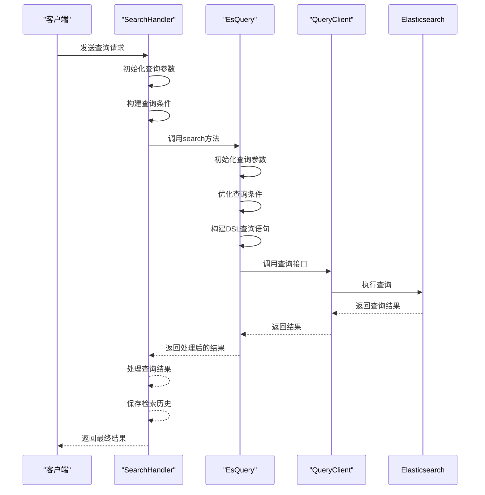
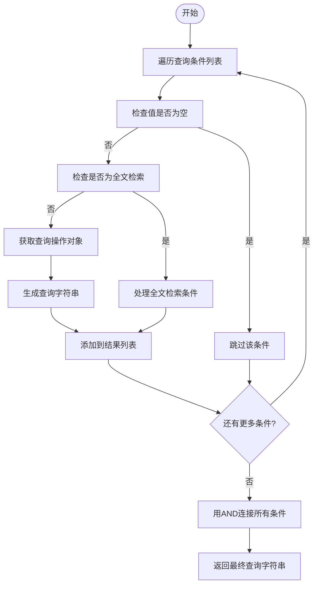
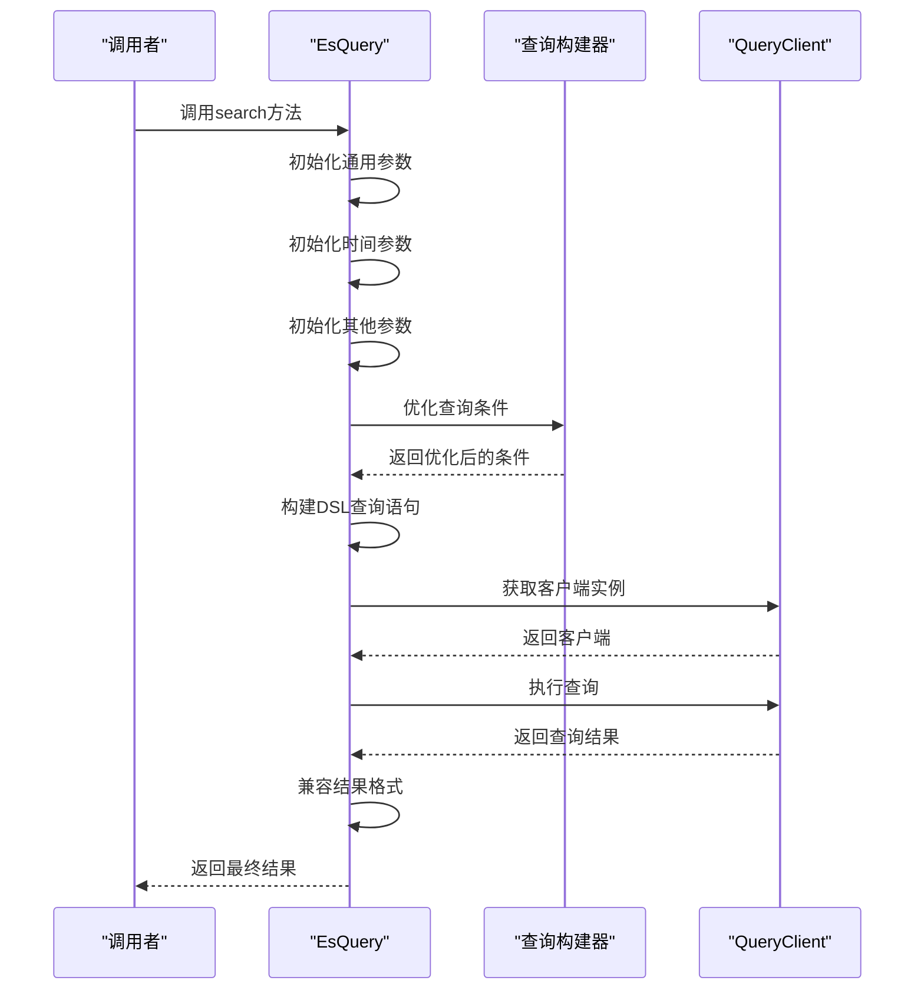
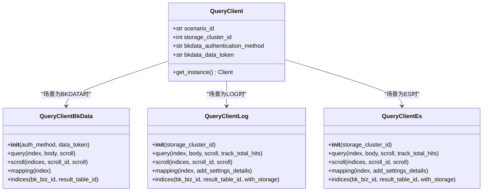
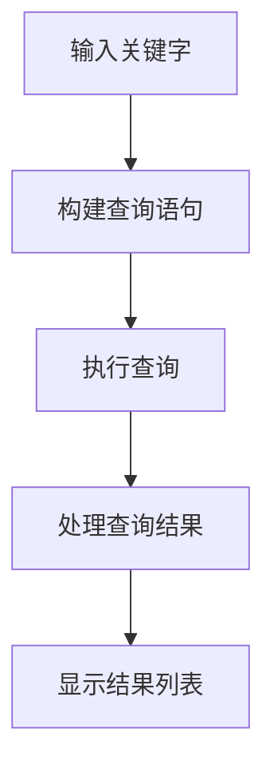
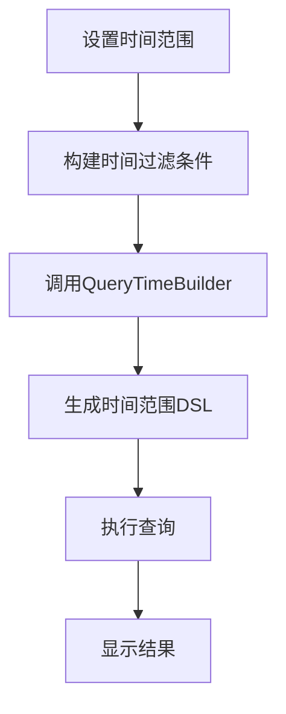
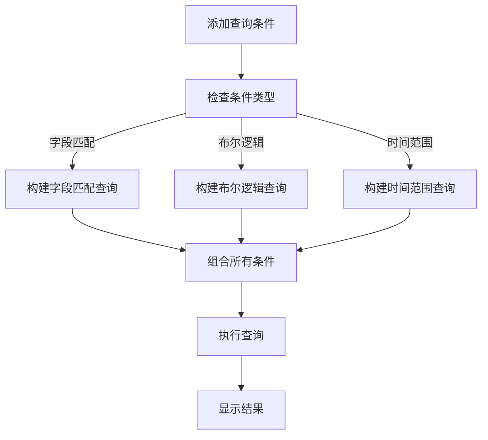
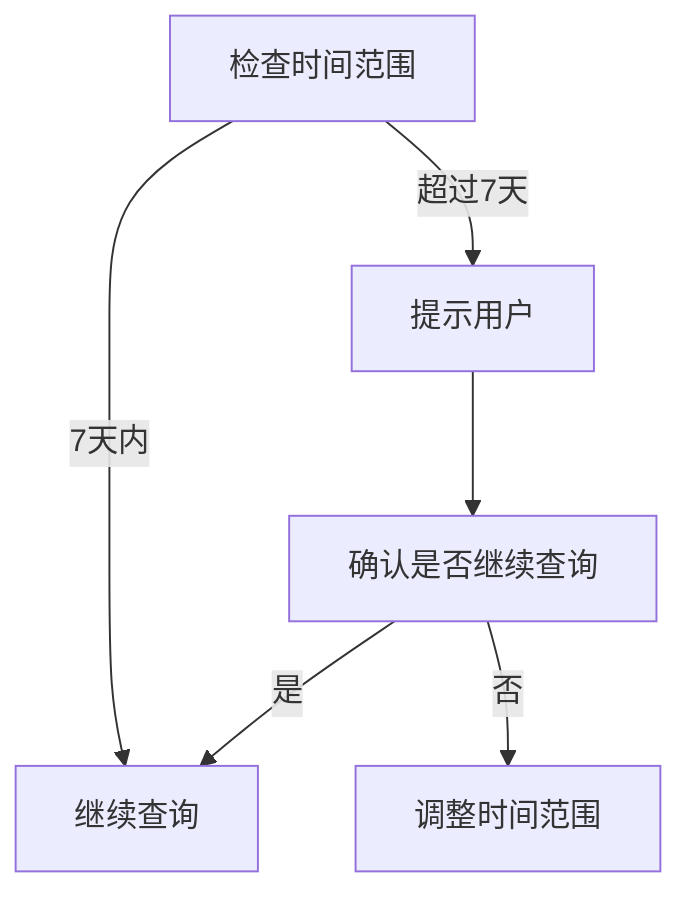
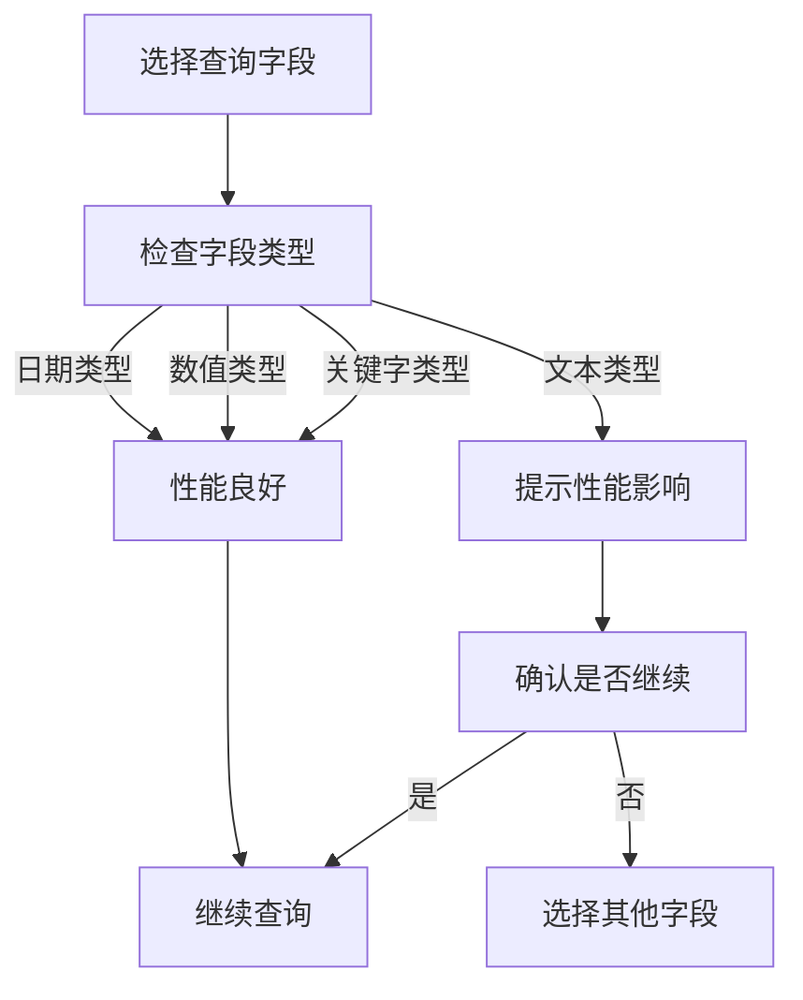
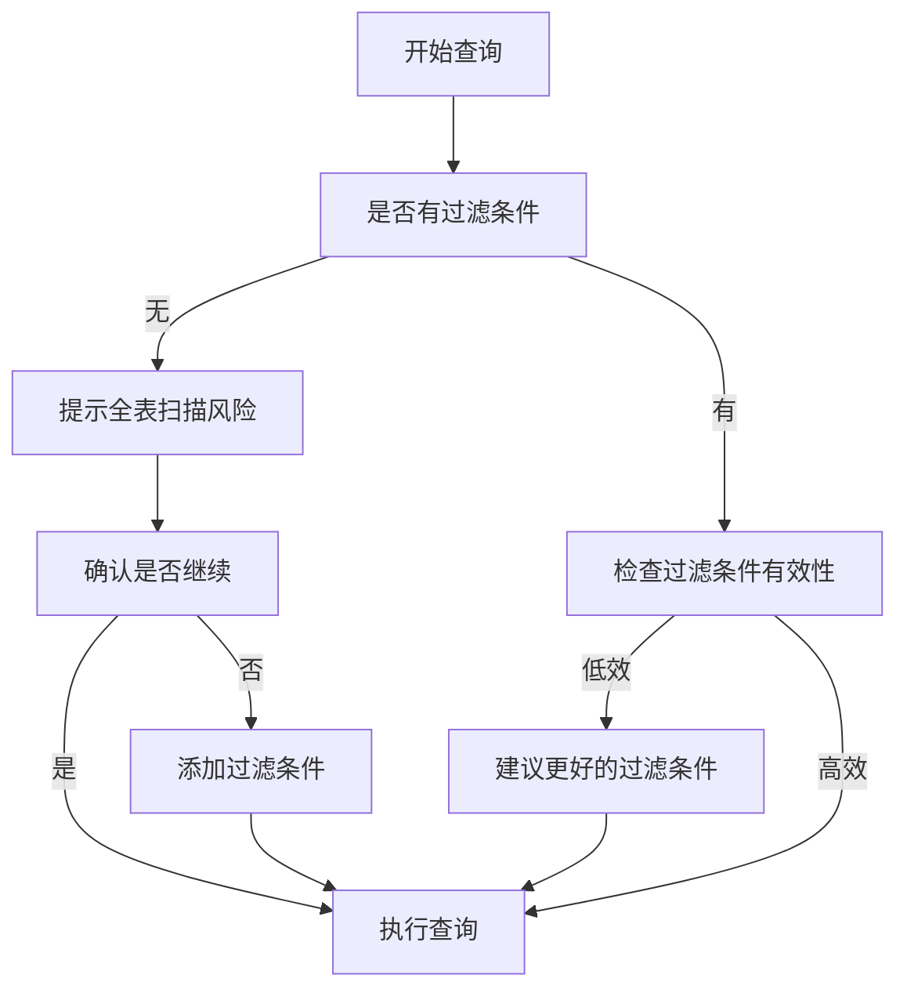

# 基础查询

<cite>
**本文档引用的文件**  
- [search_handlers_esquery.py](file://bklog/apps/log_search/handlers/search/search_handlers_esquery.py)
- [querystring_builder.py](file://bklog/apps/log_search/handlers/es/querystring_builder.py)
- [esquery.py](file://bklog/apps/log_esquery/esquery/esquery.py)
- [query_builder_logic.py](file://bklog/apps/log_esquery/esquery/dsl_builder/query_builder/query_builder_logic.py)
- [dsl_builder.py](file://bklog/apps/log_esquery/esquery/dsl_builder/dsl_builder.py)
- [query_time_builder.py](file://bklog/apps/log_esquery/esquery/builder/query_time_builder.py)
- [query_index_optimizer.py](file://bklog/apps/log_esquery/esquery/builder/query_index_optimizer.py)
- [query_filter_builder.py](file://bklog/apps/log_esquery/esquery/builder/query_filter_builder.py)
- [QueryClient.py](file://bklog/apps/log_esquery/esquery/client/QueryClient.py)
</cite>

## 目录
1. [简介](#简介)
2. [基础查询请求处理流程](#基础查询请求处理流程)
3. [查询字符串构建机制](#查询字符串构建机制)
4. [Elasticsearch查询执行实现](#elasticsearch查询执行实现)
5. [基础查询使用示例](#基础查询使用示例)
6. [查询性能优化建议](#查询性能优化建议)

## 简介
基础查询功能是日志查询服务的核心能力，支持用户通过关键字、时间范围和多条件组合等方式检索日志数据。系统通过`search_handlers_esquery.py`处理查询请求，利用`querystring_builder.py`将用户输入转换为Elasticsearch DSL查询语句，并通过`esquery.py`执行查询。该功能支持全文检索、字段匹配、布尔逻辑和时间范围查询，同时提供结果分页、排序和高亮显示等特性。

## 基础查询请求处理流程

`search_handlers_esquery.py`中的`SearchHandler`类负责处理基础查询请求，其处理流程包括查询参数解析、条件构建和结果返回三个主要阶段。

### 查询参数初始化
`SearchHandler`在初始化时接收索引集ID和查询参数字典，完成以下初始化工作：
- 构建索引集字符串并确定查询场景（scenario_id）和存储集群ID
- 验证索引集是否存在时间字段，并初始化时间字段相关信息
- 设置IP字段名称（ip或serverIp）根据查询场景
- 透传查询参数如时间范围、起止时间、时区、查询字符串、分页参数等
- 初始化排序列表、聚合条件、高亮设置等查询选项

**Section sources**
- [search_handlers_esquery.py](file://bklog/apps/log_search/handlers/search/search_handlers_esquery.py#L166-L352)

### 查询条件构建
系统在初始化过程中构建多种查询条件：
- **时间字段处理**：通过`init_time_field`方法确定时间字段、类型和单位
- **查询字符串处理**：通过`_enhance`方法对查询字符串进行语法增强
- **补充全文检索**：通过`_add_all_fields_search`方法处理全文检索条件
- **排序列表构建**：通过`_init_sort`方法初始化排序列表
- **聚合条件构建**：通过`_init_aggs`方法初始化聚合条件
- **高亮设置**：通过`_init_highlight`方法配置高亮显示

**Section sources**
- [search_handlers_esquery.py](file://bklog/apps/log_search/handlers/search/search_handlers_esquery.py#L227-L285)

### 结果返回机制
查询结果通过`search`方法返回，其处理流程如下：
- 校验查询数量是否超出限制
- 执行预查询（pre_search）以优化性能
- 根据需要执行滚动查询（scroll）以获取大量数据
- 处理查询结果，包括脱敏、字段长度分析等
- 保存检索历史记录
- 返回包含结果列表、总数、滚动ID等信息的响应

**Diagram sources**
- [search_handlers_esquery.py](file://bklog/apps/log_search/handlers/search/search_handlers_esquery.py#L643-L711)
- [esquery.py](file://bklog/apps/log_esquery/esquery/esquery.py#L149-L224)

## 查询字符串构建机制

`querystring_builder.py`负责将用户输入的查询参数转换为Elasticsearch DSL查询语句，支持字段匹配、时间范围和布尔逻辑等复杂查询。

### 查询参数到查询字符串的转换
`QueryStringBuilder`类的`to_querystring`方法将查询参数转换为查询字符串：
- 遍历查询条件列表（addition）
- 跳过空值的查询条件
- 处理全文检索情况（字段为*或__query_string__）
- 使用`BoolQueryOperation`获取查询操作对象
- 调用`to_querystring`方法生成查询字符串
- 将所有查询条件用AND连接

**Diagram sources**
- [querystring_builder.py](file://bklog/apps/log_search/handlers/es/querystring_builder.py#L27-L62)

### 布尔逻辑操作实现
系统通过`BoolQueryOperation`类实现各种布尔逻辑操作：
- **等于（is/eq）**：使用match_phrase查询
- **存在（exists）**：使用exists查询
- **不存在（does not exists）**：使用must_not的exists查询
- **大于/小于（gt/lt）**：使用range查询
- **包含（contains）**：使用wildcard查询
- **多值匹配（is one of）**：使用terms查询或should的match_phrase查询

每种操作都实现了`op`方法来构建查询条件和`to_querystring`方法来生成查询字符串。

**Section sources**
- [query_builder_logic.py](file://bklog/apps/log_esquery/esquery/dsl_builder/query_builder/query_builder_logic.py#L222-L651)

## Elasticsearch查询执行实现

`esquery.py`中的`EsQuery`类负责执行Elasticsearch查询，包括连接池管理、查询超时设置和错误处理。

### 查询执行流程
`EsQuery`类的`search`方法执行查询的主要步骤：
- 初始化查询参数（场景、索引、存储集群ID等）
- 初始化时间相关参数
- 初始化其他查询参数（大小、起始位置、聚合等）
- 优化查询条件（查询字符串、过滤条件、索引、排序）
- 构建DSL查询语句
- 获取查询客户端实例
- 执行查询并返回结果

**Diagram sources**
- [esquery.py](file://bklog/apps/log_esquery/esquery/esquery.py#L149-L224)

### 连接池管理
系统通过`QueryClient`类实现连接池管理：
- 根据查询场景（BKDATA、LOG、ES）选择不同的客户端实现
- 使用`import_string`动态导入相应的客户端类
- 为LOG和ES场景传递存储集群ID
- 为BKDATA场景传递认证信息

**Diagram sources**
- [QueryClient.py](file://bklog/apps/log_esquery/esquery/client/QueryClient.py#L28-L52)

### 查询超时设置和错误处理
系统在查询执行过程中实现了超时设置和错误处理机制：
- 通过`scroll`参数设置查询超时时间
- 记录查询性能指标（延迟和调用次数）
- 兼容不同Elasticsearch版本的Total格式
- 处理查询失败情况，解析shards failures信息并抛出异常

**Section sources**
- [esquery.py](file://bklog/apps/log_esquery/esquery/esquery.py#L210-L224)

## 基础查询使用示例

### 按关键字搜索
按关键字搜索是最基本的查询方式，用户可以在查询框中输入关键字进行全文检索。

**Section sources**
- [search_handlers_esquery.py](file://bklog/apps/log_search/handlers/search/search_handlers_esquery.py#L259-L260)

### 按时间范围查询
按时间范围查询允许用户指定特定时间段内的日志数据。

**Diagram sources**
- [query_time_builder.py](file://bklog/apps/log_esquery/esquery/builder/query_time_builder.py#L36-L103)

### 多条件组合查询
多条件组合查询支持用户通过多个条件的组合来精确筛选日志数据。

**Section sources**
- [query_filter_builder.py](file://bklog/apps/log_esquery/esquery/builder/query_filter_builder.py#L26-L47)

## 查询性能优化建议

### 合理设置查询时间范围
建议用户合理设置查询时间范围，避免查询过长时间段的数据，以提高查询性能。

**Section sources**
- [query_time_builder.py](file://bklog/apps/log_esquery/esquery/builder/query_time_builder.py#L120-L152)

### 使用合适的字段类型
建议用户使用合适的字段类型进行查询，避免在非索引字段上进行查询。

### 避免全表扫描
建议用户避免全表扫描，通过添加过滤条件来缩小查询范围。

**Section sources**
- [query_index_optimizer.py](file://bklog/apps/log_esquery/esquery/builder/query_index_optimizer.py#L33-L138)