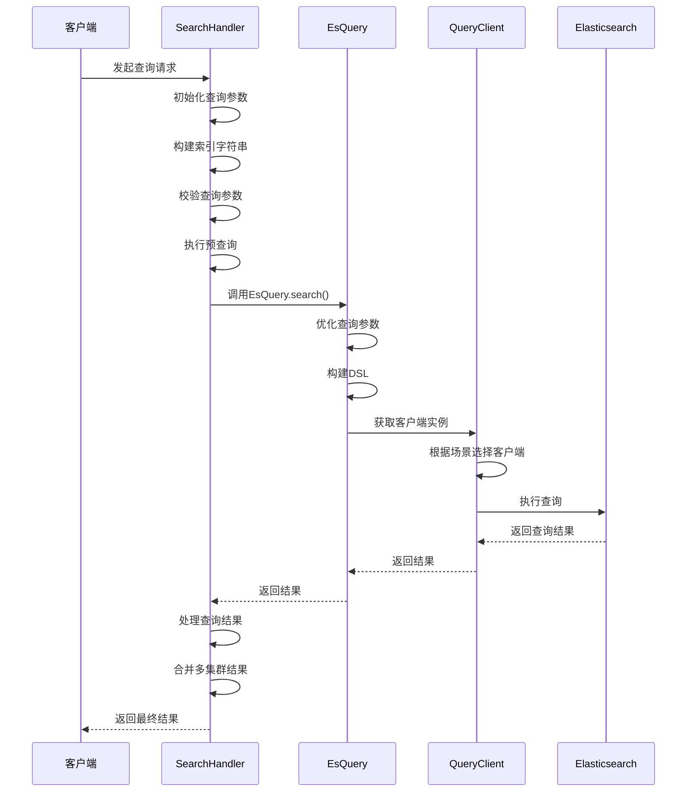
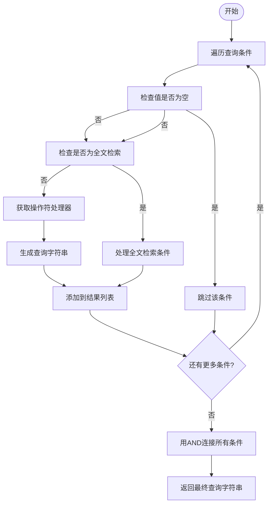
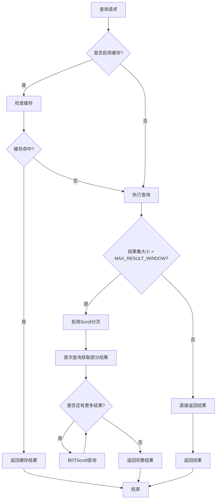
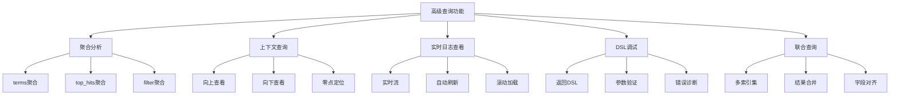
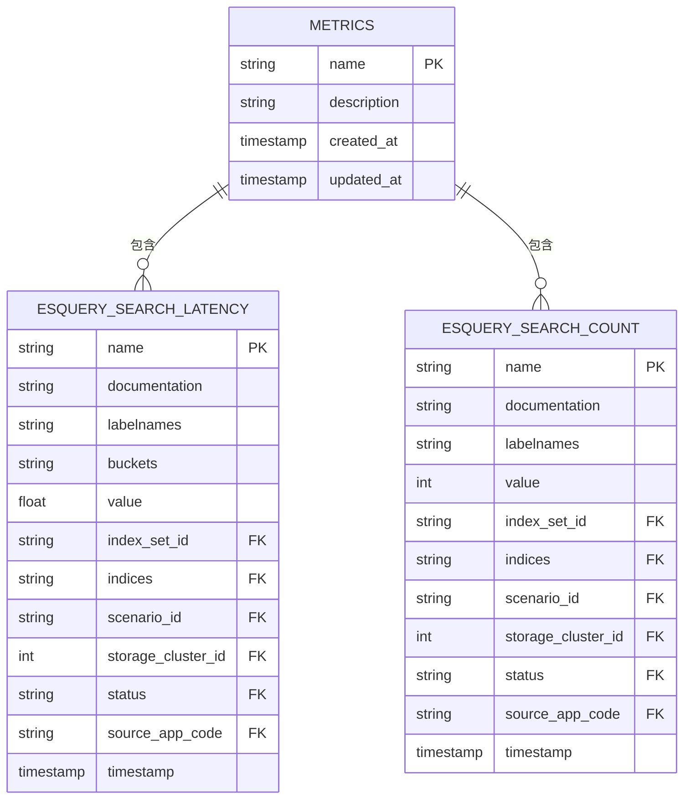

# 数据查询

<cite>
**本文档引用的文件**   
- [search_handlers_esquery.py](file://bklog/apps/log_search/handlers/search/search_handlers_esquery.py)
- [querystring_builder.py](file://bklog/apps/log_search/handlers/es/querystring_builder.py)
- [esquery.py](file://bklog/apps/log_esquery/esquery/esquery.py)
- [dsl_builder.py](file://bklog/apps/log_esquery/esquery/dsl_builder/dsl_builder.py)
- [query_builder_logic.py](file://bklog/apps/log_esquery/esquery/dsl_builder/query_builder/query_builder_logic.py)
- [QueryClient.py](file://bklog/apps/log_esquery/client/QueryClient.py)
- [metrics.py](file://bklog/apps/log_esquery/metrics.py)
- [constants.py](file://bklog/apps/log_esquery/constants.py)
</cite>

## 目录
1. [引言](#引言)
2. [查询请求处理流程](#查询请求处理流程)
3. [查询字符串转换逻辑](#查询字符串转换逻辑)
4. [Elasticsearch交互实现](#elasticsearch交互实现)
5. [查询性能优化技术](#查询性能优化技术)
6. [高级查询功能示例](#高级查询功能示例)
7. [查询性能监控指标](#查询性能监控指标)
8. [查询优化建议](#查询优化建议)
9. [结论](#结论)

## 引言
日志查询服务是蓝鲸日志平台的核心功能之一，提供高效、灵活的日志检索能力。本系统基于Elasticsearch构建，通过多层架构设计实现了从查询请求处理、DSL转换、Elasticsearch交互到结果返回的完整流程。系统支持多种查询场景，包括标准日志、蓝鲸数据平台（BKDATA）和第三方Elasticsearch集群。查询服务采用模块化设计，各组件职责清晰，便于维护和扩展。通过特性开关（Feature Toggle）机制，系统能够灵活控制功能启用，支持灰度发布和A/B测试。整个查询流程注重性能优化，实现了查询缓存、结果分页、字段投影等关键技术，确保在大规模日志数据场景下的查询效率。

**Section sources**
- [search_handlers_esquery.py](file://bklog/apps/log_search/handlers/search/search_handlers_esquery.py#L1-L100)

## 查询请求处理流程
日志查询服务的请求处理流程始于`SearchHandler`类，该类负责协调整个查询过程。当接收到查询请求时，系统首先初始化查询参数，包括索引集ID、查询字典、时间范围、排序规则等。`SearchHandler`通过`_init_indices_str`方法构建索引字符串，并根据索引集配置确定查询场景（scenario_id）和存储集群ID。系统支持多种查询类型，包括常规搜索、上下文搜索和实时日志查看，通过`search_type_tag`参数进行区分。

查询流程的核心是`search`方法，该方法首先校验查询大小是否超出限制，然后根据预查询设置决定是否执行预查询。系统通过`_multi_search`方法实现多存储集群的并行查询，当存在存储集群切换记录时，会同时向当前和历史存储集群发起查询请求，并合并结果。对于大结果集，系统支持scroll分页查询，通过`_scroll`方法实现滚动查询，确保能够获取完整的查询结果。查询结果在返回前会经过`_deal_query_result`方法处理，包括脱敏、添加CMDB信息、BCS集群信息等。



**Diagram sources **
- [search_handlers_esquery.py](file://bklog/apps/log_search/handlers/search/search_handlers_esquery.py#L643-L711)
- [esquery.py](file://bklog/apps/log_esquery/esquery/esquery.py#L149-L224)

**Section sources**
- [search_handlers_esquery.py](file://bklog/apps/log_search/handlers/search/search_handlers_esquery.py#L166-L711)

## 查询字符串转换逻辑
查询字符串到Elasticsearch DSL的转换由`QueryStringBuilder`类负责，该类实现了将用户友好的查询语法转换为Elasticsearch原生DSL的功能。转换过程始于`to_querystring`方法，该方法遍历查询条件列表，将每个条件转换为对应的查询字符串。系统支持多种查询操作符，包括"等于"、"不等于"、"包含"、"不包含"、"大于"、"小于"等，每种操作符对应不同的查询逻辑。

对于全文检索条件，系统会将查询值用引号包围，并使用OR操作符连接多个值。对于字段条件，系统通过`BoolQueryOperation.get_op`方法获取对应的操作符处理器，然后调用其`to_querystring`方法生成查询字符串。系统还支持通配符查询、正则表达式查询等高级功能。在转换过程中，系统会对特殊字符进行转义处理，确保生成的查询字符串符合Elasticsearch语法规范。最终，所有条件通过AND操作符连接，形成完整的查询字符串。



**Diagram sources **
- [querystring_builder.py](file://bklog/apps/log_search/handlers/es/querystring_builder.py#L27-L62)
- [query_builder_logic.py](file://bklog/apps/log_esquery/esquery/dsl_builder/query_builder/query_builder_logic.py#L222-L651)

**Section sources**
- [querystring_builder.py](file://bklog/apps/log_search/handlers/es/querystring_builder.py#L27-L62)

## Elasticsearch交互实现
与Elasticsearch的交互由`EsQuery`类和`QueryClient`类协同完成。`EsQuery`类作为查询服务的核心，封装了与Elasticsearch交互的所有逻辑。该类通过`search`方法执行查询，首先初始化各种查询参数，然后调用`_optimizer`方法优化查询条件，包括查询字符串、过滤条件和排序规则。系统通过`DslBuilder`类构建Elasticsearch DSL，该类将查询参数转换为符合Elasticsearch API规范的JSON结构。

`QueryClient`类负责管理不同场景下的Elasticsearch客户端实例。系统支持三种查询场景：BKDATA、LOG和ES，每种场景对应不同的客户端实现。`get_instance`方法根据场景ID动态导入并实例化相应的客户端类。客户端实例化后，`EsQuery`通过该实例执行查询操作。系统还实现了`scroll`、`dsl`、`mapping`等方法，支持滚动查询、DSL调试和索引映射查询等高级功能。查询结果在返回前会经过`compatibility_result`方法处理，确保兼容不同版本的Elasticsearch响应格式。

```mermaid
classDiagram
class EsQuery {
+search_dict : Dict
+include_nested_fields : bool
+__init__(search_dict)
+search()
+scroll()
+dsl()
+mapping()
+indices()
+cluster_stats()
+cluster_nodes_stats()
+get_cluster_info()
+cat_indices()
+es_route()
+_optimizer()
+_init_common_args()
+_init_time_field_args()
+_init_include_time_args()
+_init_time_args()
+_init_bkdata_args()
+_init_search_after_args()
+_init_other_args()
+_optimizer_mapping_time_range()
+time_start_end_builder()
+_get_client()
+_enhance()
+compatibility_result(result)
}
class QueryClient {
+scenario_id : str
+storage_cluster_id : int
+bkdata_authentication_method : str
+bkdata_data_token : str
+__init__(scenario_id, storage_cluster_id, bkdata_authentication_method, bkdata_data_token)
+get_instance()
}
class DslBuilder {
+_body : dict
+_query_body : dict
+_agg_body : dict
+time_range_dict : dict
+filter_dict_list : list
+sort_tuple : tuple
+search_string : str
+search : Search
+__init__(search_string, filter_dict_list, time_range_dict, sort_tuple, begin, size, aggs, highlight, collapse, search_after, use_time_range, mappings, time_field, slice_search, slice_id, slice_max)
+body()
+check_special_string(_str)
+build_filter(filter_item)
+build_filter_match_phrase(filter_match_phrase)
+build_time_range()
+build_agg_terms(name, field, size)
+build_agg_top_hit(name, size, sort_field, sort)
+build_agg_filter(name, field, field_value_list)
}
EsQuery --> QueryClient : "使用"
EsQuery --> DslBuilder : "使用"
QueryClient --> "QueryClientBkData" : "实例化"
QueryClient --> "QueryClientLog" : "实例化"
QueryClient --> "QueryClientEs" : "实例化"
```

**Diagram sources **
- [esquery.py](file://bklog/apps/log_esquery/esquery/esquery.py#L51-L405)
- [QueryClient.py](file://bklog/apps/log_esquery/client/QueryClient.py#L28-L52)
- [dsl_builder.py](file://bklog/apps/log_esquery/esquery/dsl_builder/dsl_builder.py#L34-L153)

**Section sources**
- [esquery.py](file://bklog/apps/log_esquery/esquery/esquery.py#L51-L405)
- [QueryClient.py](file://bklog/apps/log_esquery/client/QueryClient.py#L28-L52)

## 查询性能优化技术
日志查询服务实现了多种性能优化技术，确保在大规模数据场景下的查询效率。首先是查询缓存机制，系统通过`cache_five_minute`装饰器对检索历史进行缓存，有效期为5分钟，减少重复查询对后端的负载。对于大结果集查询，系统支持scroll分页，通过`_can_scroll`方法判断是否启用scroll查询，避免单次查询返回过多数据导致性能问题。

结果分页方面，系统通过`_scroll`方法实现滚动查询，每次获取固定数量的结果，直到获取完整结果集。系统还实现了字段投影功能，通过`export_fields`参数指定需要返回的字段，减少网络传输数据量。对于嵌套字段查询，系统通过`NestedFieldQueryTransformer`类优化查询性能，确保嵌套字段能够被正确识别和查询。此外，系统还实现了预查询机制，通过`_multi_search`方法在特定条件下执行预查询，提高查询响应速度。



**Diagram sources **
- [search_handlers_esquery.py](file://bklog/apps/log_search/handlers/search/search_handlers_esquery.py#L1059-L1094)
- [esquery.py](file://bklog/apps/log_esquery/esquery/esquery.py#L226-L246)

**Section sources**
- [search_handlers_esquery.py](file://bklog/apps/log_search/handlers/search/search_handlers_esquery.py#L1059-L1094)

## 高级查询功能示例
日志查询服务支持多种高级查询功能，满足复杂场景下的日志分析需求。聚合分析功能通过`aggs`参数实现，支持terms、top_hits、filter等多种聚合类型。例如，可以按主机IP进行分组统计，获取各主机的日志数量分布。上下文查询功能通过`search_context`方法实现，支持向上和向下查看指定日志条目的上下文内容，便于分析日志的前后关联。

实时日志查看功能通过`search_tail_f`方法实现，支持类似`tail -f`的实时日志流查看。系统通过优化查询条件和索引，确保实时查询的低延迟。对于复杂查询场景，系统支持DSL调试模式，通过`debug`参数返回生成的DSL语句，便于开发人员调试和优化查询。此外，系统还支持联合查询，通过`is_union_search`参数实现多个索引集的联合检索，满足跨业务、跨系统的日志分析需求。



**Diagram sources **
- [search_handlers_esquery.py](file://bklog/apps/log_search/handlers/search/search_handlers_esquery.py#L1650-L1897)
- [esquery.py](file://bklog/apps/log_esquery/esquery/esquery.py#L248-L270)

**Section sources**
- [search_handlers_esquery.py](file://bklog/apps/log_search/handlers/search/search_handlers_esquery.py#L1650-L1897)

## 查询性能监控指标
系统通过Prometheus实现了全面的查询性能监控，关键指标包括查询响应时间、超时率和资源消耗。`ESQUERY_SEARCH_LATENCY`直方图指标记录了每次查询的响应时间，按索引集ID、场景ID、存储集群ID等维度进行标签化，便于分析不同维度的性能表现。`ESQUERY_SEARCH_COUNT`计数器指标记录了查询次数，同样按多维度进行标签化，支持对查询流量的精细化分析。

这些监控指标在`metrics.py`文件中定义，并在`direct_esquery_search`方法中进行观测和计数。系统通过`labels`参数传递上下文信息，包括索引集ID、索引名称、场景ID、存储集群ID、状态和来源应用代码。当查询异常时，状态标签会记录异常信息，便于快速定位问题。通过Grafana等可视化工具，可以实时监控查询性能，设置告警规则，及时发现和解决性能瓶颈。



**Diagram sources **
- [metrics.py](file://bklog/apps/log_esquery/metrics.py#L7-L21)

**Section sources**
- [metrics.py](file://bklog/apps/log_esquery/metrics.py#L7-L21)

## 查询优化建议
为了编写高效的查询语句并避免性能瓶颈，建议遵循以下最佳实践。首先，尽量使用字段过滤而非全文检索，字段过滤能够利用Elasticsearch的倒排索引，查询效率更高。其次，合理使用时间范围过滤，缩小查询的时间窗口可以显著减少需要扫描的数据量。对于大结果集查询，建议使用scroll分页而非from/size分页，避免深度分页带来的性能问题。

避免使用通配符查询和正则表达式查询，这些查询无法利用索引，会导致全表扫描。对于聚合分析，建议设置合理的size限制，避免返回过多分组结果。在联合查询场景下，尽量减少参与联合的索引集数量，降低结果合并的复杂度。此外，建议定期分析查询性能监控指标，识别慢查询并进行优化。对于频繁执行的查询，可以考虑创建专用的索引别名或视图，进一步提升查询效率。

**Section sources**
- [search_handlers_esquery.py](file://bklog/apps/log_search/handlers/search/search_handlers_esquery.py#L643-L711)
- [esquery.py](file://bklog/apps/log_esquery/esquery/esquery.py#L149-L224)

## 结论
日志查询服务通过精心设计的架构和丰富的功能特性，为用户提供高效、灵活的日志检索能力。系统采用模块化设计，各组件职责清晰，便于维护和扩展。通过查询缓存、结果分页、字段投影等性能优化技术，确保了在大规模数据场景下的查询效率。丰富的高级查询功能满足了复杂场景下的日志分析需求。全面的性能监控体系为系统稳定运行提供了保障。未来可以进一步优化查询计划器，实现更智能的查询优化，提升用户体验。