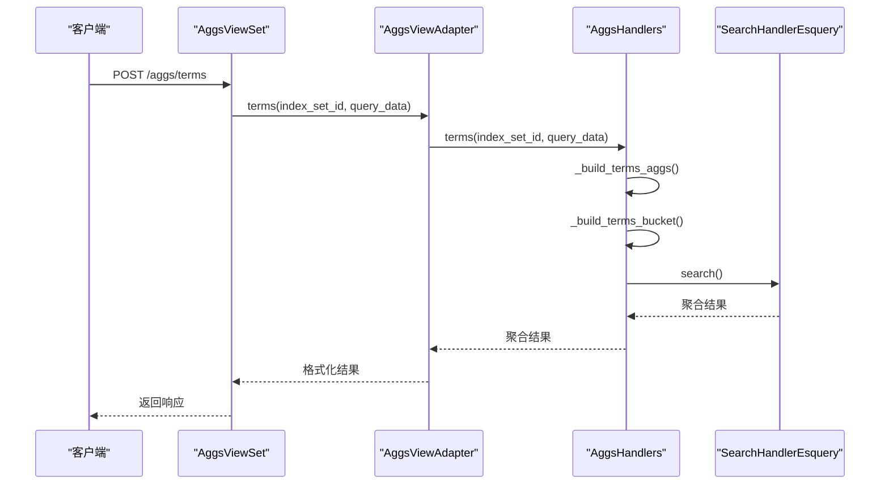
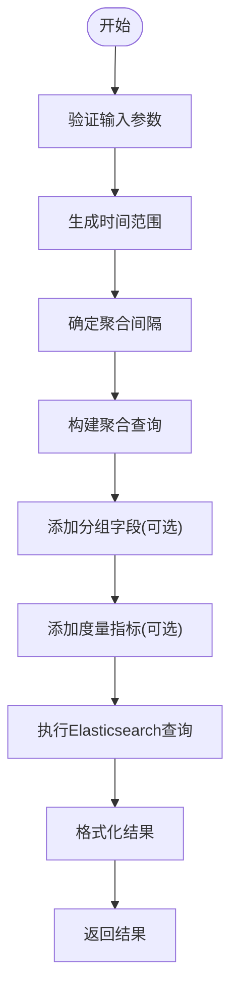
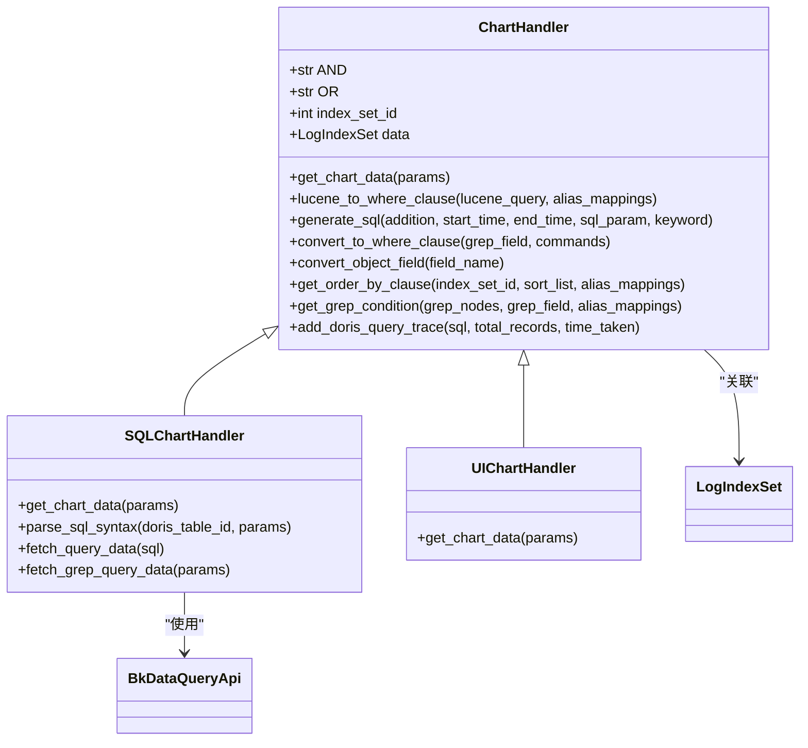

# 聚合查询

<cite>
**本文档引用的文件**   
- [aggs_handlers.py](file://bklog/apps/log_search/handlers/search/aggs_handlers.py)
- [chart_handlers.py](file://bklog/apps/log_search/handlers/search/chart_handlers.py)
- [query_filter_builder.py](file://bklog/apps/log_esquery/esquery/builder/query_filter_builder.py)
- [query_string_builder.py](file://bklog/apps/log_esquery/esquery/builder/query_string_builder.py)
- [aggs_views.py](file://bklog/apps/log_search/views/aggs_views.py)
- [chart.py](file://bklog/apps/log_unifyquery/handler/chart.py)
</cite>

## 目录
1. [聚合查询概述](#聚合查询概述)
2. [聚合查询处理流程](#聚合查询处理流程)
3. [图表数据转换](#图表数据转换)
4. [查询构建器](#查询构建器)
5. [使用示例](#使用示例)
6. [性能优化建议](#性能优化建议)

## 聚合查询概述

聚合查询功能是日志数据统计分析的核心组件，提供对日志数据的多维度统计分析能力。系统支持两种主要的聚合方式：terms聚合和date_histogram聚合。terms聚合用于对特定字段进行分组统计，计算各分组的文档数量；date_histogram聚合则按时间间隔对日志进行分组，支持时间序列分析。聚合查询通过REST API接口暴露，支持联合检索多个索引集的数据，实现跨数据源的统计分析。

**Section sources**
- [aggs_handlers.py](file://bklog/apps/log_search/handlers/search/aggs_handlers.py#L46-L592)
- [aggs_views.py](file://bklog/apps/log_search/views/aggs_views.py#L42-L321)

## 聚合查询处理流程

### Terms聚合处理

Terms聚合处理流程从API请求开始，通过`AggsViewAdapter`类的`terms`方法处理。该方法调用`AggsHandlers`类的`terms`方法构建聚合查询DSL。首先，系统会解析请求中的字段列表，对于嵌套字段，会递归构建多级聚合桶。每个字段的聚合配置包括大小限制（默认100）和排序规则（默认按文档计数降序）。系统使用Elasticsearch DSL库构建查询，通过`_build_terms_aggs`方法处理字段列表，支持单字段和多级字段的聚合。

**Diagram sources **
- [aggs_handlers.py](file://bklog/apps/log_search/handlers/search/aggs_handlers.py#L74-L165)
- [aggs_views.py](file://bklog/apps/log_search/views/aggs_views.py#L99-L103)

### Date Histogram聚合处理

Date Histogram聚合处理流程用于时间序列分析，支持按不同时间间隔（1m、5m、1h、1d）进行数据分组。系统首先根据时间范围自动确定合适的聚合间隔，然后构建date_histogram聚合。处理流程包括时间范围生成、时间格式确定和聚合桶构建。对于非date类型的时间字段，系统会进行数值转换以支持时间聚合。聚合结果会包含时间标签和对应的文档计数，支持在时间桶基础上进行额外的分组字段聚合。

**Diagram sources **
- [aggs_handlers.py](file://bklog/apps/log_search/handlers/search/aggs_handlers.py#L168-L243)
- [aggs_handlers.py](file://bklog/apps/log_search/handlers/search/aggs_handlers.py#L337-L429)

### 联合检索处理

联合检索功能支持同时查询多个索引集的数据并进行结果合并。系统通过`union_search_date_histogram`和`union_search_terms`方法实现，使用多线程并发查询各个索引集，然后合并结果。对于时间序列数据，系统会按时间戳合并相同时间点的文档计数；对于分组统计，系统会合并相同分组键的文档计数并重新排序。这种设计提高了跨索引集查询的性能，避免了串行查询的延迟累积。

**Section sources**
- [aggs_handlers.py](file://bklog/apps/log_search/handlers/search/aggs_handlers.py#L431-L552)
- [aggs_views.py](file://bklog/apps/log_search/views/aggs_views.py#L191-L268)

## 图表数据转换

### 图表处理器架构

图表数据转换功能由`ChartHandler`基类和其子类实现，支持UI模式和SQL模式两种图表生成方式。系统通过工厂模式根据查询模式选择合适的处理器实例。`SQLChartHandler`负责处理SQL查询请求，将UI查询条件转换为Doris SQL语句。转换过程包括条件解析、SQL语法生成和结果格式化。系统支持多种查询操作符的转换，如等于、不等于、包含、正则匹配等，并能正确处理AND/OR逻辑关系。

**Diagram sources **
- [chart_handlers.py](file://bklog/apps/log_search/handlers/search/chart_handlers.py#L72-L676)

### SQL查询生成

SQL查询生成流程从UI查询条件开始，系统会将过滤条件、关键字搜索和时间范围转换为标准的SQL WHERE子句。对于Lucene查询语法，系统使用luqum库解析语法树，然后递归遍历生成相应的SQL条件。特殊字段如`_ext.a.b`会被转换为`CAST(__ext['a']['b'] AS TEXT)`形式以支持嵌套对象查询。系统还支持grep命令的转换，将egrep和grep命令转换为REGEXP和LIKE条件。最终生成的SQL语句会包含时间范围过滤、字段过滤和排序条件。

**Section sources**
- [chart_handlers.py](file://bklog/apps/log_search/handlers/search/chart_handlers.py#L237-L355)
- [chart_handlers.py](file://bklog/apps/log_search/handlers/search/chart_handlers.py#L503-L534)

## 查询构建器

### 查询过滤器构建器

查询过滤器构建器`QueryFilterBuilder`负责将前端传入的过滤条件转换为Elasticsearch查询DSL中的filter上下文。系统会验证每个过滤条件的字段、操作符和值，然后构建标准的filter字典列表。支持的过滤操作符包括等于、不等于、大于、小于等，并能处理AND/OR连接条件。构建的filter列表会被添加到Elasticsearch查询的post_filter中，确保过滤操作在聚合之后执行，不影响聚合结果的准确性。

**Section sources**
- [query_filter_builder.py](file://bklog/apps/log_esquery/esquery/builder/query_filter_builder.py#L26-L48)

### 查询字符串构建器

查询字符串构建器`QueryStringBuilder`负责处理全文搜索关键字，将其转换为Elasticsearch兼容的查询字符串。系统会进行HTML解码和特殊字符检查，对于包含Elasticsearch特殊字符（如+、-、&、|等）的查询，会直接使用原字符串；对于普通文本查询，会自动添加通配符前缀和后缀以支持模糊匹配。这种设计既保证了复杂查询的灵活性，又简化了简单查询的使用。

**Section sources**
- [query_string_builder.py](file://bklog/apps/log_esquery/esquery/builder/query_string_builder.py#L31-L54)

## 使用示例

### 日志数量趋势分析

日志数量趋势分析是最常见的聚合查询用例，通过date_histogram聚合按时间间隔统计日志数量。用户可以设置时间范围和聚合间隔，系统会返回时间序列数据，用于绘制折线图或柱状图。例如，查询过去24小时每5分钟的日志数量，可以监控系统负载变化和异常流量。

### 错误率统计

错误率统计通过terms聚合实现，对日志级别或错误码字段进行分组统计。系统会计算各错误类型的文档数量，并按降序排列，帮助用户快速识别最常见的错误类型。结合时间序列分析，还可以监控错误率随时间的变化趋势。

### 来源分布分析

来源分布分析使用terms聚合对日志来源字段（如主机IP、服务名称、应用模块等）进行分组统计。这种分析有助于了解日志的地理分布、服务调用关系和资源使用情况。系统支持多级嵌套聚合，可以同时分析多个维度的分布情况。

**Section sources**
- [aggs_views.py](file://bklog/apps/log_search/views/aggs_views.py#L51-L103)
- [aggs_views.py](file://bklog/apps/log_search/views/aggs_views.py#L105-L189)

## 性能优化建议

### 合理设置聚合桶数量

聚合查询的性能与返回的聚合桶数量密切相关。系统默认限制为100个桶，建议用户根据实际需求调整此值。过大的桶数量会增加网络传输和内存消耗，可能导致查询超时。对于高基数字段（如用户ID、会话ID等），应谨慎使用聚合，或考虑使用cardinality等近似算法。

### 使用近似算法

对于精确度要求不高的统计场景，建议使用近似算法替代精确聚合。例如，使用cardinality聚合估算唯一值数量，比terms聚合性能更好。系统还支持percentiles聚合的TDigest算法，可以在较小内存占用下提供高精度的分位数计算。

### 预计算汇总数据

对于频繁查询的统计指标，建议设置定时任务预计算汇总数据并存储到专用索引中。这样可以将复杂的实时聚合查询转换为简单的文档检索，大幅提高查询性能。系统提供的`log_count_aggregation_flow.json`模板展示了如何配置日志计数聚合的数据管道。

### 优化查询条件

合理的查询条件可以显著减少需要处理的数据量。建议在聚合查询前添加尽可能多的过滤条件，特别是时间范围过滤和高选择性字段过滤。避免在聚合查询中使用通配符搜索或全表扫描，这些操作会严重影响性能。

**Section sources**
- [aggs_handlers.py](file://bklog/apps/log_search/handlers/search/aggs_handlers.py#L57-L58)
- [aggs_handlers.py](file://bklog/apps/log_search/handlers/search/aggs_handlers.py#L245-L255)