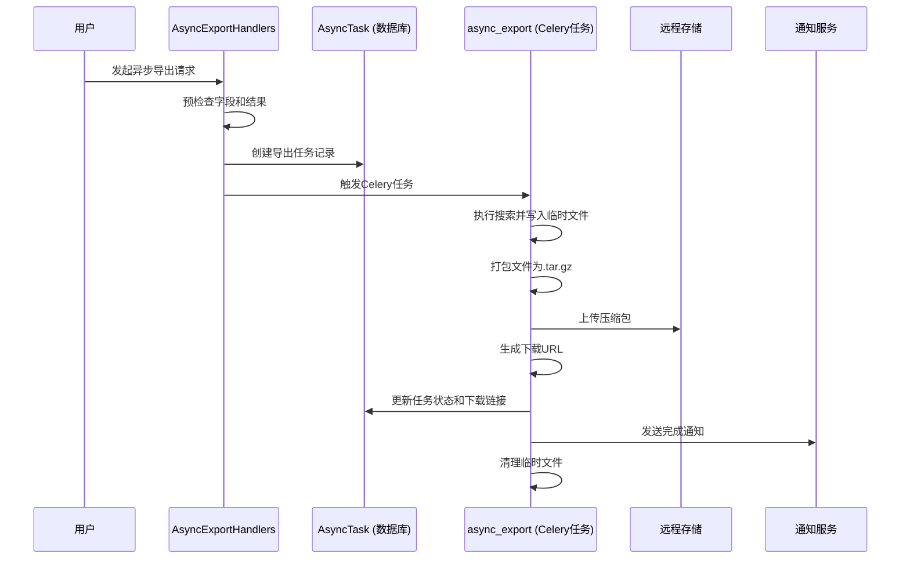
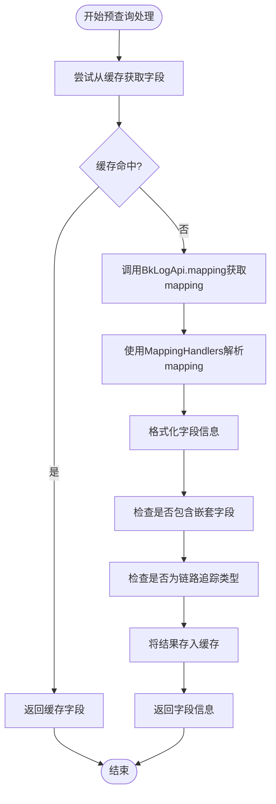
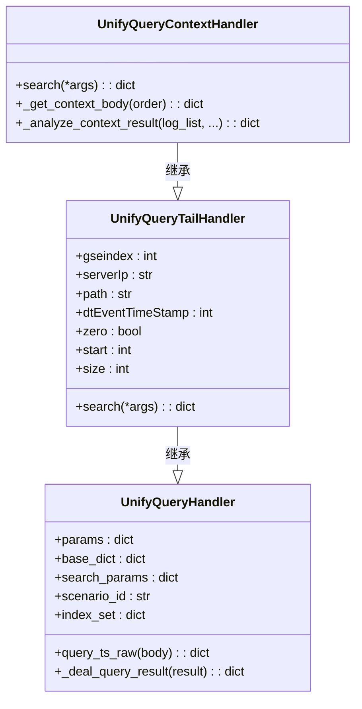

# 高级查询

<cite>
**本文档引用的文件**   
- [async_export_handlers.py](file://bklog/apps/log_search/handlers/search/async_export_handlers.py)
- [pre_search_handlers.py](file://bklog/apps/log_search/handlers/search/pre_search_handlers.py)
- [context.py](file://bklog/apps/log_unifyquery/builder/context.py)
- [tail.py](file://bklog/apps/log_unifyquery/handler/tail.py)
- [async_export.py](file://bklog/apps/log_search/tasks/async_export.py)
- [mapping_handlers.py](file://bklog/apps/log_search/handlers/search/mapping_handlers.py)
</cite>

## 目录
1. [异步导出查询结果](#异步导出查询结果)
2. [预查询处理逻辑](#预查询处理逻辑)
3. [上下文查询与实时日志查看](#上下文查询与实时日志查看)
4. [高级查询使用示例](#高级查询使用示例)
5. [性能考虑](#性能考虑)

## 异步导出查询结果

日志查询服务中的异步导出功能通过 `AsyncExportHandlers` 类实现，该类负责处理大规模日志数据的导出任务。当用户发起异步导出请求时，系统首先会进行预检查，验证查询字段是否支持异步导出，并获取排序字段。预检查通过后，系统会创建一个 `AsyncTask` 记录，用于跟踪导出任务的状态。

异步导出的核心机制是利用 Celery 任务队列。`async_export` 函数作为 Celery 任务被调用，接收 `SearchHandler` 实例、排序字段、任务ID等参数。该任务首先将查询结果写入临时文件，然后将文件打包成 `.tar.gz` 格式，上传到指定的远程存储（如 NFS、COS 或蓝鲸制品库），最后生成下载链接并通知用户。整个过程分为多个阶段：下载日志、打包文件、上传文件、生成下载链接和发送通知，每个阶段都有对应的状态标记。

对于联合查询（union search）的异步导出，系统使用 `UnionAsyncExportHandlers` 类，其工作原理类似，但需要处理多个索引集的导出任务。`UnionAsyncExportUtils` 类负责并行处理每个索引集的数据，最终将所有结果合并到一个压缩包中。

**Diagram sources**
- [async_export_handlers.py](file://bklog/apps/log_search/handlers/search/async_export_handlers.py#L87-L131)
- [async_export.py](file://bklog/apps/log_search/tasks/async_export.py#L70-L171)

**Section sources**
- [async_export_handlers.py](file://bklog/apps/log_search/handlers/search/async_export_handlers.py#L62-L131)
- [async_export.py](file://bklog/apps/log_search/tasks/async_export.py#L70-L171)

## 预查询处理逻辑

预查询处理主要由 `PreSearchHandlers` 类实现，其核心功能是为前端提供字段自动补全和查询建议。当用户开始输入查询条件时，系统会调用 `pre_check_fields` 方法，该方法接收索引、场景ID和存储集群ID作为参数。

该方法首先从缓存中获取指定索引的字段信息。如果缓存中没有，则通过 `BkLogApi.mapping` 接口从后端获取Elasticsearch的mapping信息。获取到mapping后，使用 `MappingHandlers` 工具类解析出所有字段，并进行格式化处理，包括设置字段类型、别名、是否可显示等属性。处理后的字段列表会返回给前端，用于构建查询界面和提供自动补全建议。

一个关键的优化是使用 `@cache_one_day` 装饰器对 `_get_fields` 方法进行缓存，避免了对相同索引的重复mapping查询，显著提升了性能。此外，该逻辑还会检查字段中是否包含嵌套类型（nested）以及是否为链路追踪（trace）类型，以便前端进行相应的处理。

**Diagram sources**
- [pre_search_handlers.py](file://bklog/apps/log_search/handlers/search/pre_search_handlers.py#L34-L55)
- [mapping_handlers.py](file://bklog/apps/log_search/handlers/search/mapping_handlers.py#L584-L662)

**Section sources**
- [pre_search_handlers.py](file://bklog/apps/log_search/handlers/search/pre_search_handlers.py#L29-L55)
- [mapping_handlers.py](file://bklog/apps/log_search/handlers/search/mapping_handlers.py#L96-L800)

## 上下文查询与实时日志查看

上下文查询和实时日志查看功能由 `UnifyQueryContextHandler` 和 `UnifyQueryTailHandler` 类实现，它们都继承自 `UnifyQueryHandler` 基类。这两个功能都依赖于 `context.py` 文件中定义的查询体构建器。

### 上下文查询

上下文查询的目的是获取目标日志条目周围的日志，以帮助用户分析问题。`UnifyQueryContextHandler.search` 方法是入口。当 `zero=True` 时，表示需要获取目标日志的上下文，系统会分别执行两次查询：一次使用负序（`-`）获取目标日志之前的日志，另一次使用正序（`+`）获取之后的日志。查询结果合并后，系统会调用 `_analyze_context_result` 方法来定位目标日志在结果集中的位置（`zero_index`），并将结果返回给前端。

查询体的构建由 `CreateSearchContextBodyScenarioBkData` 或 `CreateSearchContextBodyScenarioLog` 类完成，它们根据不同的场景（BKDATA或LOG）生成相应的Elasticsearch查询DSL。核心逻辑在 `create_context_conditions` 函数中，它根据排序字段和排序方向（`+` 或 `-`）动态构建OR查询条件，确保能准确地检索到目标日志前后的数据。

### 实时日志查看

实时日志查看（`tail -f`）功能由 `UnifyQueryTailHandler` 实现。它通过轮询的方式，持续获取指定时间点之后的新日志。其 `search` 方法会根据场景ID选择不同的查询体构建器，并设置 `size` 和 `start` 参数来控制返回的日志数量和起始位置。与上下文查询不同，实时查看通常只进行单次查询，但前端会以固定间隔重复调用此接口。

**Diagram sources**
- [context.py](file://bklog/apps/log_unifyquery/builder/context.py#L14-L285)
- [tail.py](file://bklog/apps/log_unifyquery/handler/tail.py#L22-L113)
- [context.py](file://bklog/apps/log_unifyquery/handler/context.py#L24-L262)

**Section sources**
- [context.py](file://bklog/apps/log_unifyquery/builder/context.py#L14-L285)
- [tail.py](file://bklog/apps/log_unifyquery/handler/tail.py#L22-L113)
- [context.py](file://bklog/apps/log_unifyquery/handler/context.py#L24-L262)

## 高级查询使用示例

### 大规模日志导出

用户在查询界面执行一次搜索后，点击“异步导出”按钮。系统会调用 `AsyncExportHandlers.async_export` 方法，创建一个导出任务。用户可以在“导出历史”中查看任务状态。当状态变为“成功”时，用户可以点击下载链接获取包含所有日志的压缩包。此功能适用于需要分析数GB甚至TB级日志的场景。

### 上下文分析

在日志列表中，用户点击某条日志的“查看上下文”按钮。前端会收集该日志的关键信息（如 `gseindex`, `iteration_idx`, `dtEventTimeStamp` 等），并调用上下文查询API。后端返回该日志前后各N条日志，帮助用户理解该日志发生的上下文环境，对于排查错误和分析系统行为非常有用。

### 实时监控

用户在“实时日志”页面选择一个索引集，并设置查询条件。前端会以固定间隔（如3秒）调用 `UnifyQueryTailHandler.search` 接口，持续获取最新的日志条目并实时刷新页面。这类似于在服务器上执行 `tail -f` 命令，是监控系统运行状态和观察程序输出的常用手段。

## 性能考虑

### 大数据量导出的资源消耗

大规模日志导出是一个资源密集型操作。系统通过以下方式优化：
1.  **异步处理**：使用Celery将导出任务放入队列，避免阻塞Web服务器。
2.  **分片处理**：`AsyncExportUtils.async_export` 方法会并行处理因存储集群切换而产生的多个数据分片。
3.  **流式写入**：查询结果通过 `scroll` 或 `search_after` API 分批获取，并直接写入文件，避免将所有数据加载到内存中。
4.  **定期清理**：通过 `clean_expired_task` 定期任务，清理过期的临时文件，防止磁盘空间耗尽。

### 实时查询的延迟优化

实时日志查看对延迟非常敏感。优化措施包括：
1.  **缓存**：预查询处理的字段信息会被缓存一天，减少对后端API的调用。
2.  **高效查询**：上下文查询使用精心构造的OR条件，确保能快速定位目标日志。
3.  **合理的分页**：通过 `size` 参数控制单次查询返回的日志数量，避免网络传输过慢。

### 结果压缩策略

所有异步导出的结果都会被压缩成 `.tar.gz` 格式。这种策略显著减少了文件大小和网络传输时间。系统使用Python内置的 `tarfile` 模块进行打包和压缩，这是一个成熟且高效的方案。