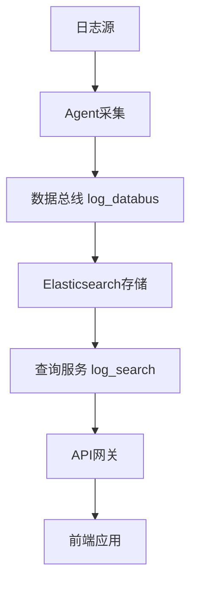
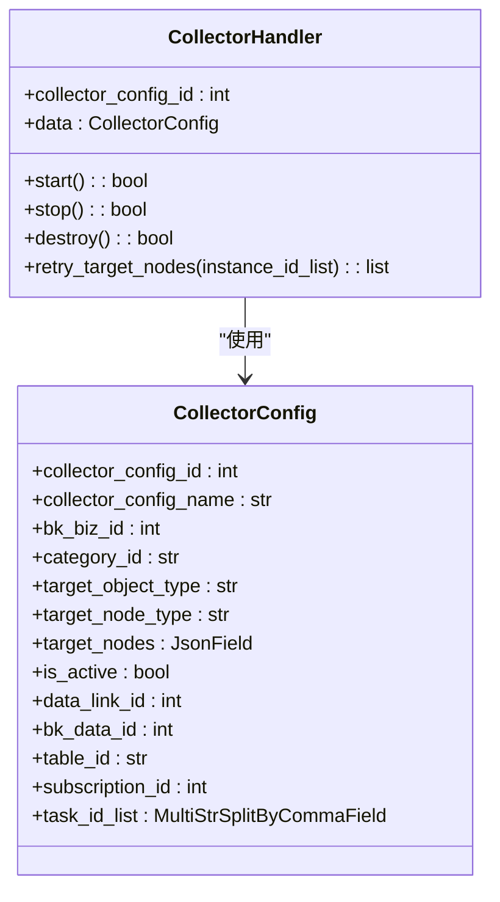
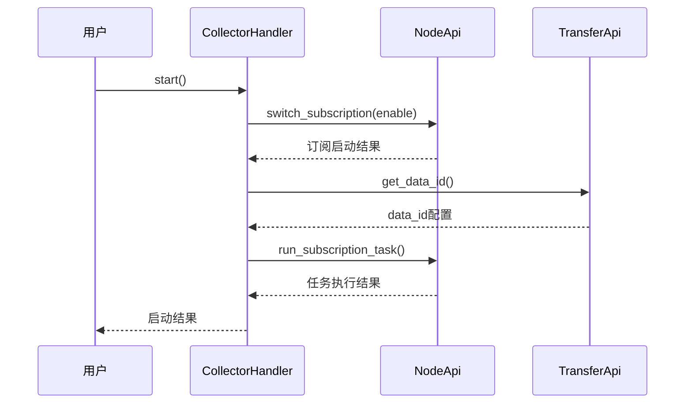
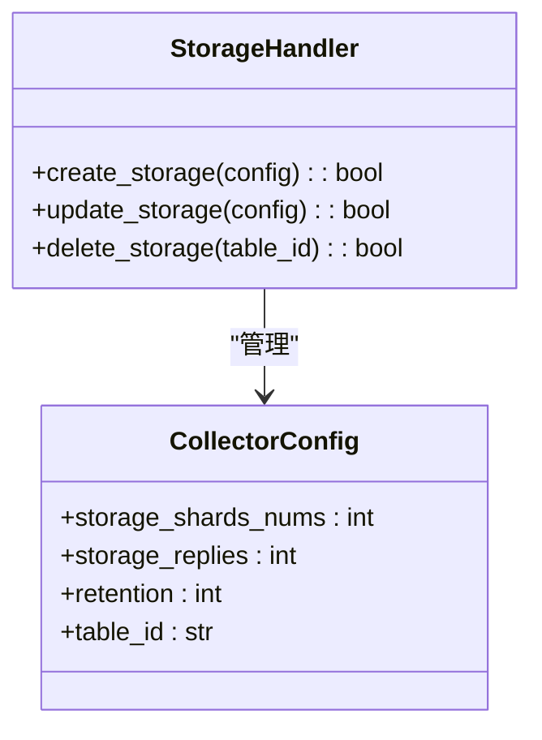
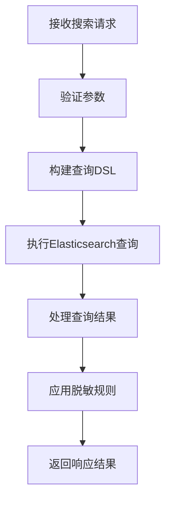
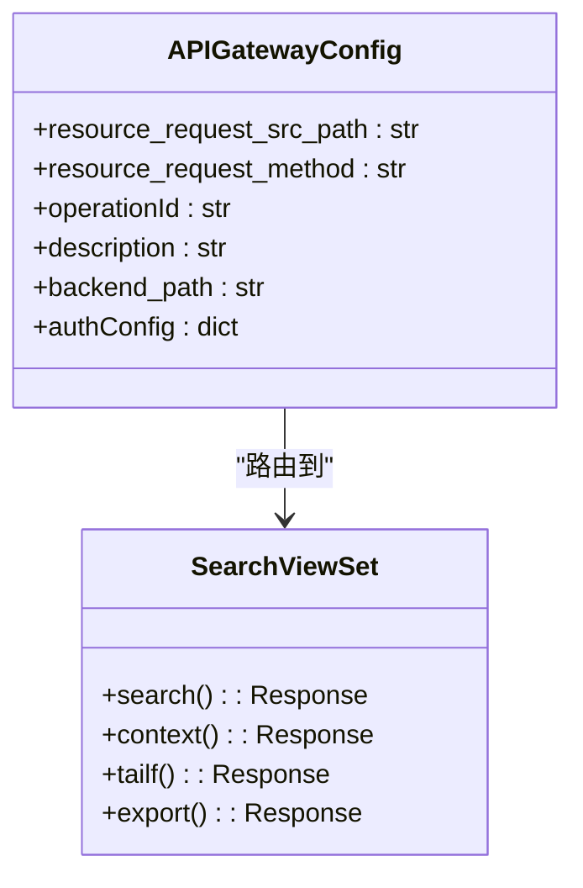
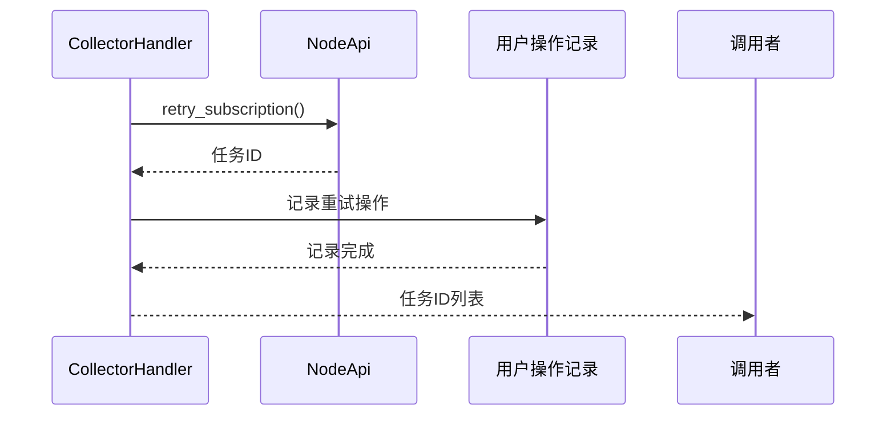

# 数据流

<cite>
**本文档引用文件**   
- [collector/base.py](file://bklog/apps/log_databus/handlers/collector/base.py)
- [collector/host.py](file://bklog/apps/log_databus/handlers/collector/host.py)
- [esquery/dsl_builder/dsl_builder.py](file://bklog/apps/log_esquery/esquery/dsl_builder/dsl_builder.py)
- [search_views.py](file://bklog/apps/log_search/views/search_views.py)
- [search_handlers_esquery.py](file://bklog/apps/log_search/handlers/search/search_handlers_esquery.py)
- [esquery_views.py](file://bklog/apps/log_esquery/views/esquery_views.py)
- [models.py](file://bklog/apps/log_databus/models.py)
</cite>

## 目录
1. [引言](#引言)
2. [数据流架构概述](#数据流架构概述)
3. [日志采集阶段](#日志采集阶段)
4. [数据总线(log_databus)处理](#数据总线log_databus处理)
5. [Elasticsearch存储](#elasticsearch存储)
6. [查询服务(log_search)处理](#查询服务log_search处理)
7. [API网关与前端应用](#api网关与前端应用)
8. [异常处理与重试机制](#异常处理与重试机制)
9. [性能优化建议](#性能优化建议)
10. [结论](#结论)

## 引言
本文档详细描述了蓝鲸日志平台中日志数据从采集到消费的完整生命周期。文档涵盖了数据路径的每个阶段：日志源 → Agent采集 → 数据总线(log_databus) → Elasticsearch存储 → 查询服务(log_search) → API网关 → 前端应用。针对每个阶段，文档解释了具体的实现机制、数据格式转换、传输协议以及异常处理策略。

## 数据流架构概述
日志数据流遵循一个清晰的架构，从数据源开始，经过多个处理阶段，最终到达前端应用。整个流程由多个组件协同工作，确保数据的可靠传输和高效查询。

**Diagram sources**
- [search_views.py](file://bklog/apps/log_search/views/search_views.py)
- [esquery_views.py](file://bklog/apps/log_esquery/views/esquery_views.py)

## 日志采集阶段
日志采集阶段由Agent负责，主要通过节点管理订阅机制实现。采集配置通过CollectorConfig模型进行管理，支持主机和容器两种环境的采集。

### 采集配置管理
采集配置通过CollectorConfig模型进行管理，包含采集项名称、业务ID、数据分类等关键信息。系统支持通过节点管理订阅来部署采集任务。

**Diagram sources**
- [models.py](file://bklog/apps/log_databus/models.py)
- [collector/base.py](file://bklog/apps/log_databus/handlers/collector/base.py)

**Section sources**
- [models.py](file://bklog/apps/log_databus/models.py#L101-L398)
- [collector/base.py](file://bklog/apps/log_databus/handlers/collector/base.py#L124-L160)

## 数据总线(log_databus)处理
数据总线(log_databus)负责处理采集到的日志数据，包括数据清洗、转换和路由。该阶段通过CollectorHandler类实现核心处理逻辑。

### 采集器处理流程
采集器处理流程包括启动、停止、销毁和重试等操作。系统通过节点管理API与采集器进行交互，确保采集任务的正常运行。

**Diagram sources**
- [collector/host.py](file://bklog/apps/log_databus/handlers/collector/host.py#L87-L113)
- [collector/base.py](file://bklog/apps/log_databus/handlers/collector/base.py#L162-L196)

**Section sources**
- [collector/host.py](file://bklog/apps/log_databus/handlers/collector/host.py#L80-L134)
- [collector/base.py](file://bklog/apps/log_databus/handlers/collector/base.py#L162-L196)

## Elasticsearch存储
采集的日志数据最终存储在Elasticsearch中，通过结果表ID(table_id)进行组织。存储配置包括分片数量、副本数和保留时间等参数。

### 存储配置管理
存储配置通过CollectorConfig模型中的相关字段进行管理，包括storage_shards_nums、storage_replies和retention等。

**Section sources**
- [models.py](file://bklog/apps/log_databus/models.py#L176-L178)
- [collector/base.py](file://bklog/apps/log_databus/handlers/collector/base.py#L231-L239)

## 查询服务(log_search)处理
查询服务(log_search)负责处理用户的搜索请求，包括查询解析、结果聚合和响应生成。该服务通过SearchHandler类实现核心查询逻辑。

### 查询请求处理流程
查询请求处理流程包括查询字符串解析、过滤条件处理、排序和聚合等步骤。系统使用DSL构建器来生成Elasticsearch查询。

**Diagram sources**
- [search_handlers_esquery.py](file://bklog/apps/log_search/handlers/search/search_handlers_esquery.py#L643-L711)
- [esquery/dsl_builder/dsl_builder.py](file://bklog/apps/log_esquery/esquery/dsl_builder/dsl_builder.py#L34-L152)

**Section sources**
- [search_handlers_esquery.py](file://bklog/apps/log_search/handlers/search/search_handlers_esquery.py#L166-L800)
- [esquery/dsl_builder/dsl_builder.py](file://bklog/apps/log_esquery/esquery/dsl_builder/dsl_builder.py#L34-L195)

## API网关与前端应用
API网关作为系统的入口，负责路由请求、认证鉴权和流量控制。前端应用通过API网关与后端服务进行交互，实现日志数据的展示和操作。

### API网关配置
API网关配置通过resources.yaml文件定义，包括资源路径、HTTP方法、后端服务路径和认证配置等。

**Section sources**
- [support-files/apigw/resources.yaml](file://bklog/support-files/apigw/resources.yaml#L373-L421)
- [search_views.py](file://bklog/apps/log_search/views/search_views.py#L280-L572)

## 异常处理与重试机制
系统实现了完善的异常处理和重试机制，确保数据流的可靠性和稳定性。当数据流中断时，系统会自动进行重试并发送告警通知。

### 重试机制实现
重试机制通过节点管理API的retry_subscription方法实现，支持对部分实例或主机进行重试操作。

**Diagram sources**
- [collector/host.py](file://bklog/apps/log_databus/handlers/collector/host.py#L577-L629)
- [collector/base.py](file://bklog/apps/log_databus/handlers/collector/base.py#L1018-L1082)

**Section sources**
- [collector/host.py](file://bklog/apps/log_databus/handlers/collector/host.py#L577-L629)
- [collector/base.py](file://bklog/apps/log_databus/handlers/collector/base.py#L1018-L1082)

## 性能优化建议
为了提高系统的性能和响应速度，建议采取以下优化措施：

### 减少数据传输延迟
- 优化采集器配置，减少不必要的日志采集
- 使用高效的数据压缩算法
- 优化网络拓扑，减少跨网络传输

### 提高查询效率
- 合理设置Elasticsearch索引的分片和副本数量
- 使用合适的查询DSL，避免全表扫描
- 实现查询结果缓存，减少重复查询

### 资源配置优化
- 根据业务需求合理分配存储资源
- 定期清理过期日志数据
- 监控系统资源使用情况，及时扩容

## 结论
本文档详细描述了蓝鲸日志平台中日志数据的完整生命周期，从采集到消费的每个阶段都有详细的说明。通过理解这些机制，可以更好地使用和优化日志系统，确保数据的可靠传输和高效查询。