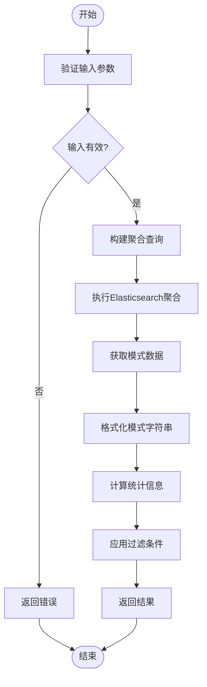
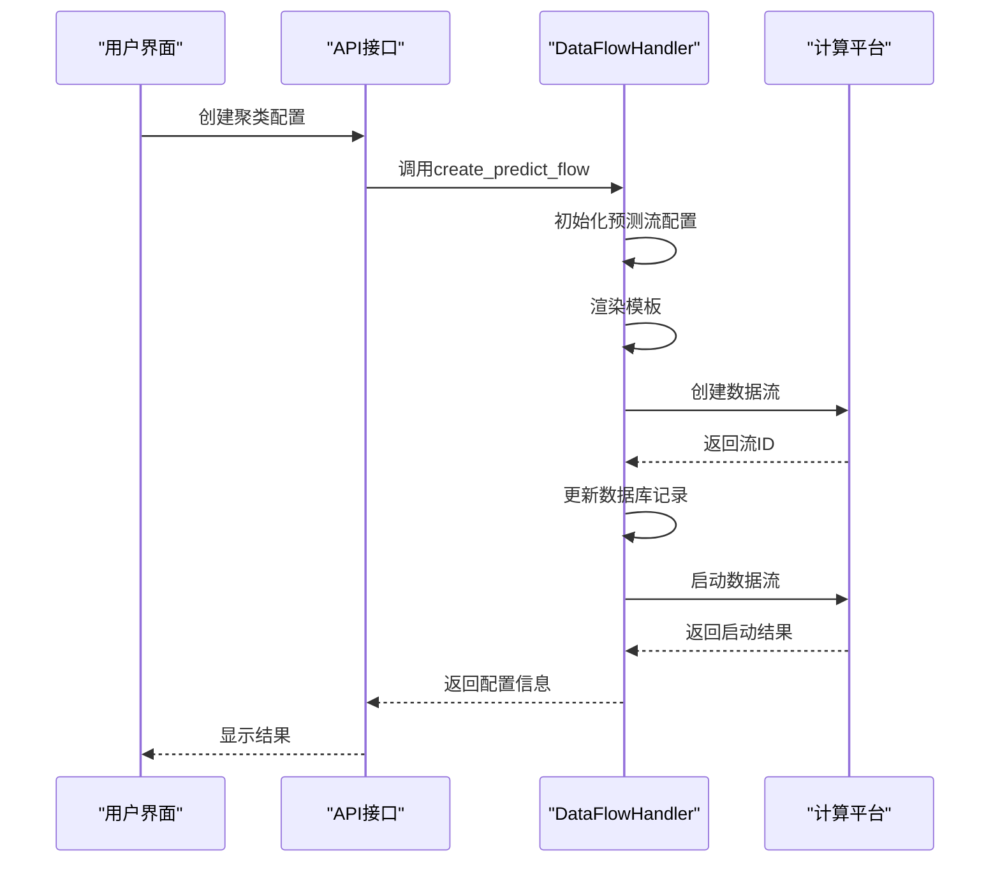

# 数据聚类

<cite>
**本文档引用的文件**   
- [clustering_config.py](file://bklog/apps/log_clustering/handlers/clustering_config.py)
- [pattern.py](file://bklog/apps/log_clustering/handlers/pattern.py)
- [dataflow_handler.py](file://bklog/apps/log_clustering/handlers/dataflow/dataflow_handler.py)
- [constants.py](file://bklog/apps/log_clustering/constants.py)
- [clustering_config_views.py](file://bklog/apps/log_clustering/views/clustering_config_views.py)
- [pattern_views.py](file://bklog/apps/log_clustering/views/pattern_views.py)
- [dataflow_model.py](file://bklog/apps/log_clustering/handlers/dataflow/dataflow_model.py)
- [models.py](file://bklog/apps/log_clustering/models.py)
- [serializers.py](file://bklog/apps/log_clustering/serializers.py)
- [utils/pattern.py](file://bklog/apps/log_clustering/utils/pattern.py)
</cite>

## 目录
1. [引言](#引言)
2. [聚类配置管理](#聚类配置管理)
3. [日志模式识别与相似度计算](#日志模式识别与相似度计算)
4. [聚类分析任务调度与执行](#聚类分析任务调度与执行)
5. [聚类结果存储与展示](#聚类结果存储与展示)
6. [API接口获取聚类结果](#api接口获取聚类结果)
7. [性能优化建议](#性能优化建议)
8. [应用场景](#应用场景)
9. [常见问题解决方案](#常见问题解决方案)
10. [结论](#结论)

## 引言
日志聚类分析是蓝鲸日志平台的核心功能之一，旨在通过智能算法对海量日志进行自动分类和模式识别，帮助运维人员快速发现异常、定位根因并预测趋势。本文档详细描述了日志聚类分析的实现机制，涵盖从配置管理到结果展示的完整流程。

## 聚类配置管理

日志聚类配置由`ClusteringConfigHandler`类管理，负责处理聚类接入、更新和状态检测等操作。配置信息存储在`ClusteringConfig`模型中，包含聚类策略、时间窗口和采样率等关键参数。

聚类配置的创建流程如下：
1. 验证索引集是否支持聚类接入（计算平台索引或采集项索引）
2. 检查清洗配置的合法性
3. 创建或更新`ClusteringConfig`对象，设置默认值和用户自定义参数
4. 触发异步任务`access_clustering`完成后续接入流程

核心配置参数包括：
- `min_members`: 最小日志数量，用于过滤低频日志模式
- `max_dist_list`: 敏感度参数，控制聚类的粒度
- `predefined_varibles`: 预定义的正则表达式模板
- `delimeter`: 分词符，用于日志文本分割
- `max_log_length`: 最大日志长度，防止过长日志影响性能
- `is_case_sensitive`: 是否区分大小写
- `clustering_fields`: 聚合字段，指定用于聚类的日志字段
- `filter_rules`: 过滤规则，用于预处理阶段的数据筛选

**Section sources**
- [clustering_config.py](file://bklog/apps/log_clustering/handlers/clustering_config.py#L1-L502)
- [models.py](file://bklog/apps/log_clustering/models.py#L106-L200)
- [constants.py](file://bklog/apps/log_clustering/constants.py#L1-L326)

## 日志模式识别与相似度计算

日志模式识别和相似度计算由`PatternHandler`类实现，其核心算法基于正则表达式匹配和分词技术。

### 模式识别算法
模式识别流程如下：
1. 根据查询参数构建聚合查询
2. 从`AiopsSignatureAndPattern`表或实时数据流中获取模式数据
3. 将原始日志转换为模式字符串，其中变量部分用`#VAR_NAME#`标记
4. 计算每个模式的出现次数和占比



**Diagram sources**
- [pattern.py](file://bklog/apps/log_clustering/handlers/pattern.py#L71-L232)
- [utils/pattern.py](file://bklog/apps/log_clustering/utils/pattern.py#L13-L159)

### 相似度计算
相似度计算基于以下步骤：
1. 使用预定义的正则表达式对日志进行变量提取
2. 根据分词符对日志内容进行分词
3. 对包含中文的文本进行中文分词（可选）
4. 构建日志的特征向量
5. 使用编辑距离或余弦相似度计算日志间的相似度

核心函数`match_text_and_tokenize`实现了上述算法，支持自定义正则表达式和分词规则。

**Section sources**
- [pattern.py](file://bklog/apps/log_clustering/handlers/pattern.py#L71-L669)
- [utils/pattern.py](file://bklog/apps/log_clustering/utils/pattern.py#L83-L159)

## 聚类分析任务调度与执行

聚类分析任务的调度和执行由`DataFlowHandler`类管理，基于计算平台的数据流（DataFlow）实现。

### 任务调度流程
1. 创建预处理流（Pre-treat Flow）
2. 创建模型应用流（After-treat Flow）
3. 创建预测流（Predict Flow）
4. 启动各数据流并监控状态



**Diagram sources**
- [dataflow_handler.py](file://bklog/apps/log_clustering/handlers/dataflow/dataflow_handler.py#L122-L1599)
- [dataflow_model.py](file://bklog/apps/log_clustering/handlers/dataflow/dataflow_model.py)

### 执行过程
执行过程分为三个主要阶段：

#### 预处理阶段
- 数据源接入：从Elasticsearch或Kafka读取原始日志
- 数据过滤：应用用户定义的过滤规则
- 字段转换：将聚类字段统一为标准名称（如"log"）

#### 特征提取阶段
- 正则匹配：使用预定义的正则表达式提取变量
- 文本分词：根据分词符分割日志内容
- 中文分词：对包含中文的文本进行分词处理
- 特征向量：构建日志的特征表示

#### 聚类算法应用
- 模型加载：加载预训练的聚类模型
- 在线训练：使用新数据对模型进行增量训练
- 模式预测：对日志进行模式分类
- 结果输出：将聚类结果写入Elasticsearch和其他存储

**Section sources**
- [dataflow_handler.py](file://bklog/apps/log_clustering/handlers/dataflow/dataflow_handler.py#L122-L1599)
- [constants.py](file://bklog/apps/log_clustering/handlers/dataflow/constants.py)

## 聚类结果存储与展示

聚类结果存储在多个位置，以支持不同的查询和展示需求。

### 存储结构
| 存储位置 | 存储内容 | 用途 |
|--------|--------|-----|
| Elasticsearch | 聚类后的日志数据，包含`__dist_05`等距离字段 | 实时查询和分析 |
| 计算平台结果表 | 模式信息和统计结果 | 批量分析和报表 |
| 数据库 | 聚类配置和元数据 | 配置管理和状态跟踪 |
| Redis | 实时聚合结果 | 快速查询和展示 |

### 展示方式
聚类结果通过多种方式展示：
- **模式列表**：显示所有识别出的日志模式及其统计信息
- **时间趋势**：展示各模式随时间的变化趋势
- **同比分析**：与历史同期数据进行对比
- **新类检测**：标识最近出现的新日志模式
- **负责人管理**：支持为模式指定负责人和备注信息

**Section sources**
- [models.py](file://bklog/apps/log_clustering/models.py)
- [pattern.py](file://bklog/apps/log_clustering/handlers/pattern.py)

## API接口获取聚类结果

系统提供RESTful API接口供外部系统获取聚类结果。

### 主要API端点
| 端点 | 方法 | 功能 |
|-----|-----|-----|
| `/clustering_config/{index_set_id}/config` | GET | 获取聚类配置 |
| `/clustering_config/{index_set_id}/access/create` | POST | 创建聚类接入 |
| `/clustering_config/{index_set_id}/access/update` | POST | 更新聚类配置 |
| `/clustering_config/{index_set_id}/access/status` | GET | 获取接入状态 |
| `/pattern/{index_set_id}/search` | POST | 搜索日志模式 |

### 示例：获取聚类配置
```json
GET /clustering_config/123/config

响应：
{
    "collector_config_id": 456,
    "collector_config_name_en": "web_log",
    "index_set_id": 123,
    "min_members": 10,
    "max_dist_list": "0.1,0.2,0.3,0.4,0.5",
    "predefined_varibles": "base64_encoded_regex",
    "delimeter": "base64_encoded_delimiter",
    "max_log_length": 1024,
    "is_case_sensitive": 0,
    "clustering_fields": "log",
    "bk_biz_id": 1,
    "filter_rules": [
        {
            "fields_name": "level",
            "op": "=",
            "value": "ERROR"
        }
    ]
}
```

**Section sources**
- [clustering_config_views.py](file://bklog/apps/log_clustering/views/clustering_config_views.py)
- [pattern_views.py](file://bklog/apps/log_clustering/views/pattern_views.py)
- [serializers.py](file://bklog/apps/log_clustering/serializers.py)

## 性能优化建议

为平衡聚类准确性和系统性能，建议调整以下参数：

### 算法参数优化
| 参数 | 推荐值 | 说明 |
|-----|-------|-----|
| `min_members` | 5-50 | 值越大性能越好，但可能漏掉重要模式 |
| `max_dist_list` | "0.3,0.5,0.7" | 值越大聚类越粗，性能越好 |
| `max_log_length` | 512-2048 | 限制日志长度可显著提升性能 |
| `is_case_sensitive` | 0 | 不区分大小写可提高匹配效率 |

### 系统配置优化
1. **采样率调整**：对于高吞吐量场景，可适当降低采样率
2. **时间窗口**：根据业务需求设置合理的分析时间窗口
3. **资源分配**：为数据流任务分配足够的计算资源
4. **缓存策略**：合理使用Redis等缓存机制

### 监控指标
- 数据流处理延迟
- 聚类任务执行时间
- 内存使用率
- 模型训练频率

**Section sources**
- [constants.py](file://bklog/apps/log_clustering/constants.py)
- [dataflow_handler.py](file://bklog/apps/log_clustering/handlers/dataflow/dataflow_handler.py)

## 应用场景

日志聚类分析在多个运维场景中发挥重要作用：

### 异常检测
通过识别新出现的日志模式，及时发现系统异常。当新类日志数量超过阈值时，触发告警通知相关人员。

### 根因分析
将相似的错误日志归为同一模式，帮助快速定位问题根源。通过分析模式的上下文信息，可以追溯到具体的代码模块或配置问题。

### 趋势预测
基于历史模式的出现频率，预测未来可能出现的问题。例如，某个错误模式的出现频率持续上升，可能预示着即将发生的系统故障。

### 容量规划
通过分析日志模式的变化趋势，预测系统负载变化，为容量规划提供数据支持。

### 安全审计
识别异常的访问模式或操作行为，辅助安全事件的检测和调查。

**Section sources**
- [pattern.py](file://bklog/apps/log_clustering/handlers/pattern.py)
- [clustering_config.py](file://bklog/apps/log_clustering/handlers/clustering_config.py)

## 常见问题解决方案

### 聚类结果不准确
**可能原因**：
1. 正则表达式配置不当
2. 分词符选择不合适
3. 敏感度过高或过低

**解决方案**：
1. 使用调试功能测试正则表达式
2. 根据日志格式调整分词符
3. 逐步调整`max_dist_list`参数

### 任务执行超时
**可能原因**：
1. 数据量过大
2. 计算资源不足
3. 网络延迟

**解决方案**：
1. 增加数据流任务的资源配额
2. 优化数据过滤规则，减少处理数据量
3. 检查网络连接状况

### 接入失败
**可能原因**：
1. 权限不足
2. 配置参数错误
3. 依赖服务不可用

**解决方案**：
1. 检查用户权限设置
2. 验证配置参数的正确性
3. 确认计算平台等依赖服务正常运行

**Section sources**
- [clustering_config.py](file://bklog/apps/log_clustering/handlers/clustering_config.py)
- [dataflow_handler.py](file://bklog/apps/log_clustering/handlers/dataflow/dataflow_handler.py)

## 结论
日志聚类分析通过智能化的算法和技术架构，实现了对海量日志数据的高效处理和价值挖掘。系统采用模块化设计，各组件职责清晰，便于维护和扩展。通过合理的参数配置和性能优化，可以在保证准确性的同时满足高吞吐量的业务需求。未来可进一步引入深度学习等先进技术，提升聚类效果和智能化水平。