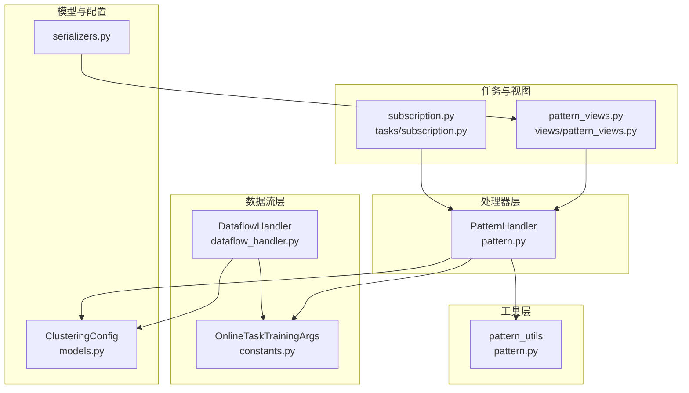
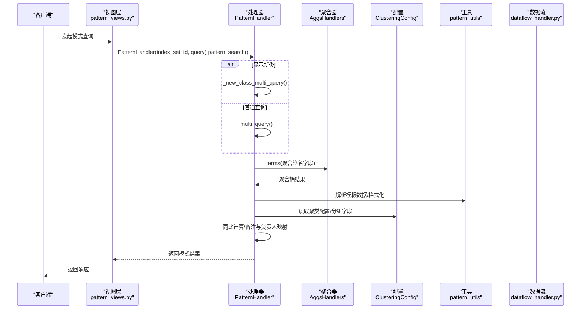
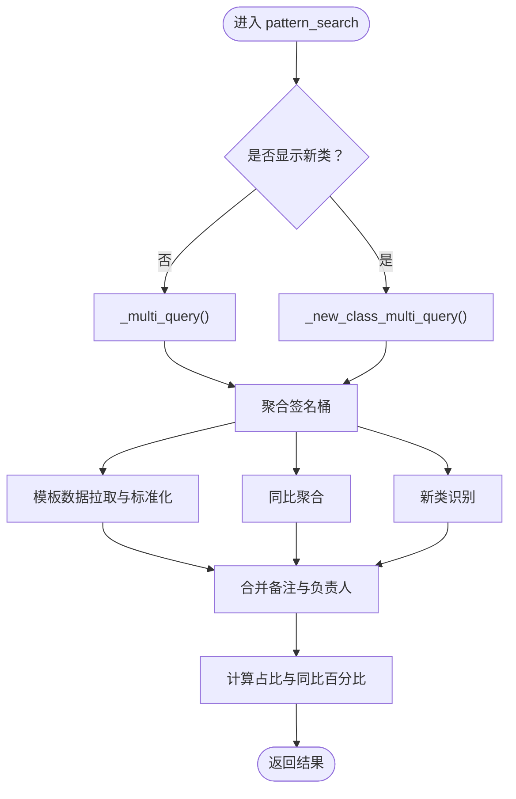
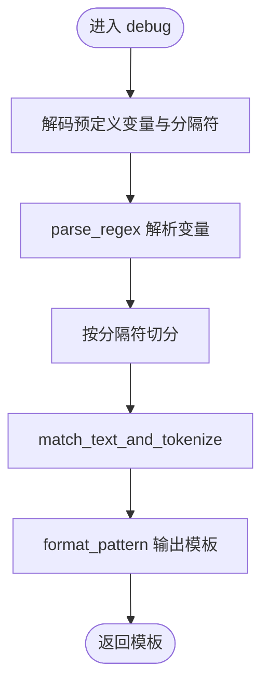
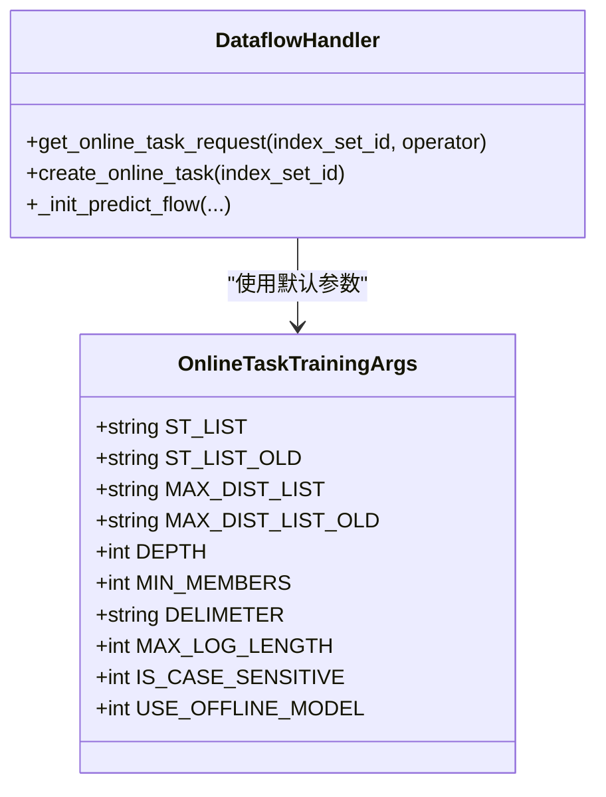
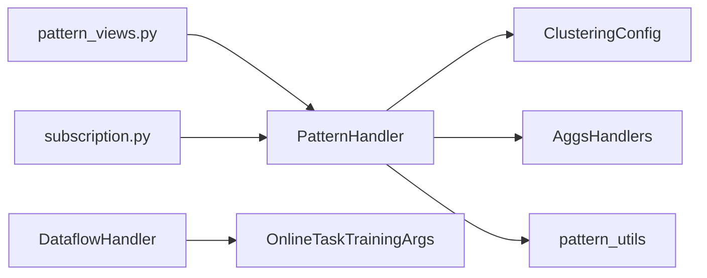

# 模式识别算法

<cite>
**本文引用的文件**
- [bklog/apps/log_clustering/handlers/pattern.py](file://bklog/apps/log_clustering/handlers/pattern.py)
- [bklog/apps/log_clustering/utils/pattern.py](file://bklog/apps/log_clustering/utils/pattern.py)
- [bklog/apps/log_clustering/handlers/dataflow/constants.py](file://bklog/apps/log_clustering/handlers/dataflow/constants.py)
- [bklog/apps/log_clustering/handlers/dataflow/dataflow_handler.py](file://bklog/apps/log_clustering/handlers/dataflow/dataflow_handler.py)
- [bklog/apps/log_clustering/tasks/subscription.py](file://bklog/apps/log_clustering/tasks/subscription.py)
- [bklog/apps/log_clustering/models.py](file://bklog/apps/log_clustering/models.py)
- [bklog/apps/log_clustering/serializers.py](file://bklog/apps/log_clustering/serializers.py)
- [bklog/apps/log_clustering/views/pattern_views.py](file://bklog/apps/log_clustering/views/pattern_views.py)
</cite>

## 目录
1. [简介](#简介)
2. [项目结构](#项目结构)
3. [核心组件](#核心组件)
4. [架构总览](#架构总览)
5. [详细组件分析](#详细组件分析)
6. [依赖关系分析](#依赖关系分析)
7. [性能考量](#性能考量)
8. [故障排查指南](#故障排查指南)
9. [结论](#结论)
10. [附录](#附录)

## 简介
本文件围绕蓝鲸日志平台中的“模式识别”能力，系统梳理并解析 pattern.py 中日志模式识别的核心算法实现，覆盖日志预处理（文本清洗、变量提取、标准化）、相似度计算（编辑距离、最长公共子序列等）、模板构建、机器学习模型在聚类与模式识别中的应用（特征工程、训练与预测），并对不同算法的性能与适用场景进行对比，提供参数调优建议与扩展指引。

## 项目结构
围绕模式识别的关键模块分布如下：
- 处理器层：负责模式查询、聚合、同比、新类识别、备注与负责人管理等
- 工具层：提供正则解析、分词与令牌化、中文分词辅助等预处理工具
- 数据流层：封装在线任务参数、训练参数、模型输入输出字段定义
- 任务与视图：对外提供模式查询接口、订阅任务中调用模式查询与清洗

图表来源
- [bklog/apps/log_clustering/handlers/pattern.py](file://bklog/apps/log_clustering/handlers/pattern.py#L85-L232)
- [bklog/apps/log_clustering/utils/pattern.py](file://bklog/apps/log_clustering/utils/pattern.py#L1-L182)
- [bklog/apps/log_clustering/handlers/dataflow/constants.py](file://bklog/apps/log_clustering/handlers/dataflow/constants.py#L1109-L1120)
- [bklog/apps/log_clustering/handlers/dataflow/dataflow_handler.py](file://bklog/apps/log_clustering/handlers/dataflow/dataflow_handler.py#L1280-L1346)
- [bklog/apps/log_clustering/tasks/subscription.py](file://bklog/apps/log_clustering/tasks/subscription.py#L184-L264)
- [bklog/apps/log_clustering/views/pattern_views.py](file://bklog/apps/log_clustering/views/pattern_views.py#L116-L132)
- [bklog/apps/log_clustering/models.py](file://bklog/apps/log_clustering/models.py#L137-L157)
- [bklog/apps/log_clustering/serializers.py](file://bklog/apps/log_clustering/serializers.py#L110-L141)

章节来源
- [bklog/apps/log_clustering/handlers/pattern.py](file://bklog/apps/log_clustering/handlers/pattern.py#L85-L232)
- [bklog/apps/log_clustering/utils/pattern.py](file://bklog/apps/log_clustering/utils/pattern.py#L1-L182)
- [bklog/apps/log_clustering/handlers/dataflow/constants.py](file://bklog/apps/log_clustering/handlers/dataflow/constants.py#L1109-L1120)
- [bklog/apps/log_clustering/handlers/dataflow/dataflow_handler.py](file://bklog/apps/log_clustering/handlers/dataflow/dataflow_handler.py#L1280-L1346)
- [bklog/apps/log_clustering/tasks/subscription.py](file://bklog/apps/log_clustering/tasks/subscription.py#L184-L264)
- [bklog/apps/log_clustering/views/pattern_views.py](file://bklog/apps/log_clustering/views/pattern_views.py#L116-L132)
- [bklog/apps/log_clustering/models.py](file://bklog/apps/log_clustering/models.py#L137-L157)
- [bklog/apps/log_clustering/serializers.py](file://bklog/apps/log_clustering/serializers.py#L110-L141)

## 核心组件
- PatternHandler：模式查询与聚合主控制器，负责聚合签名桶、同比计算、新类识别、备注与负责人映射、模板数据拉取与标准化。
- pattern_utils：日志预处理工具，提供正则解析、分词与令牌化、中文分词辅助、格式化输出等。
- Dataflow 常量与处理器：定义在线任务训练参数（如最大距离、阈值、深度、分隔符等），并生成在线任务请求参数。
- 任务与视图：对外提供模式查询接口，订阅任务中调用模式查询并进行清洗与统计。

章节来源
- [bklog/apps/log_clustering/handlers/pattern.py](file://bklog/apps/log_clustering/handlers/pattern.py#L85-L232)
- [bklog/apps/log_clustering/utils/pattern.py](file://bklog/apps/log_clustering/utils/pattern.py#L1-L182)
- [bklog/apps/log_clustering/handlers/dataflow/constants.py](file://bklog/apps/log_clustering/handlers/dataflow/constants.py#L1109-L1120)
- [bklog/apps/log_clustering/handlers/dataflow/dataflow_handler.py](file://bklog/apps/log_clustering/handlers/dataflow/dataflow_handler.py#L1280-L1346)
- [bklog/apps/log_clustering/views/pattern_views.py](file://bklog/apps/log_clustering/views/pattern_views.py#L116-L132)

## 架构总览
模式识别整体流程由“查询—聚合—模板—备注—同比—输出”构成，支持新类识别与分组维度聚合。

图表来源
- [bklog/apps/log_clustering/views/pattern_views.py](file://bklog/apps/log_clustering/views/pattern_views.py#L116-L132)
- [bklog/apps/log_clustering/handlers/pattern.py](file://bklog/apps/log_clustering/handlers/pattern.py#L85-L232)
- [bklog/apps/log_clustering/handlers/dataflow/dataflow_handler.py](file://bklog/apps/log_clustering/handlers/dataflow/dataflow_handler.py#L1280-L1346)

## 详细组件分析

### 组件A：PatternHandler（模式查询与聚合）
- 职责
  - 聚合签名桶，支持按分组字段展开
  - 计算同比与占比
  - 识别新类并标注
  - 拉取模板数据并标准化
  - 备注与负责人管理（含策略联动）
- 关键流程
  - pattern_search：根据是否显示新类选择查询路径；拉取模板数据并做标准化；合并备注与负责人；计算占比与同比。
  - _multi_query/_new_class_multi_query：并发执行聚合、同比与新类查询。
  - _get_pattern_aggs_result/_parse_pattern_aggs_result：构造聚合查询并解析桶结果。
  - _get_year_on_year_aggs_result/_year_on_year_calculate_percentage：同比时间偏移与百分比计算。
  - _get_pattern_data/_get_pattern_data_for_bkbase_link/_get_pattern_data_for_mini_link：模板数据拉取与格式化。
  - set_clustering_remark/set_clustering_owner：备注与负责人写入与策略同步。

图表来源
- [bklog/apps/log_clustering/handlers/pattern.py](file://bklog/apps/log_clustering/handlers/pattern.py#L85-L232)
- [bklog/apps/log_clustering/handlers/pattern.py](file://bklog/apps/log_clustering/handlers/pattern.py#L254-L301)
- [bklog/apps/log_clustering/handlers/pattern.py](file://bklog/apps/log_clustering/handlers/pattern.py#L303-L389)
- [bklog/apps/log_clustering/handlers/pattern.py](file://bklog/apps/log_clustering/handlers/pattern.py#L390-L430)
- [bklog/apps/log_clustering/handlers/pattern.py](file://bklog/apps/log_clustering/handlers/pattern.py#L431-L511)

章节来源
- [bklog/apps/log_clustering/handlers/pattern.py](file://bklog/apps/log_clustering/handlers/pattern.py#L85-L232)
- [bklog/apps/log_clustering/handlers/pattern.py](file://bklog/apps/log_clustering/handlers/pattern.py#L254-L301)
- [bklog/apps/log_clustering/handlers/pattern.py](file://bklog/apps/log_clustering/handlers/pattern.py#L303-L389)
- [bklog/apps/log_clustering/handlers/pattern.py](file://bklog/apps/log_clustering/handlers/pattern.py#L390-L511)

### 组件B：pattern_utils（日志预处理与令牌化）
- 职责
  - 正则解析：将预定义变量解析为正则对象
  - 文本分词与令牌化：支持中文分词、数字变量识别、标点过滤
  - 格式化输出：将令牌序列格式化为模板字符串
- 关键函数
  - parse_regex：解析预定义变量为(name, regex)列表
  - match_text_and_tokenize：执行正则匹配、分词、中文分词与令牌化
  - debug：调试入口，加载base64编码的预定义变量与分隔符，输出格式化模板

图表来源
- [bklog/apps/log_clustering/utils/pattern.py](file://bklog/apps/log_clustering/utils/pattern.py#L1-L182)

章节来源
- [bklog/apps/log_clustering/utils/pattern.py](file://bklog/apps/log_clustering/utils/pattern.py#L1-L182)

### 组件C：Dataflow 常量与处理器（在线任务与训练参数）
- 职责
  - 定义在线任务训练参数（如 st_list、max_dist_list、depth、max_log_length、delimeter 等）
  - 生成在线任务请求参数，传入模型训练与预测节点
- 关键点
  - OnlineTaskTrainingArgs：集中存放训练参数默认值
  - dataflow_handler.get_online_task_request：组装训练参数、输入输出字段、触发方式等

图表来源
- [bklog/apps/log_clustering/handlers/dataflow/constants.py](file://bklog/apps/log_clustering/handlers/dataflow/constants.py#L1109-L1120)
- [bklog/apps/log_clustering/handlers/dataflow/dataflow_handler.py](file://bklog/apps/log_clustering/handlers/dataflow/dataflow_handler.py#L1280-L1346)

章节来源
- [bklog/apps/log_clustering/handlers/dataflow/constants.py](file://bklog/apps/log_clustering/handlers/dataflow/constants.py#L1109-L1120)
- [bklog/apps/log_clustering/handlers/dataflow/dataflow_handler.py](file://bklog/apps/log_clustering/handlers/dataflow/dataflow_handler.py#L1280-L1346)

### 组件D：任务与视图（接口与订阅）
- 职责
  - 视图层接收查询参数并调用 PatternHandler
  - 订阅任务中调用 PatternHandler 并进行清洗与统计
- 关键点
  - pattern_views.py：校验参数并返回 PatternHandler 的结果
  - subscription.py：在订阅任务中调用 PatternHandler，清洗结果并统计

章节来源
- [bklog/apps/log_clustering/views/pattern_views.py](file://bklog/apps/log_clustering/views/pattern_views.py#L116-L132)
- [bklog/apps/log_clustering/tasks/subscription.py](file://bklog/apps/log_clustering/tasks/subscription.py#L184-L264)

## 依赖关系分析
- PatternHandler 依赖 ClusteringConfig 获取聚类配置、分组字段、模板结果表等
- PatternHandler 依赖 AggsHandlers 进行签名桶聚合
- PatternHandler 依赖 pattern_utils 进行模板数据格式化
- DataflowHandler 依赖 OnlineTaskTrainingArgs 生成在线任务参数
- 视图层与订阅任务依赖 PatternHandler 提供模式查询能力

图表来源
- [bklog/apps/log_clustering/handlers/pattern.py](file://bklog/apps/log_clustering/handlers/pattern.py#L85-L232)
- [bklog/apps/log_clustering/handlers/dataflow/dataflow_handler.py](file://bklog/apps/log_clustering/handlers/dataflow/dataflow_handler.py#L1280-L1346)
- [bklog/apps/log_clustering/views/pattern_views.py](file://bklog/apps/log_clustering/views/pattern_views.py#L116-L132)
- [bklog/apps/log_clustering/tasks/subscription.py](file://bklog/apps/log_clustering/tasks/subscription.py#L184-L264)

章节来源
- [bklog/apps/log_clustering/handlers/pattern.py](file://bklog/apps/log_clustering/handlers/pattern.py#L85-L232)
- [bklog/apps/log_clustering/handlers/dataflow/dataflow_handler.py](file://bklog/apps/log_clustering/handlers/dataflow/dataflow_handler.py#L1280-L1346)
- [bklog/apps/log_clustering/views/pattern_views.py](file://bklog/apps/log_clustering/views/pattern_views.py#L116-L132)
- [bklog/apps/log_clustering/tasks/subscription.py](file://bklog/apps/log_clustering/tasks/subscription.py#L184-L264)

## 性能考量
- 聚合与并发
  - 使用并发执行聚合、同比与新类查询，减少总体等待时间
  - 聚合桶数量与分组维度呈指数增长，需合理设置分组字段与聚合上限
- 模板数据拉取
  - 模板数据拉取限制条数与时间窗口，避免历史数据膨胀
- 训练参数
  - max_dist_list、st_list、depth 等参数直接影响聚类质量与性能
  - 分隔符与最大日志长度影响令牌化效率
- 同比计算
  - 时间偏移与桶键拼接增加一次聚合开销，建议按需启用

章节来源
- [bklog/apps/log_clustering/handlers/pattern.py](file://bklog/apps/log_clustering/handlers/pattern.py#L254-L301)
- [bklog/apps/log_clustering/handlers/pattern.py](file://bklog/apps/log_clustering/handlers/pattern.py#L390-L430)
- [bklog/apps/log_clustering/handlers/pattern.py](file://bklog/apps/log_clustering/handlers/pattern.py#L431-L511)
- [bklog/apps/log_clustering/handlers/dataflow/constants.py](file://bklog/apps/log_clustering/handlers/dataflow/constants.py#L1109-L1120)
- [bklog/apps/log_clustering/handlers/dataflow/dataflow_handler.py](file://bklog/apps/log_clustering/handlers/dataflow/dataflow_handler.py#L1280-L1346)

## 故障排查指南
- 模板数据拉取失败
  - 现象：模板数据为空或异常
  - 排查：检查模板结果表配置、时间窗口与拉取上限
  - 参考路径：[模板数据拉取与格式化](file://bklog/apps/log_clustering/handlers/pattern.py#L431-L511)
- 新类识别异常
  - 现象：新类查询失败或分组字段缺失
  - 排查：确认新类策略输出字段、分组字段是否存在，必要时降级到不按分组聚合
  - 参考路径：[新类识别](file://bklog/apps/log_clustering/handlers/pattern.py#L390-L430)
- 训练参数不生效
  - 现象：在线任务未按预期参数运行
  - 排查：核对 OnlineTaskTrainingArgs 默认值与 dataflow_handler 参数组装
  - 参考路径：[在线任务参数组装](file://bklog/apps/log_clustering/handlers/dataflow/dataflow_handler.py#L1280-L1346)
- 接口参数校验失败
  - 现象：请求参数不合法
  - 排查：检查序列化器参数与默认值
  - 参考路径：[序列化器](file://bklog/apps/log_clustering/serializers.py#L110-L141)

章节来源
- [bklog/apps/log_clustering/handlers/pattern.py](file://bklog/apps/log_clustering/handlers/pattern.py#L431-L511)
- [bklog/apps/log_clustering/handlers/pattern.py](file://bklog/apps/log_clustering/handlers/pattern.py#L390-L430)
- [bklog/apps/log_clustering/handlers/dataflow/dataflow_handler.py](file://bklog/apps/log_clustering/handlers/dataflow/dataflow_handler.py#L1280-L1346)
- [bklog/apps/log_clustering/serializers.py](file://bklog/apps/log_clustering/serializers.py#L110-L141)

## 结论
- 本系统采用“规则+机器学习”的混合模式识别思路：规则层面通过正则与令牌化实现可解释性强的模板构建；机器学习层面通过在线任务参数驱动聚类与预测，提升对复杂日志的适应性。
- PatternHandler 负责聚合、同比、新类与模板标准化，pattern_utils 提供预处理能力，Dataflow 层提供训练参数与在线任务编排。
- 对于结构化日志，规则方法更高效且可解释；对于复杂非结构化日志，机器学习方法更具鲁棒性。实际部署中应结合业务场景选择合适的阈值与参数组合。

## 附录

### 日志预处理流程（文本清洗、变量提取、标准化）
- 文本清洗
  - 过滤标点与空白，保留有效 token
  - 支持大小写敏感开关
- 变量提取
  - 预定义变量解析为正则，匹配后替换为占位符
  - 数字变量与 IP/Capacity 等特殊变量单独处理
- 标准化
  - 中文分词辅助，避免将中文字符拆分造成 token 失真
  - 输出统一格式的模板字符串

章节来源
- [bklog/apps/log_clustering/utils/pattern.py](file://bklog/apps/log_clustering/utils/pattern.py#L1-L182)

### 相似度计算与模板构建
- 相似度计算
  - 编辑距离：衡量两个日志序列的差异程度，适用于令牌级差异
  - 最长公共子序列（LCS）：衡量两个序列的最长公共部分，适用于结构相似但顺序不同的日志
  - 令牌化后的序列可直接用于上述算法
- 模板构建
  - 将匹配到的变量替换为占位符，形成可读模板
  - 支持中文分词与数字变量识别，提高模板泛化能力

章节来源
- [bklog/apps/log_clustering/utils/pattern.py](file://bklog/apps/log_clustering/utils/pattern.py#L1-L182)

### 机器学习模型在模式识别中的应用
- 特征工程
  - 输入字段：日志内容、时间戳、分组字段
  - 训练参数：最大距离、阈值、深度、分隔符、最大日志长度、是否区分大小写、是否使用离线模型等
- 模型训练与预测
  - 在线任务参数组装，驱动模型训练与预测节点
  - 输出包含签名、模板、是否新类等字段

章节来源
- [bklog/apps/log_clustering/handlers/dataflow/constants.py](file://bklog/apps/log_clustering/handlers/dataflow/constants.py#L1109-L1120)
- [bklog/apps/log_clustering/handlers/dataflow/dataflow_handler.py](file://bklog/apps/log_clustering/handlers/dataflow/dataflow_handler.py#L1280-L1346)
- [bklog/apps/log_clustering/models.py](file://bklog/apps/log_clustering/models.py#L137-L157)

### 算法参数调优指南
- 相似度阈值
  - 编辑距离与 LCS 阈值影响聚类粒度：阈值越低，聚类越细；阈值越高，聚类越粗
  - 建议：从默认阈值开始，结合业务日志差异度逐步调整
- 分隔符与最大日志长度
  - 分隔符影响 token 切分质量；过长日志会增加令牌化成本
  - 建议：根据日志典型长度设置最大日志长度，优化分隔符以提升 token 准确率
- 训练参数
  - max_dist_list/st_list：控制聚类半径与稳定性
  - depth/max_child：控制树深度与分支数量，避免过拟合
  - use_offline_model：在有离线模型时可作为基础模型，提升收敛速度

章节来源
- [bklog/apps/log_clustering/handlers/dataflow/constants.py](file://bklog/apps/log_clustering/handlers/dataflow/constants.py#L1109-L1120)
- [bklog/apps/log_clustering/handlers/dataflow/dataflow_handler.py](file://bklog/apps/log_clustering/handlers/dataflow/dataflow_handler.py#L1280-L1346)

### 代码示例路径（关键算法实现细节）
- 模式查询与聚合
  - [pattern_search 主流程](file://bklog/apps/log_clustering/handlers/pattern.py#L85-L232)
  - [_multi_query/_new_class_multi_query](file://bklog/apps/log_clustering/handlers/pattern.py#L254-L301)
  - [_get_pattern_aggs_result/_parse_pattern_aggs_result](file://bklog/apps/log_clustering/handlers/pattern.py#L303-L389)
- 模板数据拉取与格式化
  - [_get_pattern_data/_get_pattern_data_for_bkbase_link/_get_pattern_data_for_mini_link](file://bklog/apps/log_clustering/handlers/pattern.py#L431-L511)
- 预处理与令牌化
  - [parse_regex/match_text_and_tokenize/format_pattern](file://bklog/apps/log_clustering/utils/pattern.py#L1-L182)
- 在线任务参数
  - [get_online_task_request](file://bklog/apps/log_clustering/handlers/dataflow/dataflow_handler.py#L1280-L1346)
  - [OnlineTaskTrainingArgs](file://bklog/apps/log_clustering/handlers/dataflow/constants.py#L1109-L1120)

### 如何扩展新的模式识别算法
- 新增令牌化策略
  - 在 pattern_utils 中扩展 tokenize 逻辑，支持新的变量类型或分词策略
  - 参考路径：[match_text_and_tokenize](file://bklog/apps/log_clustering/utils/pattern.py#L83-L159)
- 新增相似度算法
  - 在预处理完成后，对令牌序列实现新的相似度计算（如余弦相似度、Jaro-Winkler 等）
  - 参考路径：[format_pattern](file://bklog/apps/log_clustering/utils/pattern.py#L13-L15)
- 新增聚类模型
  - 在 dataflow_handler 中扩展训练参数与节点配置，接入新的模型训练与预测流程
  - 参考路径：[get_online_task_request](file://bklog/apps/log_clustering/handlers/dataflow/dataflow_handler.py#L1280-L1346)
- 新增模板输出
  - 在 PatternHandler 中扩展模板数据拉取与格式化逻辑，支持新的模板字段
  - 参考路径：[_get_pattern_data_for_bkbase_link/_get_pattern_data_for_mini_link](file://bklog/apps/log_clustering/handlers/pattern.py#L431-L511)