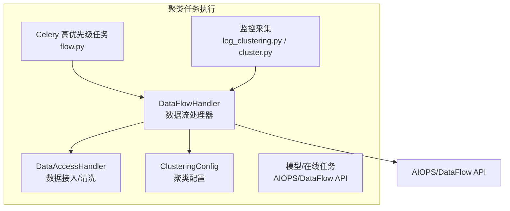
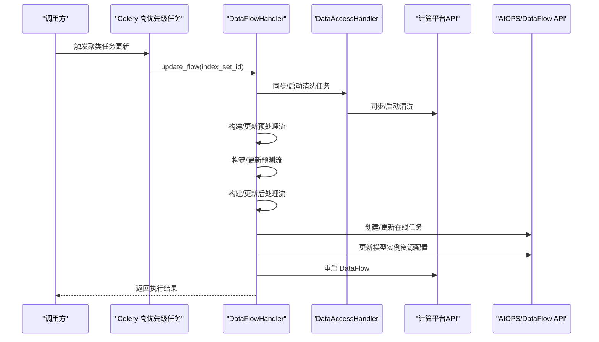
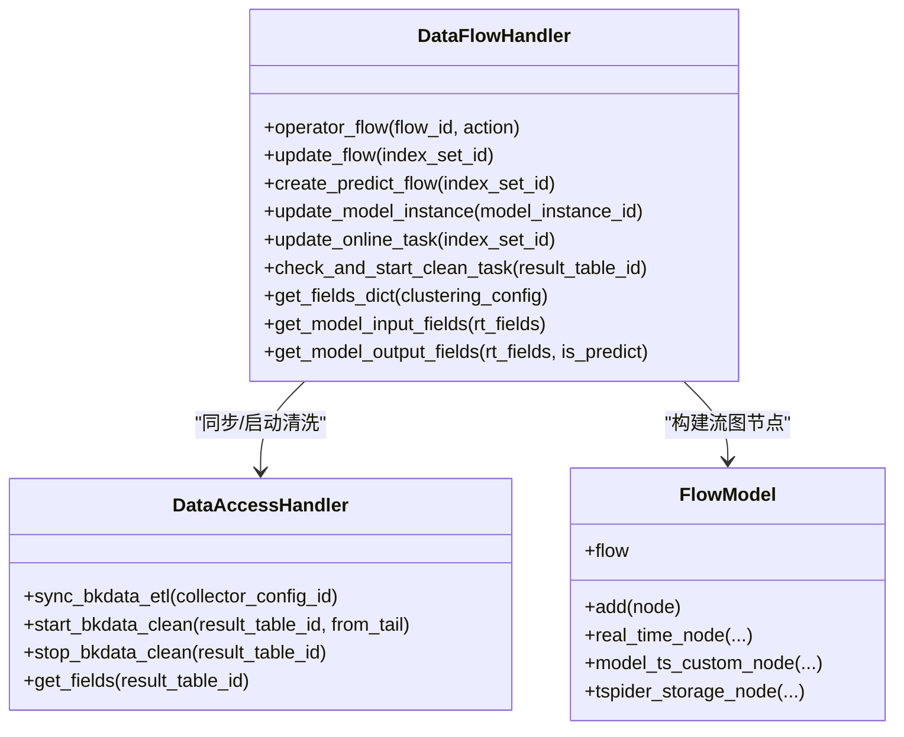
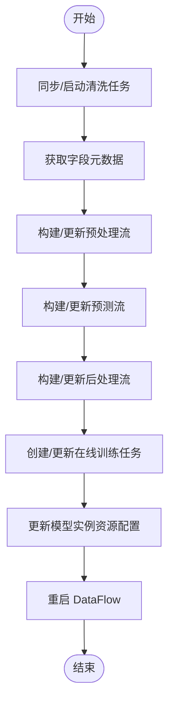
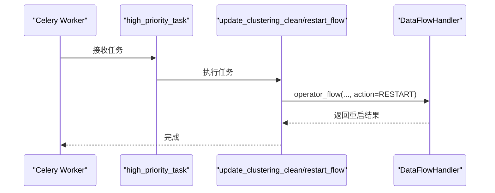
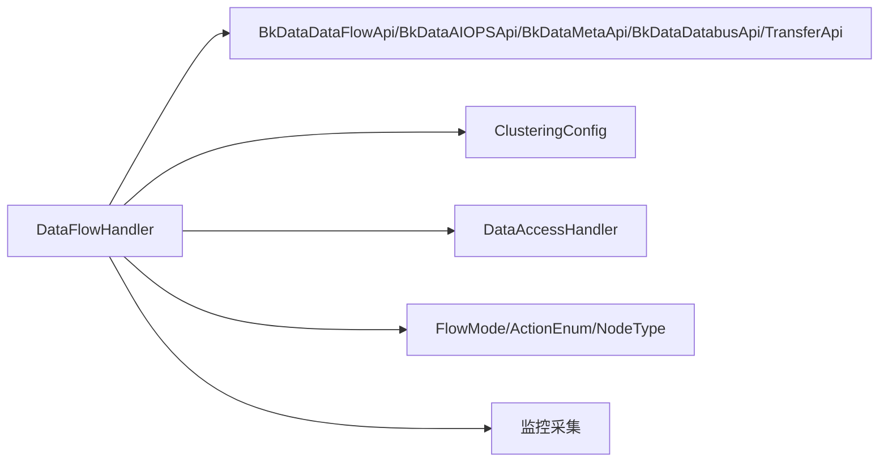

# 聚类任务执行

<cite>
**本文引用的文件**
- [dataflow_handler.py](file://bklog/apps/log_clustering/handlers/dataflow/dataflow_handler.py)
- [constants.py](file://bklog/apps/log_clustering/handlers/dataflow/constants.py)
- [dataflow_model.py](file://bklog/apps/log_clustering/handlers/dataflow/dataflow_model.py)
- [flow.py](file://bklog/apps/log_clustering/tasks/flow.py)
- [task.py](file://bklog/apps/utils/task.py)
- [default.py](file://bklog/config/default.py)
- [data_access.py](file://bklog/apps/log_clustering/handlers/data_access/data_access.py)
- [clustering.py](file://bklog/apps/log_clustering/models.py)
- [clustering_config.py](file://bklog/apps/log_clustering/handlers/clustering_config.py)
- [log_clustering.py](file://bklog/apps/log_measure/handlers/metric_collectors/log_clustering.py)
- [cluster.py](file://bklog/apps/log_measure/handlers/metric_collectors/cluster.py)
</cite>

## 目录
1. [简介](#简介)
2. [项目结构](#项目结构)
3. [核心组件](#核心组件)
4. [架构总览](#架构总览)
5. [详细组件分析](#详细组件分析)
6. [依赖分析](#依赖分析)
7. [性能考虑](#性能考虑)
8. [故障排查指南](#故障排查指南)
9. [结论](#结论)
10. [附录](#附录)

## 简介
本文件围绕聚类分析任务在 dataflow_handler.py 中的调度与执行机制展开，覆盖从任务创建到完成的全生命周期，包括任务状态管理（待处理、执行中、已完成、失败）、数据拉取、预处理、特征提取、聚类算法应用与结果存储；同时阐述与 Celery 任务队列的集成方式、任务超时/重试/错误恢复策略、性能监控指标与并发控制与资源隔离策略，并提供调试与故障排查指南及关键流程的可视化图示。

## 项目结构
聚类任务执行主要由以下模块协同完成：
- 数据流处理器：负责构建/更新/操作 DataFlow 流图，连接清洗、预处理、模型推理与后处理节点。
- 任务封装与调度：Celery 高优先级任务装饰器将任务投递至指定队列，按需重启 DataFlow。
- 数据接入与清洗：对接计算平台清洗任务，确保输入数据可用。
- 模型与在线任务：生成/更新模型节点与在线训练任务，驱动预测流。
- 监控与指标：采集聚类任务与 ES 集群健康度等指标。

图表来源
- [dataflow_handler.py](file://bklog/apps/log_clustering/handlers/dataflow/dataflow_handler.py#L122-L1811)
- [flow.py](file://bklog/apps/log_clustering/tasks/flow.py#L1-L63)
- [data_access.py](file://bklog/apps/log_clustering/handlers/data_access/data_access.py#L1-L200)
- [log_clustering.py](file://bklog/apps/log_measure/handlers/metric_collectors/log_clustering.py#L25-L64)
- [cluster.py](file://bklog/apps/log_measure/handlers/metric_collectors/cluster.py#L24-L71)

章节来源
- [dataflow_handler.py](file://bklog/apps/log_clustering/handlers/dataflow/dataflow_handler.py#L122-L1811)
- [flow.py](file://bklog/apps/log_clustering/tasks/flow.py#L1-L63)

## 核心组件
- DataFlowHandler：封装 DataFlow 流图的创建、更新、节点 SQL/模型/ES 存储配置变更、在线任务创建与更新、模型实例资源配置更新、清理任务检查与启动等。
- DataAccessHandler：封装清洗任务同步、ETL 配置创建/更新、清洗启停、字段元数据获取等。
- Celery 高优先级任务：通过装饰器将任务投递到高优先级队列，支持批量重启 DataFlow。
- 模型与在线任务：通过 AIOPS/DataFlow API 创建/更新模型节点与在线训练任务，配置执行参数与资源。
- 监控采集：统计聚类任务数量与 ES 集群健康度等指标。

章节来源
- [dataflow_handler.py](file://bklog/apps/log_clustering/handlers/dataflow/dataflow_handler.py#L122-L1811)
- [data_access.py](file://bklog/apps/log_clustering/handlers/data_access/data_access.py#L1-L200)
- [flow.py](file://bklog/apps/log_clustering/tasks/flow.py#L1-L63)
- [log_clustering.py](file://bklog/apps/log_measure/handlers/metric_collectors/log_clustering.py#L25-L64)
- [cluster.py](file://bklog/apps/log_measure/handlers/metric_collectors/cluster.py#L24-L71)

## 架构总览
聚类任务生命周期从“创建”到“完成”的关键阶段如下：
- 采集项/索引集配置准备：确定字段、过滤规则、聚类字段、ES 存储配置。
- 清洗任务同步与启动：确保清洗任务存在并从尾部开始消费。
- 预处理流构建/更新：生成预处理流图，设置过滤规则与字段映射。
- 预测流构建/更新：生成预测流图，配置模型节点输入/输出字段、训练参数、ES 输出。
- 后处理流构建/更新：合并样本与非聚类结果，格式化签名字段，分流至 TSpider/Redis/ES 等存储。
- 在线任务创建/更新：配置增量训练参数，触发服务化流水线。
- 模型实例资源配置更新：按 Flink/Spark 环境设置资源参数。
- 重启 DataFlow：根据需要重启预测/预处理/后处理流。
- 监控与指标：采集聚类任务数量与 ES 集群健康度。

图表来源
- [flow.py](file://bklog/apps/log_clustering/tasks/flow.py#L33-L63)
- [dataflow_handler.py](file://bklog/apps/log_clustering/handlers/dataflow/dataflow_handler.py#L974-L1599)
- [data_access.py](file://bklog/apps/log_clustering/handlers/data_access/data_access.py#L85-L101)

章节来源
- [flow.py](file://bklog/apps/log_clustering/tasks/flow.py#L33-L63)
- [dataflow_handler.py](file://bklog/apps/log_clustering/handlers/dataflow/dataflow_handler.py#L974-L1599)

## 详细组件分析

### DataFlowHandler 类与职责
DataFlowHandler 是聚类任务执行的核心，负责：
- 操作 DataFlow：启动/重启/停止流。
- 构建/更新流图：预处理流、预测流、后处理流、修改流。
- 节点配置更新：SQL 过滤规则、模型输入/输出字段、ES 存储字段、实时节点 SQL。
- 在线任务与模型实例：创建/更新在线训练任务，更新模型实例执行资源配置。
- 清洗任务检查与启动：确保清洗任务已就绪并从尾部消费。

图表来源
- [dataflow_handler.py](file://bklog/apps/log_clustering/handlers/dataflow/dataflow_handler.py#L122-L1811)
- [dataflow_model.py](file://bklog/apps/log_clustering/handlers/dataflow/dataflow_model.py#L43-L173)
- [data_access.py](file://bklog/apps/log_clustering/handlers/data_access/data_access.py#L1-L200)

章节来源
- [dataflow_handler.py](file://bklog/apps/log_clustering/handlers/dataflow/dataflow_handler.py#L122-L1811)
- [dataflow_model.py](file://bklog/apps/log_clustering/handlers/dataflow/dataflow_model.py#L43-L173)

### 任务状态管理
- 待处理：任务被提交到 Celery 队列，等待执行。
- 执行中：DataFlowHandler 正在构建/更新流图、同步清洗、更新在线任务与模型实例。
- 已完成：DataFlow 成功重启，任务标记成功。
- 失败：捕获异常并记录失败原因，必要时触发重试或人工干预。

章节来源
- [flow.py](file://bklog/apps/log_clustering/tasks/flow.py#L33-L63)
- [dataflow_handler.py](file://bklog/apps/log_clustering/handlers/dataflow/dataflow_handler.py#L122-L1811)

### 任务执行流程详解
- 数据拉取与清洗
  - 同步/创建清洗任务，确保清洗任务存在并从尾部开始消费。
  - 获取字段元数据，为后续节点 SQL 与模型字段准备。
- 预处理
  - 构建预处理流图，设置过滤规则（默认过滤空日志与长度>1），字段映射与转换。
  - 生成样本集与非聚类集结果表。
- 特征提取与聚类
  - 构建预测流图，配置模型节点输入/输出字段、训练参数（最小成员数、分隔符、最大日志长度、大小写敏感、深度、最大子节点、是否使用离线模型、距离列表）。
  - 配置 ES 输出字段（analyzed/doc_values/json 等），并设置过期时间。
- 结果存储
  - 后处理流将样本与非聚类结果合并，格式化签名字段，分流至 TSpider/Redis/ES 等存储。
  - 创建聚类结果表路由信息，便于检索与告警。
- 在线训练与模型实例
  - 创建/更新在线训练任务，配置增量训练参数与触发条件。
  - 更新模型实例执行资源配置（Flink/Spark 参数）。

图表来源
- [dataflow_handler.py](file://bklog/apps/log_clustering/handlers/dataflow/dataflow_handler.py#L974-L1599)
- [data_access.py](file://bklog/apps/log_clustering/handlers/data_access/data_access.py#L85-L101)

章节来源
- [dataflow_handler.py](file://bklog/apps/log_clustering/handlers/dataflow/dataflow_handler.py#L974-L1599)
- [data_access.py](file://bklog/apps/log_clustering/handlers/data_access/data_access.py#L85-L101)

### Celery 集成与任务调度
- 高优先级队列：通过装饰器将任务投递到高优先级队列，保证聚类任务优先执行。
- 任务类型：普通任务与周期性任务，分别用于一次性更新与定时巡检。
- 重启策略：支持批量重启指定流 ID，结合缓存时间戳避免重复重启。

图表来源
- [task.py](file://bklog/apps/utils/task.py#L16-L24)
- [flow.py](file://bklog/apps/log_clustering/tasks/flow.py#L33-L63)
- [constants.py](file://bklog/apps/log_clustering/handlers/dataflow/constants.py#L53-L70)

章节来源
- [task.py](file://bklog/apps/utils/task.py#L16-L24)
- [flow.py](file://bklog/apps/log_clustering/tasks/flow.py#L33-L63)
- [default.py](file://bklog/config/default.py#L192-L232)

### 错误处理、超时与重试
- API 层重试：获取 DataFlow 最新部署数据时使用带重试的包装类，限制最大尝试次数。
- 异常捕获：在任务执行过程中捕获异常并记录失败原因与堆栈信息，便于定位问题。
- 超时与重试：通过装饰器与配置可实现任务超时与重试策略（具体取决于 Celery 配置与任务实现）。

章节来源
- [dataflow_handler.py](file://bklog/apps/log_clustering/handlers/dataflow/dataflow_handler.py#L628-L662)

### 性能监控指标
- 聚类任务数量：按业务维度统计启用聚类的配置数量。
- ES 集群健康度：采集 active_shards/unassigned_shards 等关键指标，评估存储层健康状况。

章节来源
- [log_clustering.py](file://bklog/apps/log_measure/handlers/metric_collectors/log_clustering.py#L25-L64)
- [cluster.py](file://bklog/apps/log_measure/handlers/metric_collectors/cluster.py#L24-L71)

### 并发控制与资源隔离
- 队列隔离：聚类任务使用高优先级队列，避免与其他任务互相抢占。
- 并发数：通过 Celery 并发数配置控制 worker 并发度。
- 资源配置：模型实例资源配置区分 Flink/Spark 环境，设置 CPU/内存/副本/Worker 数等。

章节来源
- [task.py](file://bklog/apps/utils/task.py#L16-L24)
- [default.py](file://bklog/config/default.py#L192-L232)
- [dataflow_handler.py](file://bklog/apps/log_clustering/handlers/dataflow/dataflow_handler.py#L691-L724)

## 依赖分析
- 外部依赖
  - 计算平台 API：DataFlow、AIOPS、Meta、Databus、Transfer。
  - Elasticsearch：用于聚类结果存储与路由。
- 内部依赖
  - 配置模型：ClusteringConfig 提供聚类配置、流 ID、模型 ID、过滤规则等。
  - 数据接入：DataAccessHandler 负责清洗任务同步与字段元数据。
  - 常量与枚举：FlowMode、ActionEnum、NodeType 等定义流图模板与操作行为。

图表来源
- [dataflow_handler.py](file://bklog/apps/log_clustering/handlers/dataflow/dataflow_handler.py#L122-L1811)
- [constants.py](file://bklog/apps/log_clustering/handlers/dataflow/constants.py#L53-L114)
- [clustering.py](file://bklog/apps/log_clustering/models.py)

章节来源
- [dataflow_handler.py](file://bklog/apps/log_clustering/handlers/dataflow/dataflow_handler.py#L122-L1811)
- [constants.py](file://bklog/apps/log_clustering/handlers/dataflow/constants.py#L53-L114)

## 性能考虑
- 流图模板渲染：通过 Jinja2 模板渲染，减少手工拼装 SQL 的复杂度与错误率。
- 字段映射与去重：在预处理与预测阶段进行字段映射与去重，避免重复字段导致节点创建失败。
- ES 输出优化：合理配置 analyzed/doc_values/json 字段，降低查询与聚合成本。
- 资源参数：根据环境选择 Flink/Spark 参数，平衡吞吐与延迟。

[本节为通用指导，无需列出具体文件来源]

## 故障排查指南
- 查看任务日志
  - Celery Worker 日志：确认任务是否被正确投递与执行。
  - DataFlowHandler 日志：关注流图构建/更新过程中的异常与错误提示。
- 分析执行瓶颈
  - 清洗任务未启动：检查清洗任务是否存在，是否从尾部开始消费。
  - ES 存储配置缺失：确认 ES 存储字段（analyzed/doc_values/json）是否正确注入。
  - 模型实例资源配置：检查 Flink/Spark 参数是否合理。
- 常见问题定位
  - 节点 SQL 缺失或不匹配：核对实时节点 SQL 与模板渲染结果。
  - 在线任务参数不一致：核对训练参数与模型节点配置。
  - 重启失败：检查 DataFlow 状态与 ActionEnum 操作是否正确。

章节来源
- [flow.py](file://bklog/apps/log_clustering/tasks/flow.py#L33-L63)
- [dataflow_handler.py](file://bklog/apps/log_clustering/handlers/dataflow/dataflow_handler.py#L122-L1811)

## 结论
dataflow_handler.py 将聚类任务的创建、更新、重启与监控整合在一个统一的数据流处理器中，配合 Celery 高优先级队列与计算平台 API，实现了从数据接入到结果存储的全链路自动化。通过严格的过滤规则、字段映射与资源配置，有效提升了任务稳定性与性能；通过监控指标与日志定位，能够快速发现并解决问题。

[本节为总结性内容，无需列出具体文件来源]

## 附录
- 关键流程路径参考
  - 任务更新入口：[update_clustering_clean](file://bklog/apps/log_clustering/tasks/flow.py#L33-L51)
  - 流图更新：[update_flow](file://bklog/apps/log_clustering/handlers/dataflow/dataflow_handler.py#L974-L1004)
  - 预处理流构建：[update_pre_treat_flow](file://bklog/apps/log_clustering/handlers/dataflow/dataflow_handler.py#L1006-L1046)
  - 预测流构建：[create_predict_flow](file://bklog/apps/log_clustering/handlers/dataflow/dataflow_handler.py#L1509-L1599)
  - 后处理流构建：[update_after_treat_flow](file://bklog/apps/log_clustering/handlers/dataflow/dataflow_handler.py#L1137-L1179)
  - 在线任务创建/更新：[create_online_task/update_online_task](file://bklog/apps/log_clustering/handlers/dataflow/dataflow_handler.py#L1348-L1347)
  - 模型实例资源配置更新：[update_model_instance](file://bklog/apps/log_clustering/handlers/dataflow/dataflow_handler.py#L691-L724)
  - 清洗任务同步/启动：[sync_bkdata_etl/start_bkdata_clean](file://bklog/apps/log_clustering/handlers/data_access/data_access.py#L85-L101)