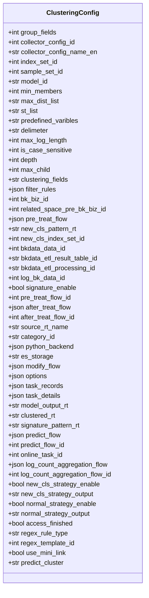
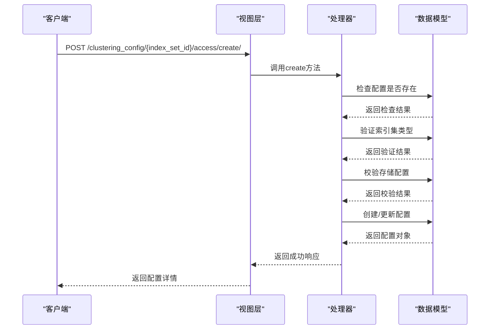
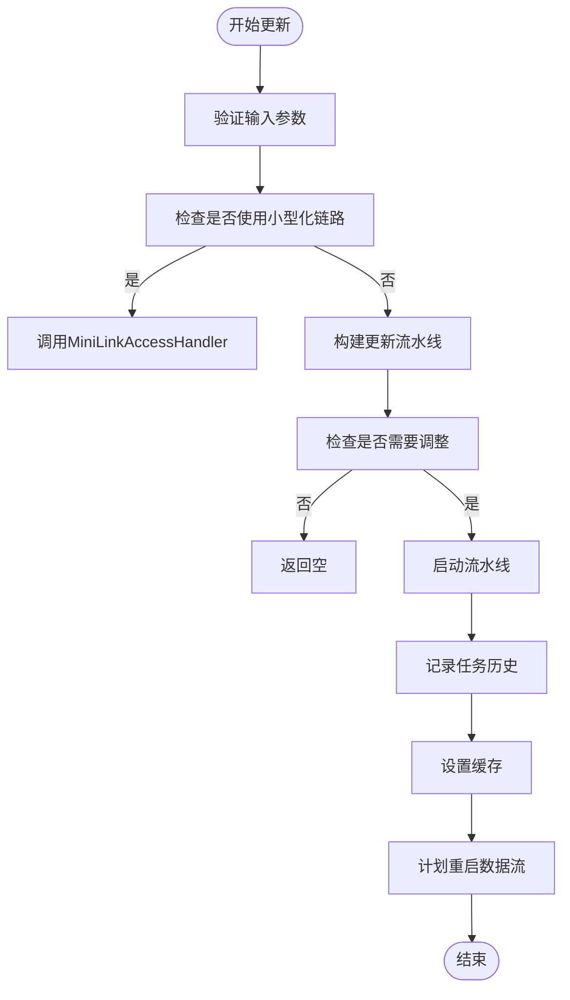
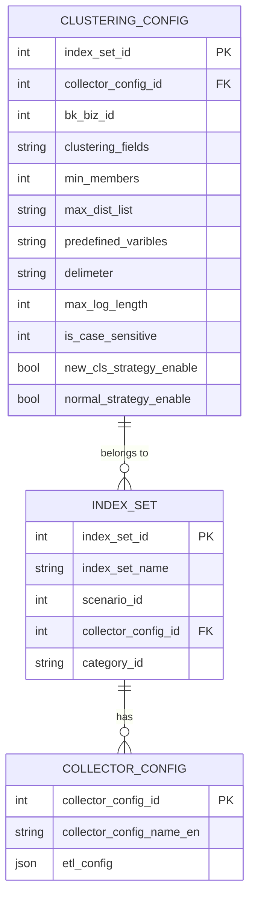
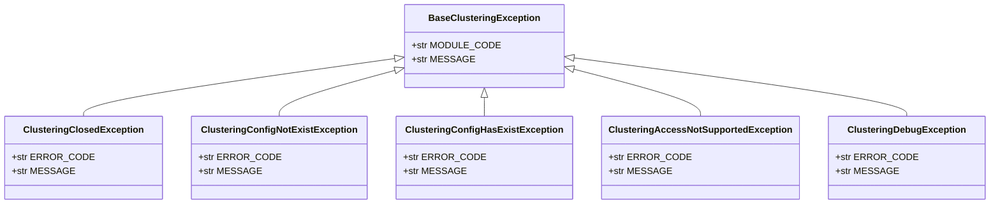
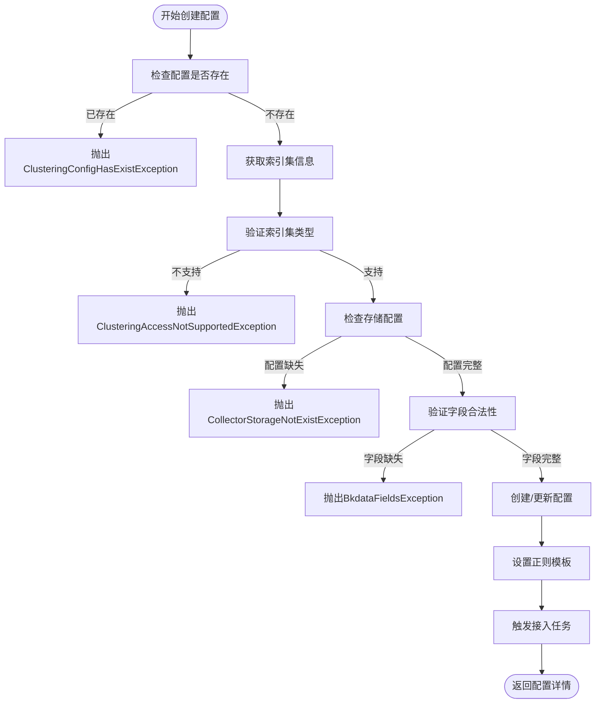
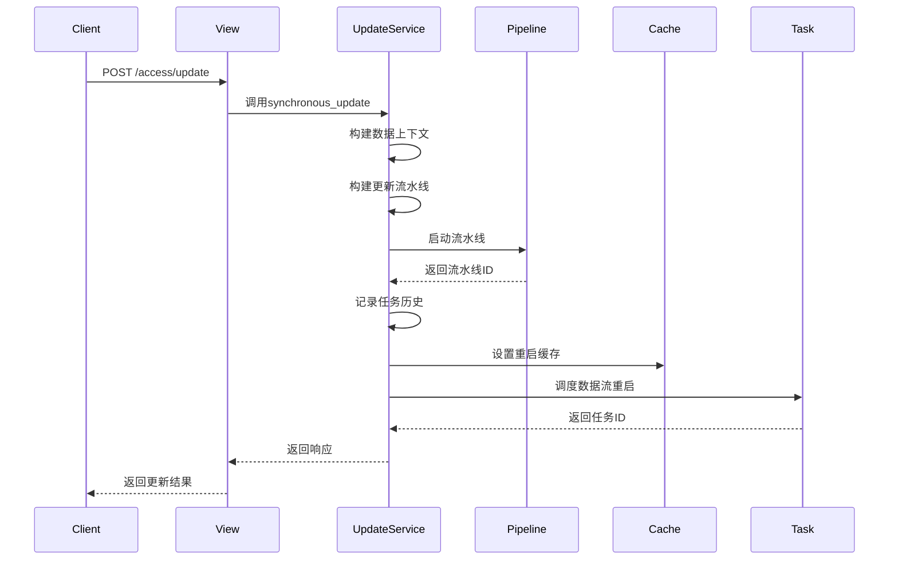

# 聚类配置管理

<cite>
**本文档引用文件**   
- [clustering_config.py](file://bklog/apps/log_clustering/handlers/clustering_config.py)
- [models.py](file://bklog/apps/log_clustering/models.py)
- [serializers.py](file://bklog/apps/log_clustering/serializers.py)
- [clustering_config_views.py](file://bklog/apps/log_clustering/views/clustering_config_views.py)
- [constants.py](file://bklog/apps/log_clustering/constants.py)
- [dataflow/constants.py](file://bklog/apps/log_clustering/handlers/dataflow/constants.py)
- [exceptions.py](file://bklog/apps/log_clustering/exceptions.py)
</cite>

## 目录
1. [引言](#引言)
2. [聚类配置模型字段定义](#聚类配置模型字段定义)
3. [配置生命周期管理](#配置生命周期管理)
4. [配置与索引集关联机制](#配置与索引集关联机制)
5. [配置最佳实践](#配置最佳实践)
6. [配置验证与错误处理](#配置验证与错误处理)
7. [配置变更审计日志](#配置变更审计日志)
8. [核心逻辑代码示例](#核心逻辑代码示例)
9. [结论](#结论)

## 引言

聚类配置管理是日志分析系统中的核心功能，它通过智能算法对海量日志进行模式识别和分类，帮助运维人员快速发现异常和问题。本文档详细阐述了聚类配置的完整生命周期管理，包括配置模型的字段定义、创建更新流程、与索引集的关联机制、最佳实践以及错误处理机制。系统通过灵活的配置选项支持不同业务场景下的日志聚类需求，包括正则表达式规则、机器学习算法等多种策略类型。

**Section sources**
- [clustering_config.py](file://bklog/apps/log_clustering/handlers/clustering_config.py#L1-L502)

## 聚类配置模型字段定义

聚类配置模型定义了日志聚类的核心参数，这些字段共同决定了聚类算法的行为和效果。主要字段包括：

### 基础配置字段
- **min_members**: 最小日志数量，定义了形成一个聚类所需的最少日志条数
- **max_dist_list**: 敏感度参数，控制聚类的精细程度，值越小越敏感
- **predefined_varibles**: 预先定义的正则表达式，用于日志预处理和特征提取
- **delimeter**: 分词符，指定日志文本的分割规则
- **max_log_length**: 最大日志长度，限制参与聚类的日志内容长度
- **is_case_sensitive**: 是否大小写敏感，控制文本匹配时的大小写处理
- **clustering_fields**: 聚合字段，指定参与聚类分析的日志字段

### 业务关联字段
- **bk_biz_id**: 业务ID，标识配置所属的业务空间
- **index_set_id**: 索引集ID，关联具体的日志索引集合
- **collector_config_id**: 采集项ID，关联日志采集配置

### 高级配置字段
- **filter_rules**: 过滤规则，定义参与聚类的日志筛选条件
- **regex_rule_type**: 规则类型，支持自定义(CUSTOMIZE)和模板(TEMPLATE)两种模式
- **regex_template_id**: 正则模板ID，当规则类型为模板时引用的模板标识
- **new_cls_strategy_enable**: 是否开启新类告警策略
- **normal_strategy_enable**: 是否开启数量突增告警策略



**Diagram sources **
- [models.py](file://bklog/apps/log_clustering/models.py#L106-L184)

**Section sources**
- [models.py](file://bklog/apps/log_clustering/models.py#L106-L184)
- [constants.py](file://bklog/apps/log_clustering/constants.py#L1-L326)

## 配置生命周期管理

聚类配置的生命周期包括创建、更新、启用/禁用等关键操作，每个操作都有明确的业务逻辑和API接口。

### 配置创建流程
配置创建通过`create`方法实现，主要步骤包括：
1. 检查索引集是否已存在聚类配置
2. 验证索引集类型是否支持聚类（计算平台索引或采集项索引）
3. 校验采集项的ES存储配置
4. 验证清洗配置的合法性
5. 创建或更新聚类配置记录



**Diagram sources **
- [clustering_config.py](file://bklog/apps/log_clustering/handlers/clustering_config.py#L98-L204)
- [clustering_config_views.py](file://bklog/apps/log_clustering/views/clustering_config_views.py#L127-L178)

### 配置更新流程
配置更新通过`update`方法实现，主要特点包括：
- 支持异步更新，立即返回任务ID
- 更新后延迟10分钟重启数据流
- 记录任务历史和详细信息
- 支持小型化链路的特殊处理



**Diagram sources **
- [clustering_config.py](file://bklog/apps/log_clustering/handlers/clustering_config.py#L206-L262)

### 配置启用/禁用
系统通过`new_cls_strategy_enable`和`normal_strategy_enable`字段控制两种告警策略的启用状态：
- 新类告警：检测日志中出现的新模式
- 数量突增告警：检测特定模式日志数量的异常增长

**Section sources**
- [clustering_config.py](file://bklog/apps/log_clustering/handlers/clustering_config.py#L98-L262)
- [clustering_config_views.py](file://bklog/apps/log_clustering/views/clustering_config_views.py#L127-L233)

## 配置与索引集关联机制

聚类配置与索引集的关联是通过`index_set_id`字段建立的，这种关联机制支持灵活的业务需求定制。

### 关联关系模型


**Diagram sources **
- [models.py](file://bklog/apps/log_clustering/models.py#L106-L184)
- [models.py](file://bklog/apps/log_search/models.py#L1-L100)

### 业务需求定制
系统支持根据不同业务需求定制聚类策略：

#### 不同日志量级的采样率调整
- 小量级日志：使用较低的`min_members`值，提高敏感度
- 大量级日志：使用较高的`min_members`值，避免过度细分
- 动态调整：根据历史数据自动优化`max_dist_list`参数

#### 不同聚类算法参数选择
- 正则表达式策略：通过`predefined_varibles`和`delimeter`精确控制文本处理
- 机器学习策略：通过`depth`和`max_child`调整搜索树的复杂度
- 混合策略：结合多种算法优势，提高聚类准确性

**Section sources**
- [clustering_config.py](file://bklog/apps/log_clustering/handlers/clustering_config.py#L127-L187)
- [models.py](file://bklog/apps/log_clustering/models.py#L106-L184)

## 配置最佳实践

### 采样率调整策略
根据日志量级调整采样率是优化聚类效果的关键：

| 日志量级 | min_members | max_dist_list | 建议 |
|---------|------------|--------------|------|
| 小量级(<1万条/天) | 1-5 | 0.1-0.3 | 提高敏感度，捕获更多模式 |
| 中量级(1-10万条/天) | 5-20 | 0.3-0.5 | 平衡敏感度和性能 |
| 大量级(>10万条/天) | 20-50 | 0.5-0.8 | 降低敏感度，避免过度细分 |

### 聚类算法参数选择
选择合适的聚类算法参数能显著提升效果：

#### 正则表达式策略
- **predefined_varibles**: 预定义常用日志模式的正则表达式
- **delimeter**: 根据日志格式选择合适的分词符（如空格、逗号、分号）
- **max_log_length**: 避免处理过长的日志影响性能

#### 机器学习策略
- **depth**: 搜索树深度，值越大越精确但性能开销越大
- **max_child**: 最大子节点数，控制树的宽度
- **is_case_sensitive**: 根据业务需求决定是否区分大小写

### 配置模板化
系统支持正则模板的复用，通过`RegexTemplate`模型实现：
- 创建通用的正则表达式模板
- 在多个索引集间共享模板配置
- 降低配置复杂度，提高一致性

**Section sources**
- [clustering_config.py](file://bklog/apps/log_clustering/handlers/clustering_config.py#L127-L187)
- [models.py](file://bklog/apps/log_clustering/models.py#L329-L337)
- [constants.py](file://bklog/apps/log_clustering/constants.py#L318-L325)

## 配置验证与错误处理

系统实现了完善的配置验证和错误处理机制，确保配置的正确性和系统的稳定性。

### 配置验证机制
- **字段验证**: 通过`ClusteringConfigSerializer`验证输入参数
- **业务逻辑验证**: 在`create`方法中检查索引集类型、存储配置等
- **正则表达式验证**: 使用`check_regexp`接口验证正则表达式的合法性

### 错误处理机制
系统定义了详细的异常类型，便于问题定位和处理：



**Diagram sources **
- [exceptions.py](file://bklog/apps/log_clustering/exceptions.py#L31-L139)

### 常见错误场景
| 错误类型 | 原因 | 解决方案 |
|--------|------|--------|
| ClusteringConfigHasExistException | 索引集已存在聚类配置 | 检查是否已配置，避免重复创建 |
| ClusteringAccessNotSupportedException | 索引集类型不支持聚类 | 确认索引集为计算平台或采集项类型 |
| CollectorStorageNotExistException | 采集项存储配置不存在 | 检查采集项的ES存储配置 |
| RegexTemplateNotExistException | 正则模板不存在 | 确认模板ID正确或创建新模板 |

**Section sources**
- [exceptions.py](file://bklog/apps/log_clustering/exceptions.py#L31-L139)
- [clustering_config.py](file://bklog/apps/log_clustering/handlers/clustering_config.py#L101-L113)
- [clustering_config_views.py](file://bklog/apps/log_clustering/views/clustering_config_views.py#L356-L366)

## 配置变更审计日志

系统通过任务记录和详细信息字段实现配置变更的审计功能。

### 审计日志结构
聚类配置的审计日志主要通过以下字段记录：
- **task_records**: 任务记录列表，包含操作类型、任务ID和时间戳
- **task_details**: 任务详情，记录每个节点的执行状态和信息

### 审计日志示例
```json
{
  "task_records": [
    {
      "operate": "CREATE",
      "task_id": "pipeline_123",
      "time": 1640995200
    },
    {
      "operate": "UPDATE",
      "task_id": "pipeline_456",
      "time": 1641081600
    }
  ],
  "task_details": {
    "pipeline_123": [
      {
        "node_id": "node_1",
        "node_name": "预处理",
        "status": "SUCCESS",
        "message": "步骤完成",
        "create_at": "2022-01-01 00:00:00",
        "update_at": "2022-01-01 00:01:00"
      }
    ]
  }
}
```

### 审计日志查询
通过`get_access_status`接口可以查询配置的接入状态和任务执行情况，返回包含流程创建、运行和数据检查状态的详细信息。

**Section sources**
- [clustering_config.py](file://bklog/apps/log_clustering/handlers/clustering_config.py#L280-L373)
- [clustering_config_views.py](file://bklog/apps/log_clustering/views/clustering_config_views.py#L234-L266)

## 核心逻辑代码示例

以下是聚类配置管理的核心逻辑代码示例：

### 配置创建核心逻辑


**Diagram sources **
- [clustering_config.py](file://bklog/apps/log_clustering/handlers/clustering_config.py#L98-L204)

### 配置更新核心逻辑


**Diagram sources **
- [clustering_config.py](file://bklog/apps/log_clustering/handlers/clustering_config.py#L206-L262)

**Section sources**
- [clustering_config.py](file://bklog/apps/log_clustering/handlers/clustering_config.py#L98-L262)

## 结论

聚类配置管理是日志分析系统的核心功能，通过完善的配置模型、生命周期管理、错误处理和审计机制，为用户提供灵活高效的日志聚类能力。系统支持多种聚类策略和参数配置，能够适应不同业务场景的需求。通过合理的配置最佳实践，可以显著提升日志分析的效果和效率。未来可以进一步优化自动参数调优和智能推荐功能，降低用户的配置复杂度。

[无来源，此部分为总结性内容]