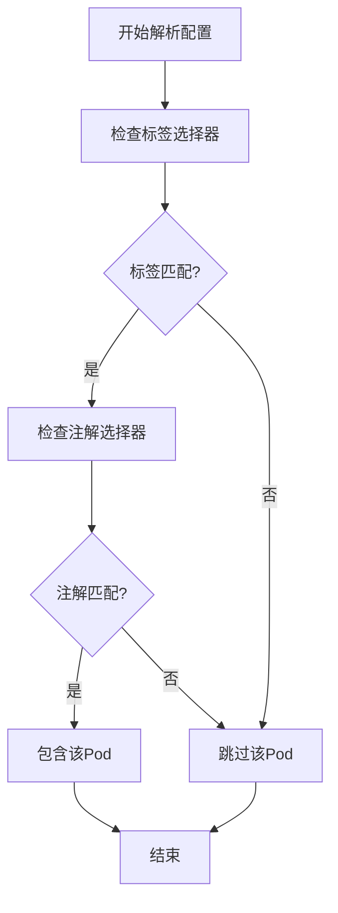
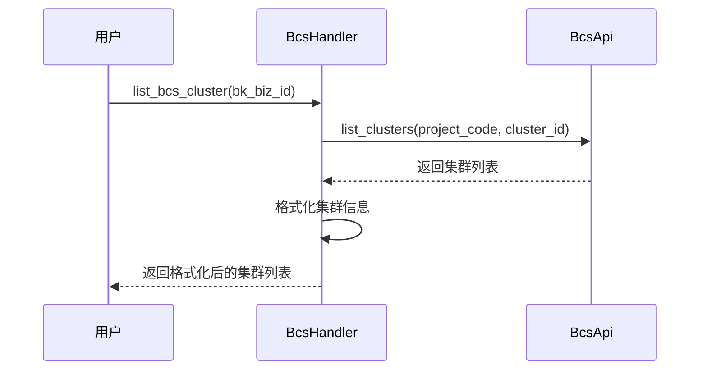
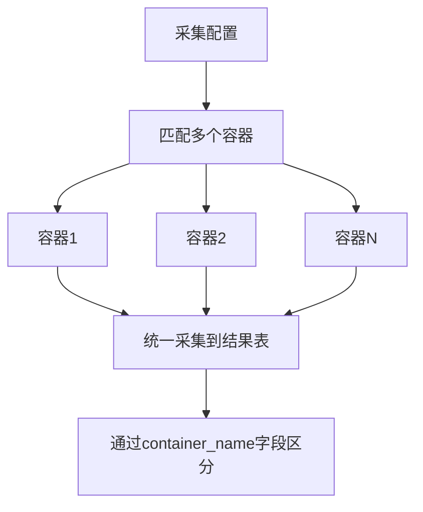
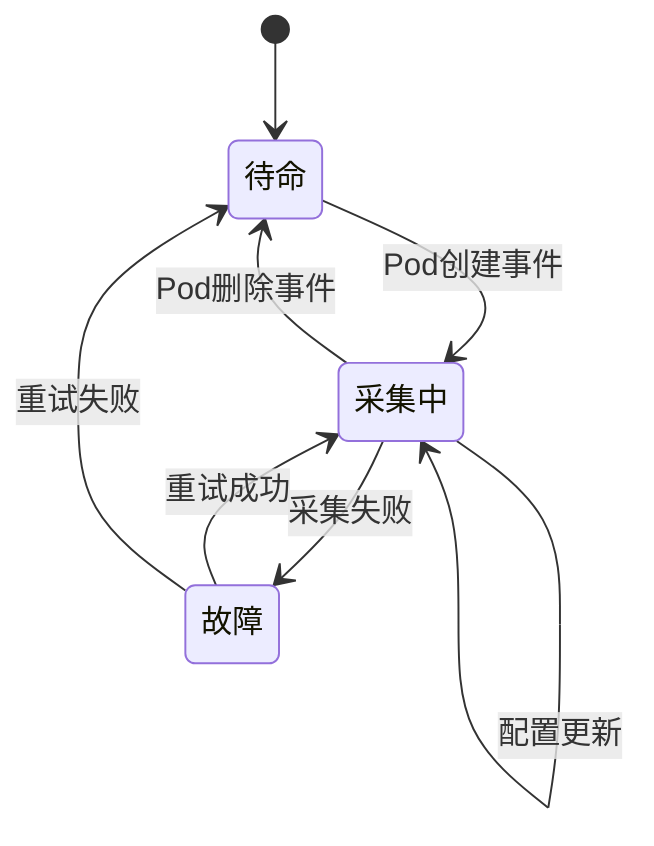

# 容器日志采集

<cite>
**本文档引用文件**  
- [k8s.py](file://bklog/apps/log_databus/handlers/collector/k8s.py)
- [bcs_handler.py](file://bklog/apps/log_bcs/handlers/bcs_handler.py)
- [constants.py](file://bklog/apps/log_databus/constants.py)
- [serializers.py](file://bklog/apps/log_databus/serializers.py)
- [models.py](file://bklog/apps/log_databus/models.py)
</cite>

## 目录
1. [简介](#简介)
2. [核心配置解析](#核心配置解析)
3. [BCS集成与动态发现](#bcs集成与动态发现)
4. [日志路径映射与合并策略](#日志路径映射与合并策略)
5. [数据模型扩展字段](#数据模型扩展字段)
6. [采集模式配置](#采集模式配置)
7. [采集生命周期管理](#采集生命周期管理)
8. [常见问题排查](#常见问题排查)

## 简介
本文档详细描述了基于Kubernetes环境的容器日志采集实现机制。系统通过集成蓝鲸容器服务（BCS）获取集群元数据，结合`k8s.py`中的处理流程实现容器动态发现与日志采集。文档重点阐述了Pod选择器、容器过滤、命名空间匹配等配置项的解析逻辑，以及DaemonSet和sidecar模式的适配方法。

**Section sources**
- [k8s.py](file://bklog/apps/log_databus/handlers/collector/k8s.py#L1-L50)

## 核心配置解析
容器日志采集的配置解析主要通过`k8s.py`文件中的`K8sCollectorHandler`类实现。系统支持多种配置项来精确匹配目标容器。

### Pod选择器与标签匹配
系统支持通过标签选择器（labelSelector）和注解选择器（annotationSelector）来匹配Pod。标签选择器支持以下操作符：
- `In`：标签值在指定列表中
- `NotIn`：标签值不在指定列表中
- `Exists`：标签存在
- `DoesNotExist`：标签不存在



**Diagram sources**
- [k8s.py](file://bklog/apps/log_databus/handlers/collector/k8s.py#L1903-L1941)

### 命名空间匹配
命名空间匹配支持以下配置：
- `namespaceSelector.matchNames`：指定要采集日志的命名空间列表
- `namespaceSelector.excludeNames`：指定要排除的命名空间列表
- `anyNamespace`：是否匹配所有命名空间

系统会根据业务权限和集群类型验证命名空间的合法性，对于共享集群，会检查用户是否有权限访问指定的命名空间。

**Section sources**
- [k8s.py](file://bklog/apps/log_databus/handlers/collector/k8s.py#L1942-L2008)

## BCS集成与动态发现
系统通过`bcs_handler.py`实现与蓝鲸容器服务（BCS）的集成，获取集群元数据并实现容器动态发现。

### 集群元数据获取
通过`BcsHandler`类的`list_bcs_cluster`方法获取BCS集群列表，返回包含集群ID、名称、环境等信息的集群元数据。



**Diagram sources**
- [bcs_handler.py](file://bklog/apps/log_bcs/handlers/bcs_handler.py#L26-L41)

### 动态发现机制
系统通过以下步骤实现容器动态发现：
1. 获取指定集群的所有命名空间
2. 根据工作负载类型（Deployment、StatefulSet等）获取Pod列表
3. 应用标签和注解选择器过滤Pod
4. 生成最终的采集目标列表

**Section sources**
- [k8s.py](file://bklog/apps/log_databus/handlers/collector/k8s.py#L2010-L2079)

## 日志路径映射与合并策略
系统实现了灵活的日志路径映射规则和多容器日志合并策略。

### 路径映射规则
容器日志路径遵循标准的Kubernetes日志路径格式：
```
/var/log/pods/<namespace>_<pod_name>_<pod_uid>/<container_name>/<instance_number>.log
```

系统通过`container_config_to_raw_config`方法将容器采集配置转换为原始配置，包含路径、编码、过滤规则等信息。

### 多容器日志合并
对于单个采集配置匹配多个容器的场景，系统采用以下合并策略：
- 将多个容器的日志统一采集到同一个结果表（Result Table）
- 通过`container_name`字段区分不同容器的日志
- 支持为不同容器配置不同的过滤规则和解析方式



**Diagram sources**
- [k8s.py](file://bklog/apps/log_databus/handlers/collector/k8s.py#L333-L403)

## 数据模型扩展字段
系统在标准数据模型基础上扩展了多个特有属性，以支持容器环境的特殊需求。

### 扩展字段定义
| 字段名 | 类型 | 描述 |
|-------|------|------|
| bcs_cluster_id | string | BCS集群ID |
| workload_type | string | 工作负载类型（Deployment、StatefulSet等） |
| workload_name | string | 工作负载名称 |
| add_pod_label | boolean | 是否自动添加Pod标签 |
| add_pod_annotation | boolean | 是否自动添加Pod注解 |
| extra_labels | object | 额外添加的标签 |

这些字段定义在`CollectorConfig`模型中，通过`extra_labels`字段支持用户自定义标签的注入。

**Section sources**
- [models.py](file://bklog/apps/log_databus/models.py#L180-L186)

## 采集模式配置
系统支持DaemonSet和sidecar两种主要的采集模式。

### DaemonSet模式
DaemonSet模式通过在每个节点上部署一个日志采集器实例来采集该节点上所有容器的日志。

```python
# DaemonSet模式配置示例
{
    "collector_type": "container_log_config",
    "environment": "container",
    "bcs_cluster_id": "BCS-K8S-12345",
    "namespaceSelector": {
        "matchNames": ["default", "production"]
    },
    "workloadType": "Deployment",
    "containerNameMatch": ["app", "web"]
}
```

### Sidecar模式
Sidecar模式通过在应用Pod中注入一个日志采集容器来采集同Pod中其他容器的日志。

```python
# Sidecar模式配置示例
{
    "collector_type": "container_log_config",
    "environment": "container",
    "bcs_cluster_id": "BCS-K8S-12345",
    "namespaceSelector": {
        "matchNames": ["sidecar-ns"]
    },
    "allContainer": true,
    "add_pod_label": true,
    "extra_labels": [
        {"key": "env", "value": "production"}
    ]
}
```

**Section sources**
- [serializers.py](file://bklog/apps/log_databus/serializers.py#L1423-L1447)

## 采集生命周期管理
系统实现了完整的采集生命周期管理，包括创建、更新、删除等操作。

### 滚动更新处理
在滚动更新场景下，系统通过以下机制确保日志采集的连续性：
1. 监听Pod创建和删除事件
2. 当新Pod创建时，自动将其加入采集目标
3. 当旧Pod删除时，从采集目标中移除
4. 保持采集配置的持续生效



**Diagram sources**
- [k8s.py](file://bklog/apps/log_databus/handlers/collector/k8s.py#L128-L144)

## 常见问题排查
本节提供容器日志采集常见问题的解决方案。

### 容器日志路径找不到
**可能原因：**
- 容器未产生日志
- 日志路径配置错误
- 权限不足无法访问日志文件

**解决方案：**
1. 确认容器正在运行并产生日志
2. 检查采集配置中的路径是否正确
3. 验证采集器是否有足够的权限访问日志目录

### 标签匹配失败
**可能原因：**
- 标签名称或值拼写错误
- 标签选择器语法错误
- Pod不存在指定的标签

**解决方案：**
1. 使用`kubectl get pod --show-labels`检查Pod的实际标签
2. 验证标签选择器的语法是否正确
3. 确认标签名称和值的大小写匹配

### 采集延迟高
**可能原因：**
- 网络延迟高
- 采集器资源不足
- 日志量过大

**解决方案：**
1. 检查网络连接质量
2. 增加采集器的CPU和内存资源
3. 优化日志采集配置，减少不必要的日志采集

**Section sources**
- [k8s.py](file://bklog/apps/log_databus/handlers/collector/k8s.py#L39-L71)