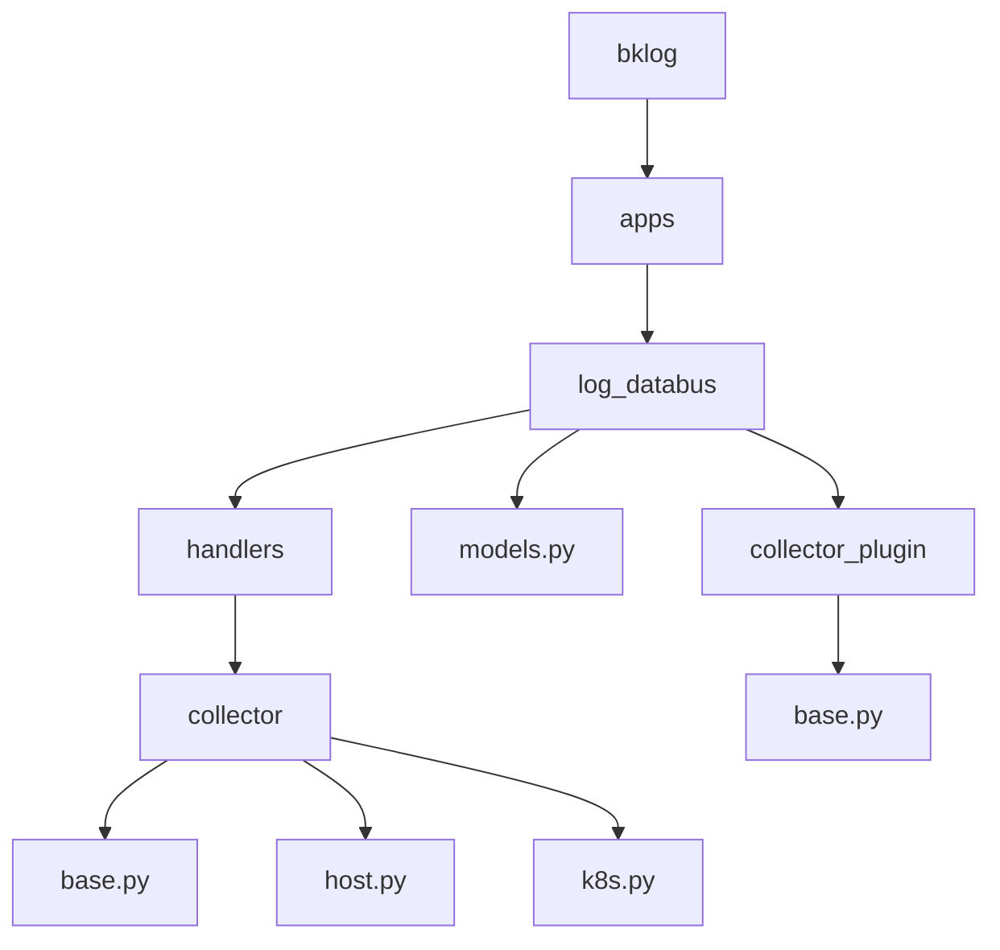
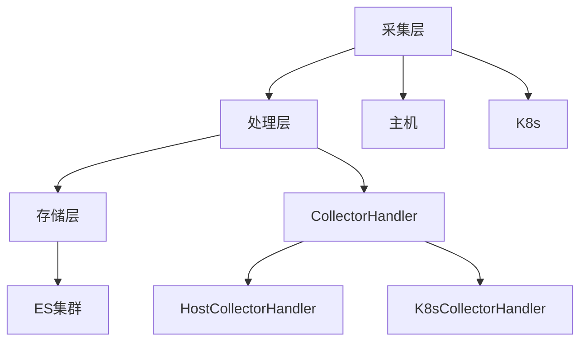
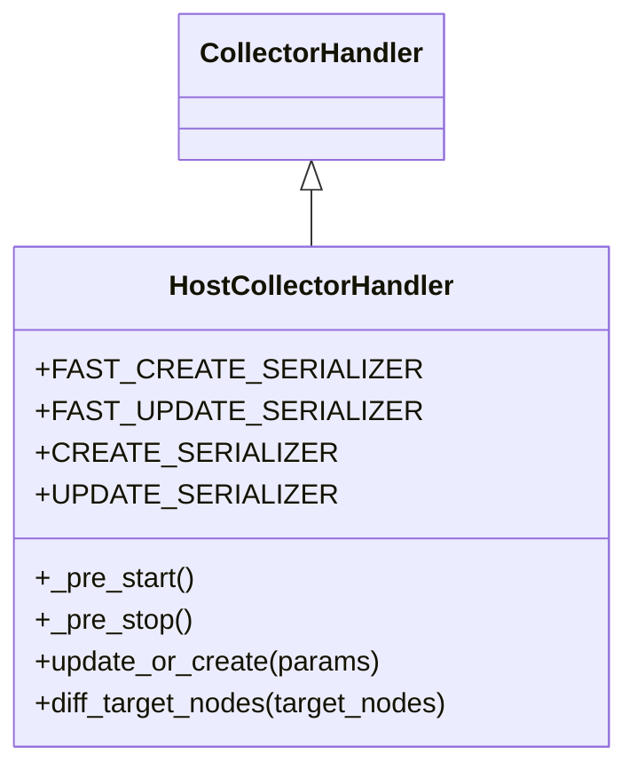
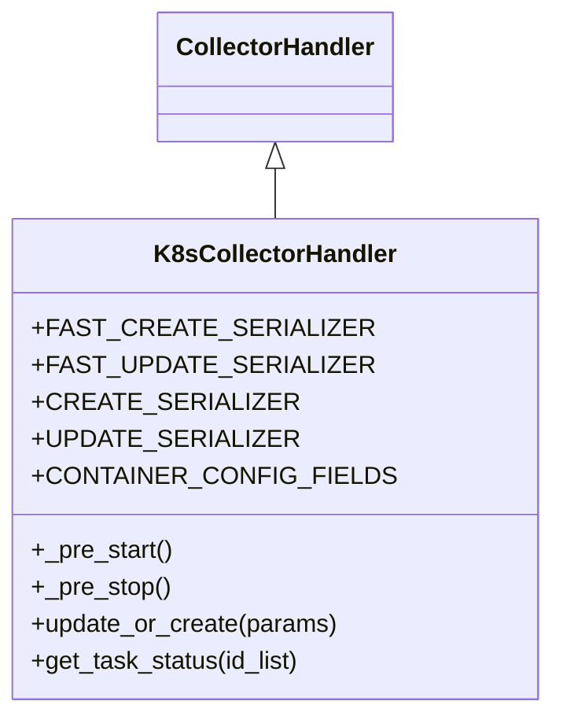
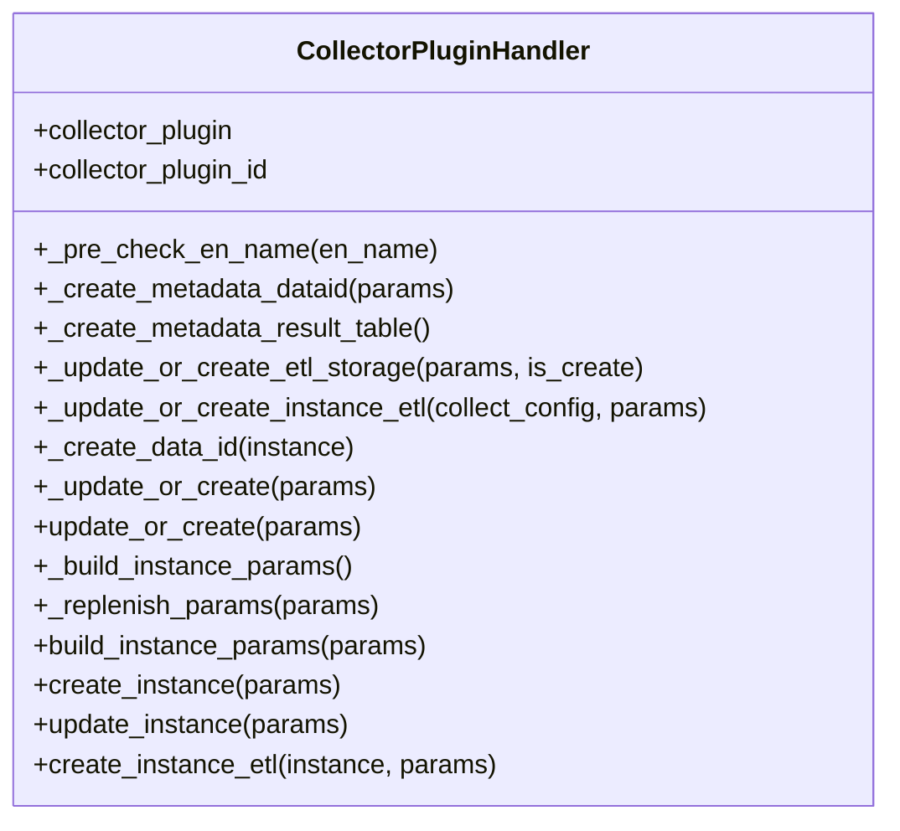
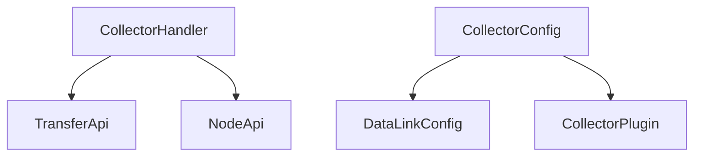

# 数据采集

<cite>
**本文档引用的文件**   
- [base.py](file://bklog/apps/log_databus/handlers/collector/base.py)
- [host.py](file://bklog/apps/log_databus/handlers/collector/host.py)
- [k8s.py](file://bklog/apps/log_databus/handlers/collector/k8s.py)
- [models.py](file://bklog/apps/log_databus/models.py)
- [base.py](file://bklog/apps/log_databus/handlers/collector_plugin/base.py)
- [collector.py](file://bklog/apps/log_databus/tasks/collector.py)
</cite>

## 目录
1. [引言](#引言)
2. [项目结构](#项目结构)
3. [核心组件](#核心组件)
4. [架构概述](#架构概述)
5. [详细组件分析](#详细组件分析)
6. [依赖分析](#依赖分析)
7. [性能考虑](#性能考虑)
8. [故障排除指南](#故障排除指南)
9. [结论](#结论)

## 引言
本文档详细描述了日志采集的实现机制，重点分析了Host采集和K8s采集两种模式的实现差异。文档涵盖了collector_handler.py中采集配置的处理流程，包括采集路径、过滤规则和采集策略的配置。同时，文档还展示了采集器插件机制，说明了如何通过collector_plugin扩展支持新的采集源，并提供了实际代码示例，如host.py中主机日志采集的实现逻辑，k8s.py中容器日志采集的处理流程。此外，文档还说明了采集配置的数据模型定义，包括CollectorConfig和CollectorPlugin模型的关系，描述了采集任务的生命周期管理，从创建、启动到停止的完整过程，并提供了常见问题排查指南。

## 项目结构
项目结构清晰地展示了日志采集相关的模块和文件。主要的采集处理逻辑位于`bklog/apps/log_databus/handlers/collector/`目录下，包括`base.py`、`host.py`和`k8s.py`等文件。这些文件分别处理基础采集、主机采集和K8s采集的逻辑。此外，`models.py`文件定义了采集配置和插件的数据模型，`base.py`文件则定义了采集插件的基础处理逻辑。

**图源**
- [base.py](file://bklog/apps/log_databus/handlers/collector/base.py)
- [host.py](file://bklog/apps/log_databus/handlers/collector/host.py)
- [k8s.py](file://bklog/apps/log_databus/handlers/collector/k8s.py)
- [models.py](file://bklog/apps/log_databus/models.py)
- [base.py](file://bklog/apps/log_databus/handlers/collector_plugin/base.py)

**节源**
- [base.py](file://bklog/apps/log_databus/handlers/collector/base.py)
- [host.py](file://bklog/apps/log_databus/handlers/collector/host.py)
- [k8s.py](file://bklog/apps/log_databus/handlers/collector/k8s.py)
- [models.py](file://bklog/apps/log_databus/models.py)
- [base.py](file://bklog/apps/log_databus/handlers/collector_plugin/base.py)

## 核心组件
核心组件包括采集配置处理、采集插件机制和采集任务生命周期管理。`CollectorHandler`类是采集处理的核心，负责处理采集配置的创建、更新、启动和停止。`HostCollectorHandler`和`K8sCollectorHandler`类分别继承自`CollectorHandler`，处理主机和K8s环境下的采集逻辑。`CollectorPluginHandler`类则负责处理采集插件的创建和更新。

**节源**
- [base.py](file://bklog/apps/log_databus/handlers/collector/base.py)
- [host.py](file://bklog/apps/log_databus/handlers/collector/host.py)
- [k8s.py](file://bklog/apps/log_databus/handlers/collector/k8s.py)
- [base.py](file://bklog/apps/log_databus/handlers/collector_plugin/base.py)

## 架构概述
系统架构分为三层：采集层、处理层和存储层。采集层负责从主机或K8s环境中采集日志，处理层负责对采集到的日志进行清洗和转换，存储层负责将处理后的日志存储到ES集群中。`CollectorHandler`类作为处理层的核心，协调采集和存储层的工作。

**图源**
- [base.py](file://bklog/apps/log_databus/handlers/collector/base.py)
- [host.py](file://bklog/apps/log_databus/handlers/collector/host.py)
- [k8s.py](file://bklog/apps/log_databus/handlers/collector/k8s.py)

**节源**
- [base.py](file://bklog/apps/log_databus/handlers/collector/base.py)
- [host.py](file://bklog/apps/log_databus/handlers/collector/host.py)
- [k8s.py](file://bklog/apps/log_databus/handlers/collector/k8s.py)

## 详细组件分析
### Host采集分析
`HostCollectorHandler`类处理主机环境下的日志采集。它通过`_pre_start`和`_pre_stop`方法在启动和停止采集任务时进行预处理。`update_or_create`方法负责创建或更新采集配置，`diff_target_nodes`方法用于比较采集目标节点的变化。

#### 类图

**图源**
- [host.py](file://bklog/apps/log_databus/handlers/collector/host.py)

**节源**
- [host.py](file://bklog/apps/log_databus/handlers/collector/host.py)

### K8s采集分析
`K8sCollectorHandler`类处理K8s环境下的日志采集。它通过`_pre_start`和`_pre_stop`方法在启动和停止采集任务时进行预处理。`update_or_create`方法负责创建或更新采集配置，`get_task_status`方法用于获取采集任务的状态。

#### 类图

**图源**
- [k8s.py](file://bklog/apps/log_databus/handlers/collector/k8s.py)

**节源**
- [k8s.py](file://bklog/apps/log_databus/handlers/collector/k8s.py)

### 采集插件机制分析
`CollectorPluginHandler`类负责处理采集插件的创建和更新。`_update_or_create`方法负责创建或更新采集插件，`build_instance_params`方法用于构造插件实例的参数。

#### 类图

**图源**
- [base.py](file://bklog/apps/log_databus/handlers/collector_plugin/base.py)

**节源**
- [base.py](file://bklog/apps/log_databus/handlers/collector_plugin/base.py)

## 依赖分析
采集组件依赖于`TransferApi`和`NodeApi`等API模块，用于与外部系统进行交互。`CollectorConfig`模型依赖于`DataLinkConfig`和`CollectorPlugin`模型，用于存储采集配置和插件的相关信息。

**图源**
- [base.py](file://bklog/apps/log_databus/handlers/collector/base.py)
- [models.py](file://bklog/apps/log_databus/models.py)

**节源**
- [base.py](file://bklog/apps/log_databus/handlers/collector/base.py)
- [models.py](file://bklog/apps/log_databus/models.py)

## 性能考虑
采集任务的性能主要受采集路径、过滤规则和采集策略的影响。合理的采集路径和过滤规则可以减少不必要的日志采集，提高采集效率。采集策略的配置也会影响采集任务的性能，如采集频率和采集量的设置。

## 故障排除指南
### 采集器无法启动
1. 检查采集配置是否正确。
2. 检查采集目标节点是否可达。
3. 检查采集插件是否正确安装。

### 日志采集不完整
1. 检查采集路径是否正确。
2. 检查过滤规则是否过于严格。
3. 检查采集策略是否合理。

**节源**
- [base.py](file://bklog/apps/log_databus/handlers/collector/base.py)
- [host.py](file://bklog/apps/log_databus/handlers/collector/host.py)
- [k8s.py](file://bklog/apps/log_databus/handlers/collector/k8s.py)

## 结论
本文档详细描述了日志采集的实现机制，分析了Host采集和K8s采集两种模式的实现差异，展示了采集器插件机制，并提供了实际代码示例。通过本文档，用户可以更好地理解和使用日志采集功能，解决常见的采集问题。