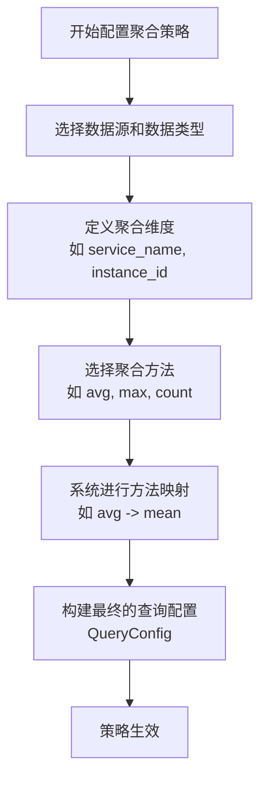
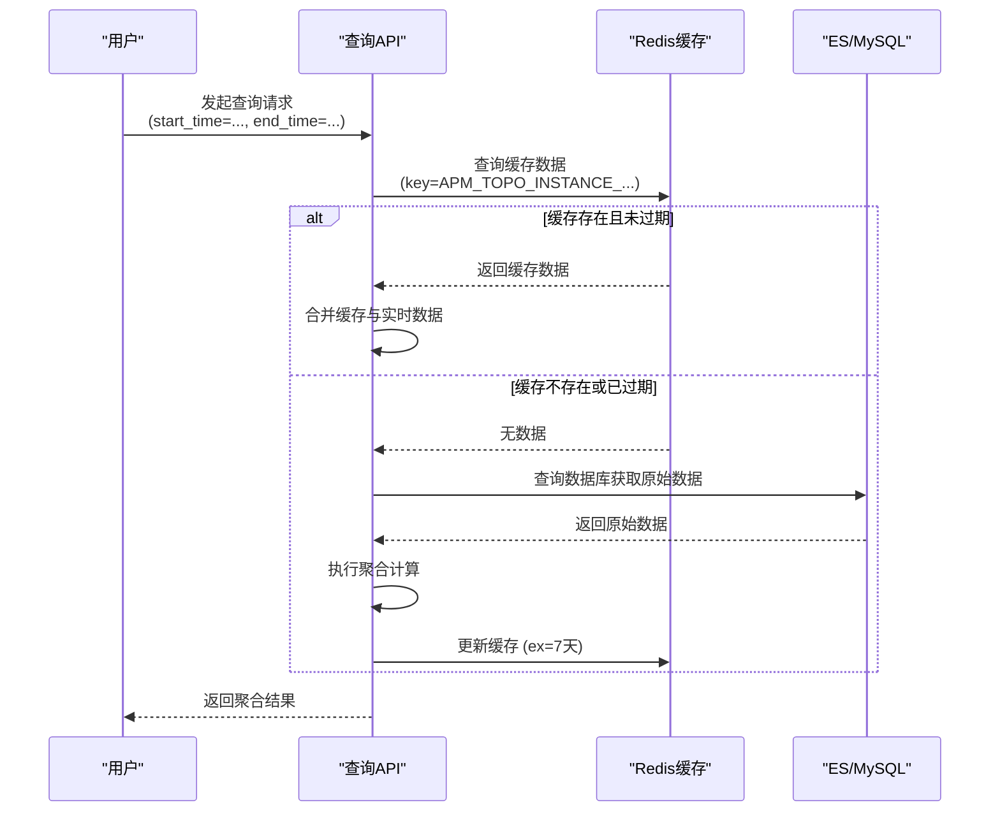
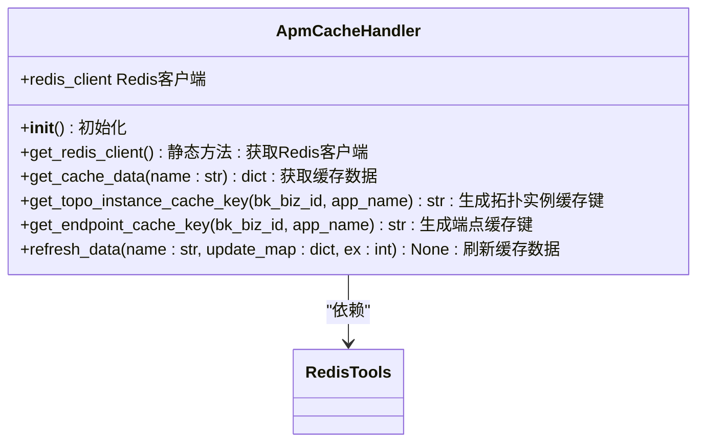
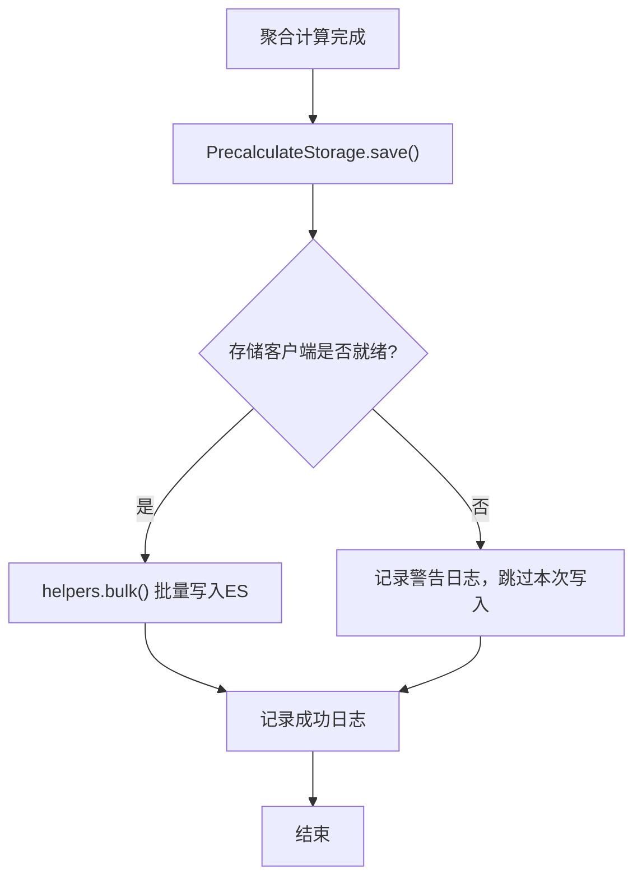

# 指标聚合

<cite>
**本文档引用的文件**   
- [apm_cache_handler.py](file://bkmonitor/apm/core/handlers/apm_cache_handler.py)
- [constants.py](file://bkmonitor/apm/constants.py)
- [storage.py](file://bkmonitor/apm/core/discover/precalculation/storage.py)
- [statistics_query.py](file://bkmonitor/apm/core/handlers/query/statistics_query.py)
- [instance.py](file://bkmonitor/apm/core/discover/instance.py)
- [endpoint.py](file://bkmonitor/apm/core/discover/endpoint.py)
- [resources.py](file://bkmonitor/apm/resources.py)
</cite>

## 目录
1. [引言](#引言)
2. [聚合策略配置](#聚合策略配置)
3. [支持的聚合函数](#支持的聚合函数)
4. [时间窗口设置](#时间窗口设置)
5. [缓存与聚合逻辑](#缓存与聚合逻辑)
6. [聚合结果存储策略](#聚合结果存储策略)
7. [查询优化方法](#查询优化方法)
8. [精度损失问题及解决方案](#精度损失问题及解决方案)
9. [最佳实践](#最佳实践)

## 引言
本文档深入解析bk-monitor系统的指标聚合功能，重点阐述监控指标的聚合处理机制。文档详细说明了聚合策略的配置方式、支持的聚合函数（如sum、avg、max、min等）和时间窗口设置。通过分析`apm_cache_handler.py`中实现的缓存与聚合逻辑，解释系统如何高效处理大规模指标数据。同时，文档阐述了聚合结果的存储策略和查询优化方法，并提供聚合配置的最佳实践，最后说明聚合过程中可能遇到的精度损失问题及其解决方案。

## 聚合策略配置

指标聚合策略的配置主要通过定义查询配置（QueryConfig）来实现，其中包含了数据源、聚合维度和聚合方法等关键信息。配置的核心是将原始的监控数据通过特定的规则进行分组和计算。

在系统中，聚合配置通常包含以下关键要素：
- **数据源标签 (data_source_label)**: 标识数据来源，例如 `BK_MONITOR_COLLECTOR`。
- **数据类型标签 (data_type_label)**: 标识数据类型，例如 `TIME_SERIES` 表示时序数据。
- **聚合维度 (agg_dimension)**: 定义了进行分组统计的维度字段，例如按服务名、实例ID等进行分组。
- **聚合方法 (method)**: 指定具体的聚合函数，如平均值、最大值等。

配置过程通常涉及将用户选择的聚合方法映射到系统内部定义的标准方法。例如，在 `data_source/__init__.py` 文件中，可以看到将用户输入的 `avg` 映射为内部的 `mean` 方法，并处理分位数等特殊聚合逻辑。



**图示来源**
- [data_source/__init__.py](file://bkmonitor/bkmonitor/data_source/data_source/__init__.py#L1177-L1205)

## 支持的聚合函数

系统通过枚举类 `AggregatedMethod` 定义了所有支持的聚合函数。这些函数是指标聚合的核心计算逻辑，允许用户对监控数据进行各种统计分析。

根据 `apm/constants.py` 文件中的定义，支持的聚合函数包括：

```python
class AggregatedMethod(Enum):
    """
    聚合方法枚举
    """
    AVG = "avg"
    MAX = "max"
    MIN = "min"
    COUNT = "count"
    DISTINCT = "distinct"
    CP50 = "cp50"
```

| 聚合函数 | 描述 |
| :--- | :--- |
| **AVG** | 计算指定维度下指标的平均值。适用于分析系统性能的平均水平，如平均响应时间。 |
| **MAX** | 计算指定维度下指标的最大值。用于发现性能瓶颈或异常峰值，如最高CPU使用率。 |
| **MIN** | 计算指定维度下指标的最小值。用于了解系统在最佳状态下的表现。 |
| **COUNT** | 统计指定维度下数据点的数量。常用于计算事件发生次数，如错误请求数量。 |
| **DISTINCT** | 统计指定维度下不同值的数量。用于计算唯一用户数、唯一IP地址等去重指标。 |
| **CP50** | 计算第50百分位数（中位数）。对异常值不敏感，能更好地反映数据的中心趋势。 |

这些聚合函数为用户提供了丰富的数据分析能力，可以根据不同的监控需求选择合适的函数。

**图示来源**
- [constants.py](file://bkmonitor/apm/constants.py#L646-L656)

## 时间窗口设置

时间窗口是指标聚合中的关键参数，它定义了数据聚合的时间范围。合理设置时间窗口对于获得准确的监控结果至关重要。

系统中的时间窗口设置主要通过两个层面进行：

1.  **缓存过期时间 (Cache Expiration)**: 这是针对缓存数据的生命周期设置。在 `apm/constants.py` 中定义了默认的缓存过期时间：
    ```python
    DEFAULT_APM_CACHE_EXPIRE = 7 * 24 * 60 * 60  # 7天（以秒为单位）
    DEFAULT_TOPO_INSTANCE_EXPIRE = 7 * 24 * 60 * 60
    DEFAULT_ENDPOINT_EXPIRE = 7 * 24 * 60 * 60
    ```
    这意味着缓存的数据在7天后会自动失效，系统会重新从数据源获取最新数据。

2.  **查询时间范围 (Query Time Range)**: 这是用户在查询时指定的时间段。例如，在 `unify_query/default.py` 中，查询API支持通过 `start_time` 和 `end_time` 参数来定义查询窗口。此外，还支持通过 `step` 参数定义聚合的粒度（如 `1m` 表示每分钟聚合一次）。



**图示来源**
- [constants.py](file://bkmonitor/apm/constants.py#L571)
- [default.py](file://bkmonitor/api/unify_query/default.py#L243-L264)

## 缓存与聚合逻辑

`ApmCacheHandler` 类是实现缓存与聚合逻辑的核心组件，它利用Redis作为缓存层，极大地提升了大规模指标数据的处理效率。

### 核心组件分析

`ApmCacheHandler` 类的主要功能和方法如下：



**图示来源**
- [apm_cache_handler.py](file://bkmonitor/apm/core/handlers/apm_cache_handler.py#L14-L52)

### 工作流程

1.  **初始化**: `__init__` 方法调用静态方法 `get_redis_client` 来获取一个Redis客户端实例，用于后续的所有缓存操作。
2.  **获取缓存**: `get_cache_data` 方法根据传入的名称（name）从Redis中获取JSON格式的缓存数据，并将其反序列化为Python字典返回。如果缓存不存在，则返回空字典。
3.  **生成缓存键**: `get_topo_instance_cache_key` 和 `get_endpoint_cache_key` 方法根据业务ID（bk_biz_id）、应用名（app_name）以及平台和环境信息，按照预定义的格式（如 `BKMONITOR_{}_{}_APM_TOPO_INSTANCE_HEARTBEAT_{}_{} `）生成唯一的Redis缓存键。
4.  **刷新缓存**: `refresh_data` 方法将更新后的数据字典（update_map）序列化为JSON字符串，并使用 `set` 命令写入Redis，同时设置过期时间（ex）。这是聚合结果写入缓存的关键步骤。

### 与发现逻辑的集成

`ApmCacheHandler` 并非独立工作，而是与拓扑发现（`instance.py`）和端点发现（`endpoint.py`）等模块紧密集成。例如，在 `instance.py` 的 `refresh_cache_data` 方法中，会调用 `ApmCacheHandler().refresh_data()` 来更新拓扑实例的缓存。

```python
def refresh_cache_data(self, old_cache_data: dict, create_instance_keys: set, ...):
    # ... 更新缓存数据字典
    name = ApmCacheHandler.get_topo_instance_cache_key(self.bk_biz_id, self.app_name)
    ApmCacheHandler().refresh_data(name, cache_data, DEFAULT_TOPO_INSTANCE_EXPIRE) # 调用刷新
```

这种设计模式实现了数据处理与缓存的解耦，使得发现逻辑专注于数据的发现和清理，而缓存逻辑则专注于数据的高效存取。

**本节来源**
- [apm_cache_handler.py](file://bkmonitor/apm/core/handlers/apm_cache_handler.py)
- [instance.py](file://bkmonitor/apm/core/discover/instance.py#L248-L279)
- [endpoint.py](file://bkmonitor/apm/core/discover/endpoint.py#L129-L161)

## 聚合结果存储策略

聚合结果的存储采用了分层和预计算相结合的策略，以平衡查询性能和存储成本。

### 预计算存储 (PrecalculateStorage)

核心的存储策略由 `PrecalculateStorage` 类实现，它负责将聚合计算的结果持久化到Elasticsearch（ES）集群中。

#### 核心特性

- **哈希环 (Rendezvous Hash)**: 使用 `RendezvousHash` 算法根据业务ID和应用名来选择存储节点，确保数据分布的均匀性和一致性。
- **分表存储**: 为了应对海量数据，系统支持将数据分散到多个结果表（Result Table）中，通过 `DEFAULT_STORAGE_DISPERSED_COUNT` 参数控制分表数量。
- **索引别名**: 使用 `get_index_write_alias` 方法动态生成写入索引的别名（如 `write_20231010_apm_global.precalculate_storage_auto_1`），便于实现按天滚动索引，简化数据管理和查询。

#### 存储流程



**图示来源**
- [storage.py](file://bkmonitor/apm/core/discover/precalculation/storage.py#L64-L431)

### 缓存层

除了持久化存储，系统还利用Redis作为高速缓存层，存储高频访问的聚合结果或中间状态（如拓扑实例的更新时间戳）。这避免了对数据库的频繁查询，显著提升了响应速度。

## 查询优化方法

为了优化聚合查询的性能，系统采用了多种技术手段：

### 1. 缓存机制
如前所述，利用Redis缓存查询结果和中间数据，是最重要的查询优化手段。对于短时间内重复的查询，可以直接从缓存返回结果，避免了昂贵的计算和数据库查询。

### 2. 并行查询
在 `resources.py` 中，可以看到使用 `InheritParentThread` 多线程技术来并行执行多个聚合查询。例如，在查询多个字段的去重数和TopK值时，系统会为每个字段创建一个线程并行执行，最后合并结果，大大缩短了总查询时间。

```python
# 伪代码示例
to_be_executed_threads = []
for field in fields:
    thread = InheritParentThread(target=query_aggregated_value, args=(..., field, ...))
    to_be_executed_threads.append(thread)
run_threads(to_be_executed_threads) # 并行执行
```

### 3. 预计算 (Precalculation)
通过 `PrecalculateStorage` 将复杂的、耗时的聚合计算提前完成并存储起来。当用户查询时，直接读取预计算好的结果，而不是实时计算，从而实现了亚秒级的查询响应。

### 4. 数据分片与索引优化
在ES存储配置中，通过设置 `slice_size`、`number_of_shards` 等参数对数据进行分片，并配置了优化的 `mapping_settings` 和 `index_settings`，确保了大数据量下的高效索引和查询性能。

**本节来源**
- [resources.py](file://bkmonitor/apm/resources.py#L1956-L1992)
- [storage.py](file://bkmonitor/apm/core/discover/precalculation/storage.py)

## 精度损失问题及解决方案

在大规模数据处理和浮点数计算中，精度损失是一个需要关注的问题。

### 问题分析

1.  **浮点数运算误差**: 在进行 `avg`、`sum` 等涉及浮点数的聚合运算时，由于计算机浮点数表示的固有局限性，可能会产生微小的舍入误差。
2.  **大数据量溢出**: 如 `fta-db-overflow.md` 文档所述，当数据量极大时，自增ID等字段可能会超过 `int` 类型的上限（21亿），导致数据溢出。

### 解决方案

1.  **浮点数精度处理**: 系统在展示百分比等数据时，会进行精度控制。例如，在 `common_utils.py` 中，有专门的函数处理百分比的显示，当数值极小时会采用科学计数法或截断处理，避免显示 `0.000...1` 这样的失真数据。
    ```python
    # 伪代码：避免超精度四舍五入导致的进位失真
    if rounded_percent - percent < (10 ** -(precision + 1)) * 5:
        # 采用截断而非四舍五入
        return math.trunc(percent * factor) / factor
    ```
2.  **数据类型升级**: 针对ID溢出问题，解决方案是将相关字段的数据类型从 `int` 升级为 `bigint`。如 `fta-db-overflow.md` 中所述，通过新建表、修改字段类型来解决此问题。
3.  **使用高精度计算**: 对于对精度要求极高的场景，可以考虑使用更高精度的数据类型或专门的数学库进行计算。

**本节来源**
- [fta-db-overflow.md](file://bkmonitor/docs/troubleshoot/fta-db-overflow.md)
- [common_utils.py](file://bkmonitor/bkmonitor/utils/common_utils.py#L852-L865)

## 最佳实践

为了高效、准确地使用指标聚合功能，建议遵循以下最佳实践：

1.  **合理选择聚合函数**: 根据监控目标选择合适的函数。例如，分析延迟应使用 `AVG` 或 `CP50`，而发现异常峰值应使用 `MAX`。
2.  **优化时间窗口**: 避免设置过长的查询时间窗口，这会导致查询性能急剧下降。建议结合业务需求，使用合理的窗口（如最近1小时、24小时）。
3.  **谨慎使用高基数维度**: 在 `agg_dimension` 中加入基数（Cardinality）过高的维度（如用户ID）会导致聚合结果数据量爆炸，严重影响性能。应尽量使用低基数的维度（如服务名、环境）。
4.  **善用预计算**: 对于需要频繁查询的复杂聚合，应配置预计算任务，将结果提前存储，以保证查询的实时性。
5.  **监控缓存命中率**: 定期检查Redis缓存的命中率，如果命中率过低，可能需要调整缓存策略或增加缓存容量。
6.  **定期清理过期数据**: 配置合理的数据保留策略（retention），及时清理过期的监控数据，以控制存储成本。

遵循这些实践，可以最大化地发挥bk-monitor系统指标聚合功能的优势，为业务监控提供强有力的支持。