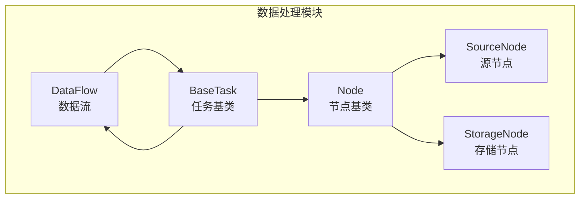
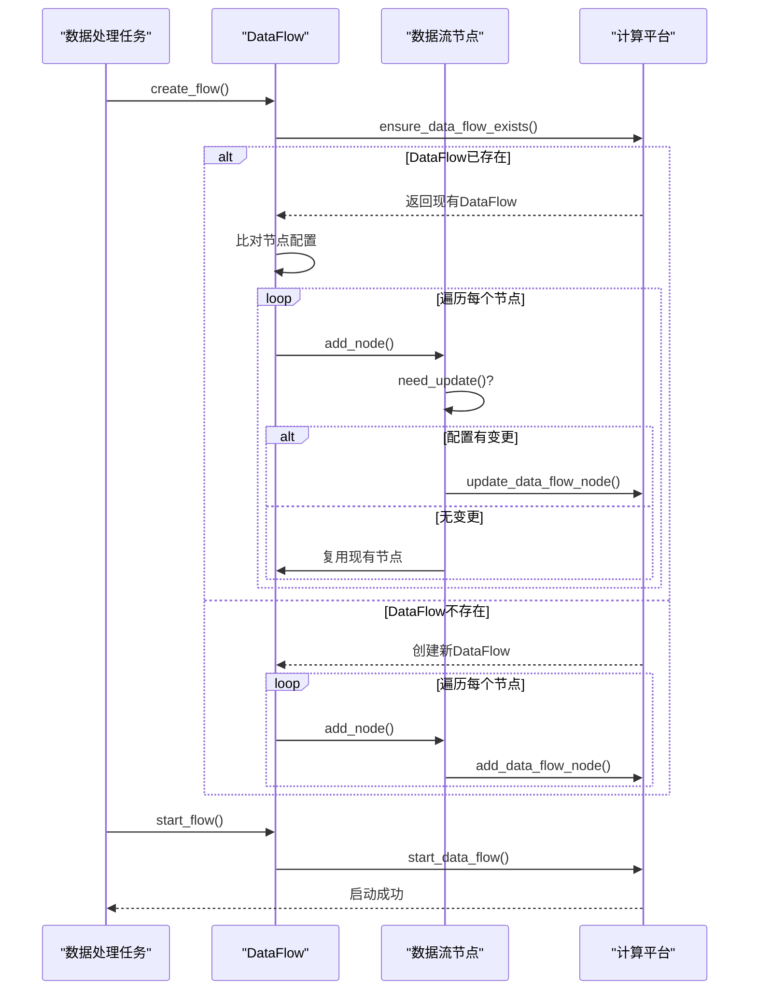
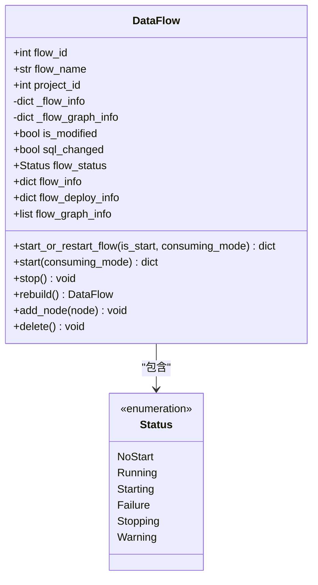
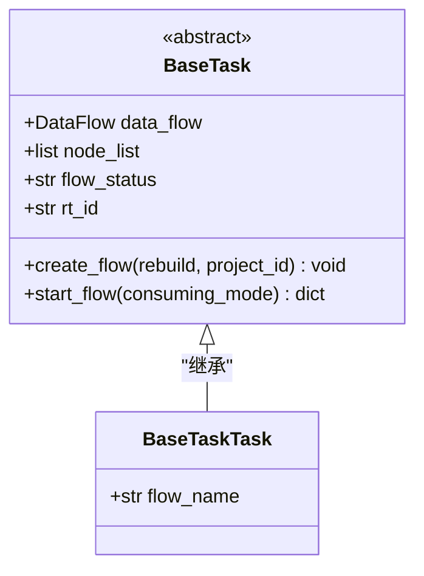
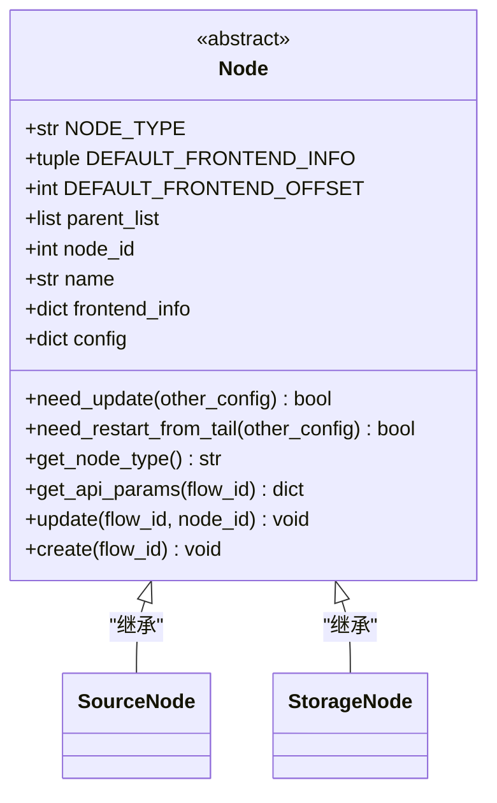
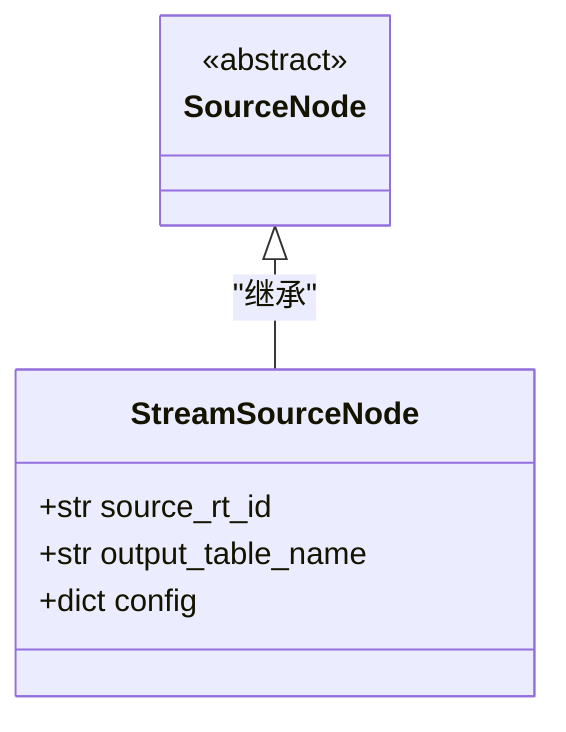
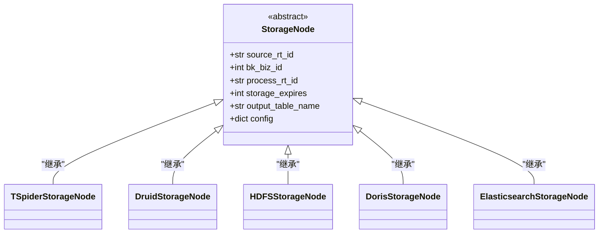
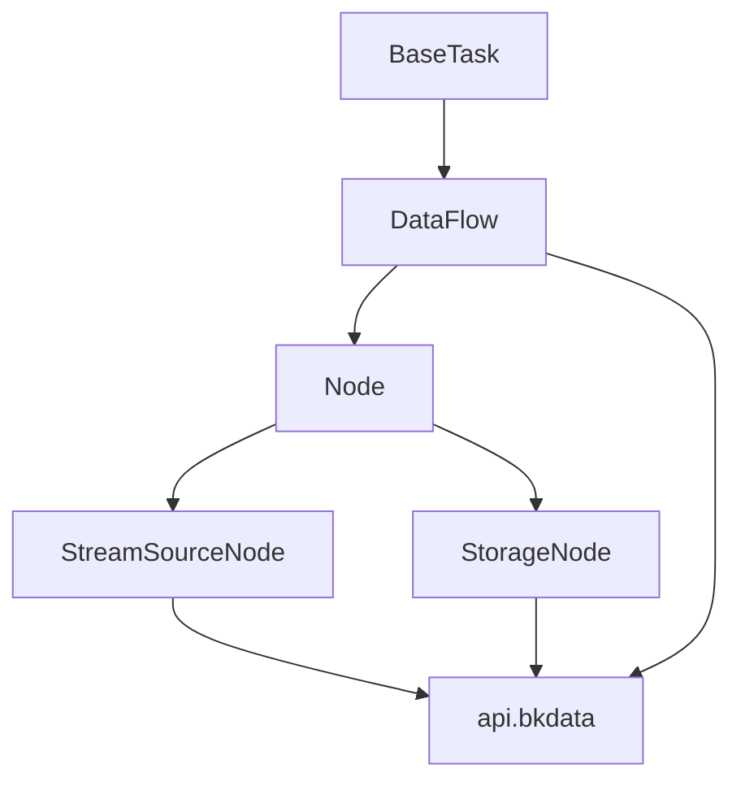

# 数据处理

<cite>
**本文档引用的文件**
- [flow.py](file://bkmonitor/bkmonitor/dataflow/flow.py)
- [base.py](file://bkmonitor/bkmonitor/dataflow/task/base.py)
- [source.py](file://bkmonitor/bkmonitor/dataflow/node/source.py)
- [storage.py](file://bkmonitor/bkmonitor/dataflow/node/storage.py)
- [base.py](file://bkmonitor/bkmonitor/dataflow/node/base.py)
- [default.py](file://bkmonitor/api/bkdata/default.py)
</cite>

## 目录
1. [简介](#简介)
2. [项目结构](#项目结构)
3. [核心组件](#核心组件)
4. [架构概览](#架构概览)
5. [详细组件分析](#详细组件分析)
6. [依赖分析](#依赖分析)
7. [性能考量](#性能考量)
8. [故障排除指南](#故障排除指南)
9. [结论](#结论)

## 简介
本文档旨在全面阐述bk-monitor系统的数据处理流程。文档详细说明了监控数据在系统内部的处理机制，包括数据清洗、格式转换、指标聚合、降采样等处理步骤的实现方式。同时，文档解释了实时处理和批处理两种模式的架构设计和适用场景，分析了数据处理链路中的性能瓶颈和优化策略，并提供了数据处理任务的监控指标和告警配置建议，以确保数据处理的可靠性和及时性。

## 项目结构
bk-monitor系统的数据处理功能主要集中在`bkmonitor/dataflow`模块中。该模块通过与计算平台（BKData）的API交互，编排和管理数据处理链路。数据处理链路由`DataFlow`对象表示，它由一系列`Node`节点构成，形成一个有向无环图（DAG）。处理链路的起点是`SourceNode`，负责从原始数据表接入数据；中间是各种处理节点，负责执行数据转换逻辑；终点是`StorageNode`，负责将处理后的数据写入不同的后端存储。

**图源**
- [flow.py](file://bkmonitor/bkmonitor/dataflow/flow.py)
- [base.py](file://bkmonitor/bkmonitor/dataflow/task/base.py)
- [base.py](file://bkmonitor/bkmonitor/dataflow/node/base.py)

**节源**
- [flow.py](file://bkmonitor/bkmonitor/dataflow/flow.py)
- [base.py](file://bkmonitor/bkmonitor/dataflow/task/base.py)

## 核心组件
数据处理的核心组件包括`DataFlow`、`BaseTask`、`Node`及其子类。`DataFlow`类封装了对计算平台DataFlow的增删改查操作，是整个数据处理链路的编排和管理核心。`BaseTask`是所有具体数据处理任务（如降采样、批处理）的基类，它定义了创建和启动数据流的标准流程。`Node`是所有数据流节点的抽象基类，定义了节点的通用行为和接口，其子类如`StreamSourceNode`和`ElasticsearchStorageNode`则实现了特定功能。

**节源**
- [flow.py](file://bkmonitor/bkmonitor/dataflow/flow.py#L34-L74)
- [base.py](file://bkmonitor/bkmonitor/dataflow/task/base.py#L0-L37)
- [base.py](file://bkmonitor/bkmonitor/dataflow/node/base.py#L0-L37)

## 架构概览
bk-monitor系统的数据处理采用基于计算平台的流批一体架构。系统通过`BaseTask`派生出的具体任务类来定义数据处理逻辑。当任务被触发时，系统会检查或创建一个名为`flow_name`的`DataFlow`。该`DataFlow`由一系列`Node`节点构成，这些节点按顺序执行，形成一个完整的数据处理管道。数据从`StreamSourceNode`节点进入，经过中间处理节点（如聚合、转换），最终由`StorageNode`节点写入目标存储。整个流程通过调用计算平台的API来实现，确保了处理的可靠性和可扩展性。

**图源**
- [flow.py](file://bkmonitor/bkmonitor/dataflow/flow.py#L107-L143)
- [base.py](file://bkmonitor/bkmonitor/dataflow/task/base.py#L33-L63)
- [default.py](file://bkmonitor/api/bkdata/default.py#L689-L735)

**节源**
- [flow.py](file://bkmonitor/bkmonitor/dataflow/flow.py#L107-L143)
- [base.py](file://bkmonitor/bkmonitor/dataflow/task/base.py#L33-L63)

## 详细组件分析
### DataFlow分析
`DataFlow`类是数据处理链路的容器和控制器。它通过`flow_id`与计算平台中的一个具体DataFlow实例关联。该类提供了丰富的属性和方法来管理DataFlow的生命周期。

**图源**
- [flow.py](file://bkmonitor/bkmonitor/dataflow/flow.py#L34-L74)

**节源**
- [flow.py](file://bkmonitor/bkmonitor/dataflow/flow.py#L34-L74)

### BaseTask分析
`BaseTask`是所有数据处理任务的基类，它定义了创建和启动数据流的标准化流程。通过继承`BaseTask`，可以轻松创建新的数据处理任务。

**图源**
- [base.py](file://bkmonitor/bkmonitor/dataflow/task/base.py#L0-L37)

**节源**
- [base.py](file://bkmonitor/bkmonitor/dataflow/task/base.py#L0-L37)

### 节点基类分析
`Node`类是所有数据流节点的抽象基类，它定义了节点的通用行为和接口。所有具体的节点类型都继承自`Node`。

**图源**
- [base.py](file://bkmonitor/bkmonitor/dataflow/node/base.py#L0-L37)

**节源**
- [base.py](file://bkmonitor/bkmonitor/dataflow/node/base.py#L0-L37)

### 数据源节点分析
`StreamSourceNode`是数据处理链路的起点，负责从指定的结果表（Result Table）接入原始数据。

**图源**
- [source.py](file://bkmonitor/bkmonitor/dataflow/node/source.py#L0-L37)

**节源**
- [source.py](file://bkmonitor/bkmonitor/dataflow/node/source.py#L0-L37)

### 数据存储节点分析
`StorageNode`及其子类是数据处理链路的终点，负责将处理后的数据写入不同的后端存储系统。

**图源**
- [storage.py](file://bkmonitor/bkmonitor/dataflow/node/storage.py#L0-L37)

**节源**
- [storage.py](file://bkmonitor/bkmonitor/dataflow/node/storage.py#L0-L37)

## 依赖分析
数据处理模块的依赖关系清晰，形成了一个分层架构。`BaseTask`依赖`DataFlow`来管理数据流，`DataFlow`依赖`Node`来构建处理链路。`Node`的子类（如`StreamSourceNode`和`StorageNode`）则依赖具体的配置和计算平台的API来实现功能。这种设计使得系统具有良好的模块化和可扩展性。

**图源**
- [base.py](file://bkmonitor/bkmonitor/dataflow/task/base.py)
- [flow.py](file://bkmonitor/bkmonitor/dataflow/flow.py)
- [base.py](file://bkmonitor/bkmonitor/dataflow/node/base.py)

**节源**
- [base.py](file://bkmonitor/bkmonitor/dataflow/task/base.py)
- [flow.py](file://bkmonitor/bkmonitor/dataflow/flow.py)

## 性能考量
在数据处理链路中，性能瓶颈可能出现在多个环节。首先，`DataFlow`的启动和部署过程可能耗时较长，尤其是在节点数量多或配置复杂时。其次，`Node`的`need_update`和`need_restart_from_tail`方法的比较逻辑如果过于复杂，也可能影响`create_flow`的效率。此外，与计算平台API的网络延迟和调用频率也是需要关注的性能因素。优化策略包括：缓存`DataFlow`和`Node`的元信息以减少API调用，优化节点配置的比较算法，以及合理设置`consuming_mode`以避免不必要的全量数据重处理。

## 故障排除指南
当数据处理任务出现问题时，应首先检查`DataFlow`的状态。通过`DataFlow.flow_status`和`DataFlow.flow_deploy_info`可以获取其运行状态和最近的部署信息。如果状态为`Failure`，则需要查看计算平台的日志以定位具体错误。其次，应检查`DataFlow`是否因配置变更而被标记为`is_modified`，这可能导致任务需要重启。最后，确保`Node`的配置（如`source_rt_id`、`cluster`等）正确无误，并且目标存储系统（如ES、MySQL）处于可用状态。

**节源**
- [flow.py](file://bkmonitor/bkmonitor/dataflow/flow.py#L34-L74)
- [flow.py](file://bkmonitor/bkmonitor/dataflow/flow.py#L167-L190)

## 结论
bk-monitor系统的数据处理机制通过`DataFlow`和`Node`的抽象，实现了对计算平台数据处理能力的高效封装。该设计使得数据处理逻辑的定义、部署和管理变得标准化和自动化。通过继承`BaseTask`和`Node`，可以灵活地构建各种数据处理任务，满足实时处理和批处理的不同需求。未来的工作可以集中在优化任务创建和启动的性能，以及增强对处理链路的监控和告警能力。