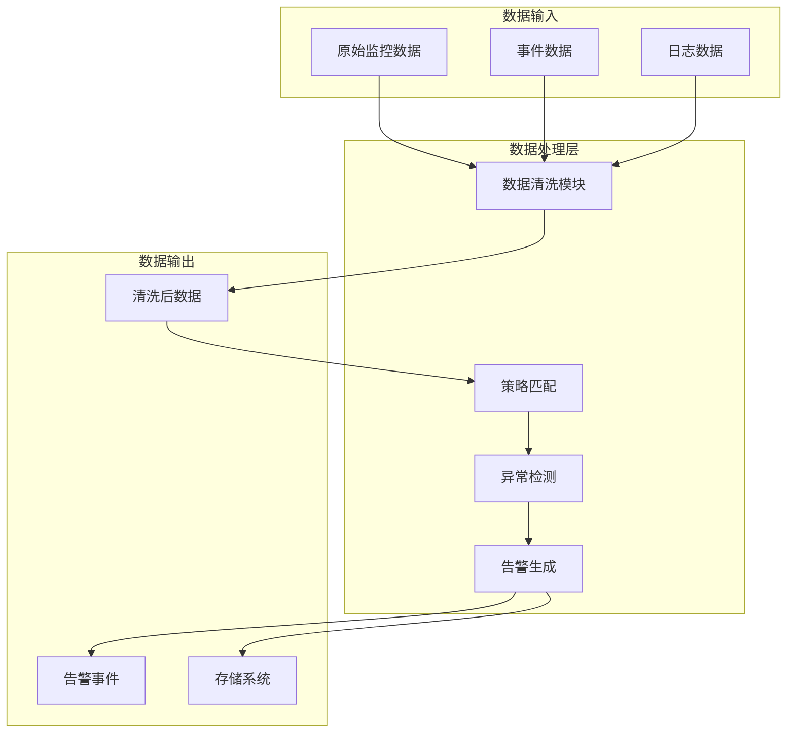
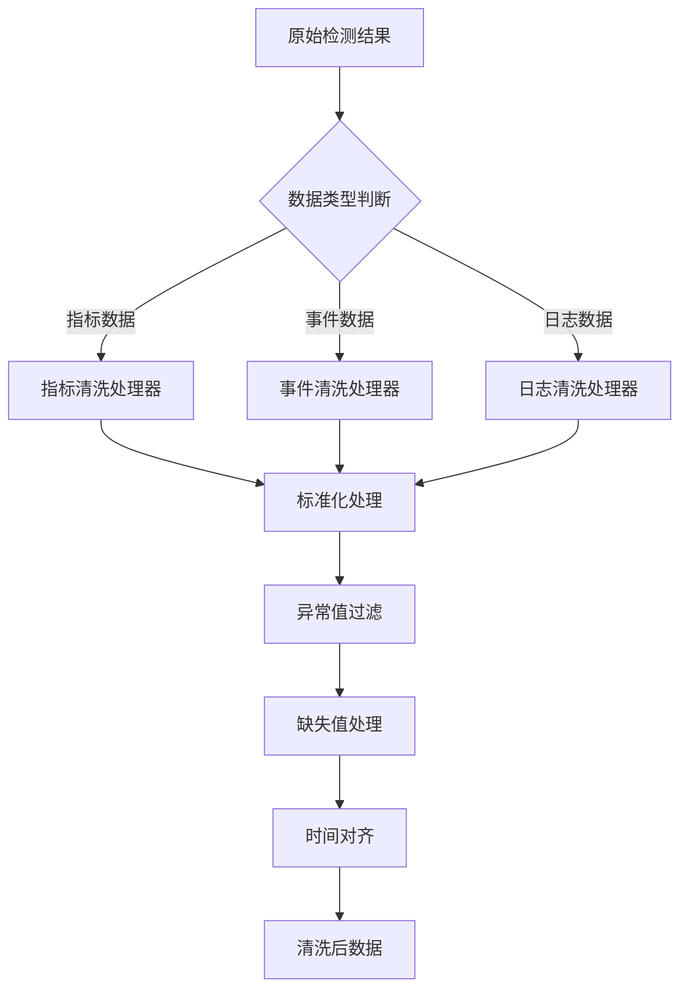
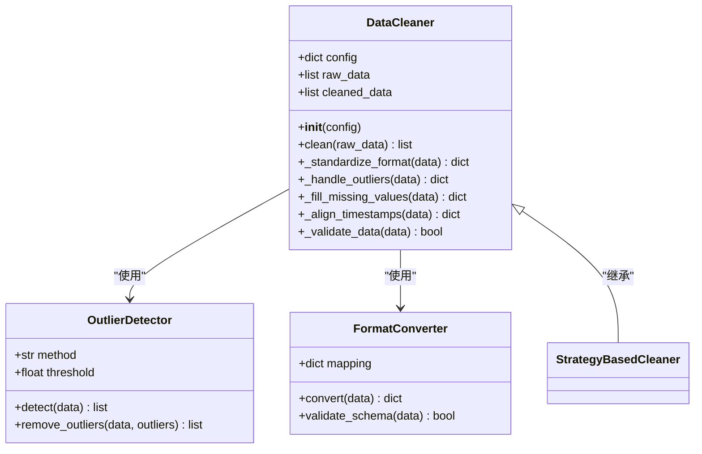
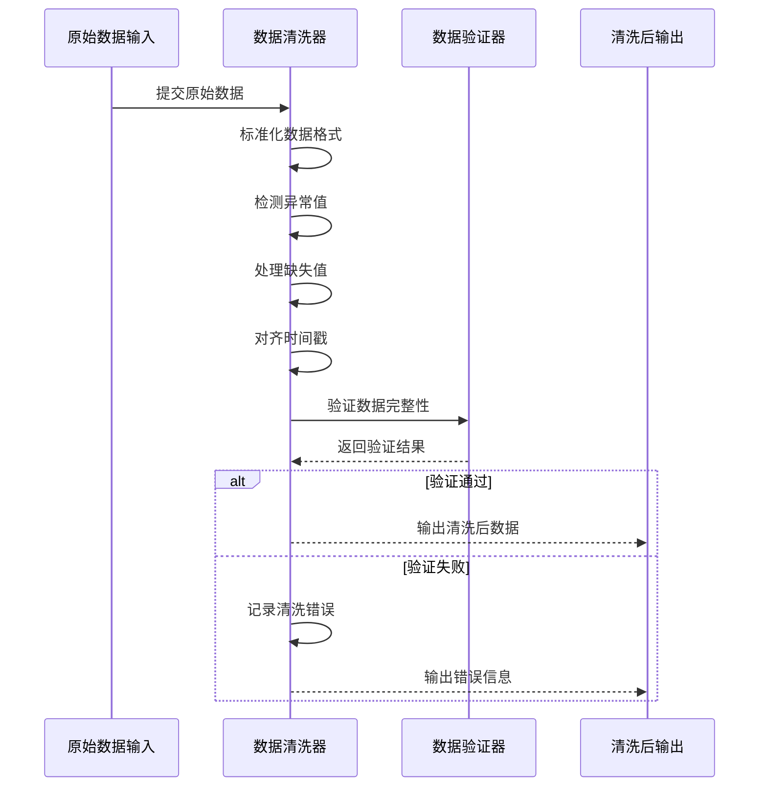
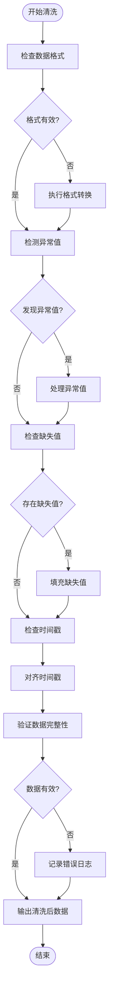
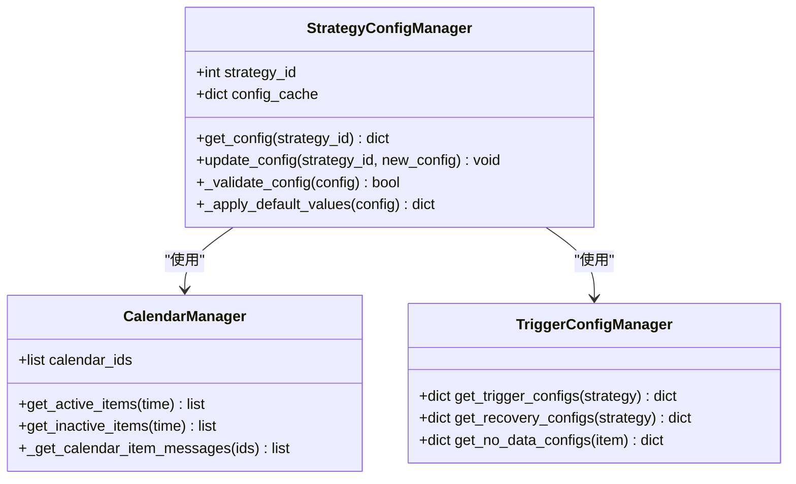
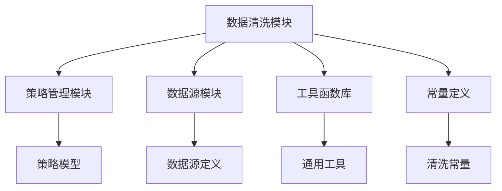

# 数据清洗

<cite>
**本文档引用文件**  
- [clean.py](file://bkmonitor/alarm_backends/core/detect_result/clean.py)
- [strategy.py](file://bkmonitor/alarm_backends/core/control/strategy.py)
- [constants.py](file://bkmonitor/alarm_backends/constants.py)
- [utils.py](file://bkmonitor/utils/common_utils.py)
- [data_source.py](file://bkmonitor/data_source/models.py)
- [models.py](file://bkmonitor/models/strategy.py)
</cite>

## 目录
1. [引言](#引言)
2. [项目结构](#项目结构)
3. [核心组件](#核心组件)
4. [架构概览](#架构概览)
5. [详细组件分析](#详细组件分析)
6. [依赖分析](#依赖分析)
7. [性能考量](#性能考量)
8. [故障排查指南](#故障排查指南)
9. [结论](#结论)

## 引言
数据清洗是bk-monitor系统中监控数据处理流程的关键环节。本系统接收来自多种数据源的原始监控数据，包括主机指标、应用性能指标、日志事件等。这些数据在进入告警检测和分析引擎之前，必须经过严格的清洗和标准化处理。数据清洗机制确保了后续处理环节的数据质量，提高了告警准确性和系统稳定性。本文档详细阐述了bk-monitor系统的数据清洗流程、处理规则、实现方式以及与其他数据处理环节的衔接。

## 项目结构
bk-monitor系统的数据清洗功能主要集中在`alarm_backends`模块中，特别是`core/detect_result`子模块。该模块负责处理检测结果的清洗、聚合和转换。数据清洗机制与策略管理、告警检测等核心功能紧密集成，通过统一的数据处理管道实现高效的数据流转。

**图示来源**  
- [clean.py](file://bkmonitor/alarm_backends/core/detect_result/clean.py)
- [strategy.py](file://bkmonitor/alarm_backends/core/control/strategy.py)

**本节来源**  
- [clean.py](file://bkmonitor/alarm_backends/core/detect_result/clean.py)
- [strategy.py](file://bkmonitor/alarm_backends/core/control/strategy.py)

## 核心组件
数据清洗机制的核心组件包括数据清洗器（Cleaner）、策略配置管理器和异常值处理器。这些组件协同工作，确保监控数据在进入检测引擎前达到一致的质量标准。清洗过程包括数据格式标准化、异常值处理、缺失值填充和时间戳对齐等关键步骤。

**本节来源**  
- [clean.py](file://bkmonitor/alarm_backends/core/detect_result/clean.py)
- [strategy.py](file://bkmonitor/alarm_backends/core/control/strategy.py)

## 架构概览
bk-monitor的数据清洗架构采用分层设计，将清洗逻辑与业务逻辑分离。清洗模块作为独立的处理单元，接收原始检测结果，执行标准化处理，并输出符合规范的清洗后数据。该架构支持灵活的配置和扩展，允许根据不同数据类型和业务需求定制清洗规则。

**图示来源**  
- [clean.py](file://bkmonitor/alarm_backends/core/detect_result/clean.py)
- [utils.py](file://bkmonitor/utils/common_utils.py)

## 详细组件分析

### 数据清洗器分析
数据清洗器是`clean.py`模块中的核心类，负责执行具体的清洗操作。它实现了多种清洗算法，包括基于统计的异常值检测、数据格式转换和缺失值插值等。清洗器通过配置参数控制清洗策略，支持动态调整。

#### 类结构分析

**图示来源**  
- [clean.py](file://bkmonitor/alarm_backends/core/detect_result/clean.py#L1-L100)

#### 清洗流程分析

**图示来源**  
- [clean.py](file://bkmonitor/alarm_backends/core/detect_result/clean.py#L50-L150)
- [utils.py](file://bkmonitor/utils/common_utils.py#L200-L250)

#### 核心算法分析

**图示来源**  
- [clean.py](file://bkmonitor/alarm_backends/core/detect_result/clean.py#L100-L300)

**本节来源**  
- [clean.py](file://bkmonitor/alarm_backends/core/detect_result/clean.py)
- [constants.py](file://bkmonitor/alarm_backends/constants.py)

### 策略配置分析
策略配置管理器负责获取和解析数据清洗所需的配置参数。这些配置定义了清洗规则、异常值阈值和缺失值处理策略等关键参数。

**图示来源**  
- [strategy.py](file://bkmonitor/alarm_backends/core/control/strategy.py#L200-L365)

**本节来源**  
- [strategy.py](file://bkmonitor/alarm_backends/core/control/strategy.py)

## 依赖分析
数据清洗模块依赖于多个核心组件，包括策略管理、数据源定义和工具函数库。这些依赖关系确保了清洗过程能够获取必要的配置信息和处理工具。

**图示来源**  
- [clean.py](file://bkmonitor/alarm_backends/core/detect_result/clean.py)
- [strategy.py](file://bkmonitor/alarm_backends/core/control/strategy.py)
- [models.py](file://bkmonitor/models/strategy.py)

**本节来源**  
- [clean.py](file://bkmonitor/alarm_backends/core/detect_result/clean.py)
- [strategy.py](file://bkmonitor/alarm_backends/core/control/strategy.py)

## 性能考量
数据清洗过程需要在保证数据质量的同时，尽量减少处理延迟。系统通过批量处理、缓存机制和并行计算等技术优化清洗性能。对于大规模数据流，采用流式处理方式，避免内存溢出。

**本节来源**  
- [clean.py](file://bkmonitor/alarm_backends/core/detect_result/clean.py)
- [utils.py](file://bkmonitor/utils/common_utils.py)

## 故障排查指南
当数据清洗过程出现问题时，应首先检查配置参数的正确性，然后验证数据格式是否符合预期。系统提供了详细的日志记录功能，可以帮助定位清洗过程中的具体问题。

**本节来源**  
- [clean.py](file://bkmonitor/alarm_backends/core/detect_result/clean.py)
- [utils.py](file://bkmonitor/utils/common_utils.py)

## 结论
bk-monitor系统的数据清洗机制通过标准化的处理流程和灵活的配置选项，确保了监控数据的质量和一致性。该机制与系统的其他组件紧密集成，为后续的告警检测和分析提供了可靠的数据基础。通过持续优化清洗算法和性能，系统能够有效处理大规模监控数据流，满足企业级监控需求。